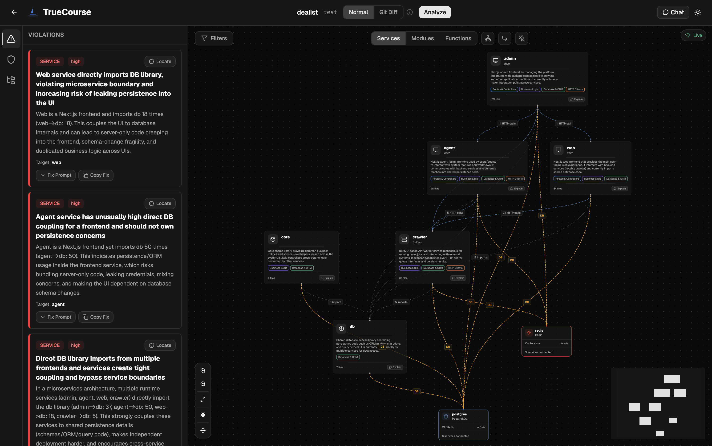

<p align="center">
  
</p>

<p align="center">
  <em>Chart the waters of your codebase.</em>
</p>

<p align="center">
  <a href="https://github.com/truecourse-ai/truecourse/actions/workflows/test.yml"></a>
  <a href="https://www.npmjs.com/package/truecourse"></a>
</p>

TrueCourse analyzes JavaScript/TypeScript repositories to detect architectural violations like circular dependencies, layer breaches, god modules, dead code, and more. It uses tree-sitter for static analysis and LLMs to surface violations with actionable fix suggestions. View results in the terminal or explore an interactive dependency graph in the web UI.

<p align="center">
  
</p>

## What it catches

- **Circular dependencies** between services and modules
- **Layer violations** like data layer calling API layer, skipping service layer, etc.
- **God modules** with too many exports or responsibilities
- **Dead modules** that are unused and should be removed
- **Database issues** like missing indexes, raw SQL bypassing ORM, schema problems
- **Dependency concerns** like tight coupling, missing abstractions, unstable interfaces
- **Git Diff mode** to see which violations your uncommitted changes introduce or resolve

## Quick Start

```bash
# 1. Start TrueCourse (first run walks you through setup)
npx truecourse

# 2. In another terminal, cd into your repo and analyze
cd /path/to/your/repo
npx truecourse analyze
```

On first run, the setup wizard configures your LLM provider. An embedded PostgreSQL database is created automatically, no Docker or external database required.

Violations print directly in your terminal. The web UI at **http://localhost:3001** shows an interactive dependency graph with violations highlighted.

## CLI Commands

```bash
npx truecourse                # Runs setup + starts the server
```

You can also run them manually:

```bash
npx truecourse setup          # Configure LLM keys
npx truecourse start          # Start the server
```

Once the server is running, `cd` into any repo and:

```bash
npx truecourse analyze        # Analyze current repo, show violations
npx truecourse analyze --diff # Show new/resolved violations from uncommitted changes
npx truecourse list           # Show violations from latest analysis
npx truecourse list --diff    # Show saved diff check results
npx truecourse add            # Register repo without analyzing
```

## Prerequisites

- Node.js >= 20
- An OpenAI or Anthropic API key

No database setup, no Docker. Everything runs locally out of the box.

## Development Setup

If you want to contribute or run from source:

```bash
git clone https://github.com/yourusername/truecourse.git
cd truecourse
pnpm install

cp .env.example .env
# Edit .env with your ANTHROPIC_API_KEY or OPENAI_API_KEY

pnpm dev
```

## Analysis Rules

TrueCourse ships with two types of rules:

- **Deterministic rules** that are checked programmatically during analysis (layer violations, circular deps, dead modules)
- **LLM rules** for architectural and database analysis, passed to the LLM for deeper inspection with fix suggestions

All rules are visible and configurable in the **Rules** tab in the web UI. To add a custom rule, add an entry to `packages/analyzer/src/rules/` and submit a PR.

## License

MIT
