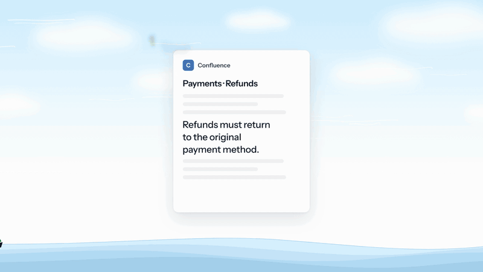

<p align="center">
  <picture>
    <source media="(prefers-color-scheme: dark)" srcset="assets/truecourse-logo-horizontal@2x.png" />
    
  </picture>
</p>

<p align="center">
  <strong>Tests that prove your product does what your documentation promises.</strong>
</p>

<p align="center">
  <a href="https://github.com/truecourse-ai/truecourse/actions/workflows/test.yml"></a>
  <a href="https://github.com/truecourse-ai/truecourse/blob/main/LICENSE"></a>
  <a href="https://discord.gg/TanxB63arz"></a>
</p>

<p align="center">
  
</p>

> [!WARNING]
> The `truecourse` npm package (the CLI) is deprecated and no longer maintained.
> TrueCourse is becoming an IDE for Product Owners, and the first step is letting
> them turn their documentation into end-to-end tests. This README describes the
> product as it is now.

TrueCourse reads the documentation a team already writes (PRDs, ADRs, READMEs,
a documentation site) and turns it into tests that run.

It curates those documents into a corpus of **claims**, works out the **flows** a
user takes through the product, writes a test for each one against the real
interfaces, and runs them. A failing test means the product and the documentation
disagree, and it names which section.

For more details, check our documentation at
**[docs.truecourse.dev](https://docs.truecourse.dev)**.

## Run it locally

### Setup

```bash
cp .env.example .env
echo "TRUECOURSE_MODE=local" >> .env
echo "TRUECOURSE_LLM_TRANSPORT=claude-code" >> .env
docker compose up -d    # starts Postgres; skip if you already run one, and set DATABASE_URL in .env to it
pnpm install
```

In `.env`, set `TRUECOURSE_SECRET_KEY` to a random string of 32 or more
characters, such as the output of `openssl rand -base64 32`. Everything else in
it already works as is.

### Run

```bash
pnpm dev    # http://localhost:3000
```

TrueCourse runs on your Claude Code login, so it needs the `claude` binary on
your PATH and signed in. Everything runs on `claude-opus-5-5`; set
`TRUECOURSE_MODEL` in `.env` to use another model.

`TRUECOURSE_MODE=local` runs without sign-in, and folders on this machine can be
connected as repositories.

First stop is **Settings › Workspace**: say what your product is, in one
sentence. Documentation is kept or dropped by whether it describes that product,
so nothing connects (no repository, no documentation source, no scan) until the
workspace has said it.

## Connect Claude Code

The server has an MCP endpoint, `/mcp`, that lets Claude Code read the
workspace (documents, conflicts, flows, runs, failures, coverage, dependencies,
sources) and make the decisions the dashboard offers. It starts no scan,
generation or run.

```bash
claude mcp add --transport http truecourse http://localhost:3001/mcp   # local mode
claude mcp add --transport http truecourse https://<your-host>/mcp     # hosted
```

Local mode needs no sign-in. Hosted, Claude Code signs in through WorkOS
AuthKit and the connection is the one workspace chosen there. A hosted server
needs `WORKOS_AUTHKIT_DOMAIN` (the AuthKit domain, e.g.
`https://example.authkit.app`) and `TRUECOURSE_MCP_URL` (the public URL of its
`/mcp`); without them `/mcp` answers 503.

## Telemetry

TrueCourse sends usage analytics to PostHog: which actions are taken and
pageviews, never your documents, keys or tokens. To turn it off, add this
to `.env`:

```bash
POSTHOG_DISABLED=1
```

## Contributing

[CONTRIBUTING.md](CONTRIBUTING.md) has the development setup, the project
structure and what makes a good pull request.

## Community

Join the [TrueCourse Discord](https://discord.gg/TanxB63arz) to ask questions,
share feedback, and follow what's shipping.

## Contact

Questions, feedback, or security reports: **Mushegh Gevorgyan**,
[mushegh@truecourse.dev](mailto:mushegh@truecourse.dev).

## License

**MIT** for everything outside `ee/`. See [LICENSE](LICENSE).

**Enterprise** for `ee/`, which holds the document Connections, the extra
repository providers and multiple workspaces. Free to read and modify for
development; production use needs a subscription. See [ee/LICENSE](ee/LICENSE).
