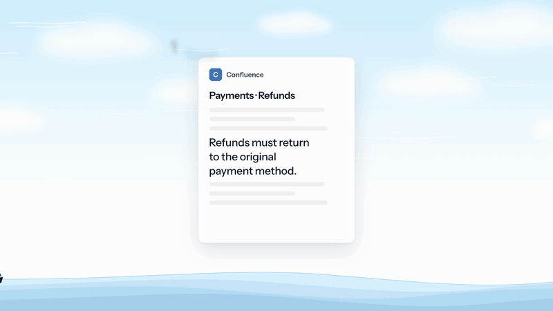

<p align="center">
  <picture>
    <source media="(prefers-color-scheme: dark)" srcset="assets/truecourse-logo-horizontal@2x.png" />
    
  </picture>
</p>

<p align="center">
  <strong>Tests that prove your product does what your documentation promises.</strong>
</p>

<p align="center">
  <a href="https://github.com/truecourse-ai/truecourse/actions/workflows/test.yml"></a>
  <a href="https://github.com/truecourse-ai/truecourse/blob/main/LICENSE"></a>
  <a href="https://discord.gg/TanxB63arz"></a>
</p>

<p align="center">
  
</p>

> [!WARNING]
> The `truecourse` npm package (the CLI) is deprecated and no longer maintained.
> TrueCourse is becoming an IDE for Product Owners, and the first step is letting
> them turn their documentation into end-to-end tests. This README describes the
> product as it is now.

TrueCourse reads the documentation a team already writes (PRDs, ADRs, READMEs,
a documentation site) and turns it into tests that run.

It curates those documents into a corpus of **claims**, works out the **flows** a
user takes through the product, writes a test for each one against the real
interfaces, and runs them. A failing test means the product and the documentation
disagree, and it names which section.

For more details, check our documentation at
**[docs.truecourse.dev](https://docs.truecourse.dev)**.

## Run it locally

### Setup

```bash
cp .env.example .env
echo "TRUECOURSE_MODE=local" >> .env
echo "TRUECOURSE_LLM_TRANSPORT=claude-code" >> .env
docker compose up -d    # starts Postgres; skip if you already run one, and set DATABASE_URL in .env to it
pnpm install
```

In `.env`, set `TRUECOURSE_SECRET_KEY` to a random string of 32 or more
characters, such as the output of `openssl rand -base64 32`. Everything else in
it already works as is.

### Run

```bash
pnpm dev    # http://localhost:3000
```

TrueCourse runs on your Claude Code login, so it needs the `claude` binary on
your PATH and signed in. Everything runs on `claude-opus-5-5`; set
`TRUECOURSE_MODEL` in `.env` to use another model.

`TRUECOURSE_MODE=local` runs without sign-in, and folders on this machine can be
connected as repositories.

First stop is **Settings › Workspace**: say what your product is, in one
sentence. Documentation is kept or dropped by whether it describes that product,
so nothing connects (no repository, no documentation source, no scan) until the
workspace has said it.

## Interface discovery

Flow setup reads API operations from route registrations, OpenAPI documents,
tRPC metadata and oRPC procedures with explicit REST routes. It recognizes an
MCP HTTP endpoint through its transport handler. Web screens come from Next.js,
Remix flat routes, React Router JSX and TanStack file routes that declare a
component. Flow setup then authors interactions on those screens.

Drizzle schemas support named and namespace imports, including multiline column
builders. The parsed tables and columns ground database seed generation.

## Pull request checks

With the GitHub App connected, a connected repository's pull requests are
checked once its Settings turn **Check pull requests** on (it is off by
default). Only pull requests into the default branch are checked. Each is
checked at its head against the default branch's stored state: the documents it
changes are re-scanned for conflicts with the rest of the workspace, its flows
are generated and run, and the result lands as a GitHub check (`TrueCourse`) —
new failures, a conflict the pull request would create, a head that does not
build, or clean. The base is
the state stored at the pull request's merge-base commit; a pull request whose
merge-base predates the repository's stored state is skipped as `no-base` until
it is rebased. The check runs the repository's own Flow setup, Flow generation
and run at the head, each with its record on the Agent page, and its report is
in the GitHub check, which links to the run it settled on (or to the setup or
generation it stopped in, or to Context's conflicts). The pull request is a
column on Code › Runs, Agent and Context.

A self-hosted App needs two more permissions than connecting alone — **Pull
requests: read**, which delivers the events and reads the changed files, and
**Checks: read and write**, which posts the check — and to subscribe to the
**Pull request**, **Check run** and **Check suite** events. An account that
installed the App before those were added is asked by GitHub to accept them:
without Pull requests read nothing is checked, and without Checks write the
checks run here and are not posted to GitHub, which Settings › Repositories
says on the account's row.

## Telemetry

TrueCourse sends usage analytics to PostHog: which actions are taken and
pageviews, never your documents, keys or tokens. To turn it off, add this
to `.env`:

```bash
POSTHOG_DISABLED=1
```

## Contributing

[CONTRIBUTING.md](CONTRIBUTING.md) has the development setup, the project
structure and what makes a good pull request.

## Community

Join the [TrueCourse Discord](https://discord.gg/TanxB63arz) to ask questions,
share feedback, and follow what's shipping.

## Contact

Questions, feedback, or security reports: **Mushegh Gevorgyan**,
[mushegh@truecourse.dev](mailto:mushegh@truecourse.dev).

## License

**MIT** for everything outside `ee/`. See [LICENSE](LICENSE).

**Enterprise** for `ee/`, which holds the document Connections, the extra
repository providers and multiple workspaces. Free to read and modify for
development; production use needs a subscription. See [ee/LICENSE](ee/LICENSE).
