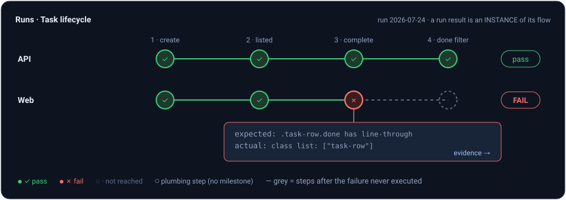
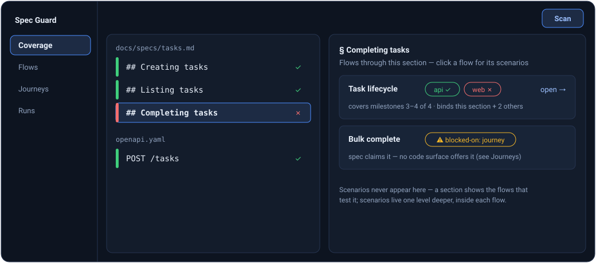
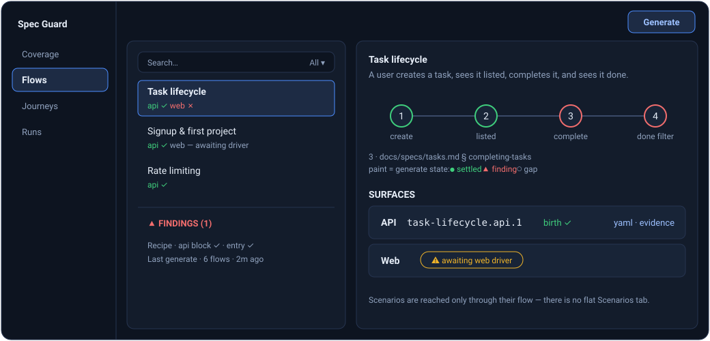
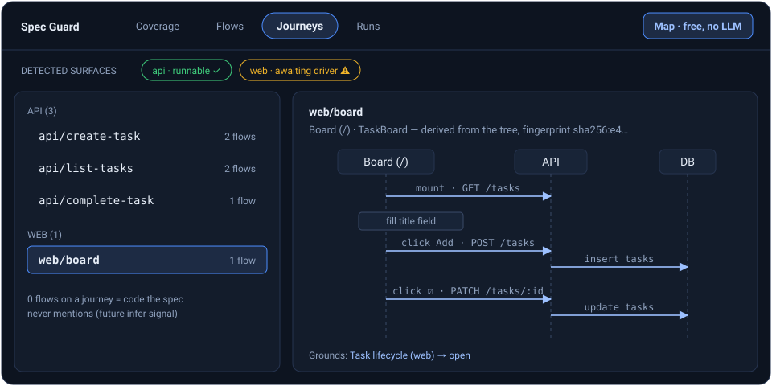

# Guard Flows & Journeys — Epic-Scale Scenarios from Spec-Derived Flows and Code-Derived Journeys

STATUS: DESIGN (2026-07-24) — nothing built. This plan redesigns the guard generation unit:
scenarios stop being authored directly from spec sections and are instead authored from
**flows** (spec-derived: WHAT to test) grounded in **journeys** (code-derived: HOW to test).
Companion to `docs/SPEC_GUARD_PLAN.md` (item 47 points here); everything below the
generation layer — drivers, runner, sandboxes, evidence, birth machinery, the api-driver
work (items 37–45) — is reused unchanged.

## Why

Guard today generates scenarios straight from spec sections: extraction reads a document,
returns per-section testable claims, and each claim is authored into one scenario bound to
exactly one section (`binds: {doc, section, fingerprint}` —
`packages/shared/src/guard/scenario.ts` `GuardBindsSchema`). That shape has a coverage
ceiling built into it:

- **No scenario can span sections.** The behaviors users actually care about — epics,
  end-to-end paths ("register, create a project, invite a teammate, the teammate sees the
  project") — are described across many sections, often across docs and areas. The current
  unit of generation cannot see them, so nothing tests them.
- **Sequencing is invisible.** A section claims "creating a task returns 201"; another claims
  "the list shows created tasks". Each gets a green scenario; the composed behavior (create
  **then** list shows it) is never exercised, and that composition is where real systems break.
- **The entry surface is conflated with the claim.** Extraction classifies each claim with a
  driver (cli/api/web/…), baking HOW into WHAT. A web app's spec claim "users can create a
  task" is testable through the API *and* through the browser — two different user contracts —
  but today it becomes exactly one scenario on one driver.

The redesign splits the two questions the current pipeline answers at once:

- A **flow** answers *what to test*: a user-goal path through the product, synthesized from
  the spec corpus ONLY — never from code — so it states what the product SHOULD do,
  unbiased by what the implementation happens to offer.
- A **journey** answers *how to test*: a concrete interaction path over the app's real
  surfaces (endpoints, screens, commands), extracted deterministically from the code's
  abstract tree — the analyzer's artifact graph, never raw source — exactly the concept the
  analyze module's User Flows feature (`detectFlows`/`traceFlows`) already implements for
  backend request paths.
- A **scenario** is the executable product of one flow realized through one journey path:
  assertions come from the flow's spec claims (the item-32 rule, unchanged), steps come from
  the journey, the driver comes from the journey's surface type.

**The independence invariant (the core of the design).** Flows never see code; journeys never
see specs; only scenario authoring sees both. Drift detection power comes from this
double-entry independence: a flow milestone no journey can realize means the spec promises a
capability the code has no surface for; a journey no flow touches means the code ships
behavior the specs never mention (the future infer analog). Any stage that leaks code into
flow synthesis or specs into journey mapping destroys the signal — this is a review-blocking
rule, not a preference.

## Naming

- **Flow** — spec-side unit, replaces the section as the generation unit. Types/schemas:
  `GuardFlow*` in `packages/shared/src/guard/flows.ts` (new).
- **Journey** — code-side unit. Types/schemas: `Journey*` in `packages/shared/src/journeys.ts`
  (new; shared because analyze will eventually render from the same shape).
- The analyze feature currently NAMED "User Flows" (`FlowRecord`,
  `packages/core/src/services/flow.service.ts`, dashboard `FlowList`/`FlowDiagramPanel`) is
  the conceptual seed of journeys and keeps working untouched in v1. Renaming that surface to
  "Journeys" (and eventually feeding it from the journey mapper) is an explicit follow-up —
  see Open questions. Inside guard code, "flow" ALWAYS means the spec-side unit.

## The binding chain

Today: `section → scenario`. New:

```
spec sections ⇄ flow → scenario ← journey
```

- A flow binds N sections (anchor + fingerprint each — the sections whose claims it
  traverses). Section identity/staleness machinery (`section-index.ts`, `resolveBinding`)
  is untouched; sections remain the STALENESS anchor and the coverage pivot.
- A scenario binds one flow (id + fingerprint) and the journey path that grounds it
  (journey ids + fingerprints), and DENORMALIZES the flow's section bindings into its YAML so
  the runner can resolve staleness with no flow lookup.
- **Dashboard consequence (user directive, 2026-07-24): clicking a spec section shows the
  FLOWS that touch it — never scenarios.** Scenarios are reached only through a flow.

## What stays, what changes

| Layer | Fate |
| --- | --- |
| Spec side — scan, corpus, areas, decisions, conflicts | **Unchanged.** Flow synthesis reads the corpus; writes nothing to it. |
| Claim extraction (`guard.extract`, whole-doc, cached per doc) | **Kept as the flow-synthesis input.** Claims stop being the generation unit; they become the milestone vocabulary flows are built from. The per-claim driver verdict becomes a *surface hint*. |
| Section index / anchors / fingerprints / remap-stale-orphan | **Unchanged.** Flows bind sections through it; OpenAPI operation sections (item 37) participate identically. |
| Scenario envelope | **Changes — `guard: 2`.** `binds` becomes plural + gains flow/journey references. This is a format-version event, explicitly allowed by the driver contract (the envelope freeze was per-driver, not per-version). |
| Drivers, runner, sandboxes, capabilities, evidence, birth, credentials/seed/schema-conformance (items 38–45) | **Unchanged.** Everything below authoring is driver-level plumbing the redesign sits on top of. |
| Driver registry (`packages/shared/src/guard/drivers.ts`) | **Reinterpreted, not changed**: a registry row now also names a JOURNEY TYPE. `desktop` and `mobile` are added as recorded (non-runnable) rows. |
| Manifest | **Rebuilt as flow-keyed (v2).** Per-section coverage derives at read time. |
| decisions.json (`dismissedClaims`) | **Kept.** Claims still exist (as milestones), so claim-level dismissal keeps working; a `dismissedFlows` list is added. |
| Coverage/gap model | **Extended**: gaps can now also be `blocked-on: journey` (no surface realizes a milestone) and per-surface `awaiting-driver` (journey exists, driver not runnable). |

## Flows (WHAT to test)

**Definition.** A flow is a user-goal path: a title, a goal statement, an ordered list of
**milestones**, and the section bindings those milestones come from. Every milestone
references an extracted claim — flow synthesis may ORDER and GROUP claims into paths, but it
can never invent an assertion that extraction didn't produce (engine-validated, snap/reject,
the same discipline as anchor validation in extract). Granularity is a spectrum by design:

- **Atomic flow** — one milestone, one section ("login rate-limits after 5 failed
  attempts"). This is today's scenario, re-homed; nothing about current coverage is lost.
- **Composite flow** — several milestones within an area ("create a task, list shows it,
  complete it, completed filter shows it").
- **Epic flow** — milestones spanning areas/docs ("onboard → first project → invite →
  collaborate"). Synthesized by the cross-area pass below.

**Synthesis pipeline** (new stage `guard.flows`, transport seam like every stage,
output-only, Zod-validated, cached under `.cache/guard/flows/`):

1. **Per-area synthesis.** Input: the area's extracted claims (claim text + section anchor +
   surface hint + blocked/untestable verdicts) plus each doc's heading outline — NO raw code,
   no probe transcripts, no recipe. Output: flows
   `{ title, goal, actor?, milestones: [{ doc, anchor, claimTitle, note? }], areaTags }`.
   Coverage honesty mirrors extraction: every runnable claim must land in ≥1 flow or carry an
   explicit no-flow reason (returned per claim, recorded as a gap) — single-claim flows are
   the legitimate default when nothing composes.
2. **Cross-area epic pass.** Input: the synthesized flows' DIGESTS only (title + goal +
   milestone claim titles) across all areas — never the docs again, so the pass is cheap.
   Output: epic flows that chain existing flows (`milestones` referencing the same claims,
   plus `composedOf: [flowId]` provenance). Runs only when >1 area has flows.
3. **Model tier**: `guard.flows` defaults to the Sonnet tier — it is a composition/judgement
   task over already-extracted claims, the `guard.fidelity`/`guard.extract` class, not
   Opus-grade authoring. Optimize the prompt until Sonnet handles it; never fix prompt
   weakness with a bigger model.

**Store: `.truecourse/scenarios/flows.json` — committable.** Flows are guard artifacts that
scenario YAMLs reference by id, so they version WITH the scenario corpus (same commit story,
same clone-inheritance rationale as `manifest.json`). The spec store stays untouched. Shape:

```json
{
  "version": 1,
  "generatedAt": "…",
  "flows": [{
    "id": "onboarding-first-project",
    "title": "A new user onboards and creates their first project",
    "goal": "…",
    "fingerprint": "sha256:…",
    "milestones": [{ "doc": "docs/auth.md", "anchor": "signup", "claimTitle": "…", "order": 1 }],
    "bindings": [{ "doc": "docs/auth.md", "anchor": "signup", "fingerprint": "sha256:…" }],
    "composedOf": [],
    "synthesisInputsHash": "…"
  }],
  "noFlowClaims": [{ "doc": "…", "anchor": "…", "claimTitle": "…", "reason": "…" }]
}
```

**Identity & staleness — the section trichotomy, lifted one level.**
- `id` = slugified title, `-N` disambiguated (stable handle for scenarios, dismissals, URLs).
- `fingerprint` = sha256 over the normalized milestone list (claim titles + anchors, ordered).
- Re-synthesis triggers per area when its claim inventory hash moves (extract output is
  already content-cached, so this is free to detect). After re-synthesis, flows REMAP by
  fingerprint (same milestones, new title → keep id), go STALE (same id, milestone set
  changed → scenarios re-author), or ORPHAN (flow gone → scenarios orphaned). Same
  vocabulary, same UI treatment as section staleness.
- A bound section's fingerprint changing makes the flow stale transitively — the flow's
  `bindings` are checked against the live section index at generate and run time exactly the
  way scenario binds are today.

**Code-blindness pays off as a signal.** A flow milestone that matching (below) cannot
realize on ANY detected surface settles as a structured gap `blocked-on: journey` — "the
spec claims this; no code surface offers it". v1 deliberately keeps this a GAP, not a
finding: the matcher is new and unproven, and bogus findings are the worst failure mode
(sqlfluff battle-test, issue #762). Escalation to a first-class finding kind once the
matcher's precision is measured is an explicit open item.

## Journeys (HOW to test)

**Definition.** A journey is an entry-rooted interaction path over one app surface, extracted
deterministically from the analyzer's artifact graph — `FileAnalysis` (functions, classes,
imports, calls incl. JSX references, httpCalls, routeRegistrations, routerMounts), the
module/method graph, and the traced chains `traceFlows` already produces. Never from raw
source dumps, never with an LLM in the loop: journey mapping is pure derivation, exactly like
`detectFlows` (`packages/core/src/services/flow.service.ts:14` — pure, synchronous, no I/O).

```
Journey {
  id: "api/create-task" | "web/projects-board" | "cli/tasks-add",
  type: 'cli' | 'api' | 'web' | 'tui' | 'library' | 'desktop' | 'mobile',
  title, entry,                      // surface-typed entry descriptor
  steps: JourneyStep[],              // surface-typed vocabulary, see below
  fingerprint: "sha256:…"            // over the normalized step list
}
```

**Journey types = driver registry rows.** `GUARD_DRIVERS` gains `desktop` and `mobile` as
recorded (non-runnable) rows — appended last, preserving the fingerprinted enum order per the
registry's load-bearing-order note. A journey type maps 1:1 to the driver that would execute
its scenarios; a journey whose driver row is non-runnable still EXISTS (it grounds coverage
accounting: "this flow is realizable on web — awaiting the web driver").

**Per-type extraction sources** (what the mapper reads; all in `@truecourse/analyzer` today
unless marked NEW). **Rollout order (user decision 2026-07-24): cli → api → web → the
rest** — the same surface sequencing guard's drivers followed; phases F1/F6/F7 mirror it.

- **cli** — NEW extraction (`cliCommands`): command/flag trees from commander/yargs (JS/TS),
  click/argparse (Python), System.CommandLine (C#). Note the cli AUTHORING pipeline keeps its
  `--help` probe grounding (items 2/35) — probes remain the runtime truth at authoring time;
  the static journey adds the structural map (which commands exist, how they chain) that
  probes cannot see. The two compose; neither replaces the other.
- **api** — entries: `routeRegistrations`+`routerMounts` (Express/Flask/FastAPI/Django/
  ASP.NET, `packages/analyzer/src/extractors/routes/*`) ∪ OpenAPI operations
  (`deriveOpenApiSections`, item 37 — when the repo commits an OpenAPI doc, its operations
  are authoritative entries). Steps: the `traceFlows` chain behind the handler — internal
  calls, `db-read`/`db-write` effects, cross-service hops. The effects are what let matching
  order operations ("create writes the row that list reads").
- **web** — NEW analyzer extraction, the biggest net-new work in this plan:
  1. **Frontend route table** (`uiRoutes`, new `FileAnalysis` field): React Router
     (`createBrowserRouter`/`<Routes>`/route objects) and Next.js file-system routes first;
     the extractor pattern follows `routes/*` (per-framework modules behind one artifact
     shape).
  2. **Interaction extraction** (`uiInteractions`, new): typed JSX event edges. The raw
     material already exists — `extractJsxReferences` captures `onClick={handler}` and
     component tags into `calls` (`packages/analyzer/src/ts-compiler.ts:892`) — this work
     TYPES it (kind: click/submit/input/navigate, owning component, handler) instead of
     leaving it indistinguishable from ordinary calls.
  3. **The frontend→API edge is already extracted**: a component's `fetch('/api/x')` lands
     in `httpCalls` with enclosing-function attribution. The mapper joins page → interaction
     → handler → httpCall → (via the route-handler lookup `flow.service.ts:133`) the api
     journey behind it.
  A web journey is then a page-rooted path: screen → interactions (fill/click) →
  navigations → API effects — precisely the "go to this screen, fill out information, click,
  go to other screen" shape, derived from the tree.
- **tui / library / desktop / mobile** — registered types with NO extractor in v1. A repo
  whose only surface is one of these simply yields no journeys, and its flows settle as
  `blocked-on: journey` — honest, visible, self-unlocking when an extractor ships (the
  driver-registry pattern, applied to extraction).

**Multi-surface duplication is deliberate.** A web app yields BOTH api journeys and web
journeys for the same underlying behavior. A flow realizable through both gets one scenario
PER surface — the API contract and the browser contract are different user promises, and
either can break alone (a route rename breaks web while the API stays green, an API
validation change breaks curl users while the UI pre-validates). The coverage UI presents
this as per-surface columns on one flow, never as duplicate rows.

**Derived, never committed.** Journeys re-derive from the working tree at generate/run time —
the same philosophy as the section index ("computed at generate/run time from doc content; no
new fields in corpus.json"). Committing them would churn on every code change and conflict on
every feature branch. Two artifacts exist on disk:
- `.truecourse/guard/journeys.json` — **gitignored** snapshot of the last mapping (dashboard
  reads it; `result.json` convention; safe to delete).
- The journey fingerprints EMBEDDED in scenario YAMLs and the manifest — the committed,
  clone-portable part (see staleness below).
Update `GITIGNORE_CONTENTS` in `packages/core/src/config/paths.ts` accordingly.

**Packaging.** New `packages/journey-mapper/` — deterministic, zero LLM dependencies,
consumes `@truecourse/analyzer` outputs, produces `Journey[]`. It does NOT depend on a prior
`truecourse analyze` run or the analyze store: guard generate invokes the analyzer directly
on the working tree (the analyzer is WASM tree-sitter, no build required; C# claims needing
Roslyn are out of scope for journey mapping v1 — tree-sitter artifacts only). Core wraps it
as a service; guard-generator and the dashboard server consume the service. The mapper is
fully testable against `tests/fixtures/` repos with hand-written expected journeys.

## Scenario generation v2

The per-section settle pipeline (`settleCliSection` et al.) becomes a per-FLOW settle
pipeline. Stages, in order (all cached, all estimated):

1. **Section index + claim extraction** — unchanged (including OpenAPI operation sections,
   suppression, blocked-on/untestable classification).
2. **Journey mapping** — deterministic, free, parallel to extraction. Emits the journey
   catalog + per-surface catalog fingerprints.
3. **Flow synthesis** — per-area + epic pass (above). Writes `flows.json`.
4. **Realization matching** (new stage `guard.match`, cheap tier, cached per flow
   fingerprint × per-surface journey-catalog fingerprint): given one flow (goal + milestones)
   and the journey catalog DIGEST for one surface (entries + step summaries — never code),
   return a realization plan — an ordered list of journey-step references that walk the
   flow's milestones on that surface — or an explicit `unrealizable` with a reason.
   The engine validates every referenced journey id/step (snap/reject). Per flow this yields
   0..S plans, S = detected surfaces.
5. **Authoring** (existing `guard.generate` Opus tier, prompt reworked): input = the flow
   (goal + each milestone's claim + its section's text — assertions come from HERE, item 32
   verbatim) + ONE realization plan (steps come from HERE) + the driver's closed verb set +
   the driver's existing grounding (cli: help/probe transcripts; api: OpenAPI operation
   slices, credentials/fixtures catalog — items 37/38/42 unchanged). Output: one scenario per
   (flow, surface), each step annotated with the milestone it realizes (engine-validated:
   every milestone realized by ≥1 step). Id scheme: `<flow-id>.<surface>.<n>`.
6. **Birth validation + fidelity review** — machinery unchanged (batched birth, item 39;
   boot pooling, item 40). Fidelity's question generalizes: "does this scenario verify the
   FLOW's milestones?" — reviewing against the flow's claims instead of one section's text.
7. **Persist independently — findings are independent, nothing is held.** Per the settle
   decision that discontinued held/all-or-nothing: a surface-scenario that passes
   birth+fidelity PERSISTS, full stop; a failing sibling (the other surface, another
   milestone's authoring defect) becomes a FINDING on the flow without withholding anything.
   A flow's status is the worst of its parts, but its healthy parts are always live.

**Scenario envelope v2** (`guard: 2`, `GUARD_FORMAT_VERSION` bump — v1 scenarios keep
parsing and running; see Migration):

```yaml
guard: 2
id: onboarding-first-project.api.1
title: New user onboards and creates a first project
flow:
  id: onboarding-first-project
  fingerprint: sha256:…
journey:
  path: [api/signup, api/create-project]     # the realization plan's journey refs
  fingerprints: [sha256:…, sha256:…]
binds:                                        # denormalized from the flow at write time
  - { doc: docs/auth.md, section: signup, fingerprint: sha256:… }
  - { doc: docs/projects.md, section: create, fingerprint: sha256:… }
driver: api
setup: …                                      # unchanged per-driver vocabulary
steps:                                        # unchanged per-driver verbs, plus:
  - request: …                                #   each step MAY carry `milestone: <order>` —
    milestone: 1                              #   the flow milestone it realizes. Authoring
  - request: …                                #   emits it; the engine validates every
    milestone: 2                              #   milestone is realized by ≥1 step. Steps
    expect: …                                 #   with no milestone are plumbing (login,
normalize: [timestamps, abs-paths, versions]  #   seeding) and paint neutral.
```

The `milestone` annotation is what makes a run renderable as a flow instance (see
Visualization below): the runner already records the failing step, so step outcomes project
onto flow milestones read-time — no new run-store fields.

**Three fingerprints, one question each.** A scenario is built from three inputs, and each
fingerprint is a content hash answering "did THIS input change since authoring?" — with a
different consequence per input:

| Fingerprint | Hashes | Changed means | Consequence |
| --- | --- | --- | --- |
| `binds[].fingerprint` | the spec SECTION's normalized text (existing mechanism) | the claim itself changed | scenario `stale` — spec-side drift, surfaced in runs |
| `flow.fingerprint` | the flow's milestone composition | synthesis reorganized what this flow tests | re-author the flow's scenarios at next generate |
| `journey.fingerprints[]` | the grounding journeys' step lists | the code surface moved | drift DOT only — scenario still runs; re-ground suggested |

Severity is deliberately graded: spec drift changes what the test MEANS (loudest — a run
outcome); flow drift changes what the test COVERS (re-author); code-surface drift changes
only HOW the test was derived (annotation — the frozen steps remain a valid probe).

**Incremental generate.** The manifest keys work per FLOW: `generationInputsHash` = flow
fingerprint + bound-section fingerprints + the fingerprints of exactly the journeys its
scenarios ground on (never the whole catalog — unrelated route churn must not re-author
everything) + recipe fingerprint + prompt fingerprints + format version. Journey drift
(surface code moved) re-runs ONLY matching+authoring for the flows that referenced the moved
journeys; spec drift re-runs from synthesis down for the touched areas.

## guard run changes

Runner semantics are almost untouched — scenarios are still self-contained YAML executed by
driver runners:

- **Staleness generalizes to plural binds**: any bound section stale → scenario `stale`;
  flow orphaned → `orphaned`. Same outcomes, same precedence, no new run outcome kinds.
- **Journey drift is a staleness DOT, not a run outcome**: at run start the runner re-derives
  journeys and compares the scenario's embedded fingerprints; a mismatch annotates the result
  (`journeyDrifted: true` — "the surface this scenario was grounded on has changed; consider
  re-generating") but the scenario still executes — its steps are frozen and remain a valid
  probe of the spec claims.
- **Rollups become flow-first**: `LATEST.json` per-scenario results gain `flowId`; the
  per-section rollup derives through flows at read time (`composeDocCoverage`).
- Runtime budget note: epic scenarios are longer-running; the api boot-amortization item
  (shared-server mode, Phase 6 open list) graduates from nice-to-have to a prerequisite for
  large flow corpora — sequenced inside phase F4 below.

## Coverage, dashboard, CLI

**Coverage composition** (`packages/core/src/commands/guard-read.ts`): section status =
worst status over the flows binding it; flow status = worst over its scenarios plus its
per-surface gaps. `GuardSectionCoverage` carries `flows: [{flowId, title, status,
surfaces: [{surface, scenarioId?, status}]}]` instead of `scenarios`.

**Dashboard (the user-directed inversion):**
- **Coverage tab** — unchanged doc/status-band left+main panes; `GuardSectionDetail` becomes
  a FLOW list (title, per-surface status chips, milestone count). Clicking a flow opens the
  flow detail: goal, milestones each linking back to its section, per-surface scenario rows
  with outcome/evidence — scenarios are two clicks from a section, never one.
- **Flows are a NEW TAB (user directive 2026-07-24)** — the tab set becomes
  **Coverage / Flows / Journeys / Drifts**, one action each (Scan / Generate / Map / Run).
  The Flows tab
  REPLACES the Scenarios tab as the inventory surface (user decision 2026-07-24: scenarios
  are too technical to be a user-facing unit — flows are the product vocabulary, scenarios
  the technical artifact underneath, reached only through their flow and never presented as
  a top-level inventory). A flat Scenarios list would also present the same corpus a second
  time with worse grouping, and the one-action-per-tab rule keeps Generate owned by exactly
  one tab. The Flows tab is the drill-down:
  1. **Flow list** (left) — every flow, filterable by status/surface/area, per-surface
     status chips, epic flows visually marked (`composedOf`). The Scenarios tab's furniture
     moves here with flow granularity: recipe card, "last generate" strip, findings block,
     dismissed chips (no held block — held was discontinued; findings are independent).
  2. **Flow detail** (main) — goal, milestone list (each linking to its spec section in
     Coverage), the per-surface scenario rows (outcome, birth/fidelity state, gaps like
     "awaiting web driver" / "blocked-on: journey"), and the flow's realization rendered as
     a diagram (below).
  3. **Scenario detail** — the existing scenario view (YAML, evidence, dismiss) plus its
     JOURNEY: the journey path the scenario grounds on, rendered as the sequence diagram,
     with the journey-drift dot when the live mapping no longer matches the embedded
     fingerprints.
- **Journeys are a tab too (user decision 2026-07-24)** — the read side of the code half,
  and the only tab whose action is FREE (Map = analyzer + journey-mapper, deterministic, no
  LLM, no estimate modal). Contents:
  1. **Surface banner** — the detected app types as chips (cli / api / web / …), each marked
     runnable or awaiting its driver — the one-glance answer to "what does TrueCourse think
     my app is".
  2. **Journey list** (left) — grouped by surface type, filterable; each row: entry
     descriptor, step count, and how many flows ground on it (the reverse index; zero =
     candidate spec gap, the future infer signal).
  3. **Journey detail** (main) — the sequence diagram (`FlowDiagramPanel` adapter), typed
     step list, and the flows/scenarios that reference it (click-through to the Flows tab).
  This tab is the debugging surface for the two failure modes the design introduces: a
  `blocked-on: journey` gap ("spec claims this — HERE is every surface we found, none
  offers it") and the journey-drift dot (compare a scenario's embedded fingerprints against
  the live catalog). Empty state: journeys derive from the working tree — one Map click,
  seconds, free. Reads `guard/journeys.json`; Map rewrites it.
- **Visualization model (user direction 2026-07-24) — two shapes, three surfaces:**
  1. **Journey = sequence diagram.** Analyze's User Flows visualization IS the journey
     concept (entry-rooted, code-derived), so `FlowDiagramPanel`'s participant/step React
     Flow components render journeys via a `Journey` adapter — embedded in the Journeys tab
     detail and the scenario detail. This is the concrete "reuse the User Flows feature"
     payoff beyond concept.
  2. **Flow = milestone graph.** A flow is not participants-and-calls; it renders as an
     ordered milestone chain (node = milestone, click → its spec section; epic flows show
     their `composedOf` segments). One component, TWO PAINT MODES driven by data:
     - **Flows tab**: generate-state paint — per-surface chips on each node
       (settled / finding / gap / awaiting-driver).
     - **Runs tab**: execution paint — **a run result is an INSTANCE of a flow.** Green =
       the milestone's step(s) passed; red = the milestone whose step failed (click → the
       expectation diff + evidence transcript); grey = not reached (steps after the failure
       never executed); neutral = plumbing steps with no milestone. Derived read-time from
       the scenario's `steps[].milestone` map + the failure detail's failing step — the run
       store is untouched. A flow run on multiple surfaces renders one row per surface
       (api green to the end, web red at milestone 3 — the duplication story made visible).
  3. The Runs tab keeps its severity-led list; selecting a result opens the flow-instance
     graph as the detail's header, evidence below it (chrome-diet: rendered open, no
     toggles).
- OpenAPI docs: the coverage renderer's markdown-only alignment gap (client
  `guard-doc-sections.ts` can't band synthetic `paths/*` sections) becomes user-visible the
  moment flows land on API repos — fixing it rides this plan (flow list renders per-section
  even when bands can't).

**CLI:** `guard flows` (list, `--show <id>` detail incl. realization plans and gaps);
`guard status` adds a flows line (`flows N total · N guarded · N partial · N blocked`);
generate progress gains `mapping journeys` / `synthesizing flows` / `matching` steps —
every long stage visibly ticks, per the progress rule.

**Estimate:** new `guardFlows` + `guardMatch` stages in
`packages/core/src/services/llm/spec-estimate.ts`, cache-aware like their caches
("N of M areas changed" / "N of M flows changed"); journey mapping is deterministic and
costs nothing. Estimate/runtime symmetry (item 11): both read the same cache probes —
single shared planning function per stage, regression-tested.

## Worked example — one product, spec to painted run

Illustrative sample (syntax of the api verbs matches the branch's `request`/`capture`/
`expect` vocabulary; hashes truncated). The product: **taskbird**, a small task manager —
React board + Express API, so it has TWO surfaces (web, api).

**1. The spec** (`docs/specs/tasks.md`; an `openapi.yaml` also exists — its operations
become `paths/post-tasks` etc. sections per item 37):

```markdown
## Creating tasks                          ← anchor tasks/creating-tasks
POST /tasks creates a task; 201 returns the task (id, title, done:false).
A missing title is a 400.

## Listing tasks                           ← anchor tasks/listing-tasks
GET /tasks returns tasks newest-first.

## Completing tasks                        ← anchor tasks/completing-tasks
PATCH /tasks/:id with { done: true } marks a task done. Done tasks show
under the "done" filter, struck through on the board.
```

**2. A flow** (spec-only synthesis composed four extracted claims into a path;
`scenarios/flows.json`):

```json
{
  "id": "task-lifecycle",
  "title": "A user creates a task, sees it listed, completes it, and sees it done",
  "fingerprint": "sha256:41ac…",
  "milestones": [
    { "order": 1, "doc": "docs/specs/tasks.md", "anchor": "tasks/creating-tasks",
      "claimTitle": "Creating a task returns it with an id" },
    { "order": 2, "doc": "docs/specs/tasks.md", "anchor": "tasks/listing-tasks",
      "claimTitle": "The list shows tasks newest-first" },
    { "order": 3, "doc": "docs/specs/tasks.md", "anchor": "tasks/completing-tasks",
      "claimTitle": "A task can be marked done" },
    { "order": 4, "doc": "docs/specs/tasks.md", "anchor": "tasks/completing-tasks",
      "claimTitle": "Done tasks appear under the done filter" }
  ],
  "bindings": [
    { "doc": "docs/specs/tasks.md", "anchor": "tasks/creating-tasks",  "fingerprint": "sha256:…" },
    { "doc": "docs/specs/tasks.md", "anchor": "tasks/listing-tasks",   "fingerprint": "sha256:…" },
    { "doc": "docs/specs/tasks.md", "anchor": "tasks/completing-tasks","fingerprint": "sha256:…" }
  ],
  "composedOf": []
}
```

**3. Journeys** (deterministic, from the tree — never committed; two of the catalog):

```json
{ "id": "api/create-task", "type": "api", "title": "POST /tasks",
  "entry": { "operation": { "method": "POST", "path": "/tasks" },
             "handler": "tasks.controller::create" },
  "steps": [ { "kind": "call", "target": "tasks.service::createTask" },
             { "kind": "db-write", "target": "tasks" } ],
  "fingerprint": "sha256:9b…" }

{ "id": "web/board", "type": "web", "title": "Board (/)",
  "entry": { "route": "/", "component": "TaskBoard" },
  "steps": [
    { "kind": "api-effect", "on": "mount", "method": "GET", "path": "/tasks" },
    { "kind": "input",  "target": "TaskBoard::titleField" },
    { "kind": "click",  "target": "TaskBoard::addButton", "handler": "handleAdd",
      "apiEffects": [ { "method": "POST", "path": "/tasks" } ] },
    { "kind": "click",  "target": "TaskRow::doneCheckbox", "handler": "handleToggle",
      "apiEffects": [ { "method": "PATCH", "path": "/tasks/:id" } ] } ],
  "fingerprint": "sha256:e4…" }
```

**4. Scenarios** — one flow × two surfaces = two scenarios. The api one (runnable today):

```yaml
guard: 2
id: task-lifecycle.api.1
title: Tasks are created, listed newest-first, completed, and filterable as done
flow: { id: task-lifecycle, fingerprint: "sha256:41ac…" }
journey:
  path: [api/create-task, api/list-tasks, api/complete-task]
  fingerprints: ["sha256:9b…", "sha256:c2…", "sha256:77…"]
binds:
  - { doc: docs/specs/tasks.md, section: tasks/creating-tasks,   fingerprint: "sha256:…" }
  - { doc: docs/specs/tasks.md, section: tasks/listing-tasks,    fingerprint: "sha256:…" }
  - { doc: docs/specs/tasks.md, section: tasks/completing-tasks, fingerprint: "sha256:…" }
driver: api
steps:
  - request: { method: POST, path: /tasks, body: { title: "Buy milk {{unique}}" } }
    capture: { taskId: body.id }
    expect: { status: 201, schema: true }
    milestone: 1
  - request: { method: GET, path: /tasks }
    expect: { status: 200, body: { path: "[0].id", equals: "${taskId}" } }
    milestone: 2
  - request: { method: PATCH, path: "/tasks/${taskId}", body: { done: true } }
    expect: { status: 200, schema: true }
    milestone: 3
  - request: { method: GET, path: "/tasks?filter=done" }
    expect: { status: 200, body: { path: "[0].id", equals: "${taskId}" } }
    milestone: 4
normalize: [timestamps]
```

The web sibling `task-lifecycle.web.1` grounds on `web/board` (`navigate` / `fill` /
`click` / `expect visible` verbs, F6); until the web driver ships the flow shows
"Web — awaiting driver" instead of a second scenario.

**5. A run paints the flow.** Suppose the board stops striking done tasks through: api
passes end-to-end, web fails at milestone 3. The Runs tab renders both instances:



## UI sketches (the four tabs)

**Coverage** — section click shows FLOWS (the user-directed inversion):



**Flows** — the inventory drill-down (replaces Scenarios; Generate lives here):



**Journeys** — the code-side catalog (free Map action):



**Runs** — severity-led list; the detail header is the painted flow instance (the run
image in the worked example above), evidence open beneath it.

## Decisions & dismissals

- `dismissedClaims` (`scenarios/decisions.json`) keeps working unchanged — a dismissed claim
  is excluded from synthesis input; a flow whose milestones ALL dismiss is dropped with a
  `dismissed` gap.
- New `dismissedFlows: [{flowId, title, dismissedAt, note?}]` — dismissing a synthesized
  flow suppresses it (and its scenarios) at generate; orphan reporting mirrors
  `orphanedDismissals`.
- Conflict gating (item 25) unchanged: generate still hard-fails on open conflicts before
  any synthesis.

## Migration from v1

- The runner keeps parsing `guard: 1` (schema union) so committed v1 corpora keep running
  and a clone that never regenerates stays green.
- The first v2 generate is a FULL re-author (extraction cache survives; synthesis, matching,
  authoring are all new stages/prompts) — the estimate presents it honestly as such.
  V1 scenarios and manifest entries are superseded per settled flow: a flow that settles
  writes its v2 scenarios and retires the v1 scenarios of the sections it binds; unsettled
  flows leave the v1 corpus in place (no coverage cliff mid-migration).
- `dismissedClaims` carry over as-is (same identity key).
- EE (Phase 8) is explicitly OUT of scope for v1 of this plan: the gate consumes committed
  scenarios + runs, and both keep their shapes' compatibility guarantees. Hosted journey
  mapping is deterministic analyzer work, so the EE adaptation is a store/seam exercise with
  no new LLM surface — sequenced after OSS proves the loop, same as the original plan.

## Rollout phases

Surface rollout order is a user decision (2026-07-24): **cli first, then api, then web,
then the rest** — the flow×journey loop proves end-to-end on the cli surface (guard's own
dogfood tradition) before each further surface joins.

- **F0 — schemas + fixtures.** `GuardFlow`/`Journey`/scenario-v2/manifest-v2 Zod in
  `packages/shared`; hand-written flows.json + journeys + v2 scenarios against
  `tests/fixtures/` repos; runner parses the v1|v2 union. No behavior change shipped.
- **F1 — journey-mapper: cli.** New package; cli journeys from the new `cliCommands`
  extractor (commander/yargs, click/argparse, System.CommandLine); `guard/journeys.json`
  snapshot; catalog fingerprints. Acceptance: the dogfood CLI's tree alone yields the
  expected command-tree journey catalog.
- **F2 — flow synthesis.** `guard.flows` stage + epic pass + `flows.json` + staleness
  trichotomy + estimate stage + `guard flows` CLI. Surface-agnostic (spec side only).
  Acceptance: on the dogfood corpus, every runnable claim lands in a flow or a reasoned
  `noFlowClaims` entry; re-running with an unchanged corpus is a 100% cache hit.
- **F3 — matching + authoring v2 + persist (cli surface).** `guard.match`, reworked
  authoring prompt with step→milestone attribution, per-flow independent persist/fidelity
  (no held — findings independent), manifest
  v2, migration semantics. This is the format-version event; birth/fidelity machinery
  reused. Acceptance: a composite flow on the dogfood CLI births green through the cli
  driver; a seeded doc-vs-code drift inside a composite flow fails birth as a finding
  (item-32 behavior preserved at flow scale).
- **F4 — run + rollups.** Plural-bind staleness, journey-drift annotation, flow-first
  LATEST rollup, `guard status`/`drifts` updates.
- **F5 — dashboard.** Section→flows inversion in Coverage, the new Flows tab replacing
  Scenarios (list → flow detail → scenario detail with its journey), the Journeys tab
  (surface banner, catalog, reverse index, free Map action), the journey sequence diagram
  (FlowDiagramPanel adapter), the flow milestone graph with both paint modes (generate
  state in Flows, run-instance pass/fail/not-reached in Runs), OpenAPI band fix.
- **F6 — api surface.** Api journeys (routeRegistrations/routerMounts + OpenAPI operations
  + traceFlows chains) join matching and authoring — the api DRIVER is already runnable
  (Phase 6 PoC + items 38–45), so this phase is mapper + matching work only. First
  multi-surface repos (cli+api) light the per-surface rollups; the api shared-server boot
  amortization lands here (epic scenarios are boot-heavy). Acceptance:
  `guard-fixture-api` realizes the taskbird-class flow through api journeys end-to-end.
- **F7 — web surface.** The `uiRoutes`/`uiInteractions` extractors, web journey
  composition, and the Playwright web driver (the original plan's web tier) land
  TOGETHER — journeys give the web driver its grounding, the web driver makes web journeys
  runnable; shipping either alone strands it. From here a web app demonstrably gets the
  same flow tested through both surfaces — the design's headline behavior. Needs a
  realistic fixture web app under `tests/fixtures/`.
- **F8 — the rest + follow-ups.** tui / library / desktop / mobile stay recorded journey
  types (extractors and drivers as later tracks, sequenced by observed demand from the
  `blocked-on: journey` / awaiting-driver telemetry), the analyze "User Flows"→Journeys
  rename decision, flow-level findings for unrealizable milestones
  (post-precision-measurement), EE adaptation.

Phases F0–F5 are the OSS v1 of this plan, proven cli-first on TrueCourse's own CLI; F6
(api) and F7 (web) extend it surface by surface in the decided order. Dogfood targets:
the TrueCourse CLI for F1–F5, `tests/fixtures/guard-fixture-api` at F6, the new fixture
web app at F7.

## Risks / open questions

- **Matcher precision is the product risk** (the successor to "binding fidelity" in the
  original plan). A wrong realization plan births a scenario that tests the wrong path —
  birth+fidelity catch most, but `unrealizable` verdicts gate on nothing. v1 keeps
  unrealizable as gaps (never findings) until precision is measured on the dogfood repos.
- **Flow synthesis quality**: too-coarse flows (kitchen-sink epics) or too-fine (one flow
  per claim, no composition) both defeat the point. The prompt must be optimized on the
  Sonnet tier against the dogfood corpus; the epic pass is droppable from v1 if per-area
  composition already covers the observed spec shapes (decide in F2 with data).
- **Scenario volume**: flows × surfaces multiplies the corpus. Bounds: one scenario per
  (flow, surface); surfaces capped by detected journey types ∩ runnable drivers (2 today).
  If volume still outgrows the run budget, changed-flow selection is the F4 dial.
- **Web extraction breadth**: React Router + Next first is a JS-ecosystem bet; server-
  rendered pages (Flask/Django templates, Razor) have no uiRoutes story yet — their repos
  keep full api/cli coverage, web settles as blocked-on: journey. Named, not hidden.
- **Does `noFlowClaims` need its own surfacing** beyond the gap list (a "claims without a
  story" review view), or is the gap chip enough? Decide in F2 from dogfood output.
- **Rename of analyze User Flows** — decide at F7; renaming earlier churns the analyze UI
  while guard is mid-migration.
- **Journey-drift dot vs auto-regenerate**: v1 annotates and waits for the user; an
  auto-regen policy (matching the auto-resolution escalation memory, item 14 family) is a
  candidate once drift frequency is observed.
