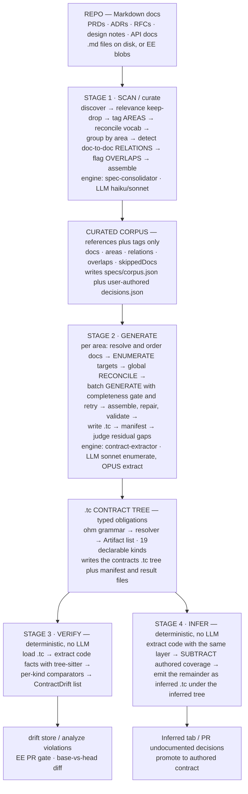
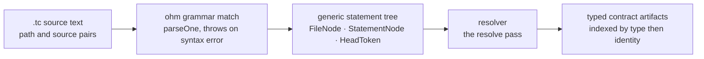
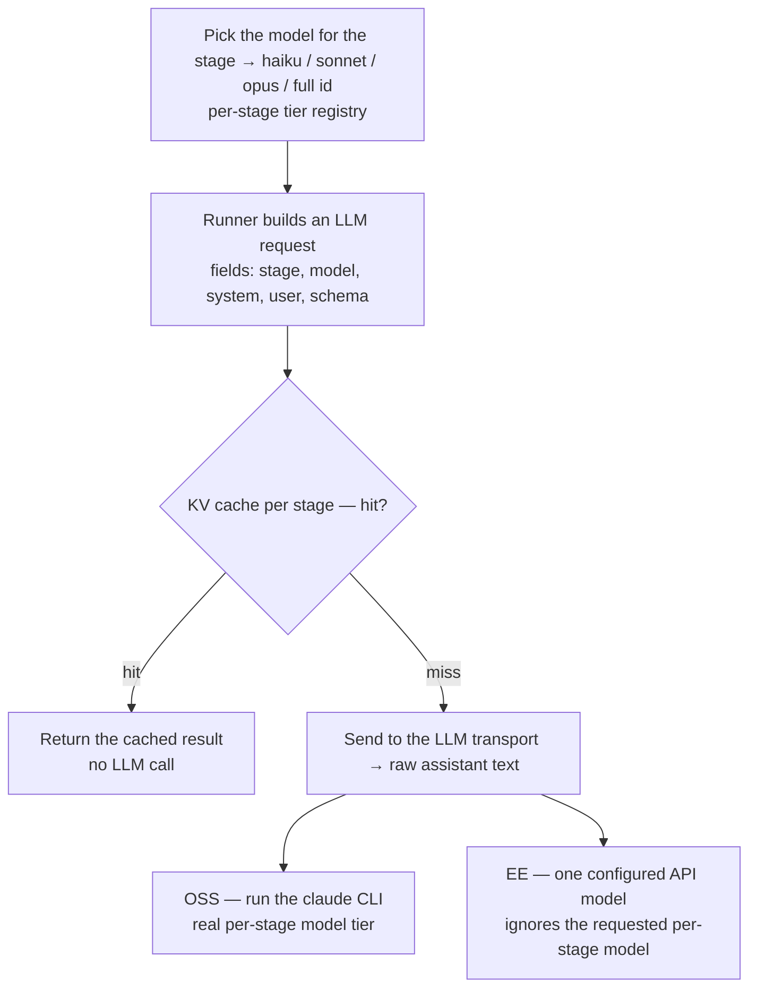

# TrueCourse — Spec / Contract / Verify Module Reference

> **Scope.** The complete engineering reference for TrueCourse's **spec → contract → verify (→ infer)** pipeline — the subsystem that turns a repository's markdown specs into a curated *corpus*, generates typed `.tc` *contracts* from it, checks the code against those contracts to surface *drift* (verify), and reverse-engineers undocumented decisions from code (infer). It is organized as a **Common** engine (edition-agnostic), the **OSS** edition (local, file-based, CLI + dashboard), the **EE** edition (hosted, Postgres, GitHub App PR gate), and an honest **Gaps** section.
>
> **The bar.** This document is written to be *reimplementation-grade*: if the code were deleted, an engineer should be able to rebuild the module and reproduce its behavior from this text alone. Where the code and any prior design note disagree, **the code wins** — §12 reconciles the two.
>
> **How to read it.** Start with [§1](#introduction) (mental model and glossary). Then read in pipeline order [§2](#data-model-storage) → [§8](#llm-orchestration) for the Common engine, [§9](#cli-reference) for the CLI, [§10](#oss-edition)/[§11](#ee-edition) for the two editions, and [§12](#gaps) for known limitations. Cross-references use stable `#anchor` slugs rather than section numbers, since numbering may shift as the document evolves.
>
> **Provenance & maintenance.** Produced by a multi-agent read → author → adversarial-audit pass over the source tree, with an integration critic reconciling cross-section facts. When you change the module, update the affected section to match.

---

<a id="table-of-contents"></a>
## Table of Contents

The document is organized as a shared **Common** core (stages and cross-cutting layers used by both editions), then per-edition sections, then gaps.

**Common**
- [1. Introduction & Mental Model](#introduction) — what the module is, the pipeline, the glossary.
- [2. Data Model & Storage Layout](#data-model-storage) — the `.truecourse/` on-disk tree, every store file, the committable-vs-gitignored split, and the store seams.
- [3. Stage 1: Spec Scan (Curate)](#scan) — discovery, relevance, area tagging, vocab, grouping, relations, overlaps, corpus assembly.
- [4. Stage 2: Contract Generate](#generate) — corpus read, enumerate, reconcile, batch generate + gate, assemble tail, manifest, gap judge.
- [5. The `.tc` Contract Language & Kinds](#tc-language) — grammar, AST, resolver/lifters, all artifact kinds, identity/slug rules.
- [6. Stage 3: Verify (Drift Detection)](#verify) — the comparators, code-fact matching, occurrence-level identity, the drift shape.
- [7. Infer (Reverse-Engineering)](#infer) — the 14 inferers, coverage subtraction, provenance, promotion.
- [8. LLM Orchestration, Models, Cost & Caching](#llm-orchestration) — model tiers + env vars, the transport seam, the KV cache, the pre-flight cost estimate.
- [9. CLI Reference](#cli-reference) — `contracts`, `spec` (+ `conflicts`/`chains`/`docs`), `verify`, `infer`, `drifts`, `hooks`.

**Editions**
- [10. OSS Edition](#oss-edition) — local file store, `claude -p` transport, git-anchored dashboard.
- [11. EE (Enterprise) Edition](#ee-edition) — hosted GitHub App PR gate, Postgres/blob storage, background jobs, workspace knowledge.

**Reference**
- [12. Gaps & Known Limitations](#gaps) — the generate non-determinism bug, stale doc-comments, extractor edge cases.

> Note on section numbering: cross-references throughout use stable `#anchor` slugs (e.g. [`#llm-orchestration`](#llm-orchestration), [`#cli-reference`](#cli-reference)) rather than section numbers, since numbering may shift as the document evolves.

---

<a id="introduction"></a>
## 1. Introduction & Mental Model

This document is a reimplementation-grade reference for TrueCourse's **spec / contract / verify module** — the subsystem that turns a repository's scattered prose documentation into machine-checkable obligations and then continuously checks the code against them. The goal of this document is concrete: if every line of the module were deleted, an engineer could rebuild it from this text and get the same behavior. This first section builds the mental model — what the module is, the shape of the pipeline, the vocabulary, and how the rest of the document is organized. Every later section goes deep on one stage or layer; this one is the map.

### 1.1 What this module is and the problem it solves

Software teams write down their decisions — PRDs, ADRs, RFCs, design notes, API docs — and then the code drifts away from them. The docs rot, contradict each other, or silently stop matching what ships. TrueCourse's thesis is that a spec is only useful if it is **executable against the code**, and that the gap between "what a Markdown doc says" and "what a linter can check" can be bridged by an intermediate, typed, committable contract language.

The module does this in four stages, forming a spec **lifecycle**:

1. **Scan** reads the repo's Markdown, decides which docs actually state system behavior, and organizes them into a curated **corpus** — a graph of *areas* (product/concern slices), *doc→doc relations* (which doc supersedes which), and *overlap flags* (docs that may disagree). The corpus stores only references and tags, never prose.
2. **Generate** turns that corpus into a tree of **`.tc` contracts** — a strict, typed DSL that encodes each obligation the docs place on the code (e.g. "`POST /api/orders` returns `201` with a `Location` header and emits `Effect:order.placed`").
3. **Verify** parses those `.tc` contracts, extracts the equivalent facts *from the code* (via tree-sitter), and diffs them — producing **drifts**: precise, per-obligation statements of where the code no longer matches the spec.
4. **Infer** runs the same code-side extraction *without a spec driving it*, subtracts whatever the authored contracts already cover, and emits the remainder as `inferred`-tagged `.tc` — the undocumented decisions baked into the code, offered up for documentation.

Scan and Generate are LLM-heavy (curation and extraction are judgement calls). Verify and Infer are **100% deterministic** — pure tree-sitter parsing and diffing, no models, no tokens, no network. That split is fundamental to the design: the expensive, non-deterministic work is front-loaded into producing a committable artifact (`.tc`), and the per-commit hot path (verify) is cheap and reproducible.

### 1.2 The end-to-end pipeline



The vertical spine is a straight pipe: **docs → corpus → `.tc` → drift**. Infer branches off the same code-side extraction layer that Verify uses, running it in the opposite direction (code minus spec, rather than spec versus code). The whole spine is driven, in production, by a single shared orchestrator that both the OSS CLI and the EE dashboard/GitHub-App call, so the four stages behave identically across editions (see [§8](#llm-orchestration) for orchestration and [§2](#data-model-storage) for the on-disk layout).

### 1.3 The four stages, one paragraph each

**Stage 1 — Scan (Curate).** Scan reads all of the repo's Markdown and works out which docs actually describe how the system behaves, then organizes them. It walks the repo for `.md` files in a stable, repeatable order, and an LLM judges each one — keep it if it states real behavior, drop it otherwise. Every kept doc is tagged with one or more **areas** (a two-level `product/concern` slice such as `core/auth`), and a cleanup pass collapses synonym drift so `authn` and `authentication` don't split into two areas. Docs are then grouped by area, doc→doc **relations** are detected — which doc supersedes which, partly from filename version numbers and partly from a single LLM pass — and within each area the tool flags **overlaps**: pairs of docs that might contradict each other, skipping any pair a relation already settles. The result is the curated corpus, written to `specs/corpus.json`, which stores only references and tags, never the prose itself. Every LLM step is cached by content, so an unchanged doc costs nothing on a re-run and the committed `corpus.json` stays stable. Full detail in [§3](#scan).

**Stage 2 — Generate.** Generate turns the corpus into the actual `.tc` contract tree, working one area at a time. First it resolves that area's docs — dropping any superseded by a `replace` relation and ordering the rest by precedence. Then it **enumerates** the area's contract *targets*: a cheap, names-only checklist of the obligations that should exist, with no bodies yet. Because several areas may list the same obligation under different names, a global **reconcile** pass merges those duplicates. Then comes the expensive step — an LLM generates the real `.tc` for each target, guarded by a **completeness gate** that re-prompts for any target still missing a body and retries until it stops making progress. A shared tail merges, normalizes, repairs, and validates the results, writes the surviving `.tc` files under `contracts/`, and records a spec-hash **manifest** so a re-run with unchanged specs regenerates nothing. Finally an LLM judges any targets that still look uncovered, to weed out false misses. One important caveat: generation is *not* a perfectly deterministic function of the corpus — see [§4](#generate) and [§12](#gaps). The `.tc` language itself is [§5](#tc-language).

**Stage 3 — Verify.** Verify checks the code against the authored contracts, and it does so with zero LLM calls. It loads the `.tc` files, parses and resolves them into typed artifacts, then extracts the equivalent facts straight from the code — TS/JS/Python/C# via tree-sitter — but only for the kinds the spec actually references, so it does no wasted work. One **comparator** per artifact kind diffs the spec's claim against what the code really does, and any mismatch becomes a **drift**. A final pass anchors each drift to its enclosing function and to which occurrence within that function it is, so a drift keeps its identity even when unrelated edits shift line numbers. Because it is pure parsing and diffing, Verify is fully deterministic — no models, no tokens, no toggles. Its drifts feed the OSS analyze violation store, or drive the EE PR gate, which compares the base and head of a pull request. Detail in [§6](#verify).

**Stage 4 — Infer.** Infer runs the very same code extraction Verify uses, but backwards. Instead of checking the code against a spec, it enumerates every decision the code makes, subtracts whatever the authored contracts already cover, and writes the leftover — the undocumented decisions — as `inferred`-tagged `.tc` under `contracts/_inferred/`, each carrying a provenance header saying where it came from and a confidence level. It too is fully deterministic. Because coverage is measured only against authored contracts, the inferred set is a *shrinking backlog*: the moment a decision gets documented, it drops out of the next run. Detail in [§7](#infer).

**How data flows between them.** The stages hand off through files, not function calls. Scan's output, `specs/corpus.json`, is Generate's only input — Generate reads the corpus and never touches the raw docs except through the references it holds. Generate's output, the `.tc` tree under `contracts/`, is in turn the input to both Verify and Infer. Those two share the code-extraction layer but run it in opposite directions: Verify is spec-driven, Infer is code-driven. An inferred contract can be *promoted* into the authored `contracts/` tree, at which point it becomes a first-class obligation that Verify checks and that Infer stops re-offering. Separately, the user's manual resolutions — force-includes, force-excludes, relation overrides, and area overrides — live in a committable `specs/decisions.json` that Scan folds back in on every run.

### 1.4 The two editions

The same engine code runs in both editions. Every difference between them is pushed behind a handful of swappable *seams* — how the engine talks to the LLM, where it caches intermediate results, and where it reads and writes specs, contracts, and verify state. The hosted edition swaps those seams in at boot; the open-source edition uses the local, file-based defaults. See [§10](#oss-edition) and [§11](#ee-edition) for the full contrast; the table below is the orientation.

| Concern | **OSS** (local / file / CLI) | **EE** (hosted / Postgres / GitHub App) |
|---|---|---|
| Surface | The `truecourse` CLI plus the local dashboard | A GitHub App PR gate plus the hosted dashboard |
| Trigger | You run the scan, generate, verify, or infer commands yourself | A GitHub webhook fires when a PR opens or updates |
| Repo access | Works in place on your checked-out tree | Reads a throwaway shallow clone and never commits anything back |
| Store identity | Keyed by the working-tree path | Keyed by the repo (owner/repo) and the PR head commit |
| Spec/contract/verify storage | JSON and `.tc` files under the repo's `.truecourse/` | Rows in Postgres, content-addressed by hash |
| LLM transport | Shells out to the local `claude` binary, which must be on your PATH | An AI-SDK transport wired in at boot; no binary or key of your own, and it refuses to run until a provider is configured |
| Per-stage models | Honors each stage's model tier — a cheaper model for light work, a stronger one for extraction | Runs one configured model for every stage, and hides the per-stage tiers so hosted progress isn't misleading |
| KV cache | Cached to files under `.truecourse/.cache/` | Cached in Postgres, content-addressed so it survives the throwaway clones |
| Decisions | Read from `decisions.json` in the repo | Passed in explicitly from Postgres, since a fresh clone has no `decisions.json` |
| Verify baseline | `verifier/LATEST.json` committed in the repo | Per-commit snapshots; the PR-head verify is transient and never moves the baseline, and the gate diffs base against head |

The critical practical difference: **OSS is user-driven and committable** — the `.tc` tree and `corpus.json` are git-tracked, so a PR reviews spec changes the same way it reviews code. **EE is webhook-driven and server-stored** — nothing is committed to the customer's repo, and the PR gate compares the base-vs-head drift sets to flag *newly* violating code.

### 1.5 Glossary

The module has a precise vocabulary. Every term below is used consistently throughout the document.

| Term | Definition |
|---|---|
| **Doc** | A single Markdown (`.md`) file found in the repo. Each one is tracked with its repo-relative path, a content hash (used as the cache key), a guessed kind (PRD, ADR, RFC, spec, runbook, design note, readme, or unknown), when it was last touched, and a short preview. Docs are the raw input to Scan. |
| **Corpus** | The curated snapshot Scan produces and stores at `specs/corpus.json`. It holds the kept docs, their areas, the doc→doc relations, the overlap flags, and the docs that were dropped — **references and tags only, never prose**. It is the single expensive-to-produce, committable artifact that Generate consumes. |
| **DocRef** | A pointer to a doc's content rather than the content itself. In OSS it is a repo-relative path resolved on disk; in EE it is a content-addressed blob id. The corpus doesn't care which — and that indifference is exactly what lets the same engine run file-backed or blob-backed. |
| **Area** | A two-level slice of the system, written `product/concern`. The `product` is a separately-deployed app (usually just `core`); the `concern` is a feature or domain slice like `auth`, `orders`, or `persistence`. Areas are the unit of grouping and of Generate — one enumerate-and-extract pass per area. The free-form tags an LLM produces are canonicalized into stable ids so synonyms don't fragment. |
| **Relation** | A typed edge between two docs. `replace` means the older doc is superseded and left out of Generate; `precedence` means both feed Generate but the newer one wins where they overlap; `keep-both` means they are peers, and is the default. Relations come from filename version numbers plus one LLM pass, and users can override them in `decisions.json`. |
| **Overlap** | A flag marking two docs in the same area that may **disagree** about a specific decision — a value, field, default, rule, status code, or endpoint shape. It is surfaced for a human to review, and any pair a relation already settles is skipped. In the code and telemetry this field is still called `openConflicts` for historical reasons. |
| **Decisions** | The user-authored, committable `decisions.json`. It records force-includes (bring back a doc that relevance dropped), force-excludes (drop an otherwise-kept doc), relation overrides, and area-tag overrides. Scan folds these into the corpus on every run. |
| **Contract / `.tc`** | The output of Generate: a typed, committable obligation written in the `.tc` language (the "Intermediate Language", or IL). One `.tc` file declares one or more artifacts, and the whole corpus of them lives under `contracts/`. A strict grammar parses them into typed artifacts. See [§5](#tc-language). |
| **Artifact / artifact kind** | One typed obligation. The language has **19 top-level kinds** it can declare — operations, entities, enums, state machines, auth requirements, authorization rules, error envelopes, and so on — plus two more that are synthesized or act as a forward-reference escape hatch, for **21 kinds** in all. Each artifact is identified by its kind and identity together. |
| **Target** | A contract that still needs generating — named by Enumerate as a kind plus an identity, with no body yet. The set of targets for an area is the checklist the **completeness gate** and the gap-judge measure against; a target that never gets a body is reported as a coverage gap. |
| **Enumerate** | The first phase of Generate: an LLM pass that reads one area's docs and lists its contract targets without writing any bodies. It is cheap, cacheable, and meant to be exhaustive — a target it leaves out will never be generated. |
| **Completeness gate** | Generate's retry mechanism. After each generation round it recomputes which targets still have no body and re-prompts only those, up to a couple of rounds, stopping once a round adds nothing new. This is how Generate converges toward covering every enumerated target. |
| **Manifest** | The committable `contracts/manifest.json`: a map from each area to the content hash of the spec it was last generated from. It makes `contracts generate` a no-op when specs are unchanged — a fresh clone re-running Generate regenerates nothing. |
| **Drift** | The unit of Verify output: one obligation the code no longer satisfies, carrying which artifact and obligation it is about, a severity, a file and line, and a message. The obligation is identified by a stable path such as `response.201.headers.location`. Each drift also has a random id that is regenerated every run and deliberately kept out of its identity. |
| **Occurrence** | The occurrence-level anchor on drifts that point at a specific code site (query rules, forbidden artifacts, named constants): the enclosing function plus a 0-based index of which occurrence within that function it is. Together they give a drift a stable key, so the EE PR gate can flag a *new* violating site without churning when unrelated lines move. |
| **`LATEST.json` convention** | The committable-baseline pattern used across the module: a materialized "current state" file that doubles as the diff baseline, git-tracked so fresh clones and worktrees start from a baseline instead of cold-starting. It applies to the analyze `LATEST.json`, `verifier/LATEST.json`, and `specs/corpus.json`. The rule: **commit it only after merging to main**, because two branches both updating a giant generated JSON will conflict. |

### 1.6 How to read the rest of this document

If you are rebuilding the module, read in pipeline order: [§2](#data-model-storage) to understand where everything is persisted, then [§3](#scan) → [§4](#generate) → [§5](#tc-language) → [§6](#verify) → [§7](#infer) for the stages, then [§8](#llm-orchestration) for the shared LLM plumbing that all the stages sit on. If you are operating or extending an existing install, [§9](#cli-reference) (CLI) and [§10](#oss-edition)/[§11](#ee-edition) (editions) are the practical entry points, and [§12](#gaps) is the honest list of what does not yet work as one might assume. Throughout, when the deep-dive text and the source disagree, the source wins — this section was written against the code at the paths cited above.

<a id="data-model-storage"></a>
## 2. Common — Data Model & Storage Layout

This section catalogs everything the spec/contract/verify module writes to disk and the pluggable boundaries those writes flow through. The on-disk shapes matter for one practical reason: a teammate who clones the repo should be able to pick up the pipeline where it left off, without paying to regenerate work that's already committed.

All of this state lives under a single per-repo folder, `<repo>/.truecourse/`, alongside one process-wide cache of LLM results. In the open-source/local edition it is **plain JSON files — there is no database**. The hosted enterprise edition keeps the identical data shapes but stores them in Postgres and blob storage instead; only the transport changes, so the same code paths serve both (see [§11](#ee-edition)). The system is forgiving about damage: a corrupt or missing file reads back as empty, and the next run simply rewrites it.

The rest of this section walks the folder top to bottom — the directory map and the one rule that decides what gets committed ([§2.1](#data-model-storage)), the small set of path and write helpers everything shares ([§2.2](#data-model-storage)), then each store in turn: the curated spec ([§2.3](#data-model-storage)), the generated contracts ([§2.4](#data-model-storage)), the drift store ([§2.5](#data-model-storage)), and the LLM caches ([§2.6](#data-model-storage)). It closes with the storage seams that let OSS and EE swap file for Postgres ([§2.7](#data-model-storage)) and the handful of data shapes that cross between the backend and the dashboard ([§2.8](#data-model-storage)).

The *producers* of these files live elsewhere: spec scan writes the corpus ([§3](#scan)), contract generate writes the `.tc` tree ([§4](#generate)), verify writes drift ([§6](#verify)), and infer writes the reverse-engineered set ([§7](#infer)). The LLM orchestration behind the caches is [§8](#llm-orchestration), and the `.tc` grammar the contract files obey is [§5](#tc-language).

---

### 2.1 The on-disk layout under `<repo>/.truecourse/`

Here is the whole tree this module owns. Other subsystems (the analyze store, the global `~/.truecourse/`) are out of scope and appear only where they share a rule.

```
<repo>/.truecourse/
  .gitignore                       ← written once by ensureRepoTruecourseDir (paths.ts)
  config.json                      ← COMMITTABLE (per-repo settings incl. llm.stages model overrides)
  specs/
    corpus.json                    ← COMMITTABLE (LATEST convention). CuratedCorpus v3.
    decisions.json                 ← COMMITTABLE, user-authored (relations / manualAreas / manualIncludes / manualExcludes)
    inferredDecisions.json         ← COMMITTABLE by default (not ignored); written by inferInProcess
  contracts/                       ← COMMITTABLE / git-tracked ON PURPOSE (the .tc corpus)
    _shared/<slug>.tc              ← cross-cutting kinds (auth / authz / error / pagination / idempotency)
    <domain>/<slug>.tc             ← Entity / Enum / StateMachine / EffectGroup / Formula / ArchitectureDecision / …
    <domain>/operations/<slug>.tc  ← one per HTTP endpoint (Operation kind)
    unenforceable/<slug>.tc        ← UnenforceableObligation kind
    _inferred/…                    ← reverse-engineered tree (independent lifecycle; verify skips it by default)
    manifest.json                  ← COMMITTABLE / git-tracked (areaId → specHash; the clone-safe no-op record)
    result.json                    ← GITIGNORED (last-generate run summary; the dashboard reads it back)
  verifier/                        ← drift store, mirrors the analyze store envelope
    runs/<iso>_<8char-uuid>.json   ← per-run drift snapshots
    LATEST.json                    ← COMMITTABLE (LATEST convention; the drift diff baseline)
    history.json                   ← GITIGNORED (matched by the top-level `history.json` line)
    diff.json                      ← GITIGNORED (matched by the top-level `diff.json` line)
    diff-<scope>.json              ← scope-parameterized diff slot (FileVerifyStore capability, unused in prod; OSS uses only diff.json, EE stores no diff files)
  .cache/                          ← GITIGNORED wholesale (`.cache/`); derived, safe to delete
    consolidator/{relevance,area-tags,vocab,chain-detection,overlap}/<key>.json
    contract/{enumerate,reconcile,extract,gap-judge}/<key>.json
```

#### 2.1.1 The single committable-vs-gitignored template

One thing decides which files land in git and which stay local: a single `.gitignore` template that the module writes into `.truecourse/` the first time it sets up the folder. It only writes the file if one isn't already there, so a `.gitignore` a person has hand-edited is never overwritten. The template ignores the derived, per-machine things — the analyze snapshots, the transient run logs, the lock file, the whole `.cache/` folder, and the generate run-summary — and treats everything else as committable.

Whenever you add a new store file, you have to update this template, or a derived file you never meant to share gets committed by accident. That is the rule.

**One subtlety worth knowing: the ignore patterns are unanchored, so they match at any depth.** A bare line like `history.json` or `diff.json` matches those filenames wherever they appear in the tree — which is precisely why the drift store's `verifier/history.json` and `verifier/diff.json` are ignored even though nothing mentions `verifier/` by name. The flip side is a genuine gap: nothing matches `verifier/runs/`, so the per-run drift snapshots are technically eligible to be committed even though the project treats them as local (flagged in [§12 Gaps](#gaps)). The `contracts/result.json` entry is the one anchored exception — it ignores that single file while the rest of `contracts/` stays tracked.

#### 2.1.2 The "committable" rationale — why generated JSON is in git

Committing generated output usually feels wrong, but three files are shared on purpose because doing so saves teammates real time or money:

| File | Why it's committed |
|---|---|
| `specs/corpus.json` | Regenerating it costs LLM calls and isn't fully deterministic. Sharing it lets a teammate, a fresh clone, or a new worktree inherit the curated spec without a cold-start scan. |
| `contracts/*.tc` + `contracts/manifest.json` | The contracts are the reviewable unit — a PR reviews spec changes by diffing the committed `.tc` files against the previous version. The manifest records what was last generated, so someone re-running generate on unchanged specs pays nothing. |
| `verifier/LATEST.json` | It's both the current drift view and the baseline the next run diffs against, so a clone inherits a drift baseline without re-running verify. |

`corpus.json`, `verifier/LATEST.json`, and analyze's own `LATEST.json` all follow the same convention: they're current-state snapshots that double as diff baselines. Because they're large generated JSON blobs, two feature branches both regenerating one will produce an unmergeable conflict — so the team rule is to commit them **only after merging to main**, never from a feature branch. The `.tc` contracts don't have this problem: they're the thing a PR is meant to review, so they belong on feature branches.

`specs/inferredDecisions.json` isn't ignored either, so it's committable by default, though in practice it's a derived reverse-engineering artifact ([§7](#infer)).

---

### 2.2 Path helpers and the write primitives

#### 2.2.1 Path resolution helpers

A small set of helpers turn a directory into the various paths under `.truecourse/`. The one that matters conceptually is how the tools find the project root: starting from the current directory, the resolver walks **upward** until it finds a `.truecourse/` folder — deliberately skipping the global `~/.truecourse` so a user's home directory is never mistaken for a project. If it reaches the filesystem root without finding one, there's no project. This is how both the CLI and the dashboard server locate where they are. A companion helper creates the folder on first use and drops in the `.gitignore` template (only if one isn't already present).

#### 2.2.2 `atomicWriteJson` — the atomic write primitive

Some files can be written while something else is reading them, so those go through `atomicWriteJson`: it writes to a uniquely-named temp file first, then renames it into place. On a normal filesystem that rename is atomic, so a reader always sees either the complete old file or the complete new one — never a half-written mess. The temp name includes the process id and a timestamp so two writers racing on the same target don't trample each other's scratch file.

There's one observable quirk to be aware of: the module uses **two write conventions that differ only in a trailing newline**. Files the verify store writes go through `atomicWriteJson` and have **no** trailing newline. The single-writer files — the spec corpus and decisions, the contract manifest and result — use a plain pretty-printed write **with** a trailing newline. The split follows concurrency: the verify store needs atomicity because a running verify can race a delete, while the others have only one writer and don't.

#### 2.2.3 mtime caching — only `verifier/LATEST.json`

Just one file gets an in-memory read cache: the drift baseline `verifier/LATEST.json`, which is read often. The verify store keeps the parsed contents alongside the file's last-modified time; a read returns the cached copy as long as the timestamp still matches, otherwise it reparses. Writing or deleting the file invalidates the entry. Notably `corpus.json` is **not** cached — it's read whole and re-validated every time, which keeps it simple at the cost of a little work.

---

### 2.3 The `specs/` store

The `specs/` folder holds the curated spec — a couple of small JSON documents, each read and written whole. Because they're whole-document reads (unlike the contract *tree*, which is walked file by file), they're served through a document-oriented seam, `SpecStore` ([§2.7](#data-model-storage)). The seam routes four artifacts:

| Artifact | File | Written by | Where |
|---|---|---|---|
| corpus | `specs/corpus.json` | the scan's curation step ([§3](#scan)) | Both editions |
| decisions | `specs/decisions.json` | the user, or the dashboard writing back | Both editions |
| inferred decisions | `specs/inferredDecisions.json` | the infer path ([§7](#infer)) | Both editions |
| verify state | `specs/verifyState.json` | the EE gate, as a per-commit drift snapshot | **EE only** — OSS never writes it |

One wrinkle: in OSS, `corpus.json` is written by the scan directly, bypassing the seam. The seam still exists so that EE can persist the exact same shape as Postgres rows keyed by repo and commit.

#### 2.3.1 `specs/corpus.json` — the curated corpus

The corpus is the output of the scan's curation step, written deterministically (no LLM at write time). It's the current schema version 3, and it reads back fail-soft: if it fails to parse or validate — including when an older, incompatible corpus is found — it reads as absent, which triggers a fresh scan.

The key storage principle is that **the corpus stores no document prose — only references.** Each document is named by a `DocRef`, which is just a string: a repo-relative path in OSS, a content-addressed blob id in EE. Downstream stages resolve a ref to its content on demand and never care which kind it is (see [§2.7.4](#data-model-storage)). This keeps the corpus small and edition-agnostic.

A corpus has four meaningful parts:

- **docs** — the documents that were kept. Each records its ref, its kind (PRD, ADR, RFC, spec, runbook, and so on), an optional lifecycle status (shipped, planned, deferred, deprecated, out-of-scope), when it was last touched, and the **area tags** that place it in the spec.
- **areas** — the groups those tags define. Every distinct area is a `product/concern` pair (for example `core/orders`), and it lists the docs that belong to it.
- **relations** — automatically detected links between documents, such as one file superseding an older version of itself.
- **skippedDocs** — documents the relevance filter dropped, each with a short reason, kept around so the dashboard can offer to force-include them.

An **overlap**, recorded inside an area, flags two documents in that area that may contradict each other — with a human-readable note and the specific headings involved. It's the signal that a spec needs a human decision.

A few rules govern this shape, and the example below shows them in action:

- **Area ids are canonical, not raw.** Both halves of `product/concern` are slugged and alias-folded when the corpus is built, so `Area.id`, each doc's area tags, overlap references, and a relation's scope all speak the same normalized vocabulary. The details of that normalization live in [§3](#scan).
- **The corpus holds only auto-detected relations.** Relations a person authored live in `decisions.json`, never here. What generate actually uses is the union of the two, computed on the fly and never stored.
- **An area's docs and its whole list of areas come out in sorted order**, so re-scanning unchanged input produces byte-identical JSON — important for keeping the committed file stable and its diffs clean.
- **An overlap is by definition unresolved.** If a relation already covers a pair of docs (replace, precedence, or keep-both), that pair is not also flagged as an overlap. An overlap is a disagreement still waiting for a decision.

Example `specs/corpus.json`:

```json
{
  "version": 3,
  "generatedAt": "2026-06-30T18:22:04.113Z",
  "docs": [
    {
      "ref": "docs/orders/PRD.md",
      "kind": "prd",
      "status": "shipped",
      "lastTouched": "2026-05-01T09:14:00.000Z",
      "areaTags": ["core/endpoints", "core/orders"]
    },
    {
      "ref": "docs/orders/PRDv2.md",
      "kind": "prd",
      "status": "shipped",
      "lastTouched": "2026-06-12T09:14:00.000Z",
      "areaTags": ["core/endpoints", "core/orders"]
    },
    {
      "ref": "docs/orders/cancellation-spec.md",
      "kind": "spec",
      "status": "planned",
      "lastTouched": "2026-06-20T11:02:00.000Z",
      "areaTags": ["core/orders"]
    },
    {
      "ref": "docs/adr/ADR-004-idempotency.md",
      "kind": "adr",
      "status": "shipped",
      "lastTouched": "2026-05-30T11:02:00.000Z",
      "areaTags": ["core/idempotency"]
    }
  ],
  "areas": [
    {
      "id": "core/endpoints",
      "product": "core",
      "concern": "endpoints",
      "docRefs": ["docs/orders/PRD.md", "docs/orders/PRDv2.md"],
      "overlaps": []
    },
    {
      "id": "core/idempotency",
      "product": "core",
      "concern": "idempotency",
      "docRefs": ["docs/adr/ADR-004-idempotency.md"],
      "overlaps": []
    },
    {
      "id": "core/orders",
      "product": "core",
      "concern": "orders",
      "docRefs": ["docs/orders/PRD.md", "docs/orders/PRDv2.md", "docs/orders/cancellation-spec.md"],
      "overlaps": [
        {
          "docs": ["docs/orders/PRDv2.md", "docs/orders/cancellation-spec.md"],
          "note": "PRDv2 caps reschedules at 3; cancellation-spec still says 5",
          "sections": [
            { "doc": "docs/orders/PRDv2.md",             "heading": "Rescheduling limits" },
            { "doc": "docs/orders/cancellation-spec.md", "heading": "Reschedule policy" }
          ]
        }
      ]
    }
  ],
  "relations": [
    {
      "type": "replace",
      "older": "docs/orders/PRD.md",
      "newer": "docs/orders/PRDv2.md",
      "detectedFrom": "filename"
    }
  ],
  "skippedDocs": [
    { "ref": "docs/archive/old-orders.md", "reason": "archived/superseded location (under archive/)" }
  ]
}
```

Note how the `replace` relation is on `(PRD.md, PRDv2.md)` (unscoped, so it applies in both `core/endpoints` and `core/orders`) and that exact pair carries **no** overlap in either area, while the overlap in `core/orders` is on the unresolved `(PRDv2.md, cancellation-spec.md)` pair — the two invariants above in action.

#### 2.3.2 `specs/decisions.json` — user-authored curation intent

This is where a person's curation decisions live — the overrides that steer scan and generate. It's committable and authored either by hand or through the dashboard. It offers four "verbs":

- **manual includes** — documents the user wants kept no matter what, bypassing the LLM relevance filter's decision to skip them ([§3](#scan)).
- **manual excludes** — documents the user wants dropped no matter what — force-removed from the corpus even when the relevance filter would keep them, so a person can pull a doc (and any conflicts it drives) out of the curated set. Applied *after* relevance, so it wins over a manual include for the same path (a doc can't be both). Include and exclude are kept mutually exclusive on write: recording one clears the other for that path.
- **relations** — declared links between two documents, saying how they relate. A relation names the older and newer document, optionally scoped to a single area (otherwise it applies wherever both docs co-occur), and records where it came from.
- **manual areas** — a per-document override of the area tags. When set, it **replaces** the doc's auto-detected tags entirely.

The relation type is the important part, because it changes what generate does with the pair:

| Type | Meaning | Effect on generate |
|---|---|---|
| replace | hard supersession — a real version chain | the older doc is **dropped**; only the newer feeds generate |
| precedence | soft refinement | **both** docs feed generate; the newer wins where they overlap, but the older's unique content survives |
| keep-both | peers, both authoritative | both feed generate — also the implicit default when no relation is recorded; an explicit entry just pins that intent |

Example `specs/decisions.json`:

```json
{
  "version": 1,
  "manualIncludes": ["docs/tasks/backlog-order-limits.md"],
  "manualExcludes": ["docs/legacy/v1-notes.md"],
  "relations": [
    {
      "type": "precedence",
      "older": "docs/orders/PRD.md",
      "newer": "docs/orders/design-note-2026.md",
      "scope": "core/orders",
      "detectedFrom": "manual",
      "note": "the design note refines the PRD's cancellation flow"
    }
  ],
  "manualAreas": [
    { "doc": "docs/misc/notes.md", "areas": ["core/billing"] }
  ]
}
```

One thing to know about reads: two different packages each have their own reader for this same file, on purpose, so neither has to depend on the other. Both are fail-soft — a missing or corrupt file reads back as an empty decisions object rather than an error. One reader serves the CLI's relation flow and the dashboard write-back; the other serves the scan's curation step and the generate reader.

#### 2.3.3 `specs/inferredDecisions.json` — the reverse-engineering summary

This file is what the infer path produces: a summary of decisions reverse-engineered from the code rather than written down in a doc. It's what the dashboard's Inferred tab reads. Each entry names an artifact (its kind and identity), where in the code it was found, why the deterministic inferer thinks it's real, a confidence level, and the rendered `.tc` body — plus a pointer to the contract file, so a user can promote an inferred decision into the authored set.

When two versions of this file are diffed, entries are matched by kind and identity — never by the reason text — and the provenance lines (the `// inferred —`, source range, and confidence header) are stripped before comparing bodies, so simply moving code to a new location doesn't register as a content change. The full mechanics are in [§7 Infer](#infer).

---

### 2.4 The `contracts/` tree

`contracts/` is the generated `.tc` corpus — the git-tracked materialization of `corpus.json`. Unlike the spec store, which reads whole documents, this is a tree of many files, so it's served through a directory-oriented seam, `ContractStore` ([§2.7](#data-model-storage)). The store's job is simply "save this tree" and "give me back this tree"; how the files are laid out, and whether they're deduplicated by content, is nobody's concern above the seam.

#### 2.4.1 File layout rules

The generate step decides where each contract file goes based on the artifact's kind and its identity. The layout is organized so a reviewer can find things:

| Artifact | Where it goes |
|---|---|
| Cross-cutting kinds — authentication, authorization, error envelope, pagination, idempotency | `_shared/` |
| An HTTP endpoint (Operation) | under `<domain>/operations/`, where the domain is inferred from the URL — the path segment after `/api/`, falling back to the first segment, or `misc` |
| An unenforceable obligation | `unenforceable/` |
| Everything else — entities, enums, state machines, effect groups, formulas, architecture decisions, and so on | `<domain>/`, where the domain comes from the first part of the identity (`Order.status` lands under `order/`) |

Two behaviors are worth calling out. The writer skips any file whose content is already byte-identical on disk, so a run that changed nothing leaves `git diff` clean. And when pruning is enabled, it deletes any `.tc` file that's no longer part of the freshly generated set and removes directories left empty — so a spec that disappears takes its contract with it.

The writer only ever creates the authored subtree (`_shared/`, the per-domain folders, and `unenforceable/`). It does **not** create the `_inferred/` tree — that's the infer path's job — and it does **not** write `result.json`, which is stamped separately ([§2.4.4](#data-model-storage)).

#### 2.4.2 `_inferred/` — the reverse-engineered subtree

`contracts/_inferred/` holds contracts the infer path reverse-engineered from code ([§7](#infer)), each carrying a provenance header that records the reason, the source location, and a confidence level. It lives on its own lifecycle, separate from the authored contracts: the system treats it as a distinct kind of set, verify **ignores it by default** (inferred contracts describe what the code does, they don't prescribe what it should do), and listing the authored contracts skips over it. Promoting one inferred decision into the authored set is a single file copy, not a wholesale re-run.

#### 2.4.3 `contracts/manifest.json` — the clone-safe no-op record (committable)

The manifest is a small map from each area to a fingerprint of the spec that produced it, as of the last generate. It's committed on purpose so the whole thing is reproducible: someone who clones the repo and re-runs generate on unchanged specs does exactly nothing — no LLM calls — while only new or edited areas are regenerated and deleted specs drop their contracts.

The fingerprint is a hash that folds together each document's reference and its full content, plus the area's id. Because it includes the ref, a rename counts as a change; because it includes the content, any edit counts. Generate compares each area's current fingerprint against the manifest to sort areas into changed, unchanged, and deleted, and short-circuits to a no-op **before making any LLM call** when nothing changed. The manifest is rewritten only on a real (non-dry) run. The full generate flow is in [§4](#generate).

#### 2.4.4 `contracts/result.json` — last-generate run summary (gitignored)

This is the one file under `contracts/` that isn't committed. It records the outcome of the last generate run — how many contract files were written, which enumerated targets never got a contract (the coverage gaps), any structural problems found, and any areas whose enumeration failed outright (`enumerateFailures`) — and it sits next to the tree it describes so the dashboard can still show those numbers after a page reload. It's written only on a real generate (not a dry run, and not a run where nothing changed).

Its modification time also drives the dashboard's staleness indicators: comparing this file's timestamp against the corpus answers "was a scan run after the last generate?", and against the verify state answers "has verify run since?"

---

### 2.5 The `verifier/` drift store

The `verifier/` folder mirrors the analyze store's structure exactly: a folder of per-run snapshots, a `LATEST.json` that holds the current state and doubles as the diff baseline, an append-only history, and an optional diff — all behind a pluggable seam, `VerifyStore`. What flows through it is drift data. There's no dependency graph and no LLM usage or cost recorded, because verify is a deterministic comparison ([§6](#verify)).

In production only a single `diff.json` is ever written. The store technically supports scoped diff files (`diff-<scope>.json`), but no caller uses them, and EE writes no diff files at all — it computes diffs on read from two stored snapshots ([§2.7](#data-model-storage)).

Run snapshots are named so that a plain alphabetical sort is also a chronological sort: each filename starts with the run's timestamp (with the punctuation swapped for dashes) followed by a short slice of its id. Listing runs is therefore just reading the folder and sorting the names.

#### 2.5.1 The four verify-snapshot shapes

Four shapes make up the store, and they nest naturally:

- **A run snapshot** is one complete verify: when it ran, against which branch and commit, where the contracts and code were, how many artifacts and endpoints it looked at, and the list of drifts it found (plus any refs it couldn't resolve). One of these is written per run.
- **`LATEST.json`** is the current view — essentially the newest run snapshot plus a rolled-up summary counting drifts by severity, and a note of which run file it was built from. It also serves as the baseline the next diff compares against.
- **A diff** is the current run measured against that baseline: which drifts are newly **added**, which were **resolved**, how many are unchanged, and which working-tree files changed to cause it.
- **History** is a thin append-only list, one small entry per run (its timestamp, branch, commit, and drift counts), for cross-run queries without loading every snapshot.

#### 2.5.2 Drift identity and the diff

A drift gets a fresh id on every run, so diffs can't match drifts by id. Instead they match on a **drift key** that identifies the obligation itself: the artifact plus the specific obligation within it. For drifts pinned to a code site, the key also carries a **stable site anchor** — the enclosing function-like symbol plus an occurrence index — deliberately built with **no raw line number**, so a drift survives when code moves down the file, and two violations of the same rule at two different sites stay distinct. Drifts about something missing entirely have no site and stay at the obligation level.

Diffing works by reducing both the baseline and current drifts to their unique keys, then sorting each current key into added, resolved, or unchanged. All three counts are deduplicated and consistent with each other — worth contrasting with the generic list diff in [§2.8.1](#data-model-storage), whose unchanged count is *not* deduplicated.

#### 2.5.3 File-store behaviors worth knowing

Two behaviors of the file-backed store matter beyond plain reads and writes. History is appended oldest-first, so the last entry is always the newest run. And deleting a run cascades: it removes the run file and its history entry, and — if the deleted run happened to be the one `LATEST.json` was built from — it rebuilds `LATEST.json` from the newest *surviving* run (or removes it entirely if none are left) and drops the current diff, because the baseline just moved out from under it.

#### 2.5.4 The legacy verify-state path (delete-only)

An older version of the tool kept verify state under `.cache/verifier/verify-state.json`. That location is now dead: current state is read only from `verifier/LATEST.json`, and the legacy file is never written or read — it's merely deleted on each verify run to clean up after old installs. This is why the `.cache/verifier/` folder mentioned in some older docs doesn't actually appear on a normal run (flagged in [§12 Gaps](#gaps)).

---

### 2.6 The `.cache/` LLM KV caches

`.cache/` is derived, ignored wholesale by git, and safe to delete — it rebuilds itself on the next run. It holds the cached results of every LLM stage, and it's what makes re-runs cheap: when a document or area hasn't changed, its cache entry is a **hit** that never reaches the LLM at all. That mechanism is also how the pipeline knows nothing changed (zero calls) and how the committed `corpus.json` stays stable across re-scans.

The cache is a simple key-value store behind a seam. In OSS each entry is a JSON file at `.cache/<cache-name>/<key>.json`, keyed under the repo root; a corrupt entry counts as a miss and gets rewritten. In EE the same seam is backed by Postgres and **ignores the repo scope entirely**, keying purely on content — so a cache hit survives even an ephemeral, throwaway clone of a PR.

#### 2.6.1 What each cache holds, and how keys work

Two ideas govern every cache key. First, each key is a content hash — it folds in the actual content (a document's text, an area's docs) so any real change produces a new key and thus a miss. Second, each key also folds in a short **fingerprint of that stage's prompt**, so editing a prompt automatically invalidates that stage's entire cache; you never have to remember to clear it by hand.

There are two families of caches, one per LLM-using stage:

**The scan caches** cover the steps of curating the corpus:

| Cache | What it remembers |
|---|---|
| relevance | whether a given document is spec-relevant enough to keep |
| area tags | which areas a document belongs to |
| vocab | the normalized product/concern vocabulary for a set of raw names |
| chain detection | which documents form a version chain (one superseding another) |
| overlap | whether two documents in an area actually disagree |

**The generate caches** cover turning the corpus into contracts:

| Cache | What it remembers |
|---|---|
| enumerate | which contract targets an area's docs imply |
| extract | the extracted contract fragments for an area |
| reconcile | how duplicate targets across all areas should be merged |
| gap judge | whether an un-contracted target is a genuine coverage gap |

The **extract** cache is the expensive one — it's where the heavyweight extraction model runs — and it's the seam that makes generate incremental: its key ties an area's fragments to that area's document content, so only areas whose specs actually changed get re-extracted. There's a known limitation, though ([§12](#gaps)): the **reconcile** step keys on the *global* list of targets across all areas, so a single edit anywhere busts reconcile, and because reconcile's output feeds the extract key, that can knock out otherwise-unchanged areas too. Full per-area incrementality is only guaranteed when literally nothing changed.

One helper keeps these keys from being brittle: contract identities are normalized before hashing — lowercasing kinds, collapsing whitespace, and for HTTP operations normalizing the method and path (folding `:id` and `{id}` together) — so cosmetic differences don't cause spurious cache misses while genuinely distinct names stay distinct.

#### 2.6.2 The drift-enrichment cache (repo-agnostic, EE-only in practice)

Drift enrichment is an optional LLM pass that turns one terse, structured drift into a few plain-English sentences for a PR comment or the drift-detail view. Its cache is deliberately **repo-agnostic**: the key is built purely from the drift's own content, so the same drift seen in any repo, any run, the gate, or the dashboard resolves to the same entry.

The important thing is that enrichment runs through the process-wide default LLM transport, which is installed **only in EE**. In OSS there is no default transport, so enrichment does zero LLM work and simply returns nothing — callers fall back to rendering the structured drift as-is. As a result the enrichment cache never even materializes in an OSS repo; in EE it lives in Postgres and ignores scope like the other caches.

---

### 2.7 The store seams — OSS file vs EE Postgres

All four storage concerns — spec, contracts, verify, and cache — are pluggable behind a seam. OSS installs a file-backed implementation at startup; EE swaps in Postgres/blob implementations at boot. The rest of the code only talks to the seam, so the two editions share every code path.

The one capability callers actually branch on is **`materializesInPlace`**. For the file implementations it's true: the "materialized" tree they hand back *is* the live repo folder, the commit dimension is meaningless, and there's nothing to clean up. For the Postgres implementations it's false: they reconstruct the requested tree into a temporary directory keyed by repo and commit, and the caller must delete it afterward. Writing every consumer to check this flag and clean up in a `finally` is what lets the same code serve a live working tree in OSS and a throwaway PR checkout in EE.

#### 2.7.1 The spec store

The spec store loads and saves the whole-document spec artifacts ([§2.3](#data-model-storage)). The file version simply reads and writes JSON under `specs/` and has no notion of a commit. Workspace-scoped specs — specs shared across a whole organization rather than one repo — are an EE-only feature, so the file version refuses to save them and returns nothing when asked to load one.

#### 2.7.2 The contract store

The contract store persists and retrieves the `.tc` tree. A request names a repo and a commit; in OSS the commit is ignored (there's only ever the checked-out tree), while EE rejects an empty commit and keys on it. The file version is essentially a **no-op broker** over the repo's own `contracts/` folder: since the `.tc` writer has already written the files to disk, saving copies and hashes nothing (which keeps OSS free of any per-write cost), and loading just points at the live folder. It does guard against path traversal — a load or save can't escape the contracts root via `..`, an absolute path, or similar. As with the spec store, workspace-scoped contracts are EE-only.

#### 2.7.3 The verify store

The file-backed verify store's behavior is described in [§2.5.3](#data-model-storage). EE collapses the whole run/latest/history/diff envelope into a single snapshots table — one row per repo and commit — where the baseline is simply the most recent row flagged as a baseline and diffs are computed on read from two rows rather than stored. Crucially, only a real "write latest" marks a baseline; the PR gate runs transiently and never does, so verifying a pull request can't clobber the repo's baseline.

#### 2.7.4 `DocRef` — file path vs blob id

A `DocRef` is the small abstraction that keeps the corpus prose-free and edition-agnostic. It's just a string, but what the string *means* depends on the edition: a repo-relative file path in OSS, a content-addressed blob id in EE. Whenever a stage needs a document's actual text, it asks an injectable resolver to turn the ref into content — reading from disk in OSS, from blob storage in EE — and a ref that can't be resolved is skipped rather than fatal. Nothing above that resolver knows or cares which edition is running.

#### 2.7.5 OSS-vs-EE summary

| Concern | OSS (file) | EE (Postgres/blob) |
|---|---|---|
| Where the tree lives | the live repo folder itself; nothing to clean up | a temp directory per repo+commit that must be cleaned up |
| corpus & decisions | JSON files under `specs/` | content rows plus a manifest; decisions as a mutable ledger |
| `.tc` contracts | the live `contracts/` folder, no hashing | one deduplicated content row per unique file, plus a per-set manifest |
| cache scope | keyed under the repo root | keyed globally by content; repo scope ignored |
| verify state | never written | one snapshot per commit |
| verify diffs | a single `diff.json` | no diff files — computed on read from two snapshots |
| workspace (org-wide) scope | unsupported — write throws, read is empty | org-wide contract sets and decisions |
| decisions on re-scan | read from `decisions.json` | must be supplied — a fresh clone has no file, so they're loaded from the ledger |

Because both editions key their caches on content with the identical scheme ([§2.6](#data-model-storage)), an unchanged document or area hits the cache across runs, across commits, and — in EE — across repos.

---

### 2.8 Shared wire types crossing frontend + backend

A few data shapes travel between the backend and the dashboard, and they're identical in both editions. They're worth pinning down precisely because the dashboard client doesn't import the backend's types — it keeps its own hand-written copies — so the two sides only stay in sync if the wire contract is treated as fixed.

#### 2.8.1 Generic artifact-diff primitives

Two small, edition-agnostic helpers back the dashboard's PR-diff views (for spec relations and decisions, and for contracts). One diffs two lists by a caller-supplied key into added, removed, and unchanged; the other diffs two path-to-content maps into added, removed, and modified files. They're the same base-vs-head idea used by the verify drift diff ([§2.5.2](#data-model-storage)) and the inferred-decision diff ([§2.3.3](#data-model-storage)).

There's one **gotcha** worth flagging: the generic list diff computes its unchanged count as "head length minus added," which is *not* deduplicated — duplicate keys on the head side inflate it. That's the opposite of the drift diff, which counts unique keys. So if a new list can contain duplicate keys, prefer the drift-style deduplicating diff.

#### 2.8.2 `ContractDrift` — the drift wire shape

`ContractDrift` is the one shape everything on the verify side speaks: the comparator emits it, the drift store persists it, and the dashboard Verify tab and EE gate consume it. It exists because the `.tc` parser (the spec side) and the code extractors (the code side) both produce values in the same typed vocabulary, which is exactly what lets the comparator line them up artifact by artifact and report where they diverge.

A single drift says: which artifact and which specific obligation within it disagree (the obligation is a stable path like `response.201.headers.location`), how severe it is, where in the code it surfaced, and a one-line human summary. It can also carry short spec-side and code-side snippets for review UIs. When a drift is tied to a particular code site it adds the two stable-anchor fields from [§2.5.2](#data-model-storage) — the enclosing symbol and an occurrence index — and, when known, a **`specOrigin`** pointing back to the source document, section, and line range the obligation came from (in EE this origin can also carry a link and label for synced knowledge-base docs like Confluence). Note that a drift's `id` is regenerated every run and is *not* its cross-run identity — that's the drift key.

The full artifact vocabulary this references — every artifact kind and its contract body — is documented in [§5](#tc-language). One caution: the dashboard's hand-written mirror of this type is looser than the backend's (some fields optional or untyped, a couple omitted), so treat the backend definition as authoritative and the client copy as a lossy view.

#### 2.8.3 Verify-state wire shape

The dashboard reads the current verify state as a flattened version of `LATEST.json` — when it last ran, where the contracts and code were, the counts, and the list of drifts. The client keeps a matching copy of this shape, and its copies of the diff and history shapes mirror the store types from [§2.5.1](#data-model-storage). The enrichment prose from [§2.6.2](#data-model-storage) is an EE-only overlay the client fetches separately; it augments a drift but never replaces the structured version.

---

**In short.** Everything this module persists lives under `<repo>/.truecourse/`: the curated spec (`corpus.json`, `decisions.json`, `inferredDecisions.json`), the generated `.tc` contract tree with its manifest and run summary, the drift store, and the derived LLM caches. A single `.gitignore` template decides what's shared and what stays local. Writes are either atomic renames or plain pretty-printed files, and only the drift baseline is cached on read. Every LLM cache key is a content hash that also folds in the prompt, which is what makes re-runs cheap and keeps the committed JSON stable. The hosted enterprise edition uses the same seams keyed the same way — only the storage transport changes.

<a id="scan"></a>
## 3. Common — Stage 1: Spec Scan (Curate)

Spec Scan is the first stage of the spec→contract→verify pipeline, and it does
one deliberately narrow job: look at all the markdown in a repository, decide
which documents are genuine *spec-source material*, and organize them into a
**curated corpus**. The corpus is not the docs themselves — it is a set of
*references* to them, annotated with what area each doc belongs to, which docs
supersede or refine which others, and where two docs in the same area might
disagree. Scan writes exactly one committable file, `corpus.json`, and never
pulls a single structured fact out of a doc. That extraction is deferred to
Stage 2 ([Contract Generate, §4](#generate)), which reads the corpus and
produces the `.tc` tree.

The engine lives in a package still named `@truecourse/spec-consolidator` — a
leftover from a deleted "claims" engine (see [§12 Gaps](#gaps)); today it only
builds a corpus. Everything funnels through a single entry point, and in
production the OSS CLI (`truecourse spec scan`, [§9](#cli-reference)), the
dashboard server, and the EE GitHub App ([§11](#ee-edition)) all drive it
through one shared in-process driver, so every edition runs the identical
algorithm.

### 3.1 Mental model & why it works this way

Real repositories ship a lot of markdown that is not durable spec: task lists,
changelog drafts, AI-agent instructions, vendor API research, superseded
versions. An earlier approach treated every `.md` as a source of structured
facts and extracted from all of it — which drowned the real product-requirement
claims in noise and manufactured spurious conflicts. Scan takes the opposite
tack: it keeps the whole document as the unit and only *annotates* it. Is this
doc relevant (keep or drop)? Which area does it belong to? Does it supersede or
refine another doc? Do two docs in the same area disagree? Nothing is taken
apart, and the corpus stores references, never prose.

Two design choices follow from this, and they matter throughout the stage:

- **Every LLM step is cached by content.** Each cache entry is keyed on a
  fingerprint of that step's prompt plus the content hash of the doc(s) it
  judged. An unchanged doc is a cache hit that costs zero tokens, and editing a
  prompt automatically invalidates every entry that used it. This is what keeps
  the committable `corpus.json` stable across re-scans, and it lets an EE scan
  running against a throwaway clone still hit the cache from one sync to the
  next. The cache itself is a pluggable seam: file-backed in OSS, Postgres in
  EE — see [§8 LLM Orchestration](#llm-orchestration) and
  [§2 Data Model & Storage](#data-model-storage).
- **The deterministic steps are pure and free.** Discovery, grouping, filename
  chain detection, transitive reduction, and corpus assembly make no LLM calls,
  so re-running them against unchanged tags is instant and stable. That is why a
  broader synonym map can re-normalize already-cached tags without re-tagging a
  single doc.

### 3.2 Pipeline order

Scan runs its stages in a fixed order, each one feeding the next:

```
discover (.md only)
  → relevance keep/drop            [LLM spec.relevance, per doc]
  → tag each DOC with AREAS        [LLM spec.areaTag, per doc]
  → reconcile emergent vocabulary  [LLM spec.vocab, one call]
  → group docs by area             [deterministic]
  → detect doc→doc RELATIONS       [deterministic filename + one LLM spec.relation pass]
  → flag within-area OVERLAPS      [LLM spec.overlap, per unresolved pair; skips relation-resolved pairs]
  → assemble + persist CuratedCorpus (corpus.json)
```

Five of those stages call an LLM. Each has its own default model tier and can be
overridden per-stage by an environment variable (the full resolution rules are
in [§8](#llm-orchestration)):

| Stage | What it decides | Default tier | How often it calls |
|---|---|---|---|
| Relevance | Keep or drop each doc | `haiku` | once per doc |
| Area tag | Which area(s) a doc belongs to | `sonnet` | once per doc |
| Vocab | Fold together drifted names | `haiku` | one call total |
| Relation | Which docs supersede which | `sonnet` | one batched call |
| Overlap | Where two docs may disagree | `haiku` | once per unresolved pair |

The per-doc and per-pair stages run concurrently, bounded by a limit that
defaults to the number of CPU cores (capped at four) and can be raised with an
environment variable.

Two things about that table are worth calling out:

- **Area tagging uses Sonnet, not Haiku.** Getting the areas right is
  load-bearing — a mis-tagged doc feeds the wrong inputs into generate — and
  Haiku consistently under-tagged terse ADRs, so this stage was deliberately
  upgraded. (A stale code comment still calls it "cheap Haiku-tier.")
- **There is a dormant LLM chain-detection stage.** A separate stage id exists
  for it, but in production the relation detector always supplies its own runner,
  so the batched chain-detection call actually bills as the relation stage. The
  standalone stage only fires if that detector is called with no runner, which
  never happens in production; the estimator and progress steps still mention
  both.

---

### 3.3 Stage: Discovery (deterministic, no LLM)

Discovery walks the repository and collects every `.md` file, producing one doc
candidate for each. The walk sorts directory entries by plain ASCII order rather
than locale-aware collation, so the output order is a single, stable ordering
that both the caches and the tests depend on.

Not everything under the tree gets picked up. Discovery skips the usual build
and tooling directories (`node_modules`, `.git`, `dist`, `.next`, `.truecourse`,
and friends), though a repo can deliberately opt one of them back in through its
`.truecourseignore` if its docs genuinely live there. Any dotfile is skipped
unconditionally — this is specifically what stops `.truecourse/`'s own output
from being re-discovered and compounding on itself every run. The repo's
`.truecourseignore` (the same ignore file the code analyzer honors) is applied,
and anything that isn't a `.md` file is dropped.

Each surviving file becomes a **doc candidate** — the unit every later stage
works with. Beyond the obvious path and body, a candidate carries three things
that matter downstream: a `contentHash` (a SHA-256 of the full file, the
primitive every cache key is built from), a short preview (the first 200 lines,
used to keep prompts small), and a `lastTouched` timestamp. That timestamp comes
from the file's last git-commit date when available, falling back to the
filesystem modification time; EE deliberately skips git here because a fresh
shallow clone has no useful history. A candidate can also carry an in-memory
body directly, which is how a non-disk source (an EE blob or connector) feeds
docs in without touching the filesystem. If a file can't be read, it is silently
skipped.

Discovery also guesses each doc's **kind** — spec, ADR, RFC, PRD, runbook,
README, design note, or simply unknown — by looking at its filename and
directory, most-specific wins:

| Kind | Roughly what marks it |
|---|---|
| `spec` | a filename that reads like `spec`/`specification` |
| `adr` | an `adr-NNN` filename, or living under an `adr`/`adrs` directory |
| `rfc` | an `rfc-NNN` filename, or an `rfc`/`rfcs` directory |
| `prd` | "prd" in the name, a `prd`/`product` directory, or a body that *looks like* a PRD |
| `runbook` | a runbook/operations/deployment/on-call name, or a `runbooks`/`ops` directory |
| `readme` | a `readme` filename (checked late, since some READMEs sit under `docs/PRDs/`) |
| `design-note` | a `design`/`notes`/`designs` directory |
| else | `unknown` |

The PRD content check is deliberately strict: it requires both a Requirements
heading and either an Acceptance Criteria or Out-of-Scope heading, because either
one alone shows up too often in ordinary design notes.

Crucially, **kind is only a signal, never a gate.** It nudges later priors and
prompt choices, but it never decides whether a doc flows through the pipeline. A
brand-new filename convention just lands in `unknown` and still gets scanned in
full.

Discovery is the default source of docs but not the only possible one: the scan
accepts an injected doc source instead, which is the seam EE uses for its blob
and connector backends. In practice today, even EE materializes its docs to a
clone tree and uses ordinary disk discovery (see §3.11).

---

### 3.4 Stage: Relevance filter (LLM `spec.relevance`)

The relevance filter is the gate that decides which docs are worth scanning at
all. Docs it keeps flow on; docs it drops are still recorded in the corpus,
along with the reason they were dropped, so the dashboard can show them and let a
user force one back in.

It works in two passes. First a deterministic pre-filter (below) throws out the
obvious non-specs without spending any tokens. Then an LLM classifies whatever
survives, one doc at a time and in parallel. A doc the user has explicitly forced
in short-circuits straight to "included" without an LLM call at all.

The key design decision here is that the filter **fails open**: if the LLM call
fails for any reason, the doc is *included* rather than dropped, on the reasoning
that losing a real spec doc is far more costly than carrying a little noise. In
EE, where a misconfigured provider could otherwise let this quietly include
everything, the pipeline guards against that by checking up front that an LLM is
actually configured ([§11](#ee-edition)).

The final result is reassembled in the original doc order, so the corpus doesn't
reshuffle docs from run to run.

#### 3.4.1 Deterministic pre-filter — `prefilterDocs`

The pre-filter is pure and deterministic — no LLM — and the same routine is used
by both the real scan and the cost estimator, so the two always agree on exactly
how many docs will reach the LLM. It drops a doc for one of three reasons.

First, high-precision structural signals: a doc sitting under an archive-like
directory (`archive`, `deprecated`, `old`, `legacy`) is treated as superseded —
note that only the *directory* triggers this, so a file merely named
`old-pricing.md` is safe — and a handful of well-known agent-instruction
filenames (`claude.md`, `agents.md`, `.cursorrules`, and the like) are dropped as
meta files.

Second, near-duplicate detection. For every pair of docs the pre-filter compares
their meaningful lines (trimmed, lowercased, with blank and pure-markup lines
removed) using Jaccard similarity. If two docs are at least 85% similar it keeps
the longer one and drops the shorter as a near-duplicate. Very thin docs — fewer
than eight distinct lines — are never deduped this way, because short stubs
collide by coincidence.

A doc the user has force-included bypasses all of this unconditionally.
Conversely, a doc the user has force-**excluded** is dropped right after the
relevance stage — filtered out of the kept set before tagging, so it never
reaches an area or an overlap. Because the gate runs after relevance, an exclude
also wins over an include for the same path.

#### 3.4.2 The LLM call

Each surviving doc gets one classification call. The prompt tells the model to
judge **by content, not by folder**: include PRDs, ADRs, RFCs, design proposals,
specs, API docs, and anything that states this system's own contracts, behavior,
or decisions — even if it lives somewhere unpromising like `tasks/` or
`backlog/`. A README counts only if it actually describes system behavior. The
model is told to skip pure status boards, TODO and kanban lists, changelogs,
third-party or vendor docs, superseded versions, process and onboarding material,
scratch notes, and AI-agent instructions. The closing rule mirrors the
fail-open stance: **when genuinely ambiguous, include.** The model answers with a
simple include/skip verdict and a short reason.

The doc is presented to the model as its path, detected kind, size, and a preview
— capped to the first 60 lines here to keep the call cheap, even though the
candidate itself holds up to 200.

#### 3.4.3 Cache

Every verdict is cached under a key that folds together the relevance prompt's
fingerprint, the doc's path, and its content hash — so the same doc, unchanged,
is a free hit next run, and editing the prompt invalidates the whole stage. A
corrupt cache entry is simply treated as a miss. The same cache read is exposed
to the pre-flight estimator, which is how the estimate can count *exactly* the
docs the next scan will actually have to classify. (The precise key material for
every stage is collected in §3.12.)

---

### 3.5 Stage: Area tagger (LLM `spec.areaTag`)

Once a doc is confirmed to be spec material, the area tagger decides *where it
belongs* — which slices of the system it speaks to. It tags each kept doc,
running the docs concurrently, and returns a per-doc set of area tags plus an
optional lifecycle status. Each tag is a two-part `{product, concern}` pair,
explained just below.

Failure here is soft, not fatal: if the LLM call fails for a doc, that doc still
lands in the corpus — just with no areas, so it ends up ungrouped rather than
aborting the whole scan. If the model returns tags but no status, a deterministic
header parse fills the status in (the doc header is the more reliable source
anyway).

#### 3.5.1 The two-level area vocabulary

An area has two levels, a **product** and a **concern**, written `product/concern`.
The prompt teaches the model a specific discipline for choosing them:

- **Product** is the separately-deployed application the doc is about. The rule
  that does most of the work here is that **most repositories are a single
  product**, so the product is almost always just `core`. A feature or module
  name — orders, billing, auth, events — is a *concern*, not a product. A repo
  earns a non-`core` product only when it ships several genuinely distinct,
  separately-deployed apps that reuse the same concept names (say a customer app,
  an admin console, and a pipeline that all have "events"); the product axis then
  keeps those same-named concerns from collapsing into one wrong contract. When
  in doubt, product is `core`.
- **Concern** is the slice within the product — the users entity, auth, events,
  endpoints, errors, persistence, and so on. The model is told to prefer short
  noun phrases and to reuse the same wording across docs, so that a README and a
  PRD about the same thing both land on, say, `core/orders entity`.
- **Every doc gets at least one area.** A doc reaching this stage is already
  confirmed spec material, so returning zero areas is a bug — it would silently
  drop the doc from generation. An ADR that decides one thing gets tagged with
  the one concern it decides. The prompt anchors this with fixed examples: Bearer
  JWTs → `core/auth`, a standard error envelope → `core/errors`, Postgres →
  `core/persistence`, Kafka → `core/messaging`.
- **Broad docs get multiple areas** (capped around six). A wide README or PRD
  might materially specify orders, customers, auth, and errors all at once; the
  model lists each area it really specifies and ignores one-line mentions.
- **Pure process material** — overviews, goals, non-goals, open questions that
  specify no behavior — goes under a fixed `process` product. A doc that is
  *only* process gets only process areas; a substantive doc that merely has a
  Goals section does not.

The model proposes free-form product and concern strings. All the tidying —
slugging, folding synonyms together, forcing the process bucket — happens
deterministically downstream in the grouper (§3.7), so the engine never carries a
hardcoded per-repo vocabulary.

#### 3.5.2 Status parsing (deterministic)

A doc can carry a lifecycle **status** — shipped, planned, deferred, deprecated,
or out-of-scope. This matters because status travels all the way through spec →
`.tc` → verifier, so that obligations from a planned, deferred, or out-of-scope
doc don't get reported as missing implementations in [Verify (§6)](#verify).

The deterministic parser scans the first 40 lines of the doc for a `Status:`
header, and skips past an unrecognized value (like a badge image) rather than
giving up. Whatever it finds is normalized against a table of synonyms — and
crucially, **terminal states are checked before "shipped,"** so a doc marked
"completed, now deprecated" classifies as deprecated, by its governing state:

| Result | Words that map to it |
|---|---|
| `out-of-scope` | out-of-scope, wont-fix, rejected, cancelled |
| `deprecated` | deprecated, superseded, obsolete, retired |
| `deferred` | deferred, on-hold, paused, backlog |
| `planned` | in-progress, planned, draft, proposed, todo, wip, upcoming, not-started |
| `shipped` | shipped, done, complete(d), released, accepted, approved, adopted, active, generally-available (also ga, live, go-live as the whole value) |
| none | anything unrecognized |

#### 3.5.3 The LLM call & the "accept any string" status trick

The tagging call shows the model the first 120 lines of the doc and asks for its
areas and, optionally, a status. There's a subtle but important trick in how the
response is validated: the status field accepts **any** string, and the value is
only normalized *afterward* through the same synonym table from §3.5.2. This is
deliberate. If the schema had insisted the status be one of the known enum
values, an unexpected word would make validation throw — and it would throw away
the perfectly good areas along with it. That was a real bug: it silently dropped
every ADR marked "Status: accepted" to zero areas. Keeping the field permissive
and coercing later means a weird status never costs the doc its areas.

#### 3.5.4 Cache

Area tags are cached exactly like relevance verdicts — keyed on the tagging
prompt's fingerprint plus the doc's path and content hash — so an unchanged doc
is free on re-scan, and the estimator can read the same cache to count how many
docs the next run will actually re-tag.

---

### 3.6 Stage: Vocab normalizer (LLM `spec.vocab`, single call)

Because tagging happens one doc at a time, the same concept can come back under
different names across docs — one README says `booking`, a PRD says `booking-app`;
one ADR says `authn`, another `authentication`. Left alone these drift into
separate areas and multi-doc consolidation falls apart. The vocab normalizer
makes a **single** LLM call over the whole emergent vocabulary and produces a
map from each drifted name to a canonical one, per axis (products and concerns
kept separate).

It only bothers when there's something to reconcile. The engine first collects
the slugged product and concern names the grouper will actually see, and if there
aren't at least two of either — nothing can collide — it returns an empty map and
skips the call entirely. It also never throws: any error just yields an empty map
and the scan proceeds with the raw names.

The prompt tells the model to merge surface variants of one product (preferring
the plain noun) and synonyms or spellings of one concern (`authn` and
`authentication` both fold to `auth`), but *not* to merge genuinely different
things, and to pick a canonical name that is one of the names it was actually
given. The guiding rule is **when in doubt, do not merge.** Whatever the model
returns is then sanitized: only mappings within the same axis survive, identity
mappings are dropped, and the fixed `core`/`process` buckets can never be a merge
target — guarding against a model that invents a name or tries to collapse the
reserved slices.

The whole call is cached against the sorted vocabulary set, so it stays free
unless the emergent vocabulary itself changes.

---

### 3.7 Stage: Area grouper (deterministic, no LLM)

The grouper is the deterministic step that turns free-form tags into stable areas
and collects the docs under each one. It makes no LLM calls — it is pure and
stable, which is exactly what lets a broader synonym map re-normalize
already-cached tags without re-tagging anything.

For each doc it settles on a final set of area ids. Normally those come from the
doc's auto-tags, canonicalized (§3.7.1). But if the user has recorded a manual
area override for that doc, the override **replaces** the auto-tags outright —
this is how a mis-tagged doc gets re-homed without re-running the classifier.
Either way the ids are de-duplicated and sorted. Each doc then becomes a corpus
entry carrying its reference, kind, status, timestamp, and final area tags, and
its path is appended to every area it belongs to.

The areas themselves are assembled from that membership map, each one sorted and
carrying its product, concern, and member docs; their overlap flags are filled in
later by the overlap stage (§3.9).

#### 3.7.1 Canonicalization vocabulary

This is where free-form tags become stable ids. Each axis is first **slugged**:
Unicode-normalized, lowercased, and reduced to hyphen-separated words, so `"Café"`
becomes `cafe`, `"Users Entity"` becomes `users-entity`, and `"Auth/RBAC"`
becomes `auth-rbac`. A tag that is pure punctuation with no letters or digits is
rejected as garbage. A non-Latin tag that slugs down to nothing doesn't lose its
doc — it falls back to a stable hashed id so non-English repos still keep a
consistent area.

Slugs are then run through a fixed **alias map** — folded in *before* the
per-repo vocab map from §3.6 — that catches the common synonyms every repo tends
to produce. A light plural-to-singular fold handles the rest:

| Axis | Examples of what folds together |
|---|---|
| Concern | authentication / authn / rbac / permissions → `auth`; user / users → `users-entity`; api / apis / routes → `endpoints`; analytics / telemetry → `events`; error-handling → `errors`; tenants / multi-tenancy → `tenancy` |
| Product | shared / common / platform / system / backend → `core`; meta → `process` |

After aliasing and the vocab map are applied, one last rule fires: if the concern
is a process concern — overview, goals, non-goals, open-questions — the product
is **forced** to `process`, the single reserved non-`core` slice. Everything else
defaults to the `core` product when no product is given.

Process areas are meaningful downstream: they are **excluded from generate**
([§4](#generate)), since overview and goals material specifies no behavior to
turn into a contract.

---

### 3.8 Stage: Relation detection (deterministic filename + one LLM `spec.relation` pass)

Relations capture doc→doc supersession — the fact that one doc replaces or
refines another. Recording them explicitly is what lets a version chain surface
as a *single* relation instead of a spray of pairwise overlap flags. Relation
detection combines two detectors, a deterministic filename detector and a single
LLM chain pass, into one flat list.

The two detectors run independently and their results are merged, with the
**filename** detector winning any tie on the same pair of docs. A detected chain,
ordered oldest to newest, becomes one "replace" relation per adjacent step. The
merged set is then de-duplicated and **transitively reduced**: in a `v1→v2→v3`
group only the consecutive edges are kept and the redundant `v1→v3` edge is
dropped, since it's already implied.

#### 3.8.1 Filename detector

The filename detector pairs docs by an obvious naming convention. Two docs form a
version pair when they sit in the *same directory*, their names differ only by a
`vN` version suffix, and the non-version part of the name matches — so
`design_v1.md` and `design_v2.md` pair up, but `frontend_PRDv1` and
`backend_PRDv2` deliberately do not. The pair is ordered by ascending version,
and each detected chain is tagged with where it came from (filename here).

#### 3.8.2 LLM chain detector

Filenames only catch the obvious cases. The LLM detector catches supersession
that filenames miss — one doc that explicitly replaces or rewrites another. It
runs a single batched call over short previews of all the docs and gets back a
list of chains. Like every other LLM stage it fails soft: if the call throws, it
returns no chains and the deterministic filename chains still stand, so a broken
model can never break the scan. When results come back, member paths are mapped
back to real docs, any **hallucinated path is dropped**, and any chain left with
fewer than two real docs is discarded.

The prompt asks the model to identify true version chains — signalled by
"replaces / deprecates / previous version" wording, filename versioning, a
detailed rewrite subsuming an older doc, or an explicit reference to a prior
version — and to **be conservative**: not to chain a PRD with an ADR, an overview
README with a detailed spec, `orders.md` with `customers.md`, or a doc with a
runbook.

One implementation wrinkle, noted back in §3.2: the scan always supplies this
detector with a runner stamped as the *relation* stage (default Sonnet), reusing
the chain-detection prompt. That's why the standalone chain-detection stage is
dormant in production — the batched call actually bills as the relation stage.
The whole batched call is a single cache entry, invalidated by any change to a
doc's path, preview, or timestamp.

#### 3.8.3 Relation semantics & merging user relations

A relation comes in one of three flavors, and the choice controls how the two
docs feed into generate:

| Type | Meaning |
|---|---|
| `replace` | Hard supersession — the newer doc fully replaces the older, and the older is **excluded from generate**. This is what real version chains become. |
| `precedence` | Soft refinement — **both** docs feed generate; the newer wins where they overlap, but the older's unique content still survives. |
| `keep-both` | Peers — both docs are current and combined. This is also the **implicit default** when no relation is recorded, so it's rarely stored explicitly; writing it down just pins the intent. |

A relation can be **scoped to a single area**, so one doc can be authoritative
for one area without burying its content everywhere else.

Relations come from two places: the detectors above (auto), and the user's own
recorded decisions (manual). For the purpose of skipping overlaps (§3.9) the two
are merged into an *effective* set — and this merged set is **not** what
`corpus.json` stores; the corpus keeps only the auto relations, and the union is
recomputed at generate time. In the merge a **user relation on a pair wins over
any auto relation on the same pair**, while user relations scoped to *different*
areas of the same pair coexist.

---

### 3.9 Stage: Overlap detector (LLM `spec.overlap`)

An **overlap** is a pair of docs in the same area that *may disagree* on a
specific decision. The overlap detector surfaces those pairs so a human can
resolve them — typically by recording a doc→doc relation.

It only examines pairs worth examining. Any pair already covered by a
relation of *any* type is skipped, which is the crucial link back to §3.8: the
moment a user records a replace, precedence, or keep-both on a pair, that pair
stops being flagged as an overlap. Everything left — every unresolved pair in
every area that has at least two docs — is checked. To keep a pathological area
from exploding into a huge number of comparisons, an area past a pair-count
ceiling (60 by default) has its extra pairs *reported* rather than silently
dropped. Each pair is checked concurrently, and a failed check flags nothing,
since a spurious flag is worse than a missed one.

The prompt draws a sharp line for the model. Two docs **disagree** only when they
state different things about the *same specific decision* — a value, field, type,
default, rule, enum member, status code, endpoint shape, or named behavior. They
do **not** disagree when they merely cover complementary ground, or when one
summarizes what the other details consistently. The bias is to flag a *plausible*
contradiction that a human should look at. When it flags one, the model also
points at the conflicting sections — the nearest markdown heading on each side —
and refers to the docs by filename rather than "doc A / doc B."

There is one small robustness touch worth noting: the model labels each
conflicting section as coming from side A or side B, and the code maps those
labels back to real doc paths itself rather than trusting the model to echo the
paths correctly. Each verdict is cached per area and per doc pair, order-insensitive,
so `(a, b)` and `(b, a)` share one entry.

---

### 3.10 Assembly & persistence

Once every stage has run, the results are stitched together into the corpus: the
grouped docs, the areas with their overlap flags now filled in, the relations,
and the list of dropped docs with their reasons. The whole object is stamped with
a schema version and a single generation timestamp, and that same timestamp is
used both in the returned object and in the file written to disk, so the two are
identical.

One point matters here: the corpus stores the **auto-detected relations only**.
The user's own relations live separately in `decisions.json`, and the effective
union of the two is recomputed at generate time ([§4](#generate)) rather than
baked into the corpus. Alongside the corpus, the scan also returns a small stats
summary — how many docs were scanned and kept, how many areas, how many open
overlaps, and so on — which is what the CLI and dashboard report to the user.

#### 3.10.1 The corpus schema

The corpus lives at `.truecourse/specs/corpus.json` and is committable, following
the same convention as the other snapshot baselines (see
[§2](#data-model-storage)). It holds four collections — the docs, the areas
(each with its overlap flags), the auto relations, and the dropped docs with
their reasons — under a schema version. A trimmed example:

```jsonc
{
  "version": 3,
  "generatedAt": "2026-07-01T12:00:00.000Z",
  "docs": [
    { "ref": "docs/orders.md", "kind": "prd", "status": "shipped",
      "areaTags": ["core/orders-entity", "core/endpoints"] }
  ],
  "areas": [
    { "id": "core/orders-entity", "product": "core", "concern": "orders-entity",
      "docRefs": ["docs/orders.md"], "overlaps": [] }
  ],
  "relations": [],       // AUTO relations only
  "skippedDocs": [ { "ref": "notes/scratch.md", "reason": "exploratory scratch" } ]
}
```

The one concept worth internalizing is the **doc reference**. Everywhere the
corpus mentions a doc it stores a reference, never the doc's prose — in OSS that
reference is a repo-relative path, and in EE it's a content-addressed blob id.
Readers resolve a reference to content without caring which it is, which is what
lets the identical corpus format serve both editions. Reads fail soft: a corrupt
corpus file parses to nothing rather than throwing.

#### 3.10.2 The decisions file (user-authored overrides)

The corpus is what the scan produces; `decisions.json` is where the *user* pushes
back on it. It sits next to the corpus, is committable and hand-authored, and
carries four kinds of override — each of which enters the pipeline at a
different stage:

| Override | What it does | Enters at |
|---|---|---|
| Manual includes | Force a doc through the relevance filter unconditionally, overriding a wrong "skip" — bypassing the deterministic pre-filter and dedupe too. | relevance (§3.4) |
| Manual excludes | Force a doc **out** of the corpus unconditionally, overriding relevance's decision to keep it — dropped before tagging, so it's absent from every area and any overlaps it would have driven. Wins over a manual include for the same path. | post-relevance gate (§3.4) |
| Manual areas | **Replace** a doc's auto-tags entirely with hand-chosen area ids (canonicalized the same way), re-homing a mis-tagged doc without re-running the classifier. | grouper (§3.7) |
| Relations | User doc→doc relations, merged so they win over auto relations on the same pair and resolve the corresponding overlaps. | relation → overlap (§3.8 → §3.9) |

The scan reads these decisions at startup, falling back to an empty set when the
file is missing or corrupt. The important behavioral note is that **the decision-write
helpers never re-curate the corpus by themselves** — they just rewrite
`decisions.json`. Applying the change is the caller's job: the CLI re-runs the
scan as a follow-up step (see [§9](#cli-reference)), and the dashboard's
include/exclude routes re-curate server-side within the same request (they change
which docs and overlaps exist, so the recheck must run atomically — no separate
client scan). Relation and area edits from the dashboard don't re-curate; the UI
overlays a relation's "resolved" state on the existing corpus. (The small module
that persists these edits is still named `orchestrator.ts` for historical reasons,
though it no longer orchestrates anything — it's just decisions I/O now.)

---

### 3.11 How `curateInProcess` drives the pipeline

The stages described above are the algorithm; the in-process driver is the
wrapper that both the CLI and the dashboard actually call. It handles everything
around the scan: the cost gate, model selection, transport, progress, telemetry,
and the "did anything change?" verdict.

Before spending anything, it runs the **pre-flight cost gate**. When the caller
supplies an estimate callback, the driver produces a cache-aware, fully offline
estimate — it re-runs discovery and the same pre-filter, reads the *real*
relevance and area-tag caches, and counts only the docs those caches will miss
(the full mechanics are in [§8](#llm-orchestration)). It only prompts the user
when the estimate actually has work to do; if nothing changed, there's nothing to
spend, so it runs silently. Declining the prompt aborts the scan.

It then **resolves a model per stage** (with a shared fallback model forwarded to
every stage) and **selects the LLM transport**. The transport is the single point
where OSS and EE diverge: OSS falls back to spawning the local `claude` CLI,
while EE injects its own AI-SDK transport. Everything else about the scan is
identical across editions.

Throughout the run it drives a **progress tracker** with four visible steps —
discovering docs, tagging areas, detecting relations, flagging overlaps. Relation
detection has no progress signal of its own, so its step is opened and closed
around the overlap boundary. In OSS each step's detail line grows a live usage
tag showing the model, tokens, and running cost; EE keeps the tag but drops the
model label ([§8](#llm-orchestration)).

When the run finishes it emits an optional, coarsely-bucketed telemetry event
(counts are put into ranges, never exact) and computes **whether anything
changed**. That verdict is beautifully simple: cache hits never reach the
transport and so record no usage, which means a fully-cached re-scan makes zero
LLM calls. Zero calls *is* the "nothing changed" signal — the same fact that lets
the confirm prompt be skipped when the estimate was empty.

EE runs through this exact same driver. Its GitHub App pipeline first insists
that an LLM is configured — EE must fail loudly rather than quietly fall back to
the `claude` CLI — loads the user's resolutions from Postgres (a fresh clone has
no `decisions.json` on disk), runs the scan against the clone, and persists the
resulting corpus keyed by repo and commit. The curate algorithm itself is
byte-for-byte identical across editions; only the cache backend, the LLM
transport, what a doc reference points at, and where the corpus is persisted
differ — all injected through seams ([§11](#ee-edition)).

---

### 3.12 Cache-key reference & determinism

Every LLM stage keys its cache on a fingerprint of that stage's prompt (`FP`
below) plus whatever content it judged. This table is the one place to see all
five at a glance:

| Stage | What the key folds in |
|---|---|
| Relevance | prompt + doc path + doc content hash |
| Area tag | prompt + doc path + doc content hash |
| Vocab | prompt + the sorted product and concern name sets |
| Chain detection | prompt + each doc's path, timestamp, and preview hash |
| Overlap | prompt + area id + the two docs' content hashes (order-insensitive) |

In OSS these live as gitignored files under `.truecourse/.cache/`
([§2](#data-model-storage)); in EE they live in Postgres. Because every key folds
in both the prompt fingerprint and the content, three properties fall out for
free: an unchanged doc is always a hit, any prompt edit invalidates that whole
stage, and an EE scan against a throwaway clone still hits the cache across syncs.
Together that is what keeps the committable `corpus.json` stable between re-scans.

The non-LLM stages — the ASCII-sorted discovery walk, the grouper, the filename
detector, transitive reduction, and corpus assembly — add no variance of their
own. The LLM stages are the only source of non-determinism, and caching is what
makes repeated runs converge.

---

### 3.13 Relationship to the legacy claims scan

Spec Scan replaced an earlier "claims" engine, and it helps to know what changed.
The old scan sliced each doc into blocks, used an LLM to extract structured
*claims* into a `claims.json`, merged those claims by identity, attributed them to
modules, and tried to auto-resolve *conflicts* between them at scan time. That
entire machinery — the claims store, conflict resolver, extractor, slicer, module
detector, and merger — was deleted. Structured extraction now happens only at
*generate* time ([§4](#generate)), and at scan time a "conflict" is nothing more
than a within-area overlap that a human resolves by recording a relation.

What survives is naming vestige only: the `@truecourse/spec-consolidator` package
name, the `consolidator/*` cache prefixes, and a couple of field names like
`openConflicts` and `claimsRange` that now carry overlap and kept-doc counts.
There is one engine today — the curated corpus — not two coexisting ones. The
STATUS lines in `docs/SPEC_SCAN_REDESIGN_PLAN.md` that still describe a live
"claims engine" are stale and contradicted by the code; [§12 Gaps & Known
Limitations](#gaps) has the full accounting.

<a id="generate"></a>
## 4. Common — Stage 2: Contract Generate

Stage 2 turns the **curated doc corpus** from [Stage 1: Spec Scan (§3)](#scan) into actual contracts. The corpus itself is thin — a set of doc references, area tags, and doc→doc relations, with no prose of its own — and this stage reads those docs and writes out a tree of typed `.tc` **contracts** under `.truecourse/contracts/`. Those `.tc` files are what [Stage 3: Verify (§6)](#verify) checks code against. Everything below covers the journey from "corpus.json exists" to "the `.tc` tree, `manifest.json`, and `result.json` are on disk."

It is one engine, shared by both editions. The OSS CLI (`truecourse contracts generate`, see [§9](#cli-reference)) and the EE GitHub App gate ([§11](#ee-edition)) run the exact same code; they differ only in a few pluggable seams — how the LLM is called, where the cache lives, how doc content is fetched, and where output is written — covered in [§8 (LLM Orchestration)](#llm-orchestration) and [§2 (Data Model & Storage)](#data-model-storage). This section explains the shared algorithm; the `.tc` grammar and the deep internals of the merge/repair tail live in their own sections and are cross-linked rather than repeated here.

> **Determinism warning.** Contract generate is *not* a deterministic function of the corpus. The same `corpus.json` can produce a different, churning `.tc` tree from one run to the next. The mechanism is summarized in [§4.12](#gen-nondeterminism); the full analysis and intended fix live in [§12 (Gaps)](#gaps).

### 4.1 The pipeline at a glance

The stage runs as a fixed sequence of steps. Three of them are deterministic bookkeeping (build inputs, write files, write the manifest); the interesting work is three LLM phases — enumerate, then generate — bracketed by a global reconcile in the middle and a repair/validate tail at the end.

| # | Step | LLM? | What it does |
|---|------|------|------|
| 1 | Build inputs | no | Reads the corpus and user decisions, applies doc relations, and produces one work item per area with its docs in precedence order. |
| 2 | Manifest no-op check | no | If nothing has changed since the last run, return immediately with zero LLM calls. |
| 3 | Seed progress | no | Tells the dashboard how many areas are about to be processed. |
| 4 | **Phase 1 — Enumerate** | yes | For each area, produce a cheap checklist of contract targets by name. Cached. |
| 5 | **Phase 2 — Reconcile** | yes | Collapse duplicate targets that several areas listed under different names down to one canonical identity. |
| 6 | **Phase 3 — Generate** | yes | For each area, generate the actual contract bodies for its targets, in batches, with a completeness gate that retries anything missed. Cached. |
| 7 | Flatten | no | Collect every generated fragment plus per-area coverage and gap stats into one flat list. |
| 8 | **Assemble tail** | yes | Merge duplicates, propagate tags, normalize, repair broken contracts, validate, and drop the unsalvageable ones. |
| 9 | Resolver-hard abort | no | If the corpus has unresolvable duplicate/conflicting identities, write nothing and report failure. |
| 10 | **Write** the `.tc` tree | no | Lay the surviving contracts out on disk (or, on a dry run, just propose them). |
| 11 | **Write manifest** | no | Record the current spec hashes so the next unchanged run is a no-op. Only on a real run. |
| 12 | **Gap auto-close** | yes | Judge each remaining gap against the written corpus and close the ones that aren't real misses. |
| 13 | Return the result | | Coverage, gaps, validation issues, and what was written. |

The five LLM phases fire in this order: enumerate → reconcile → generate (extract) → repair (only if something needs repairing) → gap-judge. Which model each uses is in [§4.11](#gen-models).

### 4.2 Options, result, and knobs

Both editions call the engine with the same bundle of options. The only required one is the repo root; everything else is a tuning knob or an injection seam. The seams are what let EE and the test suite swap in their own behavior: a custom way to reach the LLM, stub runners for each phase in place of real LLM calls, a way to feed the corpus in directly instead of reading `corpus.json` off disk, and progress callbacks that stream live counts to the dashboard. A handful of `disable*` switches turn off reconciliation, repair, the gap judge, the extract cache, or the manifest short-circuit — mostly so tests can assert exact call counts or force a full run. A dry run produces a proposal without writing anything.

The result reports whether anything was generated, what was written (or proposed, on a dry run), the surviving contracts, per-area coverage and residual gaps, and any validation issues. Two flags are worth calling out: `resolverHard` means the corpus had irreconcilable identities and nothing was written, and `noChanges` means the manifest short-circuit fired and no LLM was called at all.

Two environment variables tune throughput:

| Env var | Default | Effect |
|---|---|---|
| `TRUECOURSE_GENERATE_BATCH` | 12 | How many targets go into each generate call. |
| `TRUECOURSE_MAX_CONCURRENCY` | `min(cpus, 4)` | Ceiling on concurrent LLM calls across all areas. |

Concurrency is enforced by a single shared limiter across every area's LLM calls. Crucially, only the actual LLM calls take a slot — the per-area coordinating tasks do not. That is deliberate: if a coordinating task also held a slot, it would sit there awaiting its own inner calls that can never get one, and the whole run would deadlock. Batch size and concurrency are both clamped to at least 1, and the retry gate defaults to 2 rounds.

> Note: `TRUECOURSE_MAX_CONCURRENCY` is the spec/contract knob. The unrelated `analyze` path has its own variable (`CLAUDE_CODE_MAX_CONCURRENCY`, default 10).

### 4.3 Step 1 — Building generation inputs

The first step reads the corpus plus the user's decisions and turns them into one work item per area — each carrying that area's docs, their full text, and a precedence order. An area is really just a `product / concern` pair (billing / validation, say) with a handful of docs attached.

The doc content itself comes through a resolver seam, so the engine doesn't care whether a doc lives on disk or in a blob store. In OSS it reads the file; EE injects a blob-backed resolver. Likewise the corpus and the decisions can be read from disk or injected — EE must pass decisions explicitly, because a fresh ephemeral clone has no `decisions.json` (see [§11](#ee-edition)).

Building the inputs does three things worth understanding:

- **User decisions win.** Auto-detected doc relations from the corpus are merged with the user's hand-authored relations in `decisions.json`, and the user's always take precedence on the same doc pair. (Where those relations come from is a Stage-1 concern — see [§3](#scan).)
- **Process areas are skipped** unless explicitly requested. Anything tagged `process/` — overview, goals, non-goals, open questions — specifies no behavior, so it produces no contracts.
- **Missing docs are tolerated, not fatal.** If a doc reference can't be resolved (a file was deleted or moved), it's simply skipped. An area that ends up with no resolvable docs is dropped entirely rather than crashing the run.

#### Dropping replaced docs

Only a `replace` relation can drop a doc; `precedence` and `keep-both` relations never do (precedence only reorders). And a replace only takes effect when *both* the newer and older doc live in the same area. This area-local guard is the safety net: a replace whose replacement doc lives in some other (or excluded) area can never silently empty this one — you can only drop the older doc when its replacement is actually present alongside it.

#### Ordering docs by precedence

Within an area the docs are sorted so the highest-authority one comes first. This is a real **topological sort** over the precedence edges, not a simple score. The distinction matters: a numeric score could accidentally rank a doc above one that explicitly outranks it, whereas a topo order honors every "newer beats older" edge. Ties (and cycles) break deterministically — most-recently-touched first, then alphabetically by reference — so the same corpus always yields the same order.

This ordering is exactly what the enumerate and generate prompts mean by "highest authority first": when two docs disagree on the same point, the earlier-listed one wins.

<a id="gen-manifest"></a>
### 4.4 Step 2 — Manifest no-op short-circuit

`manifest.json` is a small, git-tracked map of each area to a hash of its spec content. It travels with the repo, so when someone clones and re-runs `contracts generate` with unchanged specs, the whole stage short-circuits to a deterministic no-op with zero LLM calls — no needless regeneration of a `.tc` tree that would come out identical anyway.

The hash for an area folds in its id, each doc's reference (so a rename counts as a change), and each doc's full content (so an edit counts), in precedence order. It's computed the same way on every machine, so hashes are portable. Before any LLM call, the engine compares the current area hashes against the manifest; if nothing changed — no edited areas, no deleted areas, and a manifest actually exists — it returns right away as a no-op. The check is skipped on a dry run (which must still produce its proposal) or when the manifest is explicitly disabled. A missing or unreadable manifest is treated as "no prior run," forcing a full generate.

**Important subtlety:** the manifest is an all-or-nothing gate — it only fires when *literally nothing* changed across the whole corpus. It does **not** skip individual unchanged areas; that finer-grained skipping is the extract cache's job ([§4.7](#gen-extract-cache)). The per-area diff the manifest can produce *is* used elsewhere, though — the pre-flight cost estimate and the dashboard's staleness dot both ask it "which areas changed?" (see [§8](#llm-orchestration)). The manifest is rewritten only on a real (non-dry) run, capturing the current areas' hashes for next time.

### 4.5 Step 4 (Phase 1) — Enumerate targets

Enumerate is a cheap first pass that reads one area's docs and lists the contracts that area should produce — by *name only*, never the contract bodies themselves. That list does double duty: it's the work plan for generation, and it's the checklist the completeness gate later measures against. The rule to keep in mind is that anything the enumerator omits will never be generated, so the prompt pushes the model hard to be exhaustive within the area, read across all the docs, list each thing once, and never invent.

Every target is a `(kind, identity, optional hint)`. There are **18 enumerable kinds** — the full declarable set minus `UnenforceableObligation`, which generation only ever emits as a last-resort faithfulness fallback and never plans for up front. Most kinds identify a target by a short slug, but a few follow a stricter convention worth knowing: an `Operation` is `"METHOD path"` (e.g. `POST /api/orders`), an `Entity` or `Enum` is just its type name, and a `StateMachine` is `"Entity.field"` (e.g. `Order.status`). The full kind catalog is the typed artifact union defined in [§5 (the .tc language)](#tc-language).

A couple of the enumeration rules are subtle enough that the prompt spells them out, because getting them wrong inflates or deflates the whole plan:

- **Field attributes are not targets.** Whether a field is immutable, server-assigned, unique, or has a format/range is captured *on the Entity*, not as its own contract. But a default value — "X defaults to `<value>`" — *is* its own `Fallback` target.
- **ValidationRule means conditional requiredness only** — "X is required when Y = Z" — not the field attributes above.
- **One EffectGroup per event source.** Individual effects are members of a group, never standalone targets.

#### The tolerant identity key

The completeness gate, the reconciler, and the gap judge all compare targets through one shared "coverage key" that normalizes *benign* spelling drift without collapsing genuinely-distinct names. It lowercases the kind, squeezes runs of whitespace, and — for operations — uppercases the HTTP method, strips trailing slashes, and folds Express-style `:id` path params into OpenAPI-style `{id}`. So `get /orders/:id/` and `GET /orders/{id}` land on the same key, while `Entity:Order` and `Entity:OrderLine` stay firmly apart.

#### Reading big docs in full

Enumerate never truncates a large doc down to a checklist of the first few pages. If an area's docs exceed the per-call budget, they're split along Markdown headings into "views" small enough to fit, and the enumerator reads *every* view, unioning the targets it finds (deduped by coverage key). So a 3,500-line doc gets enumerated end to end rather than clipped. The splitting is purely in-memory and never persisted.

#### Caching and failure tolerance

Each area's enumerate result is content-addressed cached. The cache key folds in the fingerprint of the enumerate prompt, the area id, and a hash of every doc's reference and content — so the cache invalidates on any doc edit or rename in the area, an area-id change, or an edit to the prompt itself, and nothing else. A view whose LLM call fails (e.g. a timeout) contributes no targets, and one bad view never aborts the whole run — the other areas still generate. But a failed view marks the *area* as failed, which has three deliberate consequences: (1) the area's result is **not cached** — caching a partial or empty enumeration after a timeout would poison the key, so a re-run would return the empty list as a hit and never retry; (2) the area is **left out of the manifest**, so the next run treats it as changed and re-attempts it rather than no-opping past it; and (3) its id is reported in the result's `enumerateFailures`, and the driver prints a loud `WARNING` naming the areas to re-run. This is the safety net for the one failure mode the coverage-gap count can't see (below).

This phase uses the `sonnet` tier with a 300-second per-call timeout — a slow model/proxy can run an enumerate prompt in 140–180s+, so the ceiling is set well above that. It reports its per-area target count to the dashboard as each area finishes.

<a id="gen-reconcile"></a>
### 4.6 Step 5 (Phase 2) — Global target reconciliation

Because every area enumerates on its own, a cross-cutting decision — the outbox pattern, the bearer-auth requirement, a shared constant — tends to get listed by several areas at once, and often under a *different name each time* (`outbox-pattern` in one area, `transactional-outbox` in another). Left alone, generation would produce that same artifact several times over, and since the identities differ the merge tail couldn't collapse the duplicates. Reconcile sits between enumerate and generate to give each real artifact a single canonical identity.

It works in two layers. First, a deterministic de-dup collapses targets that already share a coverage key, remembering which area saw each one first. Then, only if there are at least two distinct targets and reconciliation is enabled, a single LLM call looks across *all* the targets and proposes semantic merges — clustering things that are the same concept under different spellings and picking one canonical `(kind, identity)` per cluster. The prompt gives worked examples (merging `outbox-pattern` with `transactional-outbox`, `bearer-jwt` with `customer-bearer-jwt`), spells out what is *not* a duplicate (different kinds, operations that differ by method or path, entities that differ by name), and — because the cross-cutting kinds duplicate the most and mis-merging is worse than missing a merge — lands on the rule **"when unsure, do not merge."**

Two safety properties matter here:

- **The LLM can't invent identities.** Its proposed merges are sanitized so that both sides of every merge must be targets some area actually enumerated; self-merges are dropped. A canonical identity that no area ever listed is rejected.
- **Reconcile is best-effort.** If the call throws, the merges are simply treated as empty and the run falls back to the deterministic de-dup alone. Enumeration is never lost to a reconcile failure.

Once merges are chosen, each target adopts its canonical identity and is reassigned to the first area that enumerated that canonical form. An area that donated all its targets to another area ends up with an empty list, which is fine — the artifact is generated once, in whichever area owns it.

This phase runs silently (no per-area progress hook — the tracker just advances to the "reconcile" step once every area is enumerated), uses the `sonnet` tier, and gets a generous 600-second timeout because the output grows with the target count. Setting `disableTargetReconciliation` keeps the deterministic de-dup but skips the LLM cluster call.

One thing to flag for later: the reconcile cache is keyed on the *sorted list of every target across every area*. That global key means a single doc edit anywhere changes the list, misses the cache, and re-runs the clustering over the whole corpus — which is a root cause of the non-determinism bug in [§4.12](#gen-nondeterminism).

### 4.7 Step 6 (Phase 3) — Batch generate + completeness gate

This is where the real work happens: for each area, generate the actual `.tc` contract bodies for its reconciled targets. It is also the expensive step — the only one that runs on the `opus` tier — so most of the machinery around it exists to avoid doing it when it isn't needed and to make sure it finishes what it starts.

<a id="gen-extract-cache"></a>
#### The per-area incremental seam

Before generating anything, an area checks the extract cache. If its docs, its reconciled targets, the prompt, and the retry budget are all unchanged from a prior run, the previous contracts are reused directly and no LLM is called for that area. This is the seam that makes editing one doc cheap: only the areas that actually changed pay for regeneration.

The cache key folds together the generate prompt's fingerprint, the retry budget, the area id, a hash of each doc's reference and content, and the sorted list of the area's *reconciled* target identities. Sorting means batch ordering can't perturb the key. But note the word *reconciled*: because these identities come out of the global reconcile step, a reconcile that re-clusters the corpus changes them — which is exactly how a single doc edit can bust the extract cache of areas that didn't change at all ([§4.12](#gen-nondeterminism)).

#### The generation loop and completeness gate

On a cache miss, the area's targets are split into batches (12 by default) and generated concurrently. Two behaviors are worth understanding:

- **A failed batch is swallowed, never fatal.** One batch throwing doesn't abort the area — it just leaves its targets uncovered, to be retried or reported as a gap.
- **Contracts emit as each batch resolves,** not at the end of a round, so the dashboard's running contract count climbs continuously rather than jumping in steps. Fragments are deduped by coverage key as they land.

After a round, the loop compares what was emitted against the enumerate checklist and re-prompts only the *misses* in a focused follow-up round — up to the retry budget (2 by default). This diff-and-retry is the **completeness gate**. If a round makes no progress at all (the same targets are still missing), it stops rather than looping forever. Whatever was produced — even partial coverage — is cached, so a re-run won't silently recover the misses unless the docs or targets actually change, which would bust the key anyway.

The per-area coverage stat is just the arithmetic: how many targets there were, how many got a contract, and which ones didn't. A missing target becomes a `CoverageGap` — later refined by the gap judge (§4.10).

#### What the generate prompt asks for

The prompt hands the model one area, the exact target list, and the area's docs in precedence order, and asks for exactly one contract fragment per target — no more, no less. The important instructions are about consolidation and provenance: docs are listed highest-authority-first, so when two disagree the earlier one wins, but each doc's unique content is kept; shared cross-cutting artifacts that belong to *another* area must be referenced by cross-ref, not redefined; and each fragment records the doc reference it was drawn from as its origin. If the docs are too big to fit and get truncated, the only consequence is uncovered targets the gate reports as gaps — never a silent loss.

Generation runs on the `opus` tier with a 600-second timeout. It shares one big **system prompt** with the repair pass ([§4.9](#gen-tail)) — a single roughly 1,400-line document that carries the prime directive, the output shape, the artifact catalog, the full `.tc` grammar taught by example, and few-shot samples. The prime directive is **faithfulness**: encode only what the spec actually states, and when the spec is vague, reach for a wider grammar form rather than guessing a precise one — a `2xx`/`4xx` status *class* instead of an exact code, or an `UnenforceableObligation` (carrying a `reason`) for prose that can't be encoded at all. This prompt's hash is what fingerprints the extract cache above; the grammar it teaches is specified in full in [§5](#tc-language).

#### The identity-float caveat

Each generated fragment carries its kind, its identity, the raw `.tc` source, and an origin pointing back at the doc it came from. One detail here is load-bearing: the **identity string is trusted verbatim from the LLM** — it isn't normalized at generation time, only slugified much later when a filename is chosen. That trust is the root of the "identity float" bug ([§4.12](#gen-nondeterminism)), where the same concept drifts between spellings run to run.

#### Spec context for the tail

Generation also builds one synthetic spec "slice" per area (not per doc), carrying the area's concatenated doc text. It exists purely so the downstream tag-propagation and repair passes have the surrounding spec prose to work against. It's transient and never written to disk.

### 4.8 Steps 7–9: flatten, then the assemble tail

Once every area has generated, all its fragments are flattened into one list, alongside the per-area synthetic slices and the coverage and gap stats. That list then flows through a shared **assemble tail** — the same code both editions use to turn raw fragments into validated, writable contracts.

<a id="gen-tail"></a>
The tail runs a fixed pipeline:

1. **Merge.** Fragments are grouped by `kind:identity`, and within each group a single winner is kept, ranked by specificity and then insertion order. Because every corpus fragment carries the same rank, two areas that emit the *same* `(kind, identity)` with *different* bodies surface as a same-rank conflict — a genuine error, resolved by keeping the more-specific (or first-seen) fragment and flagging the clash.
2. **Tag propagation.** A deterministic textual rule adds `idempotent` / `paginated` tags to an operation when its surrounding spec text clearly implies them.
3. **Normalize.** Four deterministic clean-up passes — canonicalizing entity references, lifting raw predicates, deduping structurally-identical artifacts, and assigning content-derived identities while collapsing collisions.
4. **Repair.** An optional LLM pass that tries to fix broken or incomplete contracts (below). Skipped on a dry run, since it spawns the LLM.
5. **Validate.** A no-LLM parse-and-resolve gate, run through the verifier's own parser and resolver.
6. **Drop the unsalvageable.** Artifacts with hard validation issues are dropped and the survivors kept. A hard resolver error that can't be pinned to any specific artifact is escalated as a corpus-level failure.

**Design invariant:** one bad artifact must never sink the whole corpus. The only thing that aborts everything is an *unattributable* hard resolver error — that's what `resolverHard` reports, and the driver turns it into a failed run. The validation list handed back to the caller is the *original* one, so the caller can see exactly which artifacts were dropped and why.

**Repair** is a three-pass LLM step. The first pass takes syntactically-broken contracts and retries each one a bounded number of times, feeding the fresh parser error back in; the cheap `repairParse` (sonnet) tier handles the early attempts and the strong `repair` (opus) tier handles the last-ditch one. A contract that still won't parse isn't discarded here — it's tagged with a failure reason and left for the validator to drop later, so the reason survives. The second pass re-prompts contracts with unresolved cross-references, and the third re-prompts ones that fail grammar-driven conformance checks. Repair keeps the first slice on ties, which is one contributor to the origin-flip bug ([§4.12](#gen-nondeterminism)). The deep internals of merge, normalize, repair, and validate — and the `.tc` shapes they operate on — belong to [§5 (the .tc language)](#tc-language); here they're just the tail that turns raw fragments into validated artifacts.

### 4.9 Steps 10–11 — Write the `.tc` tree + manifest

The writer lays the surviving contracts out as `.tc` files under `.truecourse/contracts/`. On a real run it creates directories as needed but skips any file whose content is already byte-identical on disk, so an unchanged contract doesn't show up as a spurious git change. A dry run writes nothing and just returns the list it *would* have written. When pruning is on (every real run), stale `.tc` files that no longer correspond to a live contract are deleted and any emptied directories removed.

Where each contract lands depends on its kind:

| Kind(s) | Path |
|---|---|
| Shared cross-cutting kinds (auth requirements and rules, error envelopes, pagination, idempotency) | `_shared/<slug>.tc` |
| `Operation` | `<domain>/operations/<slug>.tc`, where the domain is the first path segment after `/api/` (falling back to the first segment, then `misc`) |
| `UnenforceableObligation` | `unenforceable/<slug>.tc` |
| Everything else (Entity, Enum, StateMachine, EffectGroup, Formula, …) | `<domain>/<slug>.tc`, where the domain is the identity's first dot-segment (`Order.status` → `order`) |

The writer only ever creates those four kinds of directory. It never touches `_inferred/` (that belongs to the [Infer path (§7)](#infer)) and never writes `result.json` (that's the driver's job — [§4.11](#gen-markers)).

<a id="gen-slugs"></a>
#### Why there are two slug functions

Two different slug functions are in play, and they must stay different. One builds artifact *identities* and collapses every non-alphanumeric character — including dots — to a single dash. The other builds *file names* and deliberately **preserves dots**. The divergence is required, not accidental: file placement infers a contract's domain directory by splitting the identity on its first dot (`Order.status` → domain `order`), so if the file-naming slug collapsed dots the way the identity slug does, domain inference would break. The dots you see in a final identity are joiners inserted *between* already-slugged pieces, not characters the identity slug ever emits. (That this normalization happens so late, on a raw LLM-chosen string, is part of the identity-float story in [§4.12](#gen-nondeterminism).)

When a contract had overridden fragments, their origin lines are stacked beneath the winner's for lineage. There's also an in-memory variant that returns the whole tree as path→source pairs for an EE "no local files" persist path; it exists but isn't wired into the current main-branch entry point.

On a real (non-dry) run the writer's counterpart records the current areas' spec hashes into `manifest.json`, so the next unchanged run — or a teammate's fresh clone — is a zero-LLM no-op ([§4.4](#gen-manifest)).

### 4.10 Step 12 — Gap auto-close judge

Not every gap the completeness gate reports is a real miss. Sometimes the enumerator over-listed a target the docs don't actually specify; sometimes an equivalent artifact was written in a *different* area under a different name. The gap judge exists to tell those apart. It runs after assembly and writing — so the full written corpus is known — and for each area with gaps it asks the model to rule on each one.

A gap is **justified** (and quietly closed) when either the area's docs don't really specify it, or an equivalent contract already exists elsewhere in the corpus — in which case the verdict points at what covers it. A gap is **unjustified** (a genuine miss) when the docs do specify it and nothing equivalent was written. The prompt's tie-breaker is to prefer calling a gap real when unsure, so honest gaps get surfaced rather than swept away. Survivors are annotated with the judge's reason and, where relevant, what covers them.

Like the other judgement stages, this one is best-effort: if the call throws, *all* the gaps are returned unchanged rather than silently dropped. It runs on the `sonnet` tier with a 300-second timeout and is content-addressed cached. Turning off the gap judge reports gaps raw, with nothing auto-closed.

<a id="gen-markers"></a>
### 4.11 result.json, manifest.json, and coverage/validation reporting

Two records survive a run on disk, both under `.truecourse/contracts/` (see [§2](#data-model-storage)):

- **`manifest.json`** — git-tracked, the spec→contract hash map ([§4.4](#gen-manifest)) that makes a clone's re-generate a no-op.
- **`result.json`** — gitignored, the run summary: when it ran, how many contracts were written, the residual gaps and validation issues, and `enumerateFailures` (areas whose enumeration failed). It's written by the driver, and only on a real run that actually changed something. The dashboard reads it back so a page reload still shows the last run's counts, and its file timestamp drives the staleness dots ([§10 OSS](#oss-edition)).

**Coverage gaps** are the enumerated targets that never got a contract — the honest "we couldn't fully encode the spec" signal, after the gap judge has already closed the ones that weren't real. Each surviving gap carries the judge's reason and, sometimes, a pointer to what covers it. The count is surfaced live on the generate progress step.

**`enumerateFailures` is a distinct signal from gaps, and the reason it exists.** A gap is an *enumerated* target that didn't get a contract — so it presupposes the area enumerated at all. When an area's enumeration fails outright (all its views time out), it produces **zero targets**, which means **zero gaps** — the loss is completely invisible to the gap count (and to a `gaps: 0` "clean" result). `enumerateFailures` is the separate signal for exactly that case: it lists the areas that silently dropped out so a `gaps: 0` run can't be mistaken for a complete one. Non-empty ⇒ the corpus is incomplete; re-run (the failed areas are neither cached nor manifested, so a re-run retries them).

**Validation issues** are the structural diagnostics from the validate pass. They come in two severities: **hard** issues (a parse failure, an empty contract, a resolver error) cause the artifact to be dropped, while **soft** issues are kept — for instance a cross-reference to a kind that isn't implemented yet, which is tolerated as future-friendly rather than fatal. The list handed back is the original one, so the caller can see exactly which artifacts were dropped and why.

<a id="gen-models"></a>
#### Stage models, env overrides, and timeouts

Each LLM phase picks its model through the shared resolution chain (see [§8](#llm-orchestration)), with a fallback model forwarded to every stage. Only generation and the final repair run on the expensive `opus` tier, because generation is the load-bearing step; enumeration, clustering, and judgement calls all run on the cheaper `sonnet`. Every stage can be individually overridden by an environment variable, and each has its own timeout scaled to how much output it produces.

| Stage | Default tier | Env override | Timeout |
|---|---|---|---|
| Enumerate | `sonnet` | `TRUECOURSE_MODEL_CONTRACT_ENUMERATE` | 300 s |
| Reconcile | `sonnet` | `TRUECOURSE_MODEL_CONTRACT_RECONCILE` | 600 s |
| Generate (extract) | `opus` | `TRUECOURSE_MODEL_CONTRACT_EXTRACT` | 600 s |
| Repair (final) | `opus` | `TRUECOURSE_MODEL_CONTRACT_REPAIR` | 600 s |
| Repair (parse, early) | `sonnet` | `TRUECOURSE_MODEL_CONTRACT_REPAIR_PARSE` | 600 s |
| Gap judge | `sonnet` | `TRUECOURSE_MODEL_CONTRACT_GAP_JUDGE` | 300 s |

There's an edition difference worth noting: in OSS each stage's `claude -p` call gets its resolved tier passed through, whereas in EE a single configured model serves every stage and the per-stage hint is ignored — which is why EE stops displaying resolved per-stage models at boot ([§8](#llm-orchestration), [§11](#ee-edition)).

Every one of these calls is content-addressed cached through a pluggable key-value seam — on disk under the gitignored `.truecourse/.cache/` in OSS, in Postgres in EE. The per-stage cache keys were described alongside each phase above; the seam itself is [§8](#llm-orchestration).

<a id="gen-nondeterminism"></a>
### 4.12 The non-determinism bug (mechanism)

Contract generate is not a deterministic function of the corpus: the same `corpus.json` can produce a different `.tc` tree from one run to the next. In OSS that means a plain regenerate can churn the whole `.tc` tree in `git diff`; in EE the PR contracts view churns wholesale (one small doc change flagged roughly 57 of 60 contracts as changed). The bug lives in the shared engine, so both editions are affected equally. There are three confirmed mechanisms (the full analysis and intended fix are in [§12 (Gaps)](#gaps)):

1. **Identity float.** The artifact identity is trusted raw from the LLM, grouped by that raw string during merge, and only slugified at filename time — by two functions that deliberately diverge on how they treat dots ([§4.9](#gen-slugs)). So the same concept can flip between spellings like `max-retry` and `maxretry`, which a structural corpus-diff reads as a delete plus a create.

2. **Global reconcile.** Reconcile is one global LLM call keyed on the sorted list of *every* target across *all* areas ([§4.6](#gen-reconcile)). A single doc edit anywhere changes that list, misses the cache, and re-clusters and renames the whole corpus non-deterministically. Those reconciled identities then feed each area's extract cache key ([§4.7](#gen-extract-cache)), so even areas that didn't change miss their cache and regenerate with drifted content. This is what defeats the per-area incremental cache and the manifest, which only short-circuits when literally nothing changed.

3. **Origin flips.** A cross-cutting artifact is owned by whichever area enumerated it first, and repair keeps the first slice on ties. When reconcile reorders or renames, the artifact ends up generated over a *different* area's docs, so its recorded origin flips (say, from the API-conventions area to the auth area) even when the contract body is byte-for-byte identical.

The through-line is that the one *global*, non-deterministic step upstream undermines all the careful incrementality machinery downstream of it. The intended fix — a single canonical slugifier applied right after parse, deterministic per-cluster reconcile keys, and a deterministic origin tie-break — is tracked in [§12](#gaps).

<a id="tc-language"></a>
## 5. Common — The .tc Contract Language & Kinds

The `.tc` language — also called the **IL**, or Intermediate Language — is TrueCourse's typed, committable, human-editable way of writing down the obligations a spec places on code. A `.tc` corpus is the layer between prose specs and the drift engine: [Stage 2 — Contract Generate](#generate) writes `.tc` files from a curated doc corpus, [Stage 3 — Verify](#verify) reads those same files back into typed artifacts and diffs them against what it extracts from the code, and [Infer](#infer) writes `.tc` in the opposite direction, reverse-engineered from code. This section is the reference for the language itself — its grammar and syntax tree, every artifact kind, how text becomes typed artifacts and back again, and the identity and file-layout rules that key everything.

Everything here lives in the edition-agnostic `contract-verifier` package (with the generate-direction serializer in its sibling `contract-extractor`). The parse-and-resolve subsystem is **pure and deterministic — no LLM calls, model tiers, tokens, or caches anywhere in it**. The LLM machinery that *authors* `.tc` from prose is a separate subsystem entirely ([§4](#generate), [§8](#llm-orchestration)).

### 5.1 Mental model and data flow

A `.tc` file is a flat sequence of **artifact declarations**. Each declaration is `<keyword> <identity> { <clauses> }` (operations have an extra token: `operation <METHOD> "<path>" { … }`). The parser is deliberately generic — it does not know about artifact kinds — and reduces every file to the same nested statement tree. A separate **resolver** then walks that tree, recognizes each keyword, and dispatches to a per-kind **lifter** that produces a typed, discriminated-union contract body.



The typed contract shapes (`OperationContract`, `EntityContract`, …) are the **meeting point** of the whole pipeline: both the `.tc` parser (this section) and the tree-sitter code extractors ([§6](#verify)) produce values conforming to the exact same types, which is precisely what lets the comparators diff spec-against-code artifact-by-artifact.

There are two ways in. The common one parses every file and resolves the whole batch in a single call. The other parses a single file to the generic tree and throws on a grammar failure — that's what the CLI's `contracts validate` and `list` use, wrapping each file so that one malformed file doesn't sink the whole corpus.

The package's public surface is organized into a few namespaces — the parser (and its AST types), the resolver, the comparators, the extractor, and conformance checks — alongside the downstream functions that build on them: verify, infer, and the adapter that turns drifts into violations.

### 5.2 The ohm grammar — the single source of truth

The `.tc` syntax is defined exactly once, as a single ohm-js grammar. It is **strict and per-kind**: it knows the precise set of clauses each artifact kind is allowed to contain, and rejects anything unfamiliar — whether at the top level or inside a body. A syntactically invalid file simply fails to match, and the parser throws an error prefixed with the offending file's path so you know which file broke.

**Legacy parser.** The grammar replaced an older hand-written lexer plus recursive-descent parser, removed in commit `e5ecb4cb` (PR #589). What survives under `src/parser/` is only the AST type declarations and a types-only re-export; a stale *compiled* artifact still sits in `dist/` with no source behind it and can be ignored, and any grammar comment mentioning "the hand-written parser" is describing that deleted code. The ohm front-end deliberately rebuilds the **same** generic statement tree the old parser produced and hands it to the unchanged resolver and lifters, so the typed contracts it yields are byte-identical to the old pipeline's.

**Design invariants worth knowing.** Whitespace and both comment forms (`//` line and `/* */` block) are skipped automatically, so **newlines are not statement terminators**. Every clause is instead bounded structurally — by a fixed number of tokens or a `{ … }` block — never by an open-ended tail that could bleed into the next statement. (A few genuinely open tails do exist — `depends-on`, the query-rule raw-predicate fallback, and `forbid emission` — but each is bounded to the exact shapes that occur.) Keywords are guarded so that `field` never matches the start of `fieldName` and `in` never matches `index`, and a `reference` — a typed `Type:identity` token — is a single lexical unit, always tried before a bare identifier.

Structurally, a file is just a list of artifact declarations, with one grammar alternative per declarable kind — nineteen in all. Operations are the sole irregular case: they lead with an HTTP method and a quoted path rather than a single identity token.

```
File     = Artifact*
Artifact = OperationArtifact | EntityArtifact | EnumArtifact | …   // 19 kinds, one each

OperationArtifact = kw<"operation"> Method string OperationBody    // method + quoted path
EntityArtifact    = kw<"entity"> ident EntityBody                  // everything else: keyword + identity + body
```

**A shared provenance clause** may appear inside *any* body. It is one of three things: an `origin` pointing back at the spec source, section, and line range that justified the artifact; an `inferred-from` marker (written by the infer path) that instead tags the artifact as reverse-engineered from code; or a `confidence` of high, medium, or low. A source path containing a slash must be quoted, since a bare identifier can't contain `/`.

**Two lexing subtleties** are worth internalizing, because they change how source tokenizes. A number counts as a fraction only when a digit actually follows the dot, so `pending..paid` can never be mis-read — `a..b` always lexes as a range. And a status class like `4xx`, though it has its own grammar rule, collapses to an ordinary identifier token in the tree (see [§5.4](#tc-parse)); there is no separate status-class token kind. Identifiers also fold a trailing call-like group into themselves, so `NOW()` and `numeric(4,3)` survive as single tokens.

**Per-kind bodies.** Each kind's body is a run of clauses drawn from that kind's own fixed vocabulary, plus the shared provenance clause. Several kinds also share a small **selector** sub-grammar for targeting operations — by path glob, exact path, regex, tag, method, or an explicit operation list. That per-kind clause vocabulary is exactly what the lifters read, and it is documented kind-by-kind, with real examples, in [§5.7](#tc-catalog).

### 5.3 The generic AST

The whole language collapses to a tiny, kind-agnostic shape: a **file** is a sequence of **statements**; a **statement** is a run of **head tokens** followed by an optional `{ … }` **block**; and a block is itself just more statements. Every node records a 1-indexed line and column so downstream drift can point back at the exact source.

A head token is one of seven flavours — an identifier, a string, a number, a range (`a..b`), a reference (a typed `Type:identity` pointer, with a flag for whether its identity was quoted), a bracketed list, or an operator:

```ts
type HeadToken =
  | { kind: 'ident';     value: string }
  | { kind: 'string';    value: string }
  | { kind: 'number';    value: number }
  | { kind: 'range';     start: number; end: number }
  | { kind: 'reference'; refType: string; identity: string; quoted: boolean }
  | { kind: 'list';      items: HeadToken[] }
  | { kind: 'op';        value: ':' | '=' | '|' | '->' | '>=' | '<=' | '==' | '!=' | '>' | '<' };
```

Two deliberate omissions: because a range is its own token kind, the operator union does **not** include `..`, and there is no status-class token — `4xx` arrives as an ordinary identifier. The grammar's operator rule does list `..`, but the token builder only emits operators for the values it recognizes and drops a bare `..`.

### 5.4 <a id="tc-parse"></a>Parsing: text → generic tree

Parsing turns raw text into that generic tree in one deterministic pass, still with no knowledge of artifact kinds. The source is matched against the grammar; if the match fails the parser throws immediately, prefixing the file path. On success a semantics walk rebuilds the tree, translating each grammar node into the corresponding head token or block:

- An identifier that carries a trailing call-like group folds it in as a single token with interior whitespace stripped, so `NOW()` and `numeric(4,3)` survive intact rather than fragmenting.
- A reference is split on its first colon into a type and an identity; if the identity was quoted the quotes are stripped, but **escape sequences inside a quoted identity are left exactly as written**, not decoded.
- Ordinary strings *do* decode the usual escapes (`\n`, `\t`, `\"`, `\\`, …); an unrecognized `\x` simply drops the backslash and keeps the character.
- A status class such as `4xx` is emitted as a plain identifier, ranges and numbers are parsed to real numeric values, and list items shed their trailing commas. Structural punctuation (`{ } [ ] , "`) contributes no tokens of its own, and the walk detects an inline `{ … }` block positionally to recurse into nested statements.

Source positions come from binary-searching a precomputed map of newline offsets, giving every node a 1-indexed line and column. At the top level each artifact stays its own statement — a file is a list of declarations, not one flattened token stream.

### 5.5 The resolver: generic tree → typed artifacts

The resolver is the stage that gives the generic tree meaning. It takes the parsed files and produces a typed, indexed, cross-reference-checked corpus: every declaration becomes a **resolved artifact** keyed by its `type:identity`, carrying its origin, whether it was authored or inferred, its confidence when inferred, where it was declared, a pointer back to the parsed statement, and — for every kind except the two that have no typed body — a fully typed contract.

Recognizing a declaration is a closed table lookup from keyword to kind. There are nineteen entries; every keyword is simply the hyphenated-lowercase form of its kind, with the single exception of `constant`, which maps to `NamedConstant`. The two synthetic kinds, `Effect` and `Unknown`, cannot be declared at the top level.

A resolve returns three things: the index itself, a list of errors (each marked *hard* or *soft* — the only soft error is an operation missing its method or path), and the list of references that pointed at nothing.

**The base layer is the one edition seam here.** Alongside the primary files, the resolver can take a lower-precedence *base* layer, which the hosted edition uses to fold in workspace-level knowledge-base contracts. When a `type:identity` appears in both layers the primary silently wins; a genuine duplicate *within* a single layer is still a hard error. The open-source path passes no base layer and gets plain single-layer behaviour.

Resolution runs in two passes. The first lifts the base layer and then the primary layer into the index, tracking which keys the primary has claimed so that primary-over-primary is flagged as a duplicate while primary-over-base is treated as an intentional override; as it goes, each effect group also registers its inner effects as standalone `Effect:<name>` entries. The second pass walks every statement, gathers each reference (including those nested inside lists), and checks it against the index — a reference resolves if its key is present, or, for a field-path reference like `Entity:Order.total`, if stripping the trailing `.field` yields an entity that is present. Anything left over is returned as the list of **unresolved references**, each tagged with where it was used.

Lifting a single declaration follows a fixed envelope. The leading token must be a known keyword, or the file gets an "expected an artifact declaration" error. Identity comes next: an operation needs both an HTTP method and a quoted path (a missing one is that single *soft* error), while every other kind takes the single identity token after its keyword — `Order.status`, `TIER_WEIGHTS`, and so on. A body block is required. Provenance is extracted, and then a per-kind lifter produces the typed contract. (Contrary to a stale comment in the source, enums **do** get lifted; the only kinds that end with no contract are the documentation-only unenforceable obligation and the synthesized effect.)

**Provenance** follows a clear precedence. An `inferred-from` marker wins outright and tags the artifact as reverse-engineered, carrying its confidence. Otherwise an `origin` clause is used, but only when it names *both* a source and a section; and the human-facing source URL and label are never filled in here — those are attached later, at read time, for hosted synced docs.

A few small helpers do the load-bearing normalization. Path parameters are canonicalized so that framework-style `:id` becomes RFC-6570 `{id}` — applied to both operation identities and operation cross-references, which is exactly what lets a spec-side operation and a code-side operation match. Effect groups have their inner effects registered as individual index entries so an operation can point at `Effect:order.paid`. And a forward reference to a kind that isn't modelled yet keeps its literal type: a reference to `PerformanceSLA:foo` stays `PerformanceSLA`, not `Unknown`. `Unknown` is only a type-checking escape hatch for the impossible case of a reference with no type at all, so such a reference is simply reported as unresolved rather than silently skipped.

### 5.6 Shared value vocabularies

A handful of value types recur across many kinds; the per-kind catalog in [§5.7](#tc-catalog) refers to them by name.

The most fundamental is the **artifact reference** — a type plus an identity, with a flag recording whether the identity was quoted on disk (only operations quote theirs). A **spec origin** records where an obligation came from: a source, a section, and a line range (with `[-1,-1]` meaning unknown), the human-facing URL and label left blank until read time for hosted synced docs. Locations are ordinary 1-indexed inclusive file spans, and severity is the usual critical/high/medium/low/info ladder.

Two vocabularies do most of the semantic work. The **type reference** describes the shape of a field, parameter, or body member — a primitive, a formatted string (`uuid`, `email`, `iso-8601`, or any descriptive format), a union, an array, or a pointer to another artifact. The **predicate** is a small query/validation algebra — equality and ordering comparisons, `in`/`not-in`, null checks, `between`, `like`/`ilike`, column-to-column comparisons, and a `raw` SQL escape hatch that is always surfaced rather than silently dropped. The very same predicate type is reused verbatim by a validation rule's `when`. Predicate columns are **qualified**, and the column string is split on its *last* dot, so a schema-qualified table like `compliance.infraction_summary.score` keeps `compliance.infraction_summary` as the table and `score` as the column. Literal values carry their own tag: string, number, boolean, null, a bare identifier such as `NOW()`, or a bound parameter.

The rest are narrower. A **selector** targets operations by path glob/exact/regex, method, protocol, tag, an explicit operation list, or boolean combinations — though any given lifter recognizes only the subset it needs. A **condition predicate** names the outcome a response models (success, validation failure, not found, conflict, auth required, rate limited, and so on). And a set of small records describe effect edges, forbid clauses, header declarations (whose names are lowercased), parameter declarations, and body shapes.

### 5.7 <a id="tc-catalog"></a>The complete artifact-kind catalog

The `.tc` language has 21 artifact kinds in all: the nineteen you can declare directly, plus two the resolver synthesizes — `Effect` (pulled out of an effect group's inner blocks; index-only, no contract) and `Unknown` (the forward-reference escape). The table is a quick index; each kind is then described in turn, with its purpose, its notable lifter behaviour, and a realistic `.tc` example.

| Keyword | Kind | Identity | `contract`? |
|---|---|---|---|
| `operation` | Operation | `METHOD {canonicalPath}` | yes |
| `entity` | Entity | ident | yes |
| `enum` | Enum | ident | yes |
| `state-machine` | StateMachine | ident (`Type.field`) | yes |
| `auth-requirement` | AuthRequirement | ident | yes |
| `authorization-rule` | AuthorizationRule | ident | yes |
| `error-envelope` | ErrorEnvelope | ident | yes |
| `pagination-contract` | PaginationContract | ident | yes |
| `idempotency-contract` | IdempotencyContract | ident | yes |
| `effect-group` | EffectGroup | ident | yes |
| — | **Effect** | inner `<name>` | no |
| `formula` | Formula | ident | yes |
| `query-rule` | QueryRule | ident | yes |
| `forbidden-artifact` | ForbiddenArtifact | ident | yes |
| `constant` | NamedConstant | ident | yes |
| `architecture-decision` | ArchitectureDecision | ident | yes |
| `validation-rule` | ValidationRule | ident | yes |
| `fallback` | Fallback | ident | yes |
| `field-exposure` | FieldExposure | ident | yes |
| `unenforceable-obligation` | UnenforceableObligation | ident | no |
| — | **Unknown** | — | — |

The nineteen declarable kinds form one discriminated union over a common base — an artifact reference, its origin, and where it was declared — plus that kind's typed contract.

#### Operation — `OperationContract`

An HTTP endpoint obligation, identified by its method and canonical path. The lifter captures the method (upper-cased), path, tags, response set, and lifecycle status; it recognizes but deliberately does **not** yet lift the `request { … }` and `preconditions { … }` blocks. A status outside the five valid values is ignored, and the non-shipped statuses (`planned`, `deferred`, `out-of-scope`) suppress the "endpoint missing from code" drift. Each response either inherits another response or is spelled out inline against a named condition (`on success`, `on not_found`), and its status may be a literal like `201` or a class like `2xx`. An inline response body records only its field **names** — the v1 comparator diffs the set of keys, not their types.

```
operation POST "/api/orders" {
  origin SPEC.md "Orders" 12..40
  status shipped
  tags [orders]
  response 201 on success {
    header Location required
    effect emits Effect:order.placed
    body Entity:Order
  }
  response 404 on not_found {
    body envelope ErrorEnvelope:global { error-code order_not_found }
  }
}
```

#### Entity — `EntityContract`

A data entity and its fields. Each field carries a type plus optional modifiers — immutable, unique, a normalizer, a reference to another artifact, a default, and so on. Type resolution is forgiving: entity and enum references become artifact pointers, the well-known formats (`uuid`, `email`, `iso-8601`) become formatted strings, the six primitives map straight through, and any other identifier (`timestamp`, `decimal`, …) is kept as a formatted string rather than dropping the field entirely.

> **Known bug**: a `string|null` union lifts with its second member hardcoded to `string` instead of the real right-hand operand, so `integer|null` is recorded as `[integer, string]`.

```
entity Order {
  field id: uuid immutable
  field email: string normalize lowercase unique
  field status: Enum:OrderStatus mutability state-machine
  field totalCents: integer >= 0
}
```

#### Enum — `EnumContract`

A closed (by default) set of string-literal (by default) values. A `trigger-subset` names a subset of those values that gates downstream behaviour — for example a `terminal` subset, or a `flagging` subset that should set `is_flagged` — and the verifier diffs each subset's membership separately. (Despite a stale comment in the resolver, enums are fully lifted.)

```
enum OrderStatus {
  closed
  values [pending, paid, shipped, cancelled]
  trigger-subset terminal [shipped, cancelled]
}
```

#### StateMachine — `StateMachineContract`

A state machine bound to one entity field. Its identity is `Entity.field`, which the lifter splits to recover the owning entity and field. Transitions written as `a -> b` or `a -> [c, d]` expand into the full set of from/to pairs.

```
state-machine Order.status {
  states Enum:OrderStatus
  initial [pending]
  terminal [shipped, cancelled]
  transitions { pending -> paid ; paid -> [shipped, cancelled] }
}
```

#### AuthRequirement — `AuthRequirementContract`

An authentication requirement over a set of routes. It defaults to Bearer auth across everything (`/**`), responding 401/`unauthenticated`, and is narrowed by a selector and optional exceptions.

```
auth-requirement api.bearer {
  scheme Bearer
  selector path-glob "/api/**"
  except { path-exact "/api/health" }
  on-violation { status 401 error-code unauthenticated }
}
```

#### AuthorizationRule — `AuthorizationRuleContract`

An authorization rule attached to specific operations, with a free-form predicate string and a default 403/`forbidden` response. (The lifter computes a selector it never uses — the comparator reads the operation list directly.)

```
authorization-rule orders.owner-only {
  applies-to { operations [Operation:"PATCH /api/orders/{id}"] }
  predicate "order.userId == actor.id"
  except { role admin }
  on-violation { status 403 error-code forbidden }
}
```

#### ErrorEnvelope — `ErrorEnvelopeContract`

The shared error-response envelope. In v1 the comparator checks only which status classes it applies to and the set of known error codes; the `shape { … }` block is parsed but not yet retained.

```
error-envelope global {
  applies-to status-class [4xx, 5xx]
  known-codes [order_not_found, validation_failed, unauthenticated]
  shape { error { code {} message {} } }
}
```

#### PaginationContract — `PaginationContractC`

A pagination convention (cursor by default) covering the query parameters a paginated endpoint must accept and the ones it forbids. One quirk: the lifter only honours a `selector tag …` — a path-glob selector, which both the grammar and the infer serializer will happily emit, is silently ignored and the default (`tag: paginated`) kept.

```
pagination-contract orders.list {
  scheme cursor
  query { cursor: string optional  limit: integer optional { default 20 min 1 max 50 } }
  forbids { forbid query-param page }
  selector tag paginated
}
```

#### IdempotencyContract — `IdempotencyContractC`

An idempotency convention — which request header carries the key, what replaying it means, and which routes it covers — defaulting to `Idempotency-Key`, short-circuit-on-repeat, over the `idempotent` tag.

```
idempotency-contract orders.create {
  request-header Idempotency-Key
  semantics short-circuit-on-repeat
  selector tag idempotent
}
```

#### EffectGroup / Effect — `EffectGroupContract`

A group of side effects published on a channel (`event-bus` by default). Each inner effect ties an emission to an operation and a response status, and is recorded only when both of those resolved. Separately, every inner effect is also indexed on its own as `Effect:<name>` so that an operation elsewhere can declare `emits Effect:<name>`.

```
effect-group order-events {
  channel kafka.orders
  effect order.placed { emit-when { operation Operation:"POST /api/orders"  on-status 201 } }
  forbids { forbid emission when-response-status [4xx, 5xx] }
}
```

#### Formula — `FormulaContract`

A computed-field formula: an output field, its input fields, and either a simple expression or a conditional one. Input and output references are each split on their last dot into entity + field. If no output is given, a placeholder stands in and the comparator skips the formula.

```
formula order.total {
  output Entity:Order field totalCents
  inputs [Entity:Order.subtotalCents, Entity:Order.taxCents]
  expression "subtotalCents + taxCents"
  computed-at order-creation
  immutable-after-creation
}
```

#### QueryRule — `QueryRuleContract`

The predicates a data-fetching query must and must not contain — tenant scoping, soft-delete filters, and the like — expressed independently of any ORM or SQL dialect. The predicate parser understands the full comparison / `in` / `between` / `like` / column-compare algebra, and an unrecognized predicate keyword is preserved verbatim as a `raw` clause rather than dropped. This same predicate lifting is reused by validation rules.

```
query-rule orders.tenant-scoped {
  bound-to Operation:"GET /api/orders"
  entity Entity:Order
  required { eq orders.tenant_id current_tenant()  is-not-null orders.deleted_at }
  forbidden { raw "OFFSET 0 without LIMIT" }
}
```

#### ForbiddenArtifact — `ForbiddenArtifactContract`

Something the spec forbids the code from containing — a file glob, an env var, a dependency, or a feature flag (file-glob by default). Note this is not how an out-of-scope endpoint is modelled; that uses an operation's `out-of-scope` status.

```
forbidden-artifact no-openai {
  category dependency
  pattern "openai"
  reason "LLM must go through the gateway"
}
```

#### NamedConstant — `NamedConstantContract` (keyword `constant`)

A named constant whose value the code must match — a scalar, a list, or a flat key/value object (nested objects aren't supported in v1). It's compared against the code by deep equality, with identifier matches case-normalized.

```
constant TIER_WEIGHTS {
  type object
  expected-value { Critical: 3  Significant: 2  "Out of Tech Control": 0.5 }
}
```

#### ArchitectureDecision — `ArchitectureDecisionContract`

An architecture decision — the ADR-style record: a category drawn from a fixed list (data store, messaging, auth strategy, runtime, persistence strategy, and so on), a chosen option, and its rejected alternatives. An unrecognized category falls back to `data-store` rather than erroring. The reason and consequences travel along only to enrich drift messages; they are never diffed, and the free-text `decision "…"` clause is parsed but not lifted.

```
architecture-decision data-store.postgres {
  origin "docs/adr/ADR-001.md" "Decision" 10..15
  category data-store
  chosen postgres
  reason "tsvector full-text search"
  rejected-alternatives [mongodb, mysql]
  scope { path-glob "app/**" }
}
```

#### ValidationRule — `ValidationRuleContract`

A standalone "field X is required / optional / forbidden **when** <predicate>" rule. The condition reuses the query-rule predicate algebra, the effect defaults to required, and a missing condition degrades to an empty raw predicate rather than being dropped.

```
validation-rule cancellation.reason-required {
  target cancellationReason
  when eq eventType.requiresCancellationReason "MANDATORY"
  actor host
  effect required
  on-violation { status 400 error-code reason_required }
}
```

#### Fallback — `FallbackContract`

A runtime coalescing rule: when a target field is null or absent, substitute a default. This is distinct from a schema/DB default (which lives on the entity field itself) — a fallback is behaviour at read time. The target splits on its last segment to recover the owning entity, and the trigger defaults to null-or-absent.

```
fallback booking.currency-default {
  target Entity:Booking.currency
  when null-or-absent
  default "USD"
}
```

#### FieldExposure — `FieldExposureContract`

A requirement that a field actually be exposed on a read path — via a query select, an API response, or both — optionally naming the operation or query that exposes it.

```
field-exposure order.total-exposed {
  field Entity:Order.totalCents
  via query-select
  via api-response
  in Operation:"GET /api/orders/{id}"
}
```

#### UnenforceableObligation — `UnenforceableObligationContract` (**no lifter**)

An obligation that cannot be checked deterministically — "checkout must feel intuitive," say. It exists only to record the gap and to satisfy cross-references; because there is no lifter, it never gains a typed contract, even though the grammar recognizes its body.

```
unenforceable-obligation ui.intuitive-checkout {
  spec-text "Checkout must feel intuitive to first-time users"
  category ux
  rationale "No deterministic signal for 'intuitive'"
  could-become-enforceable-via QueryRule:checkout.steps-count
}
```

#### Effect / Unknown

Neither of these is declarable. `Effect` is synthesized from an effect group's inner blocks and lives only in the resolver index, with no contract of its own; `Unknown` is the forward-reference escape used when a reference points at a kind that isn't modelled yet (a pointer to a not-yet-modelled `PerformanceSLA`, say).

### 5.8 Artifact identity & slug / file-layout rules

An artifact's identity — the index key — is always `type:identity`. For an operation that identity is the method plus the canonicalized path (`:name` rewritten to `{name}`), applied to both declarations and cross-references so spec and code identities line up; for every other kind it's the single token after the keyword (`Order.status`, `TIER_WEIGHTS`, …). Inner effects are keyed `Effect:<name>`, and a field-path reference like `Entity:Order.total` resolves by falling back to its parent entity.

The on-disk file path is derived from that identity by a slug, and the slug logic is **deliberately duplicated** in two places — the generate-path writer and the infer-path serializer — to avoid a circular dependency between the packages. Both compute the identical slug:

```
slugifyIdentity(id) = id.toLowerCase()
  .replace(/[\s/]+/g, '-')       // spaces and slashes → dashes
  .replace(/[^a-z0-9.-]+/g, '')  // drop anything not alnum / dot / dash
  .replace(/^-+|-+$/g, '')       // trim leading/trailing dashes
```

Operations file under `<domain>/operations/<slug>.tc` (the domain being the first meaningful path segment); a set of cross-cutting "shared" kinds file under `_shared/`; unenforceable obligations (writer only) file under `unenforceable/`; and everything else files under `<domain>/<slug>.tc`, where the domain is the first dot-segment of the identity (`Order.status` → `order`).

One real wrinkle: the two "shared" lists **diverge**, so a couple of kinds land in different places depending on which serializer wrote them.

| | writer (generate) | infer serializer |
|---|---|---|
| shared kinds | AuthRequirement, **AuthorizationRule**, ErrorEnvelope, PaginationContract, IdempotencyContract | **ArchitectureDecision**, AuthRequirement, ErrorEnvelope, PaginationContract, IdempotencyContract |
| net effect | AuthorizationRule → `_shared/` | AuthorizationRule → domain-filed; ArchitectureDecision → `_shared/` |
| unenforceable obligations | `unenforceable/<slug>.tc` | (not produced by infer) |

### 5.9 Serialization: typed → `.tc` text

The language has two reverse serializers, one per authoring direction, and both re-emit the exact grammar the parser reads, so their output round-trips cleanly.

The **infer path** turns a reverse-engineered decision back into `.tc`, writing the artifact together with the provenance the resolver needs to read it back as inferred — an `inferred-from` line pointing at the code location, plus a confidence:

```
  // inferred — <reason>
  inferred-from "<codeDir-relative-path>" <a>..<b>
  confidence <high|medium|low>
```

It also emits a few purely informational fields the resolver doesn't consume (a state machine's observed states with a "transitions not recovered" note, a formula's inputs as a comment); these simply lift back to defaults on re-parse.

The **generate path** composes the winning fragment's text and, when an artifact was merged from several docs, stacks the overridden fragments' `origin` lines underneath the winner's — the grammar allows multiple origins per artifact, giving each contract a multi-doc lineage. It persists two ways: writing the committable `.tc` tree to the local file store (skipping unchanged files and optionally pruning stale ones — this is the tree the BL-Drift view diffs against HEAD), or returning an in-memory path-to-source map for the hosted store, which keeps no scratch tree. The pipeline that *produces* these fragments — enumerate, generate, merge, normalize, repair, validate — is [§4](#generate); this section covers only the final text encoding.

### 5.10 The meeting point: how code facts become the same shapes

The reason these typed contracts matter is that they are only one half of a diff. The parser, resolver, and lifters in this section produce the **spec-side** facts; the tree-sitter code extractors of [§6](#verify) read TS/JS/Python/C# source and produce **code-side** facts in the very same contract shapes. Because both sides speak one typed vocabulary, the per-kind comparators can diff them field by field without caring about language or framework, emitting a stream of contract drifts.

Each drift carries a stable **obligation key** — a per-artifact path like `response.201.headers.location` — which is what lets a drift be matched to the same obligation across runs. When one obligation is violated at two different code sites, the enclosing symbol plus an occurrence index keep the two drifts distinct, and the resolved artifact's origin is threaded through so a drift can point back at the spec that motivated it. How those are computed and diffed belongs to [§6](#verify); the point for the `.tc` language is that the lifters here define one endpoint of that comparison and the extractors define the other, both landing in identical typed shapes.

<a id="verify"></a>
## 6. Common — Stage 3: Verify (Drift Detection)

Verify is the third and last stage of the spec lifecycle. Stage 1 ([§3](#scan)) curates a doc corpus; Stage 2 ([§4](#generate)) turns that corpus into a tree of typed `.tc` contracts ([§5](#tc-language)); **Stage 3 answers a single question: does the code still do what the contracts say it must?** It loads the authored `.tc` contracts, extracts a matching set of *facts* from the live source tree (TS/JS, Python, C#), diffs the two artifact-by-artifact, and emits a list of `ContractDrift` records — one per obligation the code violates.

The entire subsystem lives in one package, **`@truecourse/contract-verifier`**, and is **shared and edition-agnostic**: OSS and EE run the *identical* `verify()` function. There is **no LLM anywhere in this stage** — no models, no prompts, no tokens, no network, no `.cache/`, no env-var toggles. Given the same contracts + the same code, `verify()` is deterministic. The only non-deterministic output is each drift's `id` field (a random UUID, deliberately excluded from the cross-run identity — see [§6.6](#verify-occurrence)). All the LLM work in TrueCourse (doc curation, contract extraction) happens *upstream* of this package; verify is a pure diff engine. This is why verify is cheap enough to run on every `truecourse analyze` and on every PR gate check.

The difference between OSS and EE is entirely in who calls verify and what inputs they hand it — never in verify itself. OSS reaches it through the analyze pipeline (or the standalone `verify` command); EE reaches it through the PR gate. The inputs differ like this:

| | OSS (local CLI / dashboard) | EE (hosted GitHub App PR gate) |
|---|---|---|
| Contracts checked | the repo's own `.truecourse/contracts/` | a server-side contract store, checked out per commit |
| Code checked | the repo's `src` if it has one, otherwise the repo root | a throwaway clone of the PR's head commit |
| Extra contract layer | none — repo contracts only | the shared workspace corpus, layered under the repo's (repo wins on any clash) |
| Where drifts land | the local `verifier/` store, and folded into the analyze snapshot | a per-commit Postgres snapshot, diffed base-vs-head |
| Path style | absolute local paths, for the in-app viewer | repo-relative paths, so GitHub deep-links keep working |

The rest of this section walks the whole stage. **Part A — extraction** covers how code facts are pulled out per language and per artifact kind, including the route graph and the symbol index. **Part B — comparison** covers what each comparator checks and the drifts it can emit. After that come the drift record itself, occurrence-level identity, the adapter that folds drifts into analyze, and the conformance linter. Known language gaps are called out at the end.

---

### 6.1 The `verify()` entry point — end to end

The orchestrator is deliberately thin. The real work lives in the parser, resolver, extractors, and comparators; verify just wires them together and routes each artifact to the right comparator.

#### Inputs and outputs

Verify takes two directories: the authored `.tc` contracts, and the source code (TypeScript/JavaScript, Python, or C#) to check them against. Two options refine that. EE can supply a lower-precedence base layer of workspace contracts — the repo's own contracts win on any collision. And an `includeInferred` flag decides whether to pull in the `_inferred/` subtree; it defaults to off everywhere, because inferred contracts ([§7](#infer)) merely *describe* what the code already does rather than *prescribe* what it must do, so checking code against them would only restate the status quo. It's turned on only to hold code to inferred decisions that have been deliberately promoted into real obligations.

What comes back is the list of drifts plus a few diagnostics: how many artifacts the resolver indexed, how many operations were found on the code side, and any resolver errors or unresolved references (each rendered as a short file-and-location string for display).

#### The algorithm, step by step

The flow runs in a few broad phases.

First it **loads and resolves the contracts.** Every `.tc` file under the contracts directory is read and parsed (the `_inferred/` subtree is skipped unless asked for), and if a base layer exists its files are parsed too. Resolution then lifts the base layer first and the repo layer on top, so when both define the same artifact the repo silently wins — this is the "effective contracts = workspace ∪ repo, repo wins" rule the EE gate depends on. A duplicate *within a single layer*, by contrast, is a hard error. The full parser/resolver/lifter mechanics live in [§5](#tc-language); verify just consumes the resolved index.

Next it **builds a lazy view of the code.** Extraction is wrapped in a set of memoized accessors: nothing is read from the source tree until a comparator asks for it, and each fact family is extracted at most once. This "conditional extraction" means verify pays only for the kinds its contracts actually reference. Operations are the one exception — they're forced up front because they drive most of the pipeline — and every extracted operation is indexed by its identity (its HTTP method plus normalized path) so the comparators can find the code behind each contract.

Then it **compares, one artifact kind at a time.** Operations go first. A contracted route with no matching code is a critical `implementation.missing` drift, unless it's excused for one of three reasons: the spec marks it planned, deferred, or out-of-scope; its identity is an external URL the codebase will never implement; or it's a per-deployment placeholder route rather than real code. The inverse also fires: if the spec says a route is out-of-scope or deprecated but the code ships it anyway, that's a critical "forbidden operation present" drift. Everything else about a matched operation is handed to the Operation comparator ([§6.4](#verify-comparators)).

The cross-cutting comparators — error envelopes, pagination, idempotency, and auth — run next, but only against the operations the spec actually declares. That filtering matters: when one route is mounted under several prefixes it multiplies into variants, and checking only the declared identities keeps a single route from emitting one duplicate drift per mount. After those come the domain-shape comparators (entities, state machines) and the business-rule comparators (authorization rules, effect groups, formulas).

The remaining kinds — query rules, enums, forbidden artifacts, named constants, architecture decisions, validation rules, fallbacks, field exposures — all follow the same **extract-once, dispatch-each, dedupe** loop: the code side of that kind is extracted a single time, every matching contract is checked against the full set, and near-duplicate drifts are collapsed. Because extraction is memoized, dispatching many contracts against one code set costs a single extraction pass, not one per contract. A couple of deliberate choices are worth calling out here: query rules see *every* extracted query with no entity pre-filtering, so a rule constraining a column on a joined (non-`FROM`) table still matches; and architecture detection only runs at all when at least one architecture contract exists.

Finally it runs the **occurrence post-pass** over the complete drift set — tagging each site-bearing drift with its enclosing code symbol and a stable occurrence index — and returns the drifts alongside the resolver diagnostics. Doing this once, at the end, keeps occurrence numbering consistent across every comparator's output ([§6.6](#verify-occurrence)).

---

<a id="verify-extraction"></a>
### 6.2 Part A — EXTRACTION: pulling code facts

The code side reads a directory of source files and produces typed `Extracted*` records **in the same shape the spec-side `.tc` parser produces** (the `Predicate`/`LiteralValue`/`OperationContract` vocabulary from [§5](#tc-language)). That symmetry is the whole trick: because both sides speak the same typed language, the comparators are language-agnostic pure diffs — they never touch a tree-sitter node or care whether the code was TS, Python, or C#.

#### 6.2.1 The lazy-memoized facade — `CodeContractSet`

Extracting the code side goes through a single facade — a `CodeContractSet` — that exposes one accessor per fact family: operations, enums, constants, validation rules, fallbacks, field exposures, queries, effects, entities, state machines, formulas, architecture, auth presence, idempotency presence, and so on. Each accessor is lazy and memoized: the first call does the extraction and every later call returns the cached result, so a fact family is walked at most once per run. Two accessors are parameterized and memoize per argument — formula facts per target field, and idempotency presence per request header — because those genuinely differ by input. Only two callers ever touch this facade: verify, which triggers just the kinds its contracts reference, and infer ([§7](#infer)), which triggers them all.

#### 6.2.2 The shared source walk

Almost every extractor is built on one shared directory walk that parses each file and dispatches to the right language handler. A single table maps file extensions to the tree-sitter grammar used, and it's the one source of truth for which files get scanned at all:

  | Extensions | Language |
  |---|---|
  | `.ts` `.mts` `.cts` | `typescript` |
  | `.tsx` | `tsx` |
  | `.js` `.jsx` `.mjs` `.cjs` | `javascript` |
  | `.py` | `python` |
  | `.cs` | `csharp` |

The walk skips the usual noise directories (`node_modules`, `.git`, build output, caches, virtualenvs, and so on) and honors a repo's `.tcignore`. It also skips test files — anything that looks like a unit or spec file, or lives under a `__tests__` folder — because test code is full of mocks and stubs that masquerade as real implementation, and the extractors must read *production* code only. (A plain `tests/` directory is deliberately not skipped, since projects legitimately keep real sources there.)

One detail is load-bearing: each file's parse tree is explicitly disposed the moment its handler returns. Tree-sitter trees hold a fixed WASM heap allocation that isn't freed until deleted, and a long run over a large monorepo would otherwise exhaust that heap. So every matcher must eagerly reduce the syntax tree to plain data — source locations plus strings, numbers, sets, and maps — before handing back; it can never hold onto a live syntax node. A parse or matcher error on one file is swallowed rather than aborting the whole run.

The upshot of this design is that **adding a new language is a two-line change** — one extension-to-grammar entry and one matcher for that language — with no structural rework. Source locations use 1-indexed, inclusive line numbers throughout.

#### 6.2.3 Per-kind extractor file convention

Each artifact kind gets its own directory under `extractor/`, laid out the same way: a dispatcher, a types file, and one matcher file per language family — `ts-*` for JavaScript/TypeScript, `py-*` for Python, `cs-*` for C#. (Query extraction fans out further, one file per ORM or SQL dialect.) The dispatcher composes those per-language matchers into a directory extractor and dedupes the results.

A few shared helpers keep the matchers language-neutral. A per-language node vocabulary lets an inline fact extractor ask for "the call node" or "the if-statement node" without hardcoding TypeScript's tree-sitter names, so the same logic works across languages. A set of C# tree helpers handle the awkward parts of that grammar — reading string literals, converting PascalCase to snake_case, and following string concatenation and interpolation. And a memoized C# column map walks every C# file once to learn how each entity property maps to its database column (honoring an explicit `[Column("…")]` attribute, falling back to snake_case otherwise); it's threaded through C# query, entity, state-machine, and auth extraction so that a LINQ reference like `order.CustomerId` resolves to the contract's `customer_id`.

#### 6.2.4 The operation / route graph (the biggest extractor)

The operation extractor is the most involved one, because HTTP routes aren't written in a single shape — they're assembled from many code patterns and often stitched together across files through mounts. Each route it finds becomes an extracted operation carrying its identity (method plus path, e.g. `POST /api/orders`), the same response-contract shape the spec side uses, where it lives in code, and a handful of pre-computed facts other comparators will need later: which query params and numeric clamps the handler was observed to use, what events it emits, any ownership checks it performs, and whether it opted out of auth.

Building that set happens in layers, all deduplicated by identity. The JavaScript/TypeScript pass walks the source, pulls out Express routes and plugin-style (Strapi) routes, and separately records enough per-file information to reconstruct the mount graph. A second step then composes full URLs across files — resolving which router is mounted under which prefix in which parent — so a handler defined in one file under a router mounted three levels up in another still ends up with its real path. On top of that, filesystem-based routes (Astro, Next.js, SvelteKit) are read from their conventional directories. Then Python routes (FastAPI, Starlette) and C# routes (ASP.NET Core, using the shared column map) are added the same way.

**Frameworks recognized.** Across the three language families the extractor understands a broad set of routing styles:

| Language | Frameworks | Roughly how routes are recognized |
|---|---|---|
| JS/TS | Express (+ its cross-file mount graph), Strapi/plugin routes | method calls on a router, with the handler argument identified and middleware skipped; mounts and prefixes resolved across files; plugin route tables read from their config |
| JS/TS (filesystem) | Astro, Next.js (Pages and App), SvelteKit | routes inferred from the conventional directory layout and exported HTTP-verb handlers, with `[id]`-style path segments normalized to `{id}` |
| Python | FastAPI, Starlette | router/app decorators and route tables, with path converters and prefixes normalized |
| C# | ASP.NET Core | controllers (attribute routes with `[controller]`/`[action]` expansion) and minimal APIs (`MapGet` and friends, with `MapGroup` prefix chains) |

**Reading responses.** For each handler the extractor works out which HTTP responses it can return. It does a document-order pass over the body, gathering every response-shaping event — status calls, header sets, and the various framework helpers for returning JSON — and then replays them in order so each status code ends up bound to its headers and body shape. The body shape is classified only coarsely: an object literal becomes a set of field names, an array becomes a "bare array" marker, and anything opaque (a `JSON.stringify` call, say) is left undefined. Express's implicit-200 for a bare `res.json`/`send` is captured, and the FastAPI and ASP.NET response readers produce the same shape from their own idioms. Alongside the responses it records a few observations the pagination comparator later needs — which query parameters the handler reads, and whether it clamps a numeric value (a `Math.min`, `Math.Clamp`, and the like) and to what ceiling.

**Reading handler behavior.** Each handler body is also reduced, eagerly and to plain data, into two more fact sets. The first is its *emissions*: which events it fires, whether any are emitted dynamically, which emits sit on a failure (4xx/5xx) path, and which are gated behind a branch. The second is its *ownership-check candidates*: every equality comparison where one side is an authenticated-user reference (`req.auth`, `req.user`, `current_user`, `HttpContext.User`, and so on) and the other is some resource field — the raw material the authorization-rule comparator uses to detect a missing ownership guard. Both are keyed back to their operation's identity so the effect-group and authorization comparators can look them up.

#### 6.2.5 Auth & idempotency presence (own file walks)

Two facts don't belong to any single route in isolation — whether auth is enforced, and whether idempotency is handled — so each gets its own dedicated walk.

Auth-presence detection asks: which files sit behind authentication? It looks for the well-known auth middleware names (`requireAuth`, `authenticate`, `protect`, and the like), records how routers are declared, imported, exported, and mounted, and then propagates protection to a fixed point: a router protected by auth middleware protects its file, and any router that mounts a protected one inherits that protection across file boundaries. Python and C# are handled with lighter checks for their equivalents (a FastAPI auth dependency, an `[Authorize]` attribute or `.RequireAuthorization()`).

Idempotency-presence detection asks, for a given request header (matched case-insensitively): which routes actually handle it? It finds the functions whose bodies read that header — directly or through a header-aware middleware, following imports across files — and marks their routes protected. These routes are keyed by their source location rather than their route identity, deliberately, so the check doesn't have to re-derive all the mount and path normalization the operation extractor already did.

#### 6.2.6 The symbol index

The symbol index answers one narrow question the occurrence post-pass needs: given a file and a line, which named function or method encloses it? A single parse pass builds, per file, a list of every *named* function-like definition and the line range it spans, qualified by its container — the nearest class, or the object it's a property of (so `const ordersRepo = { list() {} }` yields `ordersRepo.list`). In Python, each `def` is qualified by its enclosing class chain (`OrderRepo.list`), and a nested `def` is scoped to its parent function rather than the outer class. Anonymous functions are skipped. Looking up a line returns the innermost range that contains it (or nothing, for top-level code). The index covers JavaScript/TypeScript and Python only — there's no C# symbol enumeration, which is a known gap ([§6.9](#verify-gaps)) — and its sole consumer is the occurrence post-pass ([§6.6](#verify-occurrence)).

#### 6.2.7 Query, enum, constant, architecture extractors (fact families the comparators diff)

The rest of the fact families follow the same per-language convention and produce the same typed shapes the spec side speaks. A few are worth a sentence each.

- **Queries** are read through seven adapters — Knex, Prisma, raw SQL, SQLAlchemy, Django, EF Core, and Dapper. Each extracted query records the table (and alias) it touches and the predicates it applies, and it flags a column that's bounded both above and below as a date-range binding. Nothing is silently dropped: a clause an adapter can't normalize is kept as an explicit "unparseable" entry, which later surfaces as an informational drift rather than a false pass. The raw-SQL parsing is shared (Dapper and Python raw SQL reuse the same Postgres-dialect parser).
- **Enums** are recognized in roughly twenty shapes across the three languages — unions, native enums, Zod schemas, const objects, sets and arrays in JS/TS; enums, literals, and several synthesized forms (discriminated unions, instance registries, constant clusters, selector unions) in Python; enums and sets in C#. Which shape an enum came from feeds the enum comparator's suppression logic, since some shapes are heuristic supersets that shouldn't trigger "extra value" drifts.
- **Constants** capture a named value and how it was declared (a plain literal, an object property, a default argument, a global, or a settings field); Python Pydantic settings fields are named by scope and field.
- **Architecture** is different in kind: instead of matching individual sites, a one-time scan of the codebase feeds ten category detectors (data store, messaging, auth strategy, runtime, deployment platform, and so on). Each weighs signals to decide what the codebase actually uses, reporting either a confident set of observed choices or an inconclusive result, and treats a determinate absence (no messaging at all, say) as its own kind of signal rather than a blank.

The entity, state-machine, formula, effect, validation, fallback, field-exposure, and persistence extractors all follow the same convention; the comparators in [§6.4](#verify-comparators) name the exact fact each one reads.

---

<a id="verify-drift-shape"></a>
### 6.3 The drift shape — `ContractDrift`

Every comparator speaks the same output vocabulary: a drift record describing one violated obligation. Rather than list its every field, here's what actually matters about it.

Each drift names the artifact it belongs to (kind plus identity — for an operation, `POST /api/orders`) and carries an **`obligationKey`**: a stable, per-kind identifier for the *specific* obligation that failed, like `response.201.headers.location`. This is the load-bearing part. The obligation key is what the cross-run diff and the analyze violation key are built from, and — crucially — it never contains a raw line number, so it stays the same as code moves around.

A drift has a **severity** from critical down to info. The rough grammar: structural violations (a missing implementation, an unprotected route, an illegal state transition) are critical; value or predicate mismatches are high; softer signals like a date-binding or trigger mismatch are medium; and coverage-gap surfacing — "no code counterpart," "unparseable," "inconclusive" — is info rather than a failure.

A drift anchors itself in the **code**, at the file and line range a developer would edit, and carries short spec-side and code-side snippets for the review UI. Absence drifts are the exception: when a required thing is missing from *all* code there's no real site to point at, so they fall back to a synthetic location derived from the artifact identity.

Finally, most drifts thread through a **`specOrigin`** — where the obligation was authored (source doc, section, line range), so a review UI can link back to it. For EE workspace docs synced from Confluence and the like this becomes a deep link; for OSS repo docs the dashboard links to GitHub instead. Three comparators (validation rules, fallbacks, field exposures) currently receive this origin but fail to thread it onto their drifts, a small gap noted in [§6.9](#verify-gaps).

Two smaller points round this out. The artifact kinds form a closed set of twenty named kinds plus an `Unknown` catch-all, which lets an unresolved forward reference still type-check instead of crashing the run. And the drift `id` itself is just a fresh random value each run — deliberately not part of any identity, which is exactly why the stable obligation key exists.

---

<a id="verify-comparators"></a>
### 6.4 Part B — COMPARISON: the comparators at a glance

There's exactly one comparator per artifact kind, and each is a pure function: hand it a spec artifact plus the relevant code facts, and it returns the drifts. Here's the whole catalog in plain terms; the exact drift keys and severities for each are spelled out per comparator in §6.5 below.

| Comparator | What it checks |
|---|---|
| **Operation** | Every response the contract promises is actually emitted, with its required headers and body shape — and that the code doesn't quietly return a status the contract forbids |
| **Implementation presence** (inline) | A contracted route exists in code; and, inversely, a route the spec forbade wasn't shipped |
| **ErrorEnvelope** | Error responses are wrapped in the agreed envelope shape (a top-level `error` object) |
| **Pagination** | A route doesn't accept a forbidden query param, and honors a declared `limit` ceiling by clamping it |
| **Idempotency** | Routes that must be idempotent actually read and handle the idempotency key |
| **AuthRequirement** | Routes that must be authenticated sit behind auth middleware |
| **AuthorizationRule** | A handler performs the required ownership check before acting on a resource (the IDOR class) |
| **Entity** | Immutable fields aren't reassigned, and fields that must be normalized (lowercased) are |
| **StateMachine** | Code only performs transitions the spec allows, and doesn't regress out of a terminal state |
| **EffectGroup** | Required events are emitted, and forbidden events aren't emitted on failure paths |
| **Formula** | A computed value uses the right threshold operator and reads all its declared inputs |
| **QueryRule** | Queries apply the required filters with the right values, and don't apply forbidden ones |
| **Enum** | The code's value set matches the spec's — flagging missing values, and extra ones where that's meaningful |
| **ForbiddenArtifact** | A banned file, dependency, env var, or feature flag isn't present |
| **NamedConstant** | A named constant exists and holds the agreed value |
| **ArchitectureDecision** | The codebase actually uses the chosen technology and not a rejected alternative |
| **ValidationRule** | A required validation is enforced, with the right effect and trigger condition |
| **Fallback** | A default/fallback is applied, with the right default value and trigger |
| **FieldExposure** | A field is exposed on the required channels (query projection, API response) |

---

### 6.5 Per-kind comparators in detail

#### Operation
Compares the contract's promised responses against what the code actually returns. If the handler couldn't be walked at all (a plugin route with no visible body) it stays silent rather than false-positive, and it leaves 401/403 to the auth comparators. Status matching is exact where possible, falling back to the first concrete status in an `Nxx` class. It emits four drifts: **`response.${status}`** when a promised status is never returned; **`response.${status}.headers.${name}`** when a required header is missing from that response; **`response.${status}.body.shape`** when the body shape disagrees (a bare array where the spec wants a wrapped object, or a missing field); and **`response.${status}.forbid.${forbidKey}`** when the code returns a status the contract explicitly forbade — but only in the telling case where it returns the forbidden status *instead of* the real one, papering over a guard.

#### ErrorEnvelope
For each in-scope error response (matched by status class), it checks that the body is a wrapped object with a top-level `error` key, emitting **`${op}/response.${status}.shape`** if not. It checks envelope *shape* only — it doesn't yet validate which error codes are members of the envelope.

#### Pagination
For each selected route, it flags a forbidden query parameter the handler was seen reading (**`…/forbid.query-param-${name}`**), and a declared `limit` ceiling the handler never actually clamps to (**`…/limit.max-${N}-not-clamped`**). Its route selectors handle tags and boolean combinators only — path and method selectors aren't supported here.

#### Idempotency
For each selected route, if the idempotency-presence walk didn't find that route handling the key, it emits **`${op}/missing-idempotency-key-handling`**. Mount-prefix variants of a single physical route are collapsed so it fires once, not once per mount.

#### AuthRequirement
For each selected route, it emits **`${op}/unprotected`** unless the route opted out of auth, its file was found to be behind auth, or an explicit `except` selector excuses it.

#### AuthorizationRule
The rule names the resource field an ownership check must compare against. For each targeted operation, if the handler body couldn't be resolved it stays silent (inconclusive, not a drift); otherwise, if none of the handler's ownership-check candidates compares that field, it emits **`${op} / missing-ownership-check`** — the IDOR class. The match is by signature only, deliberately conservative: it would rather miss a real violation than invent a false one. A tag-only rule with no concrete operations targets nothing and returns nothing.

#### Entity
From the entity's fields it takes the ones marked immutable and the ones that must be lowercased, and matches code to the entity by a receiver-name heuristic. It emits **`field.${field}.mutability`** when a direct assignment mutates an immutable field, and **`field.${field}.normalize`** when a file that constructs the entity never applies a lowercasing call to a field that requires it.

#### StateMachine
It emits **`transition.illegal.${from}-to-${to}`** when a transition map in code allows a move the spec never declared, and a terminal-regression drift when code writes a state that moves *out* of a terminal state. That regression comes in two flavors: if the write is guarded by an OR-chain of prior-state checks it's the *illegal* variant (naming those priors); otherwise it's the *unguarded* variant (falling back to all terminals).

#### EffectGroup
For each declared effect it looks at the emissions recorded for the operation. It emits **`Effect:${id} / missing-emission`** when the effect's event is never fired (and isn't hidden behind a dynamic emit or a branch that a sibling handles), and **`Effect:${event} / forbidden-emission-on-failure`** when the contract forbids an emission but the code fires it on a failure path.

#### Formula
It compares the threshold operators in the spec's expression against those the code uses, emitting **`expression.threshold-operator.${literal}`** on a mismatch (treating `==`/`===` and `!=`/`!==` as equivalent). It also flags declared inputs the code never really uses: **`inputs.${field}.unused`** when the parameter is marked unused by the leading-underscore convention, and **`inputs.${field}.unread`** when it's declared but never referenced. Parameter names are matched across camel/snake/underscore spellings.

#### QueryRule
It pools the predicates from every extracted query and matches them by kind and column name, comparing values order-insensitively for set membership. It emits **`query.predicate.missing.${col}.${kind}`** when a required filter is absent, **`query.predicate.value-mismatch.${col}.${kind}`** when the filter is present but compares the wrong value, and **`query.predicate.forbidden-present.${col}.${kind}`** when a banned filter appears. A differing date-range column yields the medium **`query.date-binding.column-mismatch`**, and any clause the extractor couldn't normalize surfaces as the informational **`query.unparseable`** — attributed to the rule whose entity matches the query's `FROM` table when one can be identified, otherwise to all rules.

#### Enum
It first has to match a spec enum to a code enum — preferring a name match (after stripping enum-ish suffixes), falling back to value-set similarity when names don't line up. With a match in hand it emits **`enum.${id}.no-code-counterpart`** when nothing matched, **`enum.${id}.missing-value.${v}`** for a spec value the code lacks, and **`enum.${id}.extra-value.${v}`** for a code value the spec omits. The extra-value check is suppressed for the synthesized enum shapes, which are deliberately heuristic supersets, and env-gated cloud-only values are excluded from the missing check. Parallel `.subset.…` variants apply the same logic to declared trigger subsets.

#### ForbiddenArtifact
Depending on the category, it runs a file-glob, env-var, dependency, or feature-flag detector directly over the code directory. Each match becomes **`forbidden.${category}.${pattern}.present`**, escalated to critical when it's an env var whose name signals an auth bypass (a `BYPASS`/`DISABLE_AUTH`/`SKIP_AUTH` pattern).

#### NamedConstant
After normalizing names (and a couple of value-gated fallbacks for namespaced or settings-style names), it emits **`constant.${id}.no-code-counterpart`** when no constant matches and **`constant.${id}.value-mismatch`** when one does but holds a different value — escalated to critical for sensitive names (a model id, tier weights, an API key or secret). Value comparison is deep but tolerant of extra keys in a code dict, and a presence-only contract skips the value check entirely.

#### ArchitectureDecision
Using the category detector's result, it emits **`architecture.${cat}.inconclusive`** when there's no signal to test the claim against, **`architecture.${cat}.unmet-choice`** when the chosen technology isn't among what the codebase was found to use, and **`architecture.${cat}.forbidden-alternative`** when the codebase clearly uses something *other* than the chosen option (noting "explicitly rejected" when that alternative was named in the contract's rejected list).

#### ValidationRule
Matching by target and trigger column (independent of names), it emits **`validation-rule.${id}.not-enforced`** when no guard exists, **`validation-rule.${id}.effect-mismatch`** when a guard exists but enforces the wrong effect (required vs. optional vs. forbidden), and **`validation-rule.${id}.condition-mismatch`** when the guard targets the right thing but triggers on the wrong value.

#### Fallback
Matching by target field, it emits **`fallback.${id}.not-applied`** when there's no coalescing site, **`fallback.${id}.default-mismatch`** when the default value differs (comparing identifier defaults across spellings, so `DEFAULT_TZ` and `default_tz` count as equal), and the medium **`fallback.${id}.trigger-mismatch`** when the default is right but it's triggered on the wrong condition (absent vs. null vs. either).

#### FieldExposure
Matching by target field and pooling the channels the code exposes it on, it emits **`field-exposure.${id}.not-exposed`** when the field is never surfaced, and **`field-exposure.${id}.channel-missing`** when a required channel (a query projection or an API response) is missing — extra channels beyond what's required are fine.

#### `minimatch`
The selector-matching comparators share a tiny glob-to-regex helper. It's intentionally minimal: it handles `**` and `*`, but not `?`, character classes, or brace expansion.

---

<a id="verify-occurrence"></a>
### 6.6 Occurrence-level drift identity

Because a drift's `id` is random every run, cross-run comparison — the analyze `--diff` and the EE PR gate — has to key on something stable instead. That stable key is the **`driftKey`**: the artifact plus the obligation, and, for the handful of drift kinds that can legitimately recur at several code sites, an anchor identifying *which* site.

#### Which kinds get a site anchor

Only three kinds are "site-bearing": query rules, forbidden artifacts, and named constants. These are the kinds where the same obligation can genuinely be violated at multiple distinct places in the code. Everything else — operations, entities, enums, state machines, and so on — is unique per artifact, so its identity already pins the site; anchoring those to a code symbol would only churn the identity whenever a handler moved between functions.

#### Tagging each drift with its enclosing symbol

For each site-bearing drift with a real code location, this pass looks up the enclosing function or method (via the symbol index) and records it. There's one important exception: *absence* drifts — a required predicate that's **missing** — are skipped, because the violation isn't at any one site. It's the entity's queries collectively lacking something; the comparator only cites some arbitrary first query so a reviewer has somewhere to jump. Anchoring an absence to that incidental site would be both semantically wrong and unstable, so those stay obligation-level. When there's no parseable source at all, the whole step is a safe no-op and every drift simply stays obligation-level.

#### Numbering repeat occurrences

Two violations of the same obligation in two *different* symbols are already distinct. Two in the *same* symbol still need to be told apart, so this pass groups the tagged drifts by (enclosing symbol, artifact, obligation), sorts each group deterministically, and numbers them 0, 1, 2, and so on. Drifts with no enclosing symbol keep no number and stay obligation-level. It runs over the *complete* drift set after every comparator has finished, so the numbering is stable across the whole run rather than per-comparator.

#### `driftKey` — the cross-run identity

```ts
function driftKey(d: ContractDrift): string {
  const base = `${d.artifactRef.type}:${d.artifactRef.identity} / ${d.obligationKey}`;
  return d.enclosingSymbol ? `${base} @ ${d.enclosingSymbol}#${d.occurrenceIndex ?? 0}` : base;
}
```

The point of this key is what it *doesn't* contain: there's no raw line number, only the enclosing symbol and an occurrence number. That's what lets the EE PR gate flag genuinely new violating code — a new symbol-and-index is a new key, so an added drift — while staying quiet under pure line moves, where an unrelated edit above the site shifts line numbers but not the symbol. Diffing two runs is then just a set comparison on these keys: a key only in the new run is `added`, only in the baseline is `resolved`, in both is `unchanged`. That diff is written to `verifier/diff.json` for OSS and drives the gate's base-vs-head verdict for EE. See [§2](#data-model-storage) for the `verifier/` store layout and [§11](#ee-edition) for the gate.

---

### 6.7 The violation adapter — folding drifts into analyze

When `truecourse analyze` runs in OSS, drifts need to live in the same lifecycle as everything the rule engine produces — same status tracking, same diffing, same review UI. A small adapter converts each drift into a violation record shaped exactly like core's, but as a plain object (no schema import, to keep the verifier package free of dependency cycles).

The conversion is mostly mechanical — severity and code location are copied straight across, the drift's message and its spec/code snippets are assembled into the violation's body, and fields the analyze pipeline fills in later (column ranges, snippets, fix prompts, lifecycle stamps) are left null. The one field worth calling out is the violation's **rule key**, built from the artifact kind and obligation key. Because it's stable across runs, the diff layer correctly sees an unchanged drift as unchanged rather than as one violation resolved and a new one added. The artifact kind also rides along as a subcategory, so a user can filter to, say, just the state-machine drifts.

On the analyze path, the contract pipeline runs verify against the repo's own contracts (no base layer), converts the drifts, and feeds them through the same file-level lifecycle computation rule violations get, so they inherit first-seen/status/previous-id tracking. It no-ops cleanly when the repo has no contracts, auto-detects the code directory (the repo's `src`, or its root), and treats any verifier crash as logged-but-non-fatal — a broken verify never takes down analyze.

The standalone `verify` command ([§9](#cli-reference)) and the EE gate take a different door: a wrapper that runs verify and writes the results into the `verifier/` store (`LATEST.json`, per-run snapshots, and `diff.json`, all keyed by `driftKey`). It stashes uncommitted changes first so the baseline reflects committed state, and for EE it rewrites the absolute clone paths to repo-relative form so the dashboard's deep links still resolve after the throwaway clone is deleted. A transient PR-head verify records only its per-commit snapshot and never moves the repo's baseline.

---

### 6.8 The conformance linter (adjacent, not part of drift output)

The conformance linter is a completeness check that runs after parsing and resolving contracts. Its job is to catch obligations the grammar itself can't express — context-sensitive "a contract of this kind must also declare that clause" rules, such as "an authorization rule must say what happens on violation." It's worth being clear that **this is not part of verify's drift output.** It reads the resolved artifacts and reports "incomplete" findings, and those findings feed the contract extractor's repair loop back in Stage 2 ([§4](#generate)) — they never reach the verify pipeline.

The checks are per kind, for example:

- **AuthorizationRule** — must target concrete operations (not just a tag), must carry a predicate, and must declare an on-violation clause.
- **AuthRequirement** — must declare on-violation; a role-based requirement with a wide `/api/**` glob or no selector at all must be narrowed to enumerated operations, otherwise it would fire missing-auth on every route.
- **Operation** — a `404 on not_found` response must take an explicit stance on whether a silent 200 is forbidden.
- **EffectGroup** — a group with two or more effects must also declare a `forbids` block.

Whether a clause is present is always judged against the parsed statement tree rather than the raw text, which keeps it a grammar-driven linter even for clauses the lifter fills in by default.

---

<a id="verify-gaps"></a>
### 6.9 Language coverage and known gaps (scoped to verify)

- **Languages.** Extraction is tree-sitter-only, across TypeScript/JavaScript, Python, and C#. Even C# runs on tree-sitter alone here — the Roslyn semantic host is needed by C# *analyze*, not by verify. Nothing else is recognized: a Go, Ruby, or Java file is simply never scanned.
- **Occurrence anchoring is JS + Python only.** The symbol index enumerates JavaScript/TypeScript and Python functions but has no C# support, so a C# site-bearing drift never gets an enclosing symbol and stays obligation-level — its key can't tell apart multiple sites in one file.
- **Cross-cutting selectors are partial.** Pagination matches on tags and boolean combinators only; auth and idempotency also handle path and method selectors, but the glob support is the minimal one, with no `?`, character classes, or braces.
- **Operation body checks are shallow.** Error envelopes are checked for shape, not error-code membership; body-shape comparison only looks at top-level keys; opaque (`JSON.stringify`) bodies aren't inspected; and a plugin route whose handler couldn't be walked skips response checks entirely.
- **AuthorizationRule is signature-only** — conservative by design, so it can miss a real violation but won't invent one.
- **`specOrigin` is dropped by three comparators.** Validation rules, fallbacks, and field exposures don't thread the authored origin onto their drifts, so those drifts show no "where authored" provenance in the review UI even though the resolved artifact carries it.
- **No LLM enrichment here.** Verify never calls a model. The human-prose enrichment of terse drifts is a separate, on-demand, EE-only pass ([§2](#data-model-storage) / [§11](#ee-edition)), not part of deterministic verify.

For the mirror-image reverse-engineering path — running the same extractors *without* a spec and subtracting authored coverage — see **Infer** ([§7](#infer)). For the `.tc` parser/resolver/lifter internals verify consumes, see [§5](#tc-language). For why this stage is cost-free and offline relative to the LLM stages, see [§8](#llm-orchestration).

<a id="infer"></a>
## 7. Common — Infer (Reverse-Engineering)

Infer is Verify run in reverse. Verify is spec-driven — it asks "the authored contract says X; does the code do X?" Infer is code-driven: it looks at the code first, works out what decisions the code has actually made, subtracts everything the authored `.tc` contracts already document, and writes the leftovers out as `inferred`-tagged `.tc` files under `contracts/_inferred/`. Those leftovers are the *undocumented decisions* baked into the code — routes, enums, constants, query policies, validation guards, fallbacks, architecture choices, and more that no spec ever wrote down. Crucially, both directions reuse the exact same code-side extractors, so infer and verify are two views of one machine rather than two separate implementations.

Two properties make infer simple and cheap to run:

- **It is fully deterministic.** Infer never calls an LLM — no models, no prompts, no token or cost estimates, no caching, in either edition. That is the opposite of spec-scan ([§3](#scan)) and contracts-generate ([§4](#generate)), which are LLM-heavy. (A stale comment in the EE runner mislabels it "LLM-backed" — see [§7.10](#infer-ee) and [§12](#gaps).)
- **`_inferred/` is a shrinking backlog.** Coverage is measured against *authored* contracts only; the `_inferred/` subtree never counts toward its own coverage. The moment a decision gets documented — written by hand or generated from a spec — it drops out of the next infer run. So the size of `_inferred/` is a live gauge of how much of the code's real behavior your specs still fail to describe.

The extraction engine is shared with verify and knows nothing about editions. The glue that wires it into OSS and EE lives in the in-process orchestration spine, and the persistence and action-overlay logic lives in its own modules alongside.

### 7.1 Infer vs Verify at a glance

The two directions share an engine but differ in what drives them and what they emit:

| Aspect | Verify ([§6](#verify)) | Infer (this section) |
|---|---|---|
| Direction | spec → code | code → spec |
| Spec input | required | none; authored contracts are used only to subtract what's already covered |
| Extraction | pulls only the fact kinds the spec references | pulls *every* kind of fact the code can offer |
| Output | drifts (where code breaks a spec obligation) | inferred decisions, rendered as `.tc` files under `contracts/_inferred/` |
| LLM / cost | none | none |
| Meaning of a result | drift = a spec promise the code breaks | decision = a code behavior no authored contract covers |

Both sides speak the same `.tc` vocabulary of artifacts, predicates, and literal values (see [§5](#tc-language)), which is exactly why they round-trip cleanly through one shared parser and resolver. An inferred `.tc` re-parsed by the resolver becomes a first-class artifact again — it simply carries inferred provenance instead of authored (see [§7.7](#infer-provenance)).

### 7.2 Entry point: `infer(opts)`

The core `infer` call takes two inputs — a directory of authored `.tc` contracts to subtract against, and a source-code root to reverse-engineer (TS/JS/Python/C#) — and returns two things: the list of inferred decisions, and a per-kind tally of how many authored artifacts it found (used later for coverage reporting).

Under the hood it runs four straightforward steps:

1. **Load the authored contracts.** It walks every `.tc` file under the contracts directory — deliberately skipping the `_inferred/` subtree so infer never subtracts its own prior output — and parses them through the same parser and resolver verify uses ([§5](#tc-language)).
2. **Build the coverage index.** The authored artifacts are collapsed into a set of lookup keys that each inferer will consult to skip anything already documented ([§7.3](#infer-coverage)).
3. **Extract the code facts.** The shared, lazily-memoized code-fact facade reads the source tree; unlike verify, infer forces *every* fact accessor so all kinds are available ([§6](#verify) covers this facade's internals).
4. **Fan out to the per-kind inferers.** Fourteen inferers run in a fixed order, one per artifact kind (operations, constants, enums, query rules, effect groups, entities, formulas, state machines, the cross-cutting singletons, architecture, persistence, validation rules, fallbacks, field exposures). Each returns the undocumented decisions it found in its slice.

Finally the combined list is sorted by kind and identity. That stable ordering is what lets `_inferred/` diff cleanly from one run to the next and keeps tests reproducible.

> **Stale header note.** The module's doc-comment still lists only 7 "mirror coverage" kinds and claims Entity, StateMachine, Formula, and EffectGroup have no from-code extractor yet. That is out of date — all four are inferred today. The only artifact kinds with no inferer are ForbiddenArtifact, UnenforceableObligation, AuthorizationRule, and the inner Effect member of an effect group. See [§12](#gaps).

### 7.3 <a id="infer-coverage"></a>Authored-contract coverage (the subtraction key)

Before inferring anything, infer builds a coverage index from the authored contracts: for each kind of artifact it records a set of lookup keys describing what the specs already document. Each inferer then consults the one set relevant to its kind and drops any decision whose key is already present — that is how an authored contract *suppresses* the matching inferred decision. The same pass also tallies a per-kind count of authored artifacts, which becomes the coverage report.

Most kinds key off the obvious thing: an operation by its `METHOD path` identity, an entity or enum by its name, a query rule by the columns it constrains, an effect by its event id, and so on. The four "cross-cutting" concerns — pagination, idempotency, auth, and error envelopes — are treated as singletons: a single authored contract of that kind means the whole concern is considered covered.

What makes the matching robust is that keys are *normalized* rather than compared verbatim, so it doesn't matter whether the code and the spec picked the same naming convention:

- **Field names are flattened** to lowercase letters and digits, so `discount_cents`, `discountCents`, and `DiscountCents` all collapse to one key.
- **Enum value sets are sorted before joining**, so two enums with the same members in a different order still match.
- **Validation rules are keyed structurally** by their target and the column their condition tests — independent of the human-readable rule name.

One special case is load-bearing: **persistence strategies are keyed by the stored field, not by category.** Persistence decisions are one-per-field, so keying them by their shared category would let a single authored persistence contract suppress every other field's inferred decision. Keying on the field keeps them independent.

### 7.4 The 14 per-kind inferers

Each inferer looks at one slice of the extracted code facts, drops anything the coverage index already documents, de-dupes within its own run, and reports every code location relative to the code root. What varies between them is *what they detect*, *what they deliberately ignore as noise*, and *how confident they are* in the result. A decision's confidence — high, medium, or low — signals how completely infer recovered it, and shows up in both the CLI listing and the rendered `.tc`.

| Inferer | Detects | Deliberately skips | Confidence |
|---|---|---|---|
| Operations | HTTP routes handled in code | — | high |
| Constants | policy-style module constants (SCREAMING_SNAKE, primitive value) | incidental locals, object/array constants | high |
| Enums | declared enum types (unions, TS enums, Zod enums, as-const, Python/C# enums) | value-groups derived from a real enum | high |
| Query rules | a predicate every query against a table shares | queries that failed to parse | high with 2+ queries, else low |
| Effect groups | events sharing a leading namespace, grouped | — | high |
| Entities | schema entities that have fields | field-less entities | high |
| Formulas | computed/derived fields | — | medium if bound to an entity, else low |
| State machines | status/state/phase fields assigned enum values | fewer than 2 values, or values spanning enums | low (transitions aren't recovered) |
| Cross-cutting | pagination, error envelope, auth, idempotency (one each) | any concern the spec already declares | medium (auth low) |
| Architecture | data-store, messaging, runtime, build tooling, etc. | default/absence choices like `runtime=node` | detector's own |
| Persistence | fields stored as a JSON blob (`metadata-json`) | dedicated columns (already ordinary schema) | medium |
| Validation rules | required-when style guards | — | high |
| Fallbacks | defaults that reference a *named* constant | inline literal defaults | high |
| Field exposures | a field that travels both the query and the response | single-channel projections | high |

The interesting design choices live in *why* each inferer draws its line where it does:

- **Operations.** Path parameters are canonicalized (`:id` → `{id}`) so `GET /users/:id` and `GET /users/{id}` collapse to a single decision.
- **Constants.** Only intentional, policy-shaped module constants with a primitive value survive; incidental locals and structured constants are noise. This is deliberately narrow to avoid drowning the backlog.
- **Enums.** Only *declared* enum types count. A set of values *computed from* an existing enum isn't a new decision — it's a subset that shows up as verify drift instead — and a code set matching an authored enum or one of its trigger-subsets is suppressed.
- **Query rules.** Queries against the same table are grouped, and a constant predicate is kept only if *every* query in the group carries it. Parameterized lookups (`id = ?`) don't count as constants, so they don't create spurious rules. A lone query trivially agrees with itself, which is why single-query rules land at low confidence.
- **Formulas.** A computed field is bound to an entity by matching its normalized field name. The entity binding is "the spec's contribution," so a bound formula rates medium and an unbound one low.
- **State machines.** Infer can see that a field is assigned several enum values, but it *cannot* recover the transition graph — the emitted `.tc` lists the observed states with a "transitions not recovered — confirm" comment and is always low confidence, with the owning entity left unset.
- **Cross-cutting singletons.** Pagination requires an actual page-walking parameter (cursor, offset, or page — not just a bare limit); the error envelope is the union of body fields across 4xx/5xx responses; auth assumes a Bearer scheme when any route is guarded; idempotency fires on the first idempotency-style header found on a protected route. Because a couple of these anchor to "the first protected file," the reported location can shift between runs even though the decision identity stays fixed (see [§12](#gaps)).
- **Architecture.** Each category's detector runs against one shared scan and must find *positive* evidence — default or "none" resolutions are dropped because they aren't deliberate, documentable choices.
- **Persistence.** Only the non-obvious case — a value stuffed into a JSON blob rather than its own column — is worth recording; a dedicated column is ordinary schema already covered by entity inference.
- **Fallbacks and field exposures.** A fallback matters only when its default is a *named* constant (a real policy default), not an inline literal. A field exposure matters only when the same value travels the full read path — selected by a query *and* returned in an API response — rather than appearing on just one side.

Every inferred `.tc` carries a short plain-English reason line — for example, `route handled in code but documented in no spec`, or `field ... is persisted as metadata-json but no ADR records this storage choice` — explaining exactly why the decision counts as undocumented. Those reasons are stable text, so `_inferred/` output stays byte-identical across runs; the serialization examples in the next subsection show several in context.

### 7.5 Serialization

Every inferred decision, whatever its kind, carries the same four common fields — its identity, its confidence, the code location it came from, and the plain-English reason it's undocumented — plus a handful of kind-specific fields (an operation has a method and path, an enum has its values, a fallback has its default, and so on). There is one decision shape per emitted kind. The kind names line up with the `.tc` artifact vocabulary from [§5](#tc-language), with two wrinkles: the four cross-cutting singletons (pagination, idempotency, auth, error envelope) are emitted directly, and a persistence strategy rides on the architecture-decision shape, distinguished by its category.

Rendering a decision produces two things: a file path and the `.tc` source text. The source has two halves. First a **provenance header** of three lines that mark the artifact as inferred rather than authored — this replaces the `origin` line an authored contract would carry:

```
  // inferred — <reason>
  inferred-from "<code path>" <startLine>..<endLine>
  confidence <high|medium|low>
```

Then a **body**, one template per kind. A few rendered examples:

```tc
operation GET "/api/orders/{id}" {
  // inferred — route handled in code but documented in no spec
  inferred-from "src/routes/orders.ts" 42..58
  confidence high
}

constant RATE_LIMIT {
  // inferred — policy constant defined in code but documented in no spec
  inferred-from "src/config.ts" 10..10
  confidence high
  type number
  expected-value 100
}

state-machine order.status {
  // inferred — `order.status` is assigned multiple OrderStatus values in code but no spec records a state machine
  inferred-from "src/orders/service.ts" 88..120
  confidence low
  // transitions not recovered from code — confirm
  scope { field status }
  states Enum:OrderStatus
  observed-states [paid, pending, shipped]
}

fallback loyaltyTier.fallback {
  // inferred — code falls back `loyaltyTier` to `DEFAULT_LOYALTY_TIER` when null-or-absent but no spec records this default
  inferred-from "src/loyalty.ts" 33..33
  confidence high
  target loyaltyTier
  when null-or-absent
  default DEFAULT_LOYALTY_TIER
}
```

The other kinds follow the same pattern — enums list their values, query rules list their required predicates, effect groups list one effect per event, entities list their fields, and the cross-cutting contracts render their scheme and selector. The templates deliberately produce the same syntax an authored contract would, so an inferred file is a valid, re-parseable `.tc`.

**Path layout** mirrors the authored contract tree so the two are easy to compare side by side. Operations land under a `<domain>/operations/` folder (the domain is drawn from the route's path). The shared, repo-wide kinds — architecture, auth, error envelope, pagination, idempotency — go under `_shared/`. Everything else is filed under a domain derived from the front of its identity. Identities are slugified into filesystem-safe names using the same rules the authored writer uses; the logic is a deliberate near-duplicate rather than a shared import, because pulling the extractor's copy back in would create a circular dependency between the two packages ([§5](#tc-language) covers the authored writer's twin).

### 7.6 Writing — `writeInferred`

Writing the decisions to disk is designed to leave `_inferred/` as an exact, fresh snapshot of the current state on every run. Each decision is rendered to its target path under `_inferred/`, and those paths form the set of files that *should* exist. On a dry run nothing is written — infer just reports which files it *would* produce. On a real run it writes each file, but **skips any file whose contents already match** what it would write, so unchanged decisions don't churn their modification times.

After writing, it prunes: any `.tc` file that isn't in the current set is deleted, and now-empty directories are removed. The effect is that a decision which just got documented — or whose backing code was deleted — simply disappears from `_inferred/` on the next run, with no stale leftovers.

### 7.7 <a id="infer-provenance"></a>Provenance round-trip through the resolver

An inferred `.tc` is a real contract, so it can be re-parsed later — when verify is asked to include inferred artifacts, or after a decision has been promoted into the authored `contracts/` tree. When that happens, the resolver notices the `inferred-from` line and preserves the artifact's inferred nature: it records the code location as the artifact's origin, tags the provenance as inferred, and reads back the confidence level. An authored artifact instead carries a normal `origin` line and is tagged authored; the two forms are mutually exclusive, and `inferred-from` wins if both somehow appear.

The clever part is that inferred artifacts reuse the *same* origin envelope authored ones use — the "source" slot simply holds the code path instead of a spec path, marked with a `(inferred)` section. That means everything downstream — the resolver, verify, the dashboard — reads provenance through one channel and needs no separate inferred-vs-authored plumbing. Even a promoted inferred file copied into `contracts/` keeps its inferred origin visible this way.

### 7.8 Core drivers

The in-process orchestration spine ([§8](#llm-orchestration) covers its seams in general) wraps the engine in three entry points — a normal run, the persistence helper they share, and a diff run. Because infer does no LLM work, its progress reporting carries no model, token, or cost tags — just three plain steps the dashboard and CLI show: loading the authored contracts, reverse-engineering decisions from code, and writing the inferred contracts.

#### Running infer in process

The main entry point figures out which trees to read, then hands off to the shared persistence helper. It decides the **code root** by preferring a `code/` folder under the repo when one exists, falling back to the repo root. This is a genuine, unreconciled quirk: verify and analyze auto-detect a `src/` folder through a *different* helper, so a repo that has both `code/` and `src/` will have infer and verify looking at different trees (see [§12](#gaps)).

For the **authored contracts**, the default is the repo's on-disk `.truecourse/contracts`. The hosted edition needs special handling here: an EE clone is read-only and ships *no* committed contracts — they live in Postgres — so reading its disk would find nothing and re-infer everything already documented. When infer runs against a stored ref, it instead materializes the authored contracts out of the store: it prefers the head's generated contracts (the PR changed a spec) and falls back to the baseline's (the PR touched no spec, so coverage must subtract what the baseline already documents). The materialized copy is cleaned up afterward regardless of outcome.

#### The persistence helper

The shared helper drives the three steps in order — infer the decisions, count them, write them — and then does the bookkeeping around the result:

- **Telemetry** is recorded in coarse buckets (roughly how many decisions, how long it took, whether it was a dry run), never exact counts.
- **In EE**, the freshly written `_inferred/` tree is ingested into the store under the PR head, keyed by commit. OSS skips this — its `.tc` files on disk already *are* the store.
- **A decision summary** is built for every decision — kind, identity, code location, reason, confidence, and the rendered `.tc` — even on a dry run, so the OSS diff can compute the working-tree set without writing anything.
- **On a real run**, the summaries are saved as the repo's current inferred-decisions document, and each *promoted* decision has its refreshed `.tc` re-written back into the authored contracts — otherwise a regeneration would silently drop artifacts a user had promoted. This reapply step is deliberately turned off for the transient PR-head run so it doesn't leave a partial contracts manifest at the head.

That inferred-decisions document is a single "current" snapshot per repo and commit — a JSON file under `specs/` in OSS, a Postgres row keyed by commit in EE (see [§2](#data-model-storage) for the storage layout and store seams).

#### The diff run

The diff run is the OSS Git-Diff mirror of verify's diff ([§6](#verify)). It re-infers the working tree as a dry run to get the *current* set, loads the committed baseline, applies the dismissed/promoted action overlay to *both* sides, and reports the delta between them. EE gets the same comparison through a per-commit diff route instead ([§7.10](#infer-ee)).

### 7.9 Decision persistence, diff, and the action overlay

A shared persistence module holds the read, diff, and promote logic, sitting on top of the swappable spec, contract, and action stores so OSS and EE can back it with files or Postgres respectively.

**Diffing two inferred sets.** A diff sorts decisions into three groups — *added* (in the head but not the base), *changed* (same decision, different body), and *resolved* (in the base but gone from the head) — plus a flag noting when there was no baseline at all, in which case everything counts as added rather than as a true delta. Two things make the diff stable: decisions are matched by kind and identity, never by their human-readable reason; and before comparing bodies the three provenance lines are stripped, so a decision that merely moved to a new code location or had its reason reworded is *not* flagged as changed — only a real change to the contract's shape counts.

**Actions: dismiss and promote.** A user can act on an inferred decision in two ways. *Dismissing* it says "I've seen this, it's not worth documenting." *Promoting* it copies the decision's `.tc` into the authored `contracts/` tree and records it as a real, hand-blessed contract. Either way, the decision is no longer "undocumented," so both dismissed and promoted decisions are filtered out of the list infer presents. These actions are recorded in an **action overlay** — a small side record of `(kind, identity, status)` entries — because infer re-derives the entire decision set from scratch on every run. Without the overlay, a dismissal or promotion would evaporate the next time infer ran; with it, the action sticks. OSS stores the overlay as a JSON file under `specs/`; EE injects a Postgres-backed implementation through the same seam.

The module also handles the housekeeping around all this — reading the current and dismissed sets, re-writing promoted decisions back into the authored tree after a regeneration, and backfilling the stored `.tc` and confidence for older summaries that predate those fields by reading them off the canonical inferred file.

### 7.10 <a id="infer-ee"></a>Surfaces

**CLI.** `truecourse infer` runs it from the terminal, with a `--code-dir` override and a `--dry-run` flag. It requires a git repo, streams the three-step progress, and prints a per-kind count table followed by the first twenty decisions (each with its confidence, identity, and code location, and a "+N more" tail if there are more). It closes by pointing the user at `truecourse contracts list --inferred`, which — alongside `--authored` — filters the contract corpus by provenance. The full CLI reference is in [§9](#cli-reference).

**Dashboard.** OSS and EE share the same set of endpoints over the swappable store. They cover listing the current inferred decisions (with dismissed and promoted ones filtered out) and the separately-dismissed set; running a fresh inference, which drives the on-screen progress popup and signals the client to refetch when it finishes; and the two diff modes — EE's per-commit PR diff (head vs. baseline commit) and OSS's working-tree Git-Diff. Finally, dismiss, promote, and restore endpoints apply the overlay mutations for a single decision. See [§10](#oss-edition) for the OSS Inferred-tab experience.

**EE (baseline + PR-diff story).** The hosted GitHub App runs infer as an automatically-offered PR check. It clones the PR head read-only, strips any embedded credentials, and runs infer against that clone with promotion-reapply turned off, all behind an injectable pipeline seam so tests can stub the extraction. The resulting inferred `.tc` are ingested server-side under the PR's head commit; nothing is ever committed back to the repo. The gate then diffs the head's inferred set against the default-branch baseline and can promote a decision into the authored contracts. The high-level baseline-capture and PR-comment flow is covered in [§11](#ee-edition).

> **Doc bug.** The EE runner's header calls infer "LLM-backed" and says its pipeline is injectable "so tests don't hit the LLM." Infer makes **zero** LLM calls — it is fully deterministic tree-sitter extraction. The injection point exists so tests can skip the slow, filesystem-heavy extraction, not to dodge an LLM. See [§12](#gaps).

### 7.11 Determinism, and where it is *not* clean

Infer has no models, prompts, budgets, cost estimate, or cache, so the same code plus the same authored contracts always yields the same decisions, in the same order, and the same `_inferred/` tree. Where determinism *isn't* perfectly clean, the imperfection comes from the extractor and only ever affects the reported code *location*, never a decision's identity:

- The auth and idempotency singletons anchor to "the first protected file," and that "first" follows filesystem walk order — so the reported location can drift between runs even though the decision itself is stable.
- A computed field is bound to an entity by first match, so two entities sharing a field name (like `id`) bind to whichever was walked first.
- Fallbacks and field exposures subtract coverage by normalized field name alone, so two different ones sharing a field name across different entities collapse together — the second is treated as already covered.
- State machines never recover their transitions, and a single-query rule is a trivial agreement with itself (low confidence); both under-describe what a hand-authored contract would capture.

These are enumerated with their consequences in [§12](#gaps).

<a id="llm-orchestration"></a>
## 8. Common — LLM Orchestration, Models, Cost & Caching

Every part of the spec and contract pipeline that talks to a language model — the relevance filter and area tagger in [Scan](#scan), the enumerate/extract/repair steps in [Generate](#generate), and the gap judge — goes through one shared layer. That layer decides which model a stage should use, sends the request, remembers answers so repeated work is free, and estimates the cost before spending a cent. This section explains how that plumbing works. The shape is the same in both editions, but there is one deep difference between the open-source and enterprise builds that comes up repeatedly and is summarized in [§8.11](#llm-oss-ee-split).

Note that [Verify](#verify) and [Infer](#infer) never call a model — they are pure tree-sitter and comparison passes — so nothing here applies to them. The lone exception is drift enrichment, an on-demand prose pass that is enterprise-only in practice and is covered in [§2](#data-model-storage).

### 8.1 Mental model — the four moving parts



There are four pieces, and each can be swapped out on its own:

1. **The model-tier registry** decides which model each stage should use, with a chain of overrides so a user can steer it. [§8.2](#llm-model-tiers)
2. **The transport** is the thing that actually sends a request to a model and hands back its reply. The open-source build shells out to the local `claude` command; the enterprise build talks to a hosted API. [§8.4](#llm-transport-backends)
3. **The cache** remembers each stage's answers so an unchanged input never pays for a second model call. It lives in files locally and in Postgres in the hosted edition. A cache hit never reaches the transport. [§8.5](#llm-kv-cache)
4. **The pre-flight estimate** counts tokens and puts a ceiling on the dollar cost before anything runs, then asks the user to confirm. It is fully offline and knows what is already cached. [§8.7](#llm-estimate)

The single driver that wires all four together for both the CLI and the dashboard is the `spec-in-process` driver (see [§9](#cli-reference)); this section is about the building blocks it composes.

<a id="llm-model-tiers"></a>
### 8.2 Per-stage model tiers

Each stage that calls a model is identified by a short, stable name — its stage id (for example `spec.relevance` or `contract.extract`). These names are deliberately kept separate from the source filenames, so renaming a runner never breaks anyone's configuration. There are thirteen of them: six in Scan, six in Generate, plus one that belongs to the code-analysis path (`rules.violationGen`) and simply shares the same registry.

#### 8.2.1 The full stage tier table

Each stage has a default model, expressed as one of three tiers — the cheap Haiku, the mid Sonnet, or the powerful (and expensive) Opus. The open-source build turns that tier into a concrete model when it invokes `claude`; the hosted build ignores the tier and runs one configured model for everything (see [§8.10](#llm-ee-transport)). The defaults exist to spend the least money that still gets each job done: cheap models handle the mechanical filtering and flagging, and only the genuinely hard steps reach for Opus.

| stage | default tier | pipeline step | why this tier |
|---|---|---|---|
| `spec.relevance` | Haiku | Scan / discover | a cheap keep-or-drop filter over each doc |
| `spec.areaTag` | Sonnet | Scan / tag | load-bearing — wrong tags feed the wrong docs into Generate, and Haiku under-tagged terse ADRs |
| `spec.vocab` | Haiku | Scan / tag | canonicalizing vocabulary |
| `spec.chainDetect` | Haiku | Scan / relate | spotting version chains among docs |
| `spec.overlap` | Haiku | Scan / overlap | flagging overlap within an area |
| `spec.relation` | Sonnet | Scan / relate | inferring how one doc relates to another |
| `contract.enumerate` | Sonnet | Generate / enumerate | a cheap checklist of targets per area |
| `contract.reconcile` | Sonnet | Generate / reconcile | collapsing duplicate targets across areas |
| `contract.extract` | Opus | Generate / generate | the dominant, expensive step — the actual `.tc` generation |
| `contract.repair` | Opus | Generate / repair | the last-ditch repair escalation |
| `contract.repairParse` | Sonnet | Generate / repair | mechanical syntax fixing on cheap early attempts (the final attempt escalates to Opus) |
| `contract.gapJudge` | Sonnet | Generate / generate | a judgement call, not generation |
| `rules.violationGen` | Opus | analyze path | — |

The upshot for cost: Scan is mostly Haiku with two Sonnet steps, so it is cheap; Generate's bill is dominated by the Opus `contract.extract` calls (and by Opus repairs when extraction produces something malformed).

#### 8.2.2 The env-var name formula

Any stage's model can be overridden from the environment, and the variable name is not something you have to memorize — it is derived from the stage id by a fixed rule. Take the stage id, upcase it, and turn the dots and camelCase humps into underscores, then prefix `TRUECOURSE_MODEL_`. So `spec.chainDetect` becomes `TRUECOURSE_MODEL_SPEC_CHAIN_DETECT`, and `contract.repairParse` becomes `TRUECOURSE_MODEL_CONTRACT_REPAIR_PARSE`.

#### 8.2.3 `resolveModel` — the 4-level precedence chain

When it is time to pick the model for a stage, `resolveModel` walks a chain of four sources and takes the first one that has an answer, from most specific to least. A per-stage environment variable wins outright. Failing that, a global `TRUECOURSE_MODEL` applies to every stage at once (the old `CLAUDE_CODE_MODEL` still works as a deprecated alias and prints a one-time warning the first time it is used). Next comes a per-stage setting saved in the repo's `config.json`. And if none of those is set, the built-in default tier from the table above is used.

A parallel setting controls the fallback model — the one `claude` retries on when the primary is overloaded. It has its own environment variable and config key, and if neither is set there is no fallback: the CLI would rather fail loudly on an overload than silently drop to a weaker model. A companion helper backs `truecourse config llm --show`, which prints, for every stage, the model it resolved to and where that choice came from.

One thing worth flagging: `resolveModel` runs in both editions. The open-source transport honors its answer. The hosted transport calls it too — but only so the estimate and the progress labels have something to show — and then ignores the result, running one configured model for every stage. See [§8.10](#llm-ee-transport) and [§8.11](#llm-oss-ee-split).

<a id="llm-transport"></a>
### 8.3 The transport seam — request shape

Everything the pipeline sends a model boils down to one simple request. It carries a system prompt and a user prompt, an optional model hint and fallback, an optional response schema, a timeout, and some bookkeeping fields (a stable id and the stage name) that exist only so usage and traces can be attributed later. The transport itself is just a function: give it one of these requests and it returns the model's raw reply as text.

The important design choice is that the transport is content-agnostic. It hands back exactly what the model said and does nothing to interpret it. Each caller is responsible for stripping any code fences, parsing the JSON, and validating it against its own schema. And because the transport handles one request at a time, the fan-out — running many docs or areas at once — lives in each runner, which caps its own parallelism. That keeps the transport simple and lets it slot into any amount of concurrency.

Because every runner has to clean up model output the same way, a few small helpers are shared: one strips a leading ```` ```json ```` fence, and another does a quote-aware scan for the first balanced JSON object or array, so a chatty model that tacks prose onto the end of its JSON doesn't break parsing. There is also a helper that renders a Zod schema into a JSON-schema string with every reused sub-schema inlined rather than referenced — provider structured-output validators reject `$ref`s that don't sit under `$defs`. The CLI transport ignores the schema entirely; the hosted transport feeds it to the model to enforce structured output.

<a id="llm-transport-backends"></a>
### 8.4 Transport backends & the process-wide default

#### 8.4.1 `cliTransport` — OSS default (spawns `claude -p`)

This is what the open-source build uses by default: it shells out to the locally installed `claude` command, passing the prompts as arguments and asking for JSON output. It finds the binary by checking a couple of override environment variables and otherwise falling back to `claude` on the PATH, and it only passes a `--model` flag when a model was actually chosen.

One flag choice matters: it tells `claude` to load only the user's own settings, not the settings of the repository being scanned. These stages are pure text-in, JSON-out; dragging the scanned repo's `CLAUDE.md` and tool config into every call added roughly five thousand tokens of pure overhead per call for no benefit.

The transport is careful about how each call ends. A timeout kills the subprocess and rejects. A non-zero exit rejects with whatever `claude` printed on stderr. The subtle case is a call that exits cleanly but whose JSON envelope reports an API error — a 429 usage-limit or a 5xx, for example. That is treated as a genuine transport failure and thrown, not swallowed, precisely so the batch runner sees the error and stops rather than hammering a degraded API with per-block retries. A guard ensures each call is recorded exactly once even when a kill and a later close both fire. On success, the reply text and the token-usage figures are read out of the JSON envelope (see [§8.9](#llm-observability)).

#### 8.4.2 `agentTransport` — OSS, no binary / no API key

There is a second open-source transport for the case where there is neither a `claude` binary nor an API key. Instead of calling a model itself, it works as a filesystem mailbox: it writes each request out as a JSON file in a shared directory and waits, polling, for a matching response file to appear. Some external orchestrator — in practice another Claude Code agent, itself an LLM — picks up the requests, answers them, and drops the replies back. This lets contracts be generated with no subprocess and no key at all. It is also resume-friendly: if a response file is already sitting there from a previous run, it is consumed without re-issuing the request. Request and response files are written atomically, and each request gets a stable, filename-safe id derived from its content. You opt into this transport per run with `--llm agent`.

#### 8.4.3 The process-wide default transport

A long-lived server can't thread a transport argument through every call site, so the process keeps one default transport that any runner can reach for. The two editions set it differently.

In the open-source build it is left unset, and each runner quietly falls back to its own built-in `claude` transport. That is on purpose: behavior is identical to how things worked before this seam existed. The hosted build, by contrast, installs its API transport once at boot (see [§8.10](#llm-ee-transport)). Until a provider has actually been configured there, the hosted build installs a deliberately loud no-op instead — one that throws "No LLM provider is configured" — so that missing configuration fails visibly rather than silently trying to spawn a `claude` binary that isn't there. The hosted edition never falls back to `claude`. A small `isLlmConfigured()` check lets the hosted entry points confirm a real provider is installed up front, so that a "no provider" error isn't quietly absorbed by the scan's fail-open behavior (where a relevance call that errors defaults to keeping the doc).

Picking the transport for a given run happens in one place: ask for the agent mailbox transport when the run requested `--llm agent`, otherwise use the process default (the hosted build's installed transport, or, in open source, nothing — which sends the runner to its built-in `claude`). That one decision point is the only place the two editions diverge on transport.

<a id="llm-kv-cache"></a>
### 8.5 The content-addressed KV cache

The cache is what makes re-running the pipeline nearly free. It is a simple key-value store with two operations — look up a value, save a value — and both Scan and Generate lean on it heavily. Its key property is that keys are content hashes: a stage's answer is filed under a hash of exactly the inputs that produced it, so if those inputs haven't changed, the stored answer is reused and no model is called.

There are two backings for the same interface. The open-source build writes JSON files under the repo's `.truecourse/.cache/` directory; a missing or corrupted file simply counts as a miss so the next run rewrites it, and the whole directory is gitignored because it is derived and safe to delete. The hosted build swaps in a Postgres-backed store at boot. Crucially, the Postgres store ignores which repo or clone path a request came from — the keys are already content hashes — so an unchanged doc is a cache hit even across different clones, later PR commits, and organization boundaries.

The payoff is worth stating plainly: each cache directly gates its own model call, and a cache hit never reaches the transport, so it costs nothing and records no usage. If nothing has changed, the entire pipeline becomes a near-zero-cost no-op. This is the same reason `specs/corpus.json` stays stable across re-scans and why `contracts generate` only re-runs the areas whose specs actually changed.

#### 8.5.1 Cache names + key formulas (per stage)

Every key is a hash, and every key folds in a short fingerprint of that stage's system prompt. That detail matters more than it looks: editing a prompt changes its fingerprint, which invalidates the whole cache for that stage, so an improved prompt automatically re-runs rather than silently serving stale answers keyed to the old wording.

Each forward stage of the pipeline has its own named cache, and what goes into the key is just the inputs that could change the answer:

| stage | what the cache remembers | keyed on |
|---|---|---|
| `spec.relevance` | keep-or-drop verdict for a doc | the doc's path and content |
| `spec.areaTag` | a doc's area tags | the doc's path and content |
| `spec.vocab` | the normalized vocabulary | the set of products and concerns seen |
| `spec.chainDetect` / `spec.relation` | detected version chains and relations | the docs' paths, timestamps, and content previews |
| `spec.overlap` | whether two docs in an area overlap | the two docs' content hashes, sorted so order doesn't matter |
| `contract.enumerate` | the target checklist for an area | the area's docs and their content |
| `contract.extract` | the generated `.tc` fragments for an area | the docs, the reconciled targets, and the retry budget |
| `contract.reconcile` | which duplicate targets to merge | the full set of target identities |
| `contract.gapJudge` | gap verdicts for an area | the area's gaps, doc content, and corpus keys |

Two things are worth noting. First, `spec.relation` has no cache of its own — it reuses the chain-detection prompt and rides along in the same cache as `spec.chainDetect`, which is why they share one row. Second, the only model stages with no cache at all are the repair steps, because each one fixes a specific malformed output on the fly and there is nothing content-stable to key it on.

The `extract` cache is the incremental seam of Generate, and it earns a closer look. Its key hashes not just the prompt, the area, and the doc contents, but also the reconciled target identities and the retry budget — and the targets are sorted first, so the order they happened to be batched in can't perturb the key. The consequence is exactly what you want: only areas whose docs, targets, prompt, or retry budget actually changed re-run the expensive Opus extraction, and even partial results are cached, so unchanged areas skip every Generate call. The pre-flight estimate can't peek at the extract cache before enumerate has run, so it uses the `enumerate` cache as a stand-in — unchanged docs mean both are cached — with the one caveat spelled out in [§8.7](#llm-estimate).

For the same reason, the estimate reads only the relevance and area-tag caches when it wants an exact count. The global Scan stages — vocab, relation, overlap — are estimated as rough upper bounds gated on whether the kept set of docs changed, and their real runtime caches are not consulted. So a scan the estimate calls "changed" can still hit those caches at run time and do less work than promised.

<a id="llm-concurrency"></a>
### 8.6 Concurrency & batch knobs

A handful of environment variables control how much runs in parallel and how work is batched:

| env var | applies to | default |
|---|---|---|
| `TRUECOURSE_MAX_CONCURRENCY` | how many spec/contract calls run at once, per stage | the smaller of the CPU count and 4 |
| `TRUECOURSE_GENERATE_BATCH` | how many targets go into one `contract.extract` call | 12 |
| `CLAUDE_CODE_MAX_CONCURRENCY` | the separate analyze pipeline (not spec/contract) | 10 |

The concurrency cap defaults to whichever is smaller, the machine's CPU count or four. Every Scan stage runs its own pool at that cap. Generate is a little different: all of its calls — both enumerate and extract — share a single pool, and the per-area work itself does not occupy a slot in that pool, which is what keeps a pool-inside-a-pool from deadlocking. Extraction retries up to two extra rounds. Note that the analyze pipeline has its own, unrelated concurrency knob that does not touch spec or contract work.

<a id="llm-estimate"></a>
### 8.7 Pre-flight token + ceiling-cost estimate

Before spending anything, both Scan and Generate work out how much the run will cost and ask the user to confirm. The estimate is two numbers: a token count and a ceiling dollar cost. It is computed entirely offline, it is deterministic, and it already accounts for what is cached. The dollar figure is deliberately pessimistic — it multiplies the high end of each stage's expected call count by list prices and ignores the discounts that prompt caching provides — so the real bill lands at or below what the user was shown. There is a single source for this math, and both the CLI prompt and the dashboard modal render the same numbers from it.

#### 8.7.1 The shared roll-up

The token math is intentionally crude but honest. Text is converted to tokens at roughly four characters each, and every call is charged a small fixed overhead for the prompt scaffolding on top of its input and output. Each stage's token estimate is simply its expected number of calls times the per-call token cost, and the run's total is the sum across stages using the expected — not the ceiling — call count.

The dollar cost is where the ceiling comes in. For pricing, each stage is charged at the high end of its call range rather than the expected count, and multiplied by per-token prices. A cost only appears when prices were available and at least one stage could be priced; if some stage's model has no known price, the estimate is flagged as partial so the user knows the figure is incomplete. Very small totals render as "<$0.01" rather than a string of zeros.

The estimate that comes out carries the total token count, a per-stage breakdown (each with its model, expected calls, token estimate, and where relevant a low/high call range), a human-readable subject label, and the priced cost along with a note of where the prices came from.

#### 8.7.2 Scan estimate — EXACT call count, cache-aware (no proxy)

The Scan estimate is unusually precise because it can read the real caches. It starts by discovering the docs and applying the same deterministic, no-model prefilter the real run uses. For the relevance stage it then reads the actual runtime cache and counts only the docs whose verdict is missing — those, and only those, will trigger a call. Docs already cached as "keep" are known exactly. The area-tag stage is part-exact, part-guess: it knows precisely which already-kept docs still need tagging, and it estimates that most of the docs newly classified as relevant (about nine in ten) will also be kept and need a tag.

From there it decides whether there is any work at all. The global Scan stages — vocab, relation, and overlap — run only when the kept set of docs actually changed. When they do, vocab and relation are a single call each, and overlap is estimated from how many areas the kept docs would fall into and how many doc pairs each area contributes. If nothing changed, none of these are counted, and the confirm prompt is skipped entirely. Finally the estimate builds a subject label like "3 of 20 docs changed."

The per-stage prompt sizes fed into the token math are coarse fixed constants; the real weight comes from the doc and area bodies, which are measured exactly — and that is all a confirm gate needs.

#### 8.7.3 Generate estimate — heuristic, change-aware via committed manifest

The Generate estimate can't read the real caches the way Scan does, so it is more of an educated guess — but a change-aware one. It first asks which areas actually changed by comparing the corpus against the committed `contracts/manifest.json`. Because that manifest travels with the repo in git, this comparison is deterministic and clone-safe: a fresh clone re-running generate sees no changes and estimates nothing. Only new or edited areas cost anything.

For each changed area it works forward from raw size. The total character count of the area's docs implies how many enumerate calls are needed (an area too big for one pass is split), roughly how many targets will be found (scaled by a fixed density per kilobyte of spec), and therefore how many extract batches those targets fill. On top of that it adds pessimistic allowances for retries (extraction can take up to two extra rounds), one reconcile call, a fraction of the areas needing a gap-judge pass, and a small share of extracts needing a syntax repair. The subject label again reads like "2 of 15 areas changed," or "all 15 areas cached" when nothing changed.

There is one honest caveat. The number of extract calls really depends on how many targets enumerate finds, and that isn't known until enumerate runs — so it is approximated from area size, and the enumerate cache is used as a stand-in for the extract cache (if the docs are unchanged, both are cached). On the very first run after the extract cache was introduced, the enumerate cache can be warm while the extract cache is still empty, so that one run can under-count. In practice the durable committed manifest is what drives the change signal, which keeps this from biting cloners.

#### 8.7.4 The confirm gate

The driver ties this together for both scan and generate. It prices the estimate, and if the estimate turns up any work at all, it shows it and waits for a yes. When nothing changed the estimate has no stages, so there is nothing to confirm and the run simply proceeds — silently, and without touching a model. If the user declines, the run aborts outright: scan and generate are entirely model-driven, so unlike analyze (which can fall back to a deterministic-only pass) there is nothing left to do without the model. The CLI shows the estimate as a cost-confirm prompt ([§9](#cli-reference)); the dashboard shows the same thing in a modal.

<a id="llm-prices"></a>
### 8.8 Live per-token prices

Anthropic doesn't publish a machine-readable price list, so the estimate gets its per-token prices from OpenRouter's public model listing, which needs no key. The prices come in two forms: an exact price for each known model id, and a per-tier ceiling for Haiku, Sonnet, and Opus (the tier price is the most expensive matching model, so it never undersells the real cost). The whole table is cached in the user's global directory for a day so a run doesn't re-fetch on every invocation.

Fetching is defensive by design and never fails a run. A fresh cache is used as-is; a stale one is refreshed; and if the network is unavailable or the fetch times out, it falls back to the last cached table and, failing even that, to a small set of bundled list prices baked into the code (Opus at fifteen dollars per million input tokens, and so on). Setting `TRUECOURSE_NO_PRICE_FETCH` short-circuits all of this and returns the bundled prices immediately, which is how air-gapped environments and the test suite stay deterministic and offline.

Turning a stage's model into a price walks from most specific to least: an exact match on the model id, then the same id under an `anthropic/` prefix, then the tier ceiling by matching the tier name inside the id — covering both aliases like `opus` and full ids like `claude-opus-4-8`. If none of those matches, the stage is left unpriced and the estimate is marked partial.

> **A cosmetic mismatch in the hosted edition:** the estimate still prices each stage at its resolved tier, even though the hosted build actually runs one configured model for everything. So a hosted cost estimate can show separate Opus, Sonnet, and Haiku line items while the real bill is just the single configured model. This is known and purely cosmetic.

<a id="llm-observability"></a>
### 8.9 Observability — usage accounting & call logging (OSS)

#### 8.9.1 Per-stage usage map

As the open-source run proceeds, the transport keeps a running tally per stage: how many real calls that stage made, how many tokens of each kind it used (fresh input, output, and the two cache-related token classes), and the dollars it cost. This tally is reset at the start of a run and read out at the end. The one rule that keeps it honest is that only real calls count — a cache hit records nothing, because it never reaches the transport in the first place.

The numbers come straight out of the JSON envelope that `claude` returns, which reports token usage, total cost, and a few timing figures. Attributing the call to the right model takes a little care: when a call actually falls back to a secondary model, the envelope shows both, so the code picks the model that genuinely did the work rather than the one that was requested. The agent mailbox transport returns no such envelope, so under it usage is simply unknown.

#### 8.9.2 Per-call log sink

Beyond the running totals, every single call — success or failure — can be recorded in full: its prompts, its raw reply, and its metrics. This goes to one process-global sink, which means it is meant for a single run at a time; two pipelines sharing a process would interleave. Recording is best-effort and never allowed to break a run.

The open-source on-disk logger is the local counterpart of the hosted edition's trace store, and it is controlled by a few environment variables:

| env var | effect |
|---|---|
| `TRUECOURSE_LLM_LOG` | write per-call metrics for every call |
| `TRUECOURSE_LLM_DUMP` | the above, plus a full dump of every prompt and response |
| `TRUECOURSE_DEV` | turns both of the above on by default |

The logs land under the repo's `.truecourse/logs/` directory. Because the dashboard's `pnpm dev` sets the dev flag, a local generate run is always inspectable without anyone having to export anything — and either flag can still be explicitly turned off. Only the generate path installs this logger; scan, verify, and infer do not. When nothing is enabled it costs nothing.

#### 8.9.3 The progress usage tag

The small suffix each progress step shows — something like " · sonnet · 12.4K tok · $0.04" — is built from this usage data. Each visible step in the UI maps to one or two underlying stages:

| progress step | stage(s) it covers |
|---|---|
| discover | relevance |
| tag | area tagging and vocab |
| relate | relations and chain detection |
| overlap | overlap |
| enumerate | enumerate |
| reconcile | reconcile |
| generate | extraction and the gap judge |
| repair | the two repair steps |

The token and dollar figures only appear when real calls were actually recorded, so a fully-cached run and the agent transport show nothing at all. The model name normally comes from the recorded usage; when there is no recorded call to read it from, it falls back to whatever model the stage would resolve to — but only in the open-source build. The hosted build suppresses that fallback on purpose, for the reason spelled out in [§8.11](#llm-oss-ee-split). Token counts are rendered at human scale (`1.2K`, `3.4M`).

<a id="llm-ee-transport"></a>
### 8.10 EE — the AI-SDK transport

In the hosted edition the whole pipeline runs on the server, on throwaway clones, with no `claude` binary anywhere in sight. At boot it installs its transport: it suppresses the open-source per-stage model labels, reads the saved provider configuration out of an encrypted Postgres store, and installs a real API transport if one is configured — or the loud "no provider" no-op if not. There is no fallback to a CLI or a `.env` provider; the database and a secret key are required, the provider comes only from the in-app Models settings, and saving a new provider hot-swaps the transport live.

The transport itself is built on the Vercel AI SDK. It builds a primary model and an optional fallback from the stored config, runs on the primary, and retries once on the fallback if a call fails for anything other than a deliberate abort. The pivotal detail is that it ignores the per-stage model hint on each request — the stored config fixes the model, so the hosted build runs that one model for every stage regardless of tier. That is the heart of the edition split. Because the SDK has no built-in timeout, the transport enforces its own with an abort controller.

It handles structured output with some care. An empty system prompt is dropped, since Anthropic rejects empty text blocks. When a request carries a real schema, the model is asked to produce output conforming to it; when the schema is effectively open (an empty object that accepts anything, which strict providers reject), it falls back to plain JSON mode and lets the caller's own validation do the checking; and with no schema at all it just asks for text. Either way it returns the result as a string.

Every call is also observable. It emits native OpenTelemetry spans tagged with the stage and the org/trace/job identifiers, and — when a recorder is present — captures each success or failure as a trace record carrying the prompts, the token usage, the latency, and the finish reason, stamped with the ambient trace context (org, job, repo, commit). Recording never breaks a run. Note the consequence: the hosted build populates none of the open-source per-stage usage totals, so its progress lines show no tokens or dollars — that information lives in the Postgres trace store instead.

Four providers are supported, each backed by the matching AI SDK adapter:

| provider | notes |
|---|---|
| Anthropic | the default; key, base URL, and headers come from the stored config |
| OpenAI | same shape, OpenAI's adapter |
| Amazon Bedrock | takes AWS credentials, or omits them to use the machine's ambient AWS credentials |
| GitHub Copilot | rides the OpenAI-compatible adapter against Copilot's endpoint |

The stored configuration is just the provider name, the model (and optional fallback), and whatever credentials that provider needs.

The trace context mentioned above is worth one more sentence, because it is what makes tracing work without threading anything by hand. It rides in async-local storage — a per-async-call ambient value carrying the org, trace, job, repo, and commit. The background worker wraps each job's body so this context is set, and the transport simply reads whatever is current. Because async-local storage follows the flow of `await`s, every model call within one job automatically shares the same trace id with no parameters passed around.

<a id="llm-oss-ee-split"></a>
### 8.11 The critical OSS-vs-EE difference (per-stage tiers)

If there is one thing to internalize about this whole layer, it is this: the two editions share all the math but diverge on how they actually reach a model.

| aspect | open-source | hosted |
|---|---|---|
| transport | no process default; each runner uses its own `claude` transport | an API transport installed once at boot (or the loud no-op until a provider is configured) |
| how the model is chosen | the real per-stage tier — Haiku, Sonnet, or Opus — passed to `claude` | one configured model for every stage; the per-stage hint is ignored |
| binary / key | needs `claude` on the PATH (or the agent mailbox, which needs neither) | needs an in-app provider; never spawns `claude`, never falls back |
| is the model resolution used? | yes — the transport honors it | it is computed, but only the estimate and the (suppressed) label read it; the transport ignores it |
| usage accounting | per-stage totals from `claude`'s envelopes, plus an opt-in file log | a recorder feeding the Postgres trace store and OpenTelemetry; no per-stage totals |
| progress model label | shows the resolved tier plus tokens and cost | shows no model name (the tier would mislead) and no tokens or cost |
| cache backend | JSON files under `.truecourse/.cache/`, scoped to the repo | Postgres, content-addressed, ignoring which repo or clone asked |

The reason the hosted build hides the model name on progress lines is straightforward: it runs one model for all stages and records no per-stage usage, so showing the open-source per-stage tiers would be actively misleading. Everything else — the cache keys and names, the estimate math, and the model-resolution chain — is identical across editions. Only the transport, the usage sink, and the cache backend differ.

<a id="llm-oss-preflight"></a>
### 8.12 OSS `claude` CLI preflight

Extraction fans out into many `claude` subprocesses, so a broken or expired CLI would fail every one of them and only reveal itself at the very end of a long run. To avoid that, the open-source build does a tiny live auth check once, up front, before any real work. If it fails, it prints an actionable message and exits — either an install-and-PATH message when `claude` can't be found, or `claude`'s own raw output verbatim so the user can see exactly what went wrong. This check exists only in the open-source build; the hosted edition never spawns `claude` at all.

<a id="llm-env-reference"></a>
### 8.13 Environment-variable reference (this section's scope)

For convenience, here is every environment variable this section touches, in one place:

| env var | effect | default |
|---|---|---|
| `TRUECOURSE_MODEL_<STAGE>` | per-stage model override (highest precedence); name derived from the stage id | — |
| `TRUECOURSE_MODEL` | global model override for all stages | — |
| `CLAUDE_CODE_MODEL` | deprecated alias for `TRUECOURSE_MODEL` (one-time stderr warning) | — |
| `TRUECOURSE_FALLBACK_MODEL` | `--fallback-model` for overload retry | none (fail loud) |
| `TRUECOURSE_MAX_CONCURRENCY` | spec/contract per-stage `p-limit` cap | `min(cpus, 4)` |
| `TRUECOURSE_GENERATE_BATCH` | targets per `contract.extract` batch | `12` |
| `CLAUDE_CODE_MAX_CONCURRENCY` | analyze-path concurrency (separate pipeline) | `10` |
| `TRUECOURSE_NO_PRICE_FETCH` | skip OpenRouter fetch + cache; use bundled list prices | off (fetch) |
| `TRUECOURSE_LLM_LOG` | write per-call metrics `.jsonl` + `.summary.json` | off (on under `TRUECOURSE_DEV`) |
| `TRUECOURSE_LLM_DUMP` | above + full prompt/response I/O dump | off (on under `TRUECOURSE_DEV`) |
| `TRUECOURSE_DEV` | dev mode; defaults `LLM_LOG`/`LLM_DUMP` ON | off |
| `TRUECOURSE_DEBUG_TIMING` | `[tc-timing]` stderr timing lines | off |
| `CLAUDE_CODE_BINARY` / `CLAUDE_CODE_BIN` | override the `claude` binary path (OSS cli transport) | `claude` on PATH |
| `DATABASE_URL` + `TRUECOURSE_SECRET_KEY` | EE-only: required for the Postgres provider store | — |

<a id="cli-reference"></a>
## 9. Common — CLI Reference

This section is the reference for the `truecourse` command line — the commands that take you from scattered docs to a spec corpus, to `.tc` contracts, to verified code. For each command it covers how you invoke it, what it does, what it prints, and what it changes on disk.

The one idea that ties the whole surface together: **every spec/contract command is a thin adapter.** The command itself only parses arguments, checks that you're in a git repo, makes sure the `claude` login works, asks you to approve the estimated LLM cost, and paints progress to the terminal. All the real work — curating docs, generating contracts, verifying code — is handed off to a shared driver in `core` (see [§9](#delegated-drivers) and [§8](#llm-orchestration)). The dashboard server and the EE GitHub App call those very same drivers, so the CLI contributes nothing but presentation. In particular it holds **no LLM prompt text and no model choices of its own** — those live in the engine packages it delegates to (see [§8](#llm-orchestration)).

The program is a single command tree named `truecourse`, and running it with no subcommand just prints help. Its version string is worth one caution: per the release process it must be bumped in lockstep with the three `package.json` files, because the CLI reads its version from code rather than from a package file.

### 9.1 Command map

Here is the whole surface at a glance — what each command is for, and whether it changes anything on disk.

| Command | What it does | Writes to store? |
|---|---|---|
| `contracts generate` | Turn the curated corpus into `.tc` contracts | yes — the `.tc` tree, `manifest.json`, `result.json` |
| `contracts list` | Browse the generated contracts | no |
| `contracts validate` | Parse-check the `.tc` tree and report issues | no |
| `spec scan` | Curate scattered docs into a corpus of areas and relations | yes — `specs/corpus.json` |
| `spec status` | Summarize the current corpus | no |
| `spec conflicts list` | Show unresolved within-area overlaps | no |
| `spec conflicts show <area>` | Inspect the overlapping docs in one area | no |
| `spec conflicts resolve <area>` | Record a relation that settles an overlap | yes — `decisions.json`, then `corpus.json` |
| `spec chains list` | List all doc→doc relations | no |
| `spec chains add` | Add a doc→doc relation by hand | yes — `decisions.json`, then `corpus.json` |
| `spec chains remove` | Remove a doc→doc relation | yes — `decisions.json`, then `corpus.json` |
| `spec docs list` | List the kept (corpus) docs + their area tags | no |
| `spec docs skipped` | Show docs the relevance filter dropped | no |
| `spec docs include <path>` | Force a dropped doc back into the corpus | yes — `decisions.json`, then `corpus.json` |
| `spec docs uninclude <path>` | Undo a force-include | yes — `decisions.json`, then `corpus.json` |
| `spec docs exclude <path>` | Force a kept doc out of the corpus | yes — `decisions.json`, then `corpus.json` |
| `spec docs unexclude <path>` | Undo a force-exclude | yes — `decisions.json`, then `corpus.json` |
| `verify` | Check code against the contracts for drift | yes — the `verifier/` store (or `verifier/diff.json` in diff mode) |
| `infer` | Reverse-engineer undocumented decisions | yes — `contracts/_inferred/` (unless dry-run) |
| `drifts list` | Page through the last verify's drifts | no |
| `hooks install` / `uninstall` / `status` | Manage the pre-commit gate | the pre-commit hook + `.truecourse/hooks.yaml` |
| `hooks run` | The gate itself (invoked by the hook) | no |

Two commands, `verify` and `infer`, sit at the top level rather than under a parent group. `drifts` is a parent group whose only subcommand is `list`. Every command that touches the LLM or the store hands the real work to a driver in `core`; those drivers are catalogued in [§9.9](#delegated-drivers).

### 9.2 Shared building blocks

The spec and contract commands are all assembled from the same small set of pieces. They're documented once here, and the command sections below refer back to them.

#### 9.2.1 Git guard

Before doing anything, the write-oriented commands confirm you're inside a git repository, and abort with a clear message if you aren't. This isn't a formality: TrueCourse's whole model is commit-anchored — baselines are committed, diffs run against HEAD, and verify can stash the committed state. Outside a git repo those operations would silently produce output nobody can diff, so the commands refuse to run instead. The guard fires for the LLM- and store-touching commands (scan, conflicts, generate, verify, infer). The pure reads — `contracts list`/`validate`, `spec status`, `drifts list` — skip it.

#### 9.2.2 Claude CLI preflight

The two LLM-driven commands — `spec scan` and `contracts generate` — first make sure the local `claude` CLI is installed and logged in before they start any real work. They do a spinner, a tiny live authentication round-trip, and if that succeeds they proceed. If it fails, they stop immediately with a message tailored to the cause: either the binary isn't installed or on your PATH (with a pointer to install Claude Code, or to set `CLAUDE_CODE_BINARY` to its location), or the CLI ran but exited with an error (in which case its own output is shown verbatim so you can see why).

The reason for probing up front is that extraction fans out into many `claude` subprocesses. A broken or expired login would fail every one of them, and without the preflight you'd only discover that at the very end of a long, expensive run. The check is skipped when the LLM transport is `agent`, since that mode answers prompts through a filesystem mailbox and doesn't use the `claude` binary at all. `verify` and `infer` never probe, because they make no LLM calls — they're purely deterministic (see [§6](#verify) and [§7](#infer)).

#### 9.2.3 Progress display

While a command runs, the terminal shows a live checklist that repaints itself in place. There is deliberately **no progress bar and no percentage** — the signal we want you to watch is the step that's currently active and the counter ticking up beside it. Each step shows one of four states: pending (a dim empty circle), active (a spinner in cyan), done (a filled green circle), or error (a red cross). The spinner animates a few times a second while any step is active. Pending steps never show numbers — they're just labels waiting their turn. All of this is drawn to stderr, which keeps stdout clean for the human-readable summary and the closing line.

Behind the scenes the driver runs a small step tracker that the terminal and the dashboard both listen to. The tracker also computes a percentage, but the terminal ignores it (no bar) — only the dashboard, which receives the same updates over Socket.io, uses it. Crucially, both surfaces render the *same* detail string, so the number you see ticking in the terminal matches the one in the dashboard's progress popup exactly.

Each pipeline reports its own named steps:

| Command | Steps |
|---|---|
| `spec scan` | discovering docs → tagging doc areas → detecting relations → flagging overlaps |
| `contracts generate` | enumerating targets → reconciling targets → generating contracts → repairing contracts |
| `verify` / `verify --diff` | loading contracts → scanning code for operations → comparing code against contracts |
| `infer` | loading authored contracts → reverse-engineering decisions from code → writing inferred contracts |

The counter beside each step is a live model/tokens/$ tag: which model that stage is using, how many tokens it has spent this run, and the running cost. Those numbers only appear once real LLM calls happen — a step served entirely from cache (or run under the `agent` transport, which records no usage) shows just its label. In the hosted edition the model name is dropped from the tag, since EE runs one model for every stage. The full mechanics live in [§8](#llm-orchestration).

#### 9.2.4 The cost-estimate confirm prompt

Before either of the two paid pipelines actually spends money, it shows you what the run will cost and asks you to approve it. The estimate is broken down per stage: a header summarizing the total number of LLM calls, the subject (for example "3 of 12 docs changed"), the estimated tokens, and a cost ceiling; then one line per stage showing its call count (as a range when the count is uncertain), model, and cost; then a footer reminding you that the cost is a *ceiling* — prompt caching often makes the real bill lower. When the price list was fetched offline rather than live, the footer flags that the prices are approximate.

Whether you're actually prompted depends on the situation. If the run was auto-approved — you passed `--yes`, or you're using the headless `agent` transport, which has no terminal to confirm on — the estimate is just logged and the run proceeds. In an interactive terminal you get the estimate plus a yes/no confirm. If there's no terminal and no auto-approval, the command refuses rather than silently spending money.

One important subtlety: this gate lives *in the driver*, not in the command. The driver only surfaces the estimate when there's actually work to price — that is, when at least one stage has changed inputs. When nothing changed (every doc and area is cached), there are no stages, so the confirm is skipped entirely and the run goes straight to its cheap deterministic tail. If you decline, the driver aborts the whole run — there's no deterministic-only fallback the way `analyze` has one. The deeper mechanics of the estimator (cache-awareness, the heuristics, where prices come from) are in [§8](#llm-orchestration).

---

### 9.3 `truecourse contracts`

The `contracts` group turns the curated corpus into `.tc` contracts and lets you inspect them. The `.tc` language itself is [§5](#tc-language); the generation pipeline is [§4](#generate).

#### 9.3.1 `contracts generate`

This is the command that materializes the corpus into contracts. It reads `specs/corpus.json`, runs the generation pipeline, and writes the `.tc` tree. Because it calls the LLM, it runs the `claude` preflight and the cost estimate first.

**Invocation**: `truecourse contracts generate [--diff] [-y|--yes] [--llm-transport <cli|agent>] [--io <dir>]`

| Flag | Meaning |
|---|---|
| `--diff` | Dry run — write nothing, just show what *would* change. |
| `-y, --yes` | Auto-approve the cost estimate. |
| `--llm-transport <mode>` | `cli` (the default, which spawns `claude`) or `agent` (the filesystem mailbox). |
| `--io <dir>` | The mailbox directory, required when the transport is `agent`. |

It first checks you're in a git repo, then — unless you're on the `agent` transport — verifies the `claude` login. (For the `agent` transport it insists on `--io` up front, since the mailbox has nowhere to live otherwise.) Then it hands off to the generation driver, showing the estimate confirm along the way. Declining the estimate cancels cleanly.

What it prints depends on the outcome. If there's no corpus yet, it tells you to run `spec scan` first. If generation fails, it surfaces the error. If nothing changed since the last generate — the common case on a warm repo — it reports that contracts are already up to date and stops. Otherwise it prints a short summary: how many areas were processed, and how many targets were enumerated versus actually generated.

It then flags anything worth your attention. **Coverage gaps** are targets that were enumerated but couldn't be generated; the first handful are listed by area and identity. **Validation issues** come in two flavors: *soft* ones are unresolved cross-references — non-blocking, since `truecourse verify` is what flags real drift — while *hard* ones are `.tc` that failed to parse and had to be dropped, which it reports as errors so you know coverage shrank.

Finally it closes with a next step. In dry-run mode it tells you how many files it *would* write and points you at the real command. If nothing needed writing, it says you're up to date. If it did write files, it reports the count, silently installs the bundled VS Code `.tc` syntax highlighter, and points you at `truecourse verify`.

On a real (non-dry-run) write it rewrites the `.tc` tree under `.truecourse/contracts/`, updates `contracts/manifest.json` (the spec-hash map that makes a re-run on an unchanged repo a no-op, even after a fresh clone), and stamps `contracts/result.json` with the run summary the dashboard reads back. Storage layout: [§2](#data-model-storage).

#### 9.3.2 `contracts list`

Browses the contracts already on disk. It parses the whole `.tc` tree with the same parser and resolver the verifier uses (see [§5](#tc-language)), resolves it into a set of artifacts, and prints one line per artifact — its type, identity, and source location. Inferred artifacts also show their confidence.

**Invocation**: `truecourse contracts list [--inferred] [--authored]`

The two flags are opposite lenses: `--inferred` shows only the reverse-engineered artifacts under `_inferred/`, `--authored` shows everything else. Pass neither (or both) to see all of them. If there are no contracts yet it points you at `contracts generate`; if some files failed to parse it warns you and suggests `contracts validate`. This is a pure read — no driver, no LLM, no store writes.

#### 9.3.3 `contracts validate`

Parse-checks the whole `.tc` tree and reports any problems: files that wouldn't parse, resolver errors, and cross-references that point at nothing. A clean tree reports how many artifacts it validated and sends you on to `truecourse verify`; a dirty one lists every issue and exits non-zero, so it works as a CI gate. Like `list`, it's a pure read with no LLM and no store writes.

**Invocation**: `truecourse contracts validate` (no flags)

---

### 9.4 `truecourse spec`

The `spec` group is about the corpus: the curated collection of doc areas and the relations between docs. `spec scan` builds it, and the other subcommands inspect and refine it. The scan (curate) pipeline itself is [§3](#scan).

#### 9.4.1 `spec scan`

Scan is the entry point of the whole workflow. It reads the docs scattered around your repo, decides which are relevant, tags each one with the area it belongs to, detects relations between them, flags overlaps where two docs in the same area might disagree, and writes the result to `specs/corpus.json`. Like generate, it's LLM-driven, so it runs the `claude` preflight and the cost estimate first.

**Invocation**: `truecourse spec scan [-y|--yes] [--llm-transport <cli|agent>] [--io <dir>]`

The flags mean the same things as on `contracts generate`; there's no dry-run for scan.

When the run finishes, if nothing changed since the last scan it just says the corpus is up to date. Otherwise it prints a short tally — how many docs were scanned, kept, and dropped; how many areas, relations, and overlaps resulted — and, if any overlaps are still unresolved, lists the first several so you can go settle them. It closes by pointing you at `contracts generate`.

A scan overwrites `specs/corpus.json` (unless nothing changed). It never touches `decisions.json` — that file only records your manual resolutions. One rough edge: unlike generate, scan doesn't check for a missing `--io` at the CLI layer, so on the `agent` transport an omitted `--io` surfaces as a generic error from deeper in the driver.

The driver reports `noChanges` when zero real LLM calls happened this run — every doc was a cache hit (and the `agent` transport, which records no usage, always looks that way).

#### 9.4.2 `spec status`

A quick, read-only snapshot of the current corpus. It reads `corpus.json` (warning you to run a scan if there isn't one) together with your recorded decisions, and prints the headline counts: how many docs were kept, how many areas, how many relations (split into auto-detected and user-authored), how many overlaps are open versus resolved, and how many manual force-includes you have. Then it lists each area with its doc count and any open overlaps. It closes by nudging you either toward `contracts generate` (if everything is resolved) or toward `spec conflicts list` (if overlaps remain). No LLM, no re-scan, no writes.

**Invocation**: `truecourse spec status` (no flags)

#### 9.4.3 `spec conflicts`

In the corpus model a "conflict" is a flagged **overlap** — two docs in the same area that might disagree — and you resolve it by recording a doc→doc **relation** that says how they relate. This group has three subcommands: list the open overlaps, inspect one area's overlaps in detail, and resolve an overlap by recording the relation.

**`spec conflicts list`** walks every area and prints the overlaps that don't yet have a covering relation, each with a ready-to-paste `resolve` command so you can act on it immediately. Overlaps that a relation already covers are counted as resolved and left out. It closes with the open-versus-resolved tally.

**`spec conflicts show <area>`** zooms into one area. For each overlap it shows the pair of docs, whether it's open or already resolved, and a short prose excerpt from each doc — chosen to include the lines most relevant to the overlap — so you can read what actually differs before deciding. It's a pure read.

**`spec conflicts resolve <area>`** records the relation that settles an overlap. You name the older and newer doc and pick how they relate:

**Invocation**: `truecourse spec conflicts resolve <area> --older <path> --newer <path> (--replace | --precedence | --keep-both) [--note <text>]`

| Flag | Meaning |
|---|---|
| `--older <path>` | The older / superseded doc (repo-relative). |
| `--newer <path>` | The newer / authoritative doc (repo-relative). |
| `--replace` | The newer doc fully supersedes the older, which is then excluded from generate. |
| `--precedence` | Both docs feed generate, but the newer wins wherever they overlap. |
| `--keep-both` | Both are current peers and get combined. |
| `--note <text>` | Optional rationale, stored on the relation. |

You must pass exactly one of the three relation flags. The command validates that both docs exist, differ, and actually belong to the named area, then records the relation in `decisions.json` and re-curates to fold it into `corpus.json`. That follow-up re-scan runs quietly with no estimate gate — it's cheap because the relevance and area-tag verdicts are already cached.

#### 9.4.4 `spec chains`

Where `spec conflicts` resolves overlaps the scan flagged for you, `spec chains` lets you manage the doc→doc relations directly — the same supersession and precedence relationships, but added by hand rather than in response to a flagged overlap. (Think of it as a generalization of a manual version chain.) There are three relation types, the same ones the conflict resolver uses: replace, precedence, and keep-both.

**`spec chains list`** shows every relation, grouped into the ones you authored and the ones the scan detected automatically, each with its type, direction, optional scope, and note.

**`spec chains add`** records a new relation.

**Invocation**: `truecourse spec chains add --older <path> --newer <path> [--type <type>] [--scope <area>] [--note <text>]`

You name the older and newer doc; the type defaults to `replace` and can be any of the three; an optional `--scope` confines the relation to a single area; and an optional `--note` stores a rationale. The two docs must differ.

**`spec chains remove`** deletes a relation, matched by the older/newer pair in either order. An optional `--scope` narrows the removal to the relation scoped to that one area; omit it and every relation for the pair is removed.

Both add and remove write to `decisions.json` and then re-curate — quietly, no estimate gate — to fold the change into `corpus.json`.

#### 9.4.5 `spec docs`

During a scan the relevance filter drops docs it judges irrelevant. This group is the escape hatch: it lets you see what was dropped and force specific docs back in. Your force-includes are recorded as `manualIncludes` in `decisions.json` and bypass the relevance filter on every future scan.

**`spec docs list`** prints the kept docs — the corpus's Documents set — with their area tags, read straight from `corpus.json` (no LLM, no re-curate), so you can see what's excludable before running `spec docs exclude <path>`.

**`spec docs skipped`** shows what the filter left out and why, plus any force-includes and force-excludes you've already added. It recomputes the skipped list fresh — cheap, because relevance verdicts are cached — and deliberately does *not* overwrite `corpus.json`, so it's completely side-effect-free.

**`spec docs include <path>`** forces a dropped doc back into the corpus, then re-curates so it takes effect immediately. Because pulling a doc in can create new overlaps, it points you at `spec conflicts list` afterward.

**`spec docs uninclude <path>`** reverses that, removing the force-include and re-curating.

**`spec docs exclude <path>`** is the opposite of include: it force-drops an otherwise-kept doc from the corpus, then re-curates. Removing a doc can only clear overlaps, so any conflicts it drove disappear (a force-exclude also wins over a force-include for the same path).

**`spec docs unexclude <path>`** reverses that, removing the force-exclude and re-curating so the doc — and the overlaps it drives — return.

Both include and uninclude are idempotent edits to `decisions.json` followed by a re-scan that rewrites `corpus.json`.

#### 9.4.6 How the decision edits work

The conflicts, chains, and docs subcommands all follow the same two-step shape: mutate `decisions.json`, then re-curate to materialize the change into `corpus.json`. The mutation helpers behave sensibly — adding a relation replaces any existing relation for the same doc pair (matched order-independently) and refuses a self-pair; removing one matches either order and, without a scope, clears every relation for that pair; and the force-include edits are idempotent, returning unchanged when there's nothing to do so the caller can skip a needless write.

None of the helpers re-curate on their own — that's the CLI wrapper's job. And none of them write files directly: every decision edit goes through a storage seam, so the same code path writes `decisions.json` in the OSS edition but writes Postgres in the hosted edition. See [§2](#data-model-storage) and the EE persistence in [§11](#ee-edition).

---

### 9.5 `truecourse verify` (top-level)

Verify is where contracts meet code. It extracts the operations in your codebase, compares them against the contracts, and reports the drift — places where the code no longer matches what the spec says it should do. It's deterministic (no LLM), so there's no `claude` preflight and no cost estimate. It's a top-level command, not under `spec`. The comparison engine itself is [§6](#verify).

**Invocation**: `truecourse verify [--code-dir <path>] [--diff] [--stash | --no-stash]`

| Flag | Meaning |
|---|---|
| `--code-dir <path>` | Point verify at a specific code directory (default: auto-detect). |
| `--diff` | Compare current drift against the committed baseline instead (`verify --diff`, below). |
| `--stash` | Verify the committed state, stashing your uncommitted changes first. |
| `--no-stash` | Verify the working tree exactly as it is. |

The interesting decision is whether to stash. Because the baseline is commit-anchored, verify would ideally check the committed state — but that means stashing your working changes, which you might not want. So: if you pass `--stash` or `--no-stash`, it does what you said. If you pass neither and the tree is clean (or you're not in a repo), there's nothing to stash and it just runs. If you pass neither and the tree is dirty, it asks — in an interactive terminal you choose between stashing the committed state (recommended) or analyzing the working tree as-is. In a non-interactive context with a dirty tree it refuses loudly rather than silently stashing your work behind your back.

Once it runs, it prints the headline counts — how many contract artifacts, how many operations it extracted from the code, and how many drifts it found — followed by any unresolved references and, if there is drift, a list of the first several items, each with its severity, the obligation it violates, a file location, and a message. If there are more than fit, it tells you to run `drifts list --all`. One quirk to know: when verify itself hits an error it reports it cleanly but does *not* set a non-zero exit code.

Under the hood the driver stashes only when the repo root is the git top level — a repo nested in a subdirectory is never stashed, to avoid disturbing files in the parent repo. A run persists a per-run snapshot, refreshes `verifier/LATEST.json` (the materialized current state and diff baseline), appends to `verifier/history.json`, and deletes any stale `verifier/diff.json` — since the baseline just moved, a previously computed diff is obsolete. Layout: [§2](#data-model-storage).

#### 9.5.1 `verify --diff`

Diff mode answers a different question: not "what drift exists?" but "what changed since the baseline?" It verifies the working tree as-is (never stashing) and compares the result against the committed `LATEST` baseline, so it needs both a git repo and an existing baseline to run. Instead of the full drift list it prints how many drifts were added, resolved, or unchanged, followed by the added and resolved items. Matching is done by a stable drift key, so items line up across runs even though their internal ids are regenerated each time. This mode writes only `verifier/diff.json` — it never touches the baseline.

---

### 9.6 `truecourse infer` (top-level)

Infer runs the workflow in reverse. Instead of checking code against documented decisions, it reads the code and surfaces the decisions that were made but never written down — the undocumented obligations lurking in your codebase — and writes them out as inferred contracts you can review and promote. Like verify, it's fully deterministic (tree-sitter / IL extractors, no LLM), so there's no `claude` preflight and nothing to estimate. Top-level command; the reverse-engineering engine is [§7](#infer).

**Invocation**: `truecourse infer [--code-dir <path>] [--dry-run]`

| Flag | Meaning |
|---|---|
| `--code-dir <path>` | Point infer at a specific code directory (default: auto-detect). |
| `--dry-run` | Report what would be written without touching disk. |

It prints how many undocumented decisions it found, broken down by kind, then lists the first several with their confidence, kind, identity, and code location. On a real run it writes the inferred `.tc` files under `contracts/_inferred/` and points you at `contracts list --inferred` to review them; a dry run just tells you what it *would* write.

The key thing to understand is that `_inferred/` is a *shrinking backlog*. Coverage is measured against your authored contracts only, so the moment you document one of these decisions properly, it drops out of the next infer run. Alongside the `.tc` files, infer also saves a summary artifact that the dashboard's Inferred tab reads back.

---

### 9.7 `truecourse drifts list` (top-level)

Where `verify` prints only the first handful of drifts inline, `drifts list` lets you page through the full set at your own pace. It reads the drifts from the last verify's saved baseline — it does *not* re-run verify, so it's instant and changes nothing on disk.

**Invocation**: `truecourse drifts list [--limit <n>] [--offset <n>] [--all] [--severity <list>]`

| Flag | Default | Meaning |
|---|---|---|
| `--limit <n>` | 20 | How many to show per page. |
| `--offset <n>` | 0 | Skip the first N drifts. |
| `--all` | — | Show every drift, no paging. |
| `--severity <list>` | — | Comma-separated severities to include (e.g. `critical,high`). |

If there's no baseline yet it tells you to run `verify` first. Otherwise it applies the severity filter, pages the results, and prints each drift with its severity, obligation, location, and message — closing with a "showing X–Y of Z" line and, when there's more, the exact `--offset` command to see the next page. An unrecognized severity value is rejected with an error and a non-zero exit, so a typo in a CI filter fails fast rather than silently matching nothing.

---

### 9.8 `truecourse hooks` — pre-commit gate

The `hooks` group installs and manages a git pre-commit gate that blocks commits with serious problems. One distinction matters up front: this gate runs `analyze --diff` — the deterministic code-quality *violations* — **not** `verify` (spec *drift*). It lives in this section because it's part of the CLI's git integration, not because it shares the spec pipeline. The installed hook is a tiny shell script that shells back out to `truecourse hooks run` on every commit, wrapped in `npx -y` so it works whether or not truecourse is installed globally. The commands understand both ordinary repos and git worktrees when they locate the `.git` directory.

#### 9.8.1 `hooks install`

Installs the pre-commit hook. In an interactive terminal it first warns you that a check will run on every commit and asks for confirmation (defaulting to no); in a non-interactive context it prints the warning and proceeds. It writes an executable hook into the repo's git hooks directory, and — importantly — refuses to clobber a pre-commit hook that some other tool installed, so it can't silently break an existing setup. If a TrueCourse hook is already there, it's refreshed to the latest script. It also seeds a default `.truecourse/hooks.yaml` (block on critical and high, LLM rules off) only when one doesn't already exist, never overwriting your config.

#### 9.8.2 `hooks uninstall`

Removes the hook — but only if TrueCourse installed it. A foreign pre-commit hook is left untouched, with a message saying so.

#### 9.8.3 `hooks status`

Reports whether the hook is installed and where, then reads `.truecourse/hooks.yaml` to show which severities will block a commit and whether LLM rules are enabled, or notes that no config is present.

#### 9.8.4 `hooks run`

This is the gate itself — what the installed hook invokes on each commit. It prints a one-line status as it goes and bails out gracefully in the cases where there's nothing to check: outside a repo, when git errors, when nothing is staged, or when there's no `hooks.yaml`. It does require a baseline analysis to diff against; if you've never run `truecourse analyze` in the repo it stops and tells you to. Otherwise it runs the incremental analysis over the staged files (with LLM rules pre-approved when you've opted into them via the config, so it never re-prompts mid-commit) and filters the new violations down to the severities you chose to block on. If none of them qualify, the commit passes with a note about how many lesser violations it let through. If any do qualify, it prints each blocker — title, location, and an optional fix hint — and blocks the commit, reminding you that `--no-verify` is the escape hatch. A Ctrl-C during the check aborts cleanly. The config loader validates the block-on list against the known severities and refuses to run on a malformed or unknown value.

---

<a id="delegated-drivers"></a>
### 9.9 Delegated driver contracts

Every command that touches the LLM or the store hands the real work to a driver in `core`. The command supplies only presentation; the driver owns everything that matters — progress reporting, the cost-estimate gate, telemetry, the decision-file read-modify-write, and the git stash/diff bookkeeping. That's why the same drivers can back the dashboard server and the EE GitHub App: the CLI is just one of three callers wearing a different coat of paint.

| Driver | Backs |
|---|---|
| Curate | `spec scan` and the re-curate that every decision edit triggers |
| Generate | `contracts generate` |
| Verify / Verify-diff | `verify` and `verify --diff` |
| Infer | `infer` |
| The decision-file helpers | the conflicts, chains, and docs edits (they mutate decisions but leave the re-curate to the caller) |
| Read-latest | `drifts list` (reads the drift baseline) |

Two behaviors are worth calling out. When you decline the cost estimate on scan or generate, the driver raises a distinct "estimate declined" signal that the command catches to exit cleanly — and because those two commands are entirely LLM-driven, declining aborts the whole run; there's no deterministic-only fallback the way `analyze` has one. And all the edition differences live *inside* the drivers, not in these commands: a local CLI run passes none of the EE-only context, so the hosted-edition branches (per-commit snapshots, workspace-contract merge, path-rewriting for ephemeral clones) are simply inert. See [§8](#llm-orchestration) for the transport seam — `cli` spawns the `claude` binary, while EE installs an AI-SDK transport at boot — and [§11](#ee-edition) for the EE side.

---

### 9.10 Environment variables touching these commands

The CLI carries no model choices or prompts of its own — each pipeline stage resolves its own model, and the live per-step tags simply report whatever that resolution picked (the full chain is in [§8](#llm-orchestration)). As a rule of thumb the cheap classification stages run on Haiku, the mid-tier stages on Sonnet, and the two heavy extraction stages on Opus, but every stage can be overridden through the environment variables below or the global config. (To see the current provider/model configuration, use `truecourse config llm show`, part of the separate `config` command family; the per-stage tier resolution it feeds is detailed in [§8.2](#llm-model-tiers).)

| Env var | Effect on these commands |
|---|---|
| `CLAUDE_CODE_BINARY` | Override the `claude` binary name/path; surfaced in the preflight `not-found` hint. |
| `TRUECOURSE_MODEL_<STAGE>` | Override the model for one stage (e.g. `TRUECOURSE_MODEL_CONTRACT_EXTRACT`); wins over every other setting. |
| `TRUECOURSE_MODEL` / `CLAUDE_CODE_MODEL` | Global model override (`CLAUDE_CODE_MODEL` is legacy → one-time deprecation banner). |
| `TRUECOURSE_FALLBACK_MODEL` | Fallback model for `--fallback-model`. |
| `TRUECOURSE_NO_PRICE_FETCH` | Skip the live price fetch and use bundled list prices; the confirm prompt then flags its cost as approximate. |
| `TRUECOURSE_DEBUG_TIMING` | Emit `[tc-timing]` lines to stderr from the drivers. |
| `TRUECOURSE_LLM_LOG` / `TRUECOURSE_LLM_DUMP` | Log each LLM call under `.truecourse/logs/` (wired up by the generate pipeline). |
| `CI` | Disables telemetry (`spec_scan`/`contracts_generate`/`verify`/`infer` events) automatically. |
| `TRUECOURSE_TELEMETRY=0` | Disables telemetry. |
| `TRUECOURSE_HOME` | Relocate the user-level `~/.truecourse/` dir (used by tests). |

---

### 9.11 End-to-end usage example

A first-time local run, from a fresh clone with docs but no corpus:

```
# 1. Curate docs → corpus (LLM; shows the estimate confirm the first time)
truecourse spec scan
#   Spec scan
#   ● Discovering docs — 12/12 docs · haiku · 8.4K tok · $0.01
#   ● Tagging doc areas — 11/11 docs · sonnet
#   ● Detecting relations
#   ● Flagging overlaps — 6 areas · 2 overlaps
#   docs        12 scanned · 11 kept · 1 dropped
#   areas       6
#   relations   1
#   overlaps    2
#   Open overlaps (…): • billing/pricing:  v1.md  ↔  v2.md

# 2. Resolve an overlap by recording a relation (re-scans automatically)
truecourse spec conflicts resolve billing/pricing \
  --older docs/pricing-v1.md --newer docs/pricing-v2.md --replace

# 3. Generate .tc contracts from the corpus (LLM; opus extract stage)
truecourse contracts generate            # or --diff for a dry run
truecourse contracts validate            # parse+resolve, report issues
truecourse contracts list --authored     # browse generated artifacts

# 4. Verify code against the contracts (deterministic, no LLM)
truecourse verify                         # writes verifier/LATEST.json
truecourse drifts list --all              # page the drifts afterwards
truecourse verify --diff                  # added/resolved vs LATEST baseline

# 5. Reverse-engineer undocumented decisions (deterministic)
truecourse infer --dry-run                # preview
truecourse infer                          # writes contracts/_inferred/
```

`spec scan` and `contracts generate` are the only two commands that hit the LLM and therefore the only two that run the `claude` preflight and the cost-estimate confirm; `verify`, `infer`, `drifts list`, and all the read/mutation subcommands are LLM-free. When a step is fully cached (nothing changed since the last run), scan/generate short-circuit to a `Nothing changed …` success line and the estimate confirm never appears.

<a id="oss-edition"></a>
## 10. OSS Edition

This section describes the **open-source / local** edition of the whole spec → contract → verify → infer flow: everything a developer gets when they install `truecourse` from npm and run it against a git repo on their own machine — no Postgres, no GitHub App, no hosted server. It covers only what is *unique to OSS*; the pipeline mechanics themselves (curate, generate, the `.tc` language, verify, infer, LLM orchestration) are shared with the enterprise edition and live in [§3](#scan)–[§8](#llm-orchestration).

The key idea is that OSS and EE run **the same code**. Wherever the two editions behave differently, that difference is isolated behind one of four swappable pieces: the LLM transport and four kinds of storage (a key-value cache plus the spec, contract, and verify stores). OSS is simply the configuration where all of these are left at their local, file-based defaults — writing JSON and `.tc` files to disk and talking to the `claude` CLI. EE replaces them at startup with Postgres-backed stores and a hosted LLM transport; nothing else in the shared driver code changes.

The single most important thing to understand about OSS is therefore that **the driver code is identical to EE.** The command-line tool ([§9](#cli-reference)) and the local dashboard server both call the very same in-process drivers that the enterprise GitHub App worker calls. What makes a run "OSS" is purely which storage and transport implementations happen to be registered in the process — and in the local edition nobody registers anything, so every seam keeps its default.

### 10.1 The Four Seams and Their OSS Defaults

Everything that can differ between editions is registered in a small in-process registry: each seam has a "get the current implementation" / "set a new one" pair, and each starts life pointing at a local, file-based default. The enterprise edition swaps in Postgres-backed versions once at startup; the local edition never calls the setters, so every seam keeps its default. Each storage seam also carries a flag that says whether it *materializes in place* — that is, whether it writes real files into the developer's repo. That flag is the single switch the rest of the code keys off to tell the two editions apart: it is on for every local store and off for every Postgres one.

The table below shows the five seams, what OSS uses, and what EE swaps in.

| Seam | OSS default (this edition) | EE swap |
|---|---|---|
| LLM transport | unset, so each stage falls back to spawning the `claude` CLI | a hosted transport installed at boot |
| Key-value cache | files under `<repo>/.truecourse/.cache/` | Postgres |
| Contract store | the live `.tc` tree in the repo | content-addressed Postgres |
| Spec store | raw JSON files under `specs/` | Postgres (jsonb) |
| Verify store | the `verifier/` file tree | Postgres, one row per commit |

Because OSS leaves all of these at their defaults, several things follow:
- **No database.** Everything is JSON and `.tc` files under `<repo>/.truecourse/`.
- **Commit and repo identity are inert.** EE keys storage by `owner/repo` plus a specific commit; OSS keys everything by the working-tree path. All the EE-only machinery in the shared drivers — per-commit snapshots, merging in workspace-level contracts, verifying a PR head without touching disk, rewriting drift paths to be repo-relative — is simply dead code locally, because the inputs that would trigger it are never supplied.
- **Drift enrichment does nothing.** With no LLM transport registered, the step that would rewrite a terse drift into readable prose returns empty, and the UI shows the raw structured snippet instead (see [§10.6](#oss-edition) and the enrichment mechanics in [§8](#llm-orchestration)).
- **No background jobs.** There is no worker to hand work to, so the dashboard's request to refresh contracts in the background is a harmless no-op — the developer just re-generates by hand.

### 10.2 The File-Based Store Under `<repo>/.truecourse/`

The full on-disk layout, file formats, and the committable-vs-gitignored split are documented in [§2](#data-model-storage). This subsection covers only how the three local stores behave in OSS.

#### 10.2.1 Committable vs gitignored (the one template)

When TrueCourse first sets up a repo it drops a `.gitignore` inside `<repo>/.truecourse/` (only if one isn't already there). That single template decides what travels with the repo and what stays local. The gitignored entries are the derived and transient files — the raw per-analysis snapshots, the LLM cache, run logs, lock files, and the various `diff` and `history` files.

Everything else under `.truecourse/` is meant to be committed. For the spec/contract/verify module, the files that are **git-tracked on purpose** are:

| Path | Why it is committed |
|---|---|
| `specs/corpus.json` | the curated-corpus baseline, so fresh clones inherit it without a cold-start LLM scan |
| `specs/decisions.json` | the developer's own curation choices (relations, area overrides, manual includes) |
| `contracts/**/*.tc` | the whole `.tc` corpus — this is what lets the Contracts diff view compare your working tree against HEAD |
| `contracts/manifest.json` | records each area's spec hash, so a re-run of generate on a clone is a deterministic no-op ([§4](#generate)) |
| `verifier/LATEST.json` | the drift baseline that `verify --diff` compares against |

One subtlety: the `history.json` and `diff.json` ignore lines aren't anchored to a directory, so they also match `verifier/history.json` and `verifier/diff.json` — there's no verify-specific rule. The per-run drift snapshots under `verifier/runs/`, however, match no ignore line at all, so they are technically eligible to be committed even though the project treats them as local-only — a small gap flagged in [§12](#gaps).

#### 10.2.2 The committable-after-merge-to-main convention

`corpus.json` and `verifier/LATEST.json` (like analyze's `LATEST.json`) are large generated JSON files. If two feature branches both re-run a scan or verify, they'll each produce a huge, conflicting diff of that file. The convention is therefore to **commit these baseline files only after merging to `main`**: on main, re-run the scan or verify and commit the regenerated result — never commit them from a feature branch. The `.tc` contract tree and its `manifest.json` are the exception. Those *are* the reviewable artifact of a spec change, so a PR that changes specs is expected to carry the regenerated contracts — that is the entire point of the Contracts diff view.

#### 10.2.3 The contract store is a thin broker over the live tree

In OSS the contract store barely does anything, because the `.tc` writer has already written the contracts straight into the repo. So the store never copies or content-hashes files. Saving contracts just counts the `.tc` files that were written and reports the count; loading them hands back the live repo directory itself, with a deliberately empty cleanup step (deleting it would wipe the user's own files). Listing walks whatever is currently checked out — there's no per-commit history to choose from — and, when asked for authored contracts, it skips the `_inferred/` subtree where reverse-engineered decisions live.

There is no workspace concept in OSS, so any workspace-scoped contract operation either throws (on write) or returns nothing (on read). That means a request for the "effective" set of contracts degrades cleanly to just the repo's own contracts.

Because the local contract store materializes in place, two related things happen downstream. The verify snapshot records the real on-disk contracts directory (EE records a logical "contracts at commit X" descriptor instead), and drift locations stay as absolute local file paths rather than being rewritten repo-relative — which is exactly what lets the dashboard's built-in code viewer open the offending file.

#### 10.2.4 The spec store writes plain JSON files

The local spec store reads and writes the handful of JSON artifacts under `specs/` — the corpus, the user's decisions, verify state, and inferred decisions. Each is one pretty-printed JSON file. Since there's no commit dimension in OSS, "load the latest" simply means "read that one file," and asking for the latest commit returns nothing.

A couple of OSS-specific notes. The `verifyState` artifact is never written locally — only the EE gate stores verify state per commit; in OSS the verify state lives entirely in `verifier/LATEST.json`. And, as with contracts, any workspace-scoped operation throws or returns null.

Two files bypass the store seam entirely. `corpus.json` is written by a direct, deterministic writer at the end of a curate run (no LLM at write time) and read back through a validator that fails soft to nothing if the file is corrupt. `decisions.json` is read the same way, falling back to an empty set of decisions rather than erroring.

#### 10.2.5 The verify store mirrors the analyze store

The verify store is the drift-side twin of the analyze store: a folder of per-run snapshots plus a materialized `LATEST.json`, a `history.json` trend log, and an optional `diff.json`. Three behaviors are worth knowing:

- **`LATEST.json` is read through a small in-memory cache** keyed on the file's modification time; a write invalidates it and a changed mtime forces a re-parse. It's the only file in the module read this way — the corpus, by contrast, is re-parsed in full on every read.
- **Deleting a run cascades.** Removing a run also prunes it from history, and if it happened to be the current head, `LATEST.json` is re-materialized from the newest surviving run (or removed) and the stale diff is dropped, since the baseline just moved. OSS only ever uses the single default diff slot; the per-scope diff files are an EE per-PR mechanism.
- **All writes are atomic** — write to a temp file, then rename into place — so a concurrent reader always sees either the old file or the new one, never a half-written one. One quirk worth knowing when you diff these files by hand: the atomic writer emits no trailing newline, whereas the corpus, decisions, manifest, and result writers deliberately append one.

### 10.3 The `claude` CLI Transport and Real Per-Stage Model Tiers

This is where OSS and EE diverge most sharply. **OSS gives each pipeline stage its own model tier; EE runs one configured model for every stage.** The tier mechanics themselves live in [§8](#llm-orchestration); here is the OSS-specific wiring.

#### 10.3.1 How a stage becomes a `claude -p` call

In OSS no LLM transport is registered, so every pipeline stage falls back to spawning the `claude` command-line tool as a subprocess (found on the PATH, or overridden by an environment variable). Each stage runs a one-shot prompt: it passes the stage's user prompt, the resolved model tier for that stage (and an optional fallback model), asks for JSON output, and supplies the system prompt.

One deliberate choice is that the subprocess is told to read only the *user's* settings, not the scanned repo's project settings. This avoids dragging the target repo's own `CLAUDE.md` and tool configuration into every single call, which would add thousands of pure-overhead tokens per request.

A few behaviors matter:
- **The model tier is real.** Each stage is invoked with its own resolved model — this is the crux of the OSS edition.
- **Both hard and soft failures count as failures.** A non-zero exit is obviously a failure, but so is a successful exit whose response is flagged as an error (for instance a rate-limit or server error that surfaces at exit 0). Treating the soft case as a failure stops the batch runner from hammering a degraded API with per-block retries. This is why a spec scan of a large repo can fail with a terse "claude API error" when usage limits are hit — and why re-running simply resumes from the cached successes.
- **Token and cost usage are captured** from the JSON response and shown inline on each step's progress line (model, tokens, dollars). Cache hits never reach the transport, so a fully cached re-run records no usage and the step shows no numbers.

#### 10.3.2 The per-stage tier table and its overrides

Each stage has a built-in default model chosen for the job it does: cheap Haiku for simple keep/drop and normalization filters, mid-tier Sonnet for classification and checklist work, and the most capable Opus for the expensive extraction and final repair steps. The full default assignment is:

| Stage | Default tier | Why |
|---|---|---|
| relevance (keep/drop docs) | `haiku` | cheap doc filter |
| area tagging | `sonnet` | load-bearing — Haiku under-tagged terse ADRs |
| vocabulary normalization | `haiku` | simple normalization |
| chain detection | `haiku` | doc→doc supersession edges |
| overlap flagging | `haiku` | within-area overlap |
| relation classification | `sonnet` | classification |
| enumerate targets | `sonnet` | cheap checklist |
| reconcile duplicates | `sonnet` | global duplicate-target merge |
| extract contracts | `opus` | the dominant, expensive stage |
| repair | `opus` | final repair escalation |
| repair-parse | `sonnet` | mechanical syntax fixing |
| gap judging | `sonnet` | a judgement call, not generation |

Any of these can be overridden, with the first of the following that's set winning: a per-stage environment variable, then a single global environment variable (an older variable name is still honored with a deprecation notice), then a per-repo setting in `config.json`, and finally the built-in default. A fallback model can be configured the same way. The scan and generate drivers resolve the whole model set up front and hand it to the pipeline.

Because OSS runs real per-stage tiers, the progress line keeps showing each step's configured model even when the step is a pure cache hit. (EE turns this display off at boot, since its single-model transport ignores the per-stage tier — but that never happens locally.)

#### 10.3.3 The `agent` transport (no `claude`, no API key)

OSS also offers a second transport for headless or externally-orchestrated runs, selected with `--llm agent`. Instead of spawning anything, it acts as a filesystem mailbox: it drops each prompt into a requests folder and polls a responses folder for the answer. This lets an outside orchestrating agent (for example, a Claude Code routine) answer the prompts with no `claude` binary and no API key involved. It's resume-friendly — an answer that's already sitting in the mailbox is picked up without re-asking — and it reports no token or cost usage.

#### 10.3.4 The `claude` login preflight (OSS-only)

Before starting any real work, the CLI does a quick check that `claude` is installed and logged in, failing fast with an actionable message if it isn't. This check is skipped when using the agent mailbox (there's no binary to check) and doesn't apply to EE, which never spawns `claude`. The dashboard server doesn't run the preflight either; there a misconfigured `claude` simply shows up as a failed run in the progress popup.

### 10.4 Git-Based Diffs (Working Tree vs Committed Baselines)

OSS is **commit-anchored**. Because the corpus, the `.tc` tree, and the verify baseline are all committed to git, the dashboard's diff modes compare your *current working tree* against the *last committed baseline*. This is the local analog of EE's "PR head vs base" diff: EE derives the comparison from stored per-commit snapshots, whereas OSS simply re-computes it on demand against HEAD.

There are three diffs, and one notable gap:

| Diff | What it compares |
|---|---|
| Contracts | your working-tree `.tc` files against the versions committed at HEAD |
| Verify | the drifts in your current code against the committed `verifier/LATEST.json` baseline |
| Inferred | freshly re-inferred decisions against the committed `inferredDecisions.json` |
| Spec | nothing — there is no corpus diff, so you can't yet see which docs or areas a change touched (see [§12](#gaps)) |

How each works:
- **Contracts diff** is pure git: it asks git for the status of the tracked `.tc` tree and reports what was added, modified, or removed. No LLM, no store reads. It always excludes the `_inferred/` subtree, whose reverse-engineered decisions live on the Inferred tab instead. (It requires a git repo; without one the request is rejected.)
- **Verify diff** uses the committed baseline as its reference. It re-runs verify against the working tree exactly as it stands — deliberately *not* stashing your changes, since the whole point is to see the effect of them — and writes the result to `diff.json` without disturbing the baseline. Drifts are matched by a stable identity (type, target, and, for per-query drifts, the enclosing symbol) so that merely moving code to a different line doesn't churn the diff (see [§6](#verify)). It requires both a git repo and an existing baseline, and tells you to run verify first if there isn't one.
- **Inferred diff** re-runs infer in a dry-run mode so the committed inferred decisions aren't overwritten, applies any dismiss/promote actions to both sides, and diffs the results.

The **normal** (non-diff) verify run is what establishes the baseline in the first place: it stashes a dirty tree by default so the baseline reflects committed state, saves a new run snapshot plus `LATEST.json` and history, and clears any stale diff. That committed baseline is exactly what a later `verify --diff` compares against.

### 10.5 The Local Dashboard Server: Route → Driver → Store

The local dashboard is an Express + Socket.io server serving a React front end. Every spec, contract, and verify endpoint is a thin adapter that does the same three things: figure out which repo the request is about, optionally check that it's a git repo, and then call the exact same in-process driver the CLI calls — streaming progress back over a websocket instead of printing it to a terminal. The React components themselves don't know or care which edition they're in; OSS-ness is detected from the fact that the stores materialize in place (server side) and that there's no enterprise workspace (client side).

#### 10.5.1 The OSS route table

The endpoints group naturally by tab. Rather than list every path, here is what each area exposes:

- **Spec** — read the curated corpus, kick off a scan (git required), read an individual doc from the working tree, and record or remove the developer's curation choices (doc relations, manual includes). Editing a relation or include also asks the background worker to refresh contracts, which is a no-op in OSS.
- **Contracts** — read the grouped `.tc` file tree, read one `.tc` file, run the working-tree-vs-HEAD git diff, and generate contracts from the corpus (git required).
- **Verify** — read the current verify state, run a verify (with the stash-confirm dialog), browse run history and individual past runs (deleting one cascades), read or compute the drift diff, and request drift enrichment — which returns nothing in OSS since there's no LLM transport, so the UI falls back to the raw structured drift.
- **Inferred** — read reverse-engineered decisions, run infer (git required), diff the working tree, and dismiss / promote / restore individual decisions.

A few endpoint-level notes worth knowing: reading the corpus or verify state 404s if you've never run the corresponding command; doc reads reject path-traversal attempts; and everything that calls the LLM (scan, generate, verify, infer) requires a git repo and emits a completion event the client uses to refetch.

#### 10.5.2 The data-flow shape (route → driver → store)

Every one of these operations follows the same path, which a scan illustrates well:

1. **The route** resolves the repo, confirms it's a git repo, and sets up a progress tracker and a cost-estimate handler that both report back to the browser over the websocket (the dashboard's equivalent of the CLI's terminal step renderer).
2. **The driver** runs the pre-flight cost estimate (only prompting when there's actually work to do), resolves the per-stage models and the transport, and runs the curate pipeline, advancing the tracker through its discover → tag → relate → overlap phases.
3. **The store** writes the corpus and the per-stage caches, and reads the developer's relations and includes back from `decisions.json`.
4. **Progress** streams to the browser step by step, and a completion event tells the client to refetch the corpus and re-check staleness. The cost estimate round-trips as a prompt-and-confirm exchange with a ten-minute safety timeout that resolves to "don't proceed" — it never spends money on its own. If the developer declines the estimate, the run cancels cleanly and the route reports a no-op rather than an error.

The verify run adds one more round-trip: a stash-confirm dialog. A clean tree (or a non-git or subdirectory case) proceeds silently; a dirty tree at the git root asks the developer whether to stash, and they can cancel. This mirrors analyze's stash flow so that the drift baseline reflects committed state.

#### 10.5.3 OSS staleness dots

The amber dots on the Generate and Verify buttons come from a staleness endpoint. Locally it computes two signals:
- **Contracts stale** is content-based, not time-based: it checks whether any area's spec has actually changed since the last generate. This is exactly the question "would generate do any work?", so a harmless re-scan that merely rewrites `corpus.json` without changing any content won't falsely light the dot.
- **Verify stale** is a simple timestamp comparison: it lights when the contracts were generated more recently than the last verify run, meaning the drift baseline is behind the contracts.

(In EE both are always off, because the gate produces spec, contracts, and verify together for each commit.)

### 10.6 What Each Tab Shows (OSS Specifics)

The dashboard's tab components are shared with EE (documented in [§11](#ee-edition)); this covers only what's different in OSS. The verification area has Verify (the default), Spec, Contracts, Inferred, and Runs tabs. The three enterprise-only tabs (Pulls, Drift Analytics, Settings) are simply hidden in OSS.

- **Spec tab** — a browser for the curated doc corpus, organized by area: the flagged within-area conflicts (marked resolved once a covering relation exists), the kept documents with their area tags (each with a hover **skip** action that force-excludes it), the docs that were dropped as irrelevant (each with a force-include action), the docs the developer force-included (each with a remove action), and the docs the developer force-excluded (each with a restore action). Selecting a conflict shows the overlapping pair side by side with one-click resolution buttons; selecting a doc shows its markdown. Include/exclude are **server-driven**: the route writes the decision *and* re-curates atomically (no separate client scan, no cost-estimate gate), then returns the recomputed corpus. Because adding/removing a doc changes the doc set, the re-curate re-runs the relation + vocab stages and can take tens of seconds — so the UI moves the *doc* optimistically at once (it jumps to Force-excluded / back to Documents) while leaving the conflicts to update only when the authoritative corpus lands, and streams the same step-progress popup as a scan meanwhile (all include/exclude actions disable until it finishes, one re-curate at a time). The OSS-only piece is a Scan/Rescan button in the header. There is no diff mode here — you can't yet see which docs or areas a change touched (see [§12](#gaps)).
- **Contracts tab** — a browser for the generated `.tc` tree, grouped by module with the shared, inferred, and unenforceable groups sorted to the top, plus sections for any validation issues and coverage gaps from the last generate. OSS shows repo contracts only (no workspace provenance). The OSS-only pieces are a Generate button (with its amber staleness dot) and a git-diff toggle; a successful generate also quietly installs the bundled VS Code `.tc` syntax extension. Selecting a file opens it in the in-app code viewer.
- **Verify tab** — three columns: drift analytics on the left (interactive in OSS, so clicking a chart filters the list beside it; EE promotes this into its own tab), the drifts themselves in the middle (grouped by severity, or shown as added/resolved with resolved rows struck through in diff mode), and the selected drift's detail on the right. The OSS-only pieces are a Verify button, a diff-mode toggle, and a run-history dropdown. Drift file links open the in-app code viewer (EE deep-links to GitHub instead). Crucially, the "what's wrong / spec expectation / code observation" sections show the raw structured drift data, because drift enrichment is LLM-only and does nothing in OSS.
- **Inferred tab** — the reverse-engineered decisions, grouped by kind, with a confidence filter and a dismissed section you can restore from. The detail pane shows the rendered `.tc` with promote-to-spec and dismiss buttons. The OSS-only pieces are an Infer button and a git-diff toggle. Promoting a decision writes its `.tc` into the authored `contracts/` tree.

### 10.7 The Local Developer Loop

The intended OSS workflow, end to end, all git-anchored:

```bash
# 1. SCAN — curate scattered docs into a corpus. Requires the `claude` CLI logged in.
#    Reads *.md across the repo, LLM-filters + area-tags, detects relations/overlaps.
truecourse spec scan
#    → writes .truecourse/specs/corpus.json (committable) + .cache/ (gitignored)
#    → prints: docs scanned/kept/dropped · areas · relations · overlaps · open-overlap list

# 2. RESOLVE CONFLICTS — record doc→doc relations for flagged within-area overlaps.
truecourse spec conflicts list
truecourse spec conflicts resolve <area> --older <a.md> --newer <b.md> --precedence
#    → writes .truecourse/specs/decisions.json (committable), then re-scans to apply
#    (Also: `spec chains add/remove` for supersession edges, `spec docs include` to
#     force-include a relevance-dropped doc.)

# 3. GENERATE — turn the corpus into the .tc contract tree.
truecourse contracts generate            # --diff for a dry run; -y to skip the cost confirm
#    → writes .truecourse/contracts/**/*.tc + manifest.json (both committable)
#    → writes contracts/result.json (gitignored run summary the dashboard reads back)
#    → only changed areas re-run the expensive Opus extract (cache- + manifest-aware)

# 4. COMMIT the .tc contracts — THIS is how a PR reviews a spec change.
git add .truecourse/contracts && git commit -m "contracts: …"

# 5. VERIFY — check live code against the committed contracts.
truecourse verify                        # stashes a dirty tree by default
#    → writes .truecourse/verifier/{runs, LATEST.json, history.json}
truecourse verify --diff                 # drifts now vs committed verifier/LATEST.json
truecourse drifts list --all             # browse the materialized LATEST drifts

# 6. INFER (optional) — reverse-engineer undocumented decisions from code.
truecourse infer                         # deterministic; no claude preflight/estimate
#    → writes .truecourse/contracts/_inferred/**/*.tc + specs/inferredDecisions.json
```

The dashboard mirrors this workflow exactly: its Scan, Generate, Verify, and Infer buttons call the same drivers, all git-gated, and the git-diff toggle provides the working-tree-vs-committed views. After merging to `main`, re-run scan and verify on main and commit the regenerated `corpus.json` and `verifier/LATEST.json` (the committable-after-merge convention, [§10.2.2](#oss-edition)).

Two things about the loop are worth calling out:
- **Runs where nothing changed are free and silent.** Both scan and generate know, from their caches and the committed `manifest.json`, when no docs or areas have actually changed. In that case the cost estimate has no stages, the confirm prompt is skipped, and the command just reports "Nothing changed." A fresh clone re-running generate therefore regenerates nothing, because the manifest travels with the repo.
- **Editing curation decisions doesn't re-curate on its own.** Adding or removing a relation or include only writes `decisions.json`. The CLI then re-runs a scan to apply the change (with a "re-scanning to apply the relation" spinner), and the dashboard re-scans after such an edit too. This re-run is cheap — relevance and area tags are content-cached — so it isn't a full LLM pass.

### 10.8 OSS Behavior Summary (What Is Absent or Degraded vs EE)

| Capability | OSS behavior |
|---|---|
| Storage | file-based JSON and `.tc` under `<repo>/.truecourse/`; no database |
| Store key | the working-tree path; repo and commit identity go unused |
| LLM transport | the `claude` CLI per stage (or the agent mailbox); real per-stage model tiers |
| Model tiers | the full default tier table is honored, and stays visible in the progress line |
| Cache | files under `<repo>/.truecourse/.cache/` (gitignored, scoped to the repo) |
| Diffs | git-anchored: working tree vs committed `.tc` and vs the committed `LATEST.json` baseline |
| Drift enrichment | a no-op (no transport), so the UI shows the raw structured drift |
| Background jobs | none; resolving a conflict does not re-baseline automatically |
| Workspace / Knowledge | absent; effective contracts are repo-only |
| Per-commit snapshots | none; no per-commit verify state or per-PR diffs are written |
| Spec diff | not implemented — there's no corpus diff |
| PR gate / GitHub App | absent — that's the enterprise edition ([§11](#ee-edition)) |

<a id="ee-edition"></a>
## 11. EE (Enterprise) Edition

The Enterprise Edition ("EE") is the same spec/contract/verify/infer engine documented in [§2](#data-model-storage)–[§8](#llm-orchestration), lifted into a **hosted, multi-tenant, server-side** product. None of the pipeline logic is rewritten for EE. The analysis packages and core drivers are the exact same code the open-source CLI runs; what changes is where that code reads and writes. The open-source edition keeps its state in files under `<repo>/.truecourse/` and runs the LLM by shelling out to the `claude` command. EE keeps the same state in Postgres, talks to a single hosted model, and is driven by GitHub webhooks and a background queue rather than someone typing commands in a terminal.

This section walks through that EE-specific wiring end to end. It does not re-explain how curate, generate, verify, or infer work inside — those live in the common sections, linked by anchor. What follows covers, in order: how EE stores state in Postgres, how it talks to the model, the GitHub App pull-request gate, the background job system, external Knowledge sources, the EE client, and an honest account of what is still in progress.

All of the enterprise code lives under `ee/packages/`. None of it is published to npm — the packages are private. The open-source dashboard server never references the enterprise code directly; instead, at startup it attempts to load it dynamically, and only if that load succeeds and enterprise mode is enabled does it hand control to the EE plugin to register itself.

### 11.1 Mental model: OSS vs EE in one table

| Concern | OSS | EE |
|---|---|---|
| Where state lives | Files under `<repo>/.truecourse/` — `corpus.json`, the `.tc` contracts, the verify baseline, the caches | Postgres. There is no `.truecourse/` tree at all. |
| How state is keyed | By working-tree path — one tree, the commit doesn't matter | By repo *and* commit, so state is captured per commit and identical content is stored once |
| Talking to the model | Shells out to the `claude` CLI (or an agent mailbox) | A single hosted model — Anthropic, OpenAI, Bedrock, or Copilot — installed for the whole process |
| Model tiers | Each stage can ask for a cheaper or pricier model ([§8](#llm-orchestration)) | One configured model runs every stage; the per-stage hint is ignored |
| Cache scope | Per-repo cache files on disk | A single global cache table shared across the whole enterprise |
| What starts a run | Local CLI or dashboard buttons, anchored to your working tree | GitHub webhooks feeding a job queue; there are no run buttons |
| Drift file paths | Absolute paths on your machine, opened in the in-app viewer | Rewritten to repo-relative paths, since the clone is thrown away |
| Verify baseline | The `verifier/LATEST.json` file plus run/history/diff files | The most recent baseline row in Postgres; diffs are computed when read |
| Preventing concurrent runs | A lockfile in the repo | A Postgres advisory lock on a dedicated connection pool |
| Extra capabilities | — | Workspace Knowledge, external connectors, merging shared workspace contracts into each repo, per-commit PR-aware views, an operator console, background jobs, and notifications |

What makes this possible is that every place the engine touches storage or the model goes through a swappable seam. At boot EE simply installs its Postgres-backed and hosted-model implementations of those seams; the driver code underneath never changes.

### 11.2 Boot & composition

When the EE plugin registers itself it advertises a set of capabilities — starting with single sign-on and workspaces, and adding more (jobs, knowledge, the GitHub gate, LLM configuration) as each subsystem finishes coming up. The subsystems start in a fixed order, and that order matters: each step relies on the ones before it.

It begins with the plumbing that everything else needs. Error reporting is wired up first, so that once the gate is running, any error it logs makes its way to Sentry (Sentry stays dormant if no DSN is configured). Then single sign-on is configured; if its settings are incomplete this fails hard, which is how the open-source loader detects that it isn't really an enterprise deploy and falls back to community mode. Signing in mounts the login routes and installs the session check that guards every other route.

Next EE validates its hard requirements up front, so a misconfigured deploy fails immediately instead of halfway through a job. Three things are mandatory and have no fallback: a Postgres connection string (all state lives in Postgres — there is no file mode), a fully configured GitHub App (EE always gates pull requests — there is no SSO-only mode), and a secret key of at least 32 characters, which is used to derive the AES key that encrypts stored LLM provider keys and connector tokens.

With those in hand it opens the database, applies migrations, and sets aside a dedicated connection pool reserved for advisory locks. It then installs the Postgres-backed store implementations (see [§11.3](#ee-edition)) and sweeps away any leftover temp directories from a previous crash.

The rest brings up the services in dependency order: the workspace API; the background job system (started before Knowledge, so that a sync request has a queue to enqueue onto); workspace Knowledge and the external connectors with their encrypted tokens; the GitHub App PR gate (see [§11.5](#ee-edition)); a reader that fetches a repo's source docs straight from GitHub, since EE has no local checkout for the Spec tab to read; the hosted-model transport and the Models settings page (see [§11.4](#ee-edition)); and finally the operator-only admin console. The admin console is deliberately *not* advertised as a capability — it is gated per user on whether that user is an operator.

If a background service such as the job runner fails to start, the HTTP server still boots; the failure is logged and jobs simply don't process until a restart succeeds.

### 11.3 Storage: Postgres content-addressed, per-commit

EE keeps no `.truecourse` tree on disk — everything lives in Postgres. The design has two layers. A single content-addressed pool holds the bulky, immutable bodies (the actual `.tc` text, the corpus JSON, and so on), storing each distinct body exactly once. On top of that sit small pointer rows that describe *what* exists at a given repo and commit and reference the bodies by their content hash.

#### 11.3.1 The `RepoRef` keying model

Everything the gate stores is filed under a repo and a commit — the `owner/repo` name plus the commit SHA. This is the key difference from the open-source file stores, which just materialize the current working tree and ignore which commit it is. Because EE keys by commit, it captures state per commit, and because bodies are content-addressed, identical content across commits (or across repos) is stored once. Workspace-shared artifacts — the Knowledge contracts described in [§11.7](#ee-edition) — are keyed only by the workspace instead, with no commit dimension: they are always "latest".

#### 11.3.2 `installEeStores` — the seam swaps

This is the single step that turns the file-based engine into a Postgres one. It replaces every store seam the engine relies on — the spec store, the contract store, the verify store, the Code Quality analyze store, the LLM cache, the concurrency lock, the per-repo config and UI state, and the dismiss/promote overlay for inferred actions — with a Postgres-backed version of the same interface. It also wires up the resolver that turns a Knowledge drift's document path back into a real external link. The LLM trace sink is set up here too, but it is handed to the model transport as a recorder rather than installed as an engine seam.

One swap is worth calling out: the project "registry" is not a table but a derived view over the connected-repo table. That means routing a repo slug resolves *only* repos that are actually connected, and can never point at an orphaned entry.

#### 11.3.3 The `content` table + scopes

This is the shared pool of bodies — one row per distinct body, identified by its content hash. Every body also carries a *scope*: a namespace that both isolates one tenant's data from another's and separates the kinds of data. A scope is a data-type prefix plus an owner — for example a repo's contract bodies, a repo's spec bodies, a workspace's contract bodies, or an organization's LLM traces. Two consequences follow from scoping this way. Garbage collection runs independently per scope, so cleaning up one repo's contracts never touches another's. And deduplication is deliberately *within* a scope only: two identical bytes filed under different scopes are stored twice, which is what keeps tenants isolated.

Writing a body is an insert-if-absent, and it reports back whether it actually added a new row so callers can count what was genuinely written. It intentionally keeps no in-memory "already wrote this" memo: such a memo would go stale if a body were deleted out of band, causing a later write to be skipped and leaving a pointer aimed at a body that no longer exists. Garbage collection for a scope is the mirror image — it sweeps away any body under that scope that nothing live still references.

#### 11.3.4 The manifest/pointer tables

Around the shared body pool sit a handful of pointer and ledger tables. Each one records, for a given repo and commit (or for a workspace), which bodies make up an artifact and some denormalized summary fields for the dashboard to read cheaply. In plain terms:

| Table | What it records |
|---|---|
| `content` | the shared body pool from [§11.3.3](#ee-edition) |
| `spec_sets` | which body holds a repo's corpus (and inferred decisions) at a commit |
| `contract_sets` | the manifest mapping each `.tc` file path to its body hash, for a repo's contracts and its inferred contracts |
| `verify_snapshots` | the one and only home for drift state — the full verify result at a commit, plus a drift count and per-severity totals for the trend chart, and a flag marking whether the row is a baseline |
| `decisions` | the mutable, always-latest ledger of a user's conflict resolutions, per repo or per workspace |
| `extraction_cache` | the content-addressed LLM-stage cache, shared globally across the whole enterprise |
| `workspace_spec_sets` / `workspace_contract_sets` | the workspace equivalents of the spec and contract pointers — always-latest, no commit |
| `knowledge_documents` | provenance only for external docs (path, title, link, version, content hash) — never the doc body |
| `jobs` | background job status and progress |
| `notifications` | the durable notification feed |

A few behaviors around these tables are worth understanding rather than just cataloguing:

**Saving a spec set routes by what it is.** A verify result goes to the snapshot table, a conflict resolution goes to the decisions ledger, and the corpus (or inferred decisions) goes to the body pool with a pointer row. Every save insists on a non-empty commit — an empty commit is a programming error and throws. The "latest commit" for a repo is simply the newest commit that has a corpus, i.e. the last one that was scanned.

**Saving contracts writes bodies first, the pointer last.** The contract save walks the `.tc` tree (keeping the ordinary contracts and the inferred ones separate), hashes the files in parallel, dedups them into the pool, and only then writes the manifest row. The ordering is the safety property: if the process crashes mid-save, the worst case is a few orphaned bodies that garbage collection later reclaims — never a pointer aimed at a body that was never written. Loading reverses this, reconstructing the `.tc` tree in a temp directory and treating any missing body as an integrity error. Unlike the open-source file stores, the Postgres stores never materialize in place; they always clone to a temp directory on load.

**Only a real baseline can set the baseline flag.** All drift state, baseline or not, is written through one shaper, and it only touches the `isBaseline` flag when explicitly told to mark a baseline. The single caller that does so is the non-transient baseline verify; the transient gate verify on a PR head never marks a baseline, and since it writes under a different commit it lands in a different row anyway. So a pull request can never clobber the baseline. There are no separate latest/runs/history/diff files as in open source: the baseline *is* the most recent baseline-flagged row, the trend is all of them, and diffs are computed on read.

**The LLM cache is global on purpose.** The cache ignores which repo or scope asked for an entry and keys purely on a content hash — a fingerprint of the prompt plus the doc, area, and target hashes (the formulas are in [§8](#llm-orchestration)). So identical spec content anywhere in the enterprise shares one cache entry and one LLM call, which is what keeps regeneration cheap now that contracts aren't committed to the repo. Separately, the analyze lock uses a Postgres advisory lock on that dedicated pool to keep two analyses of the same repo from running at once, even across different clones or processes.

> **The retired blob store.** An older `ee/packages/storage` package offered a pluggable blob store with Azure, S3, filesystem, and Postgres backends. It is no longer wired into the pipeline — boot never constructs one, and asking for the Postgres backend now throws with a message explaining the content pool superseded it. Anywhere older docs mention a "PgBlobStore," the shared `content` pool is what replaced it.

### 11.4 The AI-SDK transport (single model, no per-stage tiers)

Where the open-source edition shells out to the `claude` CLI, EE installs one hosted model for the whole process and never falls back to a CLI. This is the sharpest divergence between the two editions. The general mechanics of talking to a model are in [§8](#llm-orchestration); what follows is just the EE-specific wiring.

The active provider is read from the encrypted Postgres store, where it was saved through the Models settings page. There is no `.env` or CLI fallback: if a provider has been configured, EE installs a transport that talks to it; if none has, it installs a deliberately loud no-op that throws a clear "no LLM provider" error on any attempt to use it, and the system reports itself as not configured until someone saves one.

One cosmetic adjustment happens at the same time. Because a single model runs every stage, EE turns off the open-source per-stage tier labels (the haiku/sonnet/opus badges in the progress popup) — they would be misleading when every stage uses the same model. The per-stage model resolution is still evaluated by the pre-flight cost estimate, which is a known, documented cosmetic mismatch.

The transport itself is thin. It builds a primary model and an optional fallback, and on a genuine (non-cancellation) error it retries exactly once on the fallback. It adapts to what the caller wants back: a strict JSON schema uses the provider's structured-object mode; an intentionally "open" schema that strict providers would reject falls back to plain JSON mode; a schema-less request just returns text. Either way it hands back the raw assistant text, and the caller strips code fences and validates. A deadline aborts calls that run too long. When a recorder is present, every call — success or failure — is captured as one trace tagged with the org, job, repo, and commit it belongs to (see [§11.6](#ee-edition)), and recorder errors are swallowed so tracing can never break a run.

EE supports four providers. Each is configured with a stored provider config: a chosen model, an optional fallback model, and whatever credentials that provider needs.

| Provider | Credentials |
|---|---|
| Anthropic | API key |
| OpenAI | API key |
| Amazon Bedrock | AWS credentials (or the ambient AWS credential chain if none are given) |
| GitHub Copilot | API key against Copilot's OpenAI-compatible endpoint |

**Fail loudly, up front.** The relevance filter in curate is designed to fail *open* — on a transport error it keeps a doc rather than dropping it. That is the right default in general, but it means a missing provider wouldn't error; it would silently sail through with everything included and produce an empty corpus. So the scan and generate paths check that a provider is configured and throw *before* doing any LLM work, rather than letting the gate "succeed" on nothing.

### 11.5 The GitHub App PR gate — `ee/packages/github-app`

The GitHub App is the hosted PR gate. It has no open-source analog — the open-source equivalent is running the CLI locally and reading the results in the dashboard. The App receives GitHub webhooks, clones repos read-only (it never commits anything back), scans their specs on the server, and produces three signals on each pull request: a drift Check, a Code Quality Check, and an auto-generated Infer comment.

It can run against two storage backends. In local development and tests it keeps its state as JSON files under the home directory; in a hosted deployment it uses Postgres. Since hosted EE always has a database configured, this section describes the Postgres path throughout.

#### 11.5.1 Config & env

The App needs four things to run: its app id, its private key, the secret used to verify inbound webhook signatures, and its slug (which builds the "install this app" URL). If any of those is missing, loading the config returns nothing rather than throwing — that way an SSO-only deploy is unaffected and the gate simply stays off. (The full EE server re-checks these at boot and *does* throw, because EE proper has no SSO-only mode.) The private key is accepted either as raw PEM with escaped newlines or base64-encoded, and is normalized on load. A few optional settings enable email notifications and set the dashboard origin used for deep links; the full list is in [§11.10](#ee-edition).

Authentication is standard GitHub App auth. Two details are worth noting for security. Clones pass their token as a git HTTP header rather than embedding it in the clone URL, so the token never lands in a URL that might get logged. And after cloning, any persisted auth header is stripped from the clone's git config as defense in depth — though the repo is only ever read, never pushed to.

#### 11.5.2 Registration & composition

Registration wires the App together and reports whether it turned on. If the config is missing it logs and reports off. Otherwise it selects the storage backend, sets up GitHub authentication, and enables the email notifier only if an email key was provided. It keeps a few in-flight guards to dedupe concurrent work — one keyed by comment, one by pull request and offer type, one by repo and commit — so redelivered webhooks don't double-process. It also installs a "re-verify open PRs" hook that the jobs layer calls after a repo's contracts are regenerated. Finally it mounts two routers under the same base: a public one that receives webhooks and a protected one that powers the dashboard's connect page. Then it reports on.

Three events drive the gate. When the default branch moves, the App recomputes the baseline — preferably as a durable background job (with progress and a notification), or inline as a fallback. When a pull request changes, it runs **the gate first, then infer, and never at the same time**: the gate cold-generates the head's contracts and infer subtracts them, so running them concurrently would re-offer decisions the PR just documented. If the gate fails, infer still runs, falling back to the baseline's contracts. And when a comment is edited, it re-checks the infer offer.

#### 11.5.3 Webhook receiver

Every webhook first has to prove it's really from GitHub. The receiver verifies the signature header against the exact raw request bytes using a timing-safe HMAC comparison; if the bytes weren't captured or the signature doesn't match, it fails closed with a 401. A verified request is dispatched and acknowledged with a 202. If a handler throws, the receiver returns a 500 so that GitHub retries — which is safe because the handlers are idempotent.

Dispatch routes by event type. An installation event either removes the installation (when the app is uninstalled) or upserts it, taking care to preserve an existing workspace link and creation time so a re-sent event can't wipe them. A push only matters when it advances a connected, enabled repo's default branch — in that case it kicks off a baseline. Pull-request and comment events are forwarded to the gate and infer handlers described above.

#### 11.5.4 Store: `PostgresGateStore` + `gh_*` tables

The gate keeps its own tables alongside the storage tables from [§11.3](#ee-edition):

| Table | What it records |
|---|---|
| `gh_installations` | each GitHub App installation, its account, and which workspace it's linked to |
| `gh_repos` | each connected repo and its settings — whether drift and Code Quality block the merge, the Code Quality severity threshold, whether the repo is enabled, and who to email |
| `gh_baselines` | a pointer to the baseline commit; the drifts themselves live in that commit's verify snapshot |
| `gh_inferred_actions` | a persistent dismiss/promote overlay so those choices survive a re-baseline |
| `gh_runs` | one row per gate run — the PR, the head and base commits, the verdict, and how many drifts were added or resolved |

A few store behaviors matter:

- **A baseline is stored as a pointer, not the drifts.** Saving a baseline records only which commit is the baseline; the actual drift data lives in that commit's verify snapshot, written by the real (non-transient) baseline verify that marks the row as a baseline. Reading a baseline follows the pointer to that snapshot and pulls out its drifts. The distinction between "no drifts" and *no drifts value at all* is meaningful: a null means the repo had no contracts (a neutral baseline), whereas an empty list means contracts existed and nothing drifted.
- **Uninstalling cleans up in one transaction**, cascading the installation's baselines and runs, then its repos, then the installation itself.
- **Installs and links are upserts that never lose the workspace link**, so a re-sent install event can't blank out a repo's existing workspace association.
- **Run history is capped.** Recording a run ignores duplicates and trims the table to the most recent 200 rows per repo.

Each drift the gate carries is an ordinary contract drift as defined in [§6](#verify) — severity, message, file and line, the spec and code sides, and the artifact it belongs to.

#### 11.5.5 Baseline computation — `runBaseline`

A baseline is the full first pass over the default branch: clone the repo, curate its specs, generate contracts, compute drift, run Code Quality analysis, and infer undocumented decisions, then record the result. It is recomputed whenever the default branch advances or a contract regeneration re-baselines the same commit.

The run is idempotent. If a baseline already exists at this exact commit and the caller didn't force a rebuild, it skips re-cloning entirely. Forcing is what a post-conflict-resolution re-baseline uses to upgrade a neutral baseline into a real verify at the same commit.

Otherwise it clones the default branch shallowly and works through the phases. If the repo has no contracts yet, it scans the specs; if that scan finds no unresolved conflicts, it generates contracts, and if it does find conflicts, it deliberately *skips* generation and leaves a neutral baseline in place until someone resolves them in the dashboard (which triggers a contract regeneration). Then it computes drift — but only if there are contracts to check against, whether the repo's own or the workspace's shared ones. Crucially, the baseline verifies against the **same merged (workspace plus repo) contract set** the PR-head verify will use, so the two are comparing like with like. If there are genuinely no contracts at all, the baseline is neutral.

Code Quality analysis and infer both run as best-effort extras. Code Quality is skipped when the code hasn't changed at this commit (so a contract-only re-baseline doesn't needlessly re-analyze), and a failure there — for instance, no LLM provider configured — must not block the drift baseline. Infer reverse-engineers the default branch's undocumented decisions (see [§7](#infer)), stores them, and re-applies the user's promotions. Finally the baseline is saved and the temp clone is deleted.

One invariant holds the whole thing together: **a failure to generate or verify throws and propagates — it is never saved as a neutral baseline.** A neutral (null) baseline reads exactly like "this repo has no spec," which would make the gate non-blocking for every PR. By throwing instead, the prior baseline is left intact and the gate self-heals by recomputing the base live on the next PR. A neutral baseline is only ever recorded when generation legitimately produced no contracts.

#### 11.5.6 Server-side spec scan pipeline

The server runs the same curate and generate engines as the CLI, wrapped in a small pipeline that the gate calls (and that tests can swap out). Both halves bail out with the "no LLM provider" error before doing any work if no model is configured.

The scan half curates the clone's docs into a corpus and saves it, reporting back how many within-area overlaps (unresolved conflicts) it found. One EE-specific twist: the user's stored conflict resolutions live in Postgres, keyed by repo — not in the freshly cloned tree — so the scan folds them in explicitly. Without that, curate would re-flag conflicts the user has already resolved.

The generate half turns that corpus into contracts and saves them, reporting the file count. If generation genuinely fails it throws rather than returning empty — otherwise the gate would save a misleading neutral baseline. A clean "nothing to generate" result is distinct from a failure and simply yields zero files.

There is also a standalone PR-head scan used on its own; the gate and baseline paths, by contrast, drive scan and generate directly.

#### 11.5.7 Gate verify runner

The verify runner is what actually decides whether a PR drifted. It clones the PR's base branch, works out the base's drifts, fetches and checks out the PR head, works out the head's drifts, and runs a Code Quality delta.

For the base, if the PR targets the default branch it reuses the saved baseline (computing live only if there isn't one); if it targets some other branch, there's no saved baseline for that branch so it verifies the base live. For the head, it fetches the PR through the pull-request ref that GitHub exposes on the base repo — which is what lets the gate work for pull requests from forks, since it never needs access to the fork itself. When the PR changed no spec docs, the head's *code* is verified against the *base's* contracts rather than regenerating them, so a pure code change is measured against the spec it's supposed to satisfy.

Code Quality runs best-effort and, importantly, statelessly: it analyzes the head without persisting anything to the repo's baseline, so gating a PR never moves the mainline Code Quality baseline. If a baseline exists, the added violations are reported and a PR-scoped diff is written under a PR-specific key; a failure just leaves the Code Quality result empty.

Underneath, the routine that computes drift at a commit either reuses contracts already in the store or cold-generates them on the current checkout without a second clone. When the PR changed no specs, it reuses the base's already-resolved contracts and re-resolves nothing. Otherwise, if the repo has no contracts yet it scans and generates; if it does, it still recovers the conflict count from the stored corpus, so a warm cache can never silently downgrade a spec that actually disagrees into a "trusted" one. Then, only if there are contracts to check against (the repo's or the workspace's), it verifies and rewrites the paths.

Two disciplines protect correctness here. First, **neutral versus error**: the verify treats "no contracts directory" as a genuine neutral result, but *every other* failure — a missing or garbage-collected body, a verifier crash, a read error — is re-thrown so it surfaces as the gate's error Check. It must never silently collapse into "neutral" and stop blocking real drift. Second, because the analysis happened in a throwaway clone, the drift paths are rewritten from absolute temp-directory paths to repo-relative ones before they're stored, so the dashboard's file links point at the real repo.

#### 11.5.8 Gate decisions

Given the base and head drifts, the gate reaches its verdict by checking a short list of conditions in order and taking the first that applies:

| Order | Situation | Verdict |
|---|---|---|
| 1 | there are unresolved spec conflicts | fail (or neutral, if the repo isn't set to block) — the conflicts must be resolved in the dashboard first |
| 2 | the head has no contracts to check | neutral — nothing to verify against |
| 3 | there's no baseline to compare to | neutral — the baseline is set when changes merge to the default branch |
| 4 | otherwise | diff the base and head drifts; if nothing new lands at or above the severity threshold it's a pass, otherwise fail (or neutral, if the repo isn't set to block) |

The severity threshold defaults to the lowest level, so by default *any* new drift fails the gate. The diff matches drifts by a stable key that survives id regeneration across runs, so it reliably tells genuinely new drifts from ones that were already there.

Code Quality is decided the same way on its own added violations: no baseline means neutral, otherwise it passes unless a new violation lands at or above its threshold. That threshold defaults higher (to "high") because architecture analysis is noisier than drift, so it's tuned to block only on the more serious findings.

#### 11.5.9 Gate orchestration — `handlePullRequestGate`

This handler ties the whole PR flow together and posts two GitHub Checks — one named for drift, one for Code Quality. It runs on the events that matter (a PR opened, updated, or reopened) and posts at most a couple dozen inline comments.

It starts with guards and idempotency. It only proceeds for an enabled, connected repo, and it won't run two gates for the same commit at once. It also skips webhook redeliveries: if a run already exists for this exact head commit it returns early. (A forced re-gate — the kind fired after a conflict is resolved — skips that redelivery check but still respects the concurrency guard.) Both Checks are put into an "in progress" state immediately, and a cleanup step guarantees that if anything leaves a Check hanging, it's closed out as a neutral "did not complete" rather than spinning forever.

It then works out whether the PR touched any spec docs — using the exact same deterministic discovery rule the scanner uses, so the two never disagree — and runs the verify described in [§11.5.7](#ee-edition). If verify throws, it posts a neutral "gate error" drift Check and stops there. Otherwise it feeds the base and head drifts into the decision logic from [§11.5.8](#ee-edition) and posts the authoritative drift Check, anchored to the head commit. That Check is **always the plain, structured verdict — never the LLM-enriched prose**, so the merge signal is deterministic. The Code Quality Check is decided and posted the same way, in its own try/catch so that a failure to post it only logs.

The run is then recorded — the row that both anchors idempotency and feeds the dashboard. There's no separate PR-diff written here: the transient verify already stored the head snapshot, and the dashboard derives the diff from it on read. If the run warrants it and the repo has recipients configured, an email goes out — a "conflicts need resolution" note or a "gate failed" note, each gated on that repo's notification preferences.

Everything after that is cosmetic and isolated so it can't affect the verdict. New drifts are optionally enriched with LLM prose (best-effort — it never downgrades the already-posted Check). A single marker comment on the PR is created or updated with the rendered summary, and inline review comments are attached to the new drifts, skipping any line that already has one and quietly ignoring the expected cases where GitHub rejects a comment because the line or file isn't part of the diff.

Finally, there's a way to re-run the gate without a new push: after someone resolves a conflict in the dashboard and contracts regenerate, the App forcibly re-gates every open PR (by synthesizing an update event for each), so a PR that was parked on "unresolved conflicts" gets a real verdict immediately. This is exposed as a settable hook that the jobs layer calls; when the App isn't configured it's simply a no-op.

#### 11.5.10 Comment rendering

The PR summary is posted as a single comment carrying a hidden HTML marker, which is how the gate finds and updates it on later runs instead of piling on new ones. Its wording follows the verdict, with a status emoji and a tailored message per neutral reason — telling the author to resolve conflicts in the dashboard, to run contract generation, or that a baseline is set once changes merge to the default branch — or, for a real result, either a "passed" note or a list of the new drifts (severity, a summary, and the file and line). The authoritative Check output, by contrast, is always the deterministic version and is never enriched. Each inline review comment leads with the terse drift message and then adds either the LLM-enriched prose or the structured spec-versus-code detail.

#### 11.5.11 Infer auto-run

Infer used to be an opt-in checkbox; now it runs automatically on every PR event. It only bothers when the PR actually changes code, and for a pull request from a fork it posts (or keeps) a short comment explaining infer can't run there. Otherwise it posts a "running" comment, infers the head's undocumented decisions, and compares them against the baseline's. The head's decisions have the persistent dismiss/promote overlay applied first, so choices a maintainer already made don't reappear. The diff produces the decisions the PR newly surfaces, and the comment ends as either "no change" or a summary of what's new; an email is sent only when there's something new and the repo opted in.

The older checkbox re-trigger still exists for manually re-running infer from the comment, and it's carefully permissioned: it only fires on an edit to the bot's own comment with the box checked, on an enabled repo, and only if the person ticking it actually has write access — a non-writer can't trigger it.

One subtlety in how infer runs on a PR head: it must **not** re-apply the user's promotions there. Doing so would write a partial, hand-authored manifest at the head commit and corrupt the contracts tree and its diff. When the head stored no contracts of its own, the baseline's contracts supply the coverage instead. The inferred results are stored under the head commit.

#### 11.5.12 Connect router (protected) & email

The protected connect router is the API behind the dashboard's GitHub integration page, and every route is scoped to the signed-in user's workspace. It lets the dashboard list installations and their repos along with a per-repo summary, complete the post-install handshake, connect and disconnect repos, adjust a repo's settings, and read the run history — both per repo and as a workspace-wide feed with one row per pull request.

Two of these guard against cross-tenant mistakes. The post-install handshake only binds an installation to the workspace that initiated it, and it will never re-bind an installation already owned by another workspace — a takeover guard. Likewise, connecting a repo already linked to a different workspace is rejected with a conflict. When a repo *is* newly connected, the router registers it and best-effort enqueues an initial baseline for the repo's current head. The settings route validates and normalizes what it accepts — the blocking toggles, the Code Quality severity threshold, the enabled flag, a de-duplicated and length-capped list of notification emails, and the per-notification preferences.

Email goes out through Resend, and each message is sent to one recipient at a time so a single bad address can't sink the whole batch. There are three kinds — a gate failure, a "conflicts need resolution" notice, and an infer result — all HTML-escaped, and each is only sent when the repo's per-repo preferences (all on by default) allow it.

### 11.6 Background job system

In the hosted edition the heavy work — scanning specs, generating contracts, verifying code — never blocks a web request. It runs on a separate background worker that pulls jobs from a queue kept in Postgres, so the app stays responsive and each run happens on a fresh clone of the repo.

There are four kinds of jobs:

| Job | When it runs | What it does |
|---|---|---|
| **Repo baseline** | a repo is first connected, or its default branch moves | the full first pass — scan the specs, generate contracts, compute the drift baseline, run code-quality analysis, and infer undocumented decisions |
| **Repo contracts** | someone resolves a spec conflict on a repo | regenerates that repo's contracts (on the corpus model that means re-running the baseline) and re-checks any open pull requests |
| **Knowledge sync** | a workspace's external docs (e.g. Confluence) change | re-fetches the docs, rebuilds the shared workspace contracts, and re-verifies the repos that use them |
| **Workspace contracts** | shared workspace contracts changed | a thin follow-up that only re-verifies the connected repos |

How the jobs behave:

- **Each job runs at most once.** If it throws, it fails for good rather than retrying — a retry could redo the same work and collide with a run already in progress.
- **One of a kind at a time per repo.** Connecting, pushing, and chained refreshes all try to enqueue the same job; a "single-flight" guard drops the duplicates instead of piling them up. If the server restarts mid-job, leftover jobs are marked failed on boot so they don't wedge the queue.
- **Progress streams to the dashboard live.** As a job moves through its steps the browser sees the checklist tick over in real time. A short summary is saved on the job record; the detailed step list is pushed over a live event stream so the saved record stays small. A hosted run shows the same numbered sub-steps a local CLI run does.
- **Every job is traceable.** All of a job's AI calls are tagged with the org, repo, commit, and job they belong to, so a run can be followed end to end even when steps run concurrently.

Live progress and notifications reach the browser over a server-sent event stream. Notifications are also stored in Postgres as the source of truth, so a client that reconnects catches up on anything it missed — and this holds even when the app runs across several server instances.

### 11.7 External Knowledge sources

A workspace can attach external documentation — a Confluence space today (Notion, Jira, Linear, and Google Docs are named as future kinds, but only Confluence is actually wired up). The contracts these docs produce are **shared by every repo in the workspace** and folded into each repo's contract set, so a rule written once in a company wiki is enforced across all connected repos.

A sync fetches the current set of pages from the connector, pulling each page's body into memory transiently and hashing it. Each page gets a stable synthetic path of the form `knowledge/<kind>/<id>.md`. That path is the anchor for everything downstream: it seeds the block identities, records provenance, and is what later lets a drift point back at the page it came from.

To turn those pages into contracts, the sync writes them into a scratch directory at their synthetic paths, curates them into a workspace corpus, saves it, generates contracts in memory, and saves those — no scratch tree is kept. It then reconciles the provenance ledger, dropping pages that disappeared and upserting the ones still present. The whole set is replaced every run *on purpose*: because the global LLM cache makes an unchanged page cost nothing to re-extract, it's cheaper and simpler to re-fetch everything than to try to diff on version or hash — and diffing would risk wrongly pruning pages the full replace expects to see. As everywhere in Knowledge, the page *bodies* are never stored; only the provenance row survives.

The most important design choice is that **workspace contracts are merged in at verify time, not baked into a repo's contracts at generate time.** When a repo is verified, its own contracts are layered over the workspace's, and on any collision the repo's version wins. So every connected repo — its baseline and every PR head — is checked against the same combined workspace-plus-repo set, without ever rewriting the repo's own contracts. That's also why a Knowledge change re-verifies (re-baselines) every connected repo rather than regenerating their contracts. Finally, the resolver installed at boot is what turns a Knowledge drift's synthetic doc path back into a real external link, so the dashboard's "Source" points at the actual Confluence page instead of a repo path that would 404.

### 11.8 The EE client — `ee/packages/client`

The per-repo BL-Drift panels — Spec, Contracts, Verify, Inferred — are shared code that renders in both editions (see [§10](#oss-edition)). The enterprise client package adds the cross-repo surfaces on top, and the client simply asks which edition it's running in to decide how those shared panels behave. The differences all follow from EE having no local working tree and being organized around pull requests:

- **No run buttons.** The open-source panels have Scan, Generate, Verify, and Infer buttons anchored to your working tree. In EE the gate produces those results per commit, so with no working tree to act on, the buttons hide themselves.
- **PR-aware instead of working-tree.** Where open source has a "Git Diff" mode over your uncommitted changes, EE keys its views to a pull request: selecting a PR pins the contracts and verify tabs to that PR's head commit and shows the diff against its baseline.
- **Different chrome and tabs.** EE swaps the open-source header for a workspace-styled bar (repo title, tabs, and a PR pill). Some tabs are enterprise-only and appear based on which capabilities are enabled — pull requests, drift analytics, and settings need the GitHub gate; workspace analytics and violations need workspaces — while the local-filesystem tabs (flows, files, databases) are open-source-only.
- **Workspace provenance.** The contract list unions in the shared workspace Knowledge contracts, badged as coming from the workspace, with the repo's own winning on any path collision. In open source that workspace list is always empty.
- **No staleness.** In EE the spec, contract, and verify sets are always produced together for a commit, so they can never be out of sync; the open-source staleness probes don't apply.
- **File links go to GitHub.** A drift's file link deep-links to the blob on GitHub at the verify commit, rather than opening the in-app code viewer.
- **Enrichment is enterprise-only.** LLM drift enrichment and the Knowledge source-link resolution are EE features; in open source they degrade gracefully to structured JSON and plain text.

On top of the shared panels, the enterprise client contributes the cross-repo pages: a workspace overview with the gate run feed, the repositories connect-and-configure page, a pull-requests page, the Knowledge page, an integrations page for connector tokens, the Models page for provider config, a notifications page (the durable feed plus live toasts), the operator admin console, and settings — plus the live event-stream client that feeds job progress and notifications.

The **Knowledge page** mirrors a repo's own tabs at the workspace level: a Sources tab that is the provenance ledger (the workspace analog of a repo's Spec tab) and a Contracts tab that reuses the repo contract viewer to show the generated workspace `.tc`. Reprocessing only happens on a sync, so there is deliberately no on-demand scan or conflict UI here. That points at a known gap: when a workspace contract and a repo contract collide, the repo silently wins with no UI to review or resolve it (see [§12](#gaps)).

The **admin console** is the cross-org operator view. Every route requires the caller to be an operator — a specific role on the WorkOS user; regular members get a 403 and never even see the nav. Operators can see every workspace's data (an optional filter narrows to one), and the console surfaces the LLM trace store and the background jobs across all orgs. It is intentionally not advertised as a deployment capability.

### 11.9 In-progress / uncommitted state (honesty)

At the time of writing, the only unsettled work in the gate is progress-reporting plumbing. The scan, generate, and baseline paths were switched from a scattering of per-slice progress callbacks to a single step-tracker per phase, driven off shared step definitions, so a hosted run can show the same numbered checklist a local run does. A couple of the old callback fields still exist on the options type but are now dead on the corpus path — progress is reported through the tracker instead.

Everything else about the gate is stable: the webhook-to-dispatch-to-checks-and-comments flow, the store schema, and the "a failure is never a neutral baseline" invariant are all settled.

One clarification about naming. The old "claims" spec engine is gone — fully deleted, not just bypassed. The EE gate, baseline, and Knowledge paths all run on a single curated-corpus engine. A few names are leftovers from the transition and don't imply a second engine: the `spec-consolidator` package name, the `consolidator` cache prefix, and the `openConflicts` field (which now just means within-area overlap flags). If `docs/SPEC_SCAN_REDESIGN_PLAN.md` still marks later phases as planned or blocked, those lines are stale and contradicted by the code (see [§3](#scan), [§12](#gaps)).

### 11.10 EE-specific env var reference

| Env var | Required | Effect |
|---|---|---|
| `DATABASE_URL` | yes | Postgres connection for all state; also selects the Postgres gate store |
| `TRUECOURSE_SECRET_KEY` | yes (≥32 chars) | the AES key that encrypts stored LLM keys and connector tokens |
| `GITHUB_APP_ID` | yes | the GitHub App id |
| `GITHUB_APP_PRIVATE_KEY` | yes | the App private key (raw PEM with escaped newlines, or base64) |
| `GITHUB_APP_WEBHOOK_SECRET` | yes | the secret used to verify inbound webhook signatures |
| `GITHUB_APP_SLUG` | yes | builds the "install this app" URL |
| `WORKOS_*` | yes | single sign-on config (an incomplete set fails boot) |
| `WORKOS_APP_URL` | no | dashboard origin for deep links in comments and emails |
| `RESEND_API_KEY` | no | enables the email notifier (off if unset) |
| `RESEND_FROM` | no | the from-address for notification emails |
| `SENTRY_DSN` | no | enables EE-only error tracking (dormant if unset) |
| `BLOB_STORE` | no | retired — the Postgres value throws, and it's no longer wired into the pipeline |

Note that the **LLM provider itself is not an environment variable** in EE. It's stored encrypted in Postgres and configured through the Models page — there is no `.env` or CLI fallback. The per-stage model tiers and their environment variables from [§8](#llm-orchestration) are still read by the pre-flight cost estimate, but the single-model transport ignores them.

<a id="gaps"></a>
## 12. Gaps & Known Limitations

This is the honest state of the spec/contract/verify module: the bugs, the half-built features, the stale documentation, the coverage holes, and the dead code. Everything below was verified against source at the commit under review — where a design document and the code disagreed, the code won, and the discrepancy is itself recorded as a gap.

Read this section as a roadmap, not an apology. Each entry says **what** the gap is, **why** it matters, **where** in the code it lives, the **intended fix**, and, where it varies, its **edition scope** (OSS / EE / both). The four headline gaps are written out in prose because they are load-bearing and need root-cause depth; the long tail is grouped into thematic tables.

One meta-warning before the specifics: **the module's own planning document, `docs/SPEC_SCAN_REDESIGN_PLAN.md`, is materially stale.** Its `STATUS:` lines and Phase 3/5/6 sections describe a transitional world in which two spec engines ("claims" and "curated corpus") coexist. That world has already ended in code — see [§12.5](#gaps-stale-plan). Trust the code, and trust the other sections of this document ([§3](#scan)–[§11](#ee-edition)), over that plan.

---

<a id="gaps-nondeterminism-generate"></a>
### 12.1 Headline gap A — Contract generation is non-deterministic (CORE BUG)

**Scope: both OSS and EE.** Generation runs in one shared engine (see [§4](#generate)), driven identically by the OSS CLI and the EE GitHub App, so the bug affects both editions.

**What it is.** Running `contracts generate` on the same curated corpus twice can produce *different* `.tc` output — different artifact identities, file names, origin tags, and (on a cold cache) different bodies. That breaks the core promise that `.tc` is a stable, committable, diffable materialization of the spec.

**How it surfaces.** It's one bug with two faces:

- **OSS:** every regenerate churns the *entire* contract tree in `git diff`, not just the area whose doc you edited, so a reviewer can't tell a real spec change from identity noise.
- **EE:** each spec-touching PR regenerates the head corpus and diffs it against a separately-generated base, so the PR "Contracts" view churns wholesale — in one real case, about 57 of 60 contracts were marked changed when only one area's doc had actually moved.

**Why it happens.** Three root causes, all confirmed:

1. **Artifact identity floats.** The identity string comes straight from the model and is only cleaned up at write time — by *two different* cleanup functions that disagree. One preserves dots (used for file names), the other collapses dots to dashes (used for the identity token). So `max.retry` survives as a filename but becomes `max-retry` as an identity, and the diff reads that mismatch as a delete-plus-create rather than one stable artifact. (See [§5](#tc-language) for why two slugifiers exist and [§2](#data-model-storage) for how the diff treats a rename.)

2. **A global reconcile step busts caches it shouldn't.** Duplicate targets across areas are merged by a single LLM call whose cache key folds in *every* target across *all* areas. Editing one doc changes that global list, misses the cache, and re-clusters everything — and because those reconciled identities feed each area's own extraction cache key, even *unchanged* areas miss their cache and regenerate with drifted content. The per-area cache that is supposed to make regeneration incremental is defeated from above.

3. **Origin tags flip.** A cross-cutting artifact is tagged with whichever area happened to enumerate it first. When reconcile reorders things, that origin flips between areas even though the body is byte-identical — pure churn.

**Why the incremental machinery doesn't save you.** The engine does compute per-area changed/unchanged/deleted lists, but it only acts on the whole-corpus "nothing changed at all" shortcut. All finer-grained skipping is delegated to the per-area extraction cache — which root cause #2 defeats.

**The intended fix.** The goal is "deterministic *enough*": unchanged inputs reproduce byte-for-byte, while the LLM stays free to vary on genuinely new work. Four moves:

1. **Canonical identity at parse.** Canonicalize the identity right after the model returns it, and use that one form as the merge key, the file name, and the `.tc` identity — collapsing the two divergent slugifiers into one.
2. **Deterministic, scoped reconcile.** Dedupe by canonical id with no LLM, and key the residual semantic dedup per-target rather than over the global list, so unchanged targets keep their identity and their cache hit.
3. **Deterministic origin tie-break.** Break origin ties by sorted area id, everywhere origin is assigned.
4. **A guardrail test.** Generate, edit one doc in one area, generate again, and assert that *only that area's* contracts changed and everything else is byte-identical. That is the concrete definition of "fixed."

**Honest limit.** A cold regenerate of a *brand-new* area's body still varies until it's cached. Canonical identity pins that area's file name and identity; the diff only needs the *unchanged* areas to stay stable, which the fixes above deliver.

---

<a id="gaps-ee-models"></a>
### 12.2 Headline gap B — EE ignores per-stage model tiers (one model runs every stage)

**Scope: EE only** (OSS is correct). See [§8](#llm-orchestration) for the model-tier registry.

**What it is.** OSS picks a *different* model for each stage of the pipeline: cheap stages run on Haiku, mid stages on Sonnet, and the expensive extraction and repair stages on Opus. The hosted edition does not. Its transport ignores the per-stage hint and runs *every* stage on the single model configured on the workspace Models page — so relevance filtering, tagging, extraction, and repair all run on one model, with no cheap-vs-expensive tiering.

**Why it matters.** EE loses the cost/quality profile OSS gets for free. Cheap stages that OSS would run on Haiku might run on Opus in EE, or expensive extraction that OSS runs on Opus might run on something cheaper — so both the bill and the output quality drift away from OSS, with no knob to correct it.

**Two side effects, papered over rather than fixed:**

- **Progress labels.** Progress used to derive a per-stage model name from the *OSS* tiers, which was misleading in EE since EE really runs one model. EE now suppresses that label at boot so no model name is shown, and a recent commit dropped the misleading per-stage labels outright. (The dashboard's estimate modal still renders a per-stage "Model" column, which now depends on whether the server fills it in — see [§12.17](#gaps-ui).)
- **Cost estimate.** The pre-flight estimate still prices each stage at its OSS tier even in EE, so an EE user can see a blended Opus/Sonnet/Haiku estimate that won't match the real single-model bill. Cosmetic, uncorrected — see [§12.14](#gaps-llm).

**Intended fix (a product decision, not yet done):** in the EE transport, map each OSS tier to a provider-specific model *per stage*, instead of running one configured model everywhere, so hosted gets the same cost/quality profile as OSS.

---

<a id="gaps-workspace"></a>
### 12.3 Headline gap C — Workspace Knowledge conflict resolution is NOT BUILT

**Scope: EE only** (Knowledge is an EE feature; see [§11](#ee-edition)).

**What it is.** On the repo side, conflict resolution is complete: overlapping docs surface, you record how they relate (one replaces another, one takes precedence, or keep both), those decisions save to `decisions.json`, and contracts regenerate. Workspace Knowledge — the Confluence-sync side — has none of that. Its page offers only *Sources* and *Contracts* tabs, with no corpus/overlap view and no way to edit relations. Overlaps *are* computed during the sync and stored in the workspace `corpus.json`, but they're never shown, so a workspace conflict is only ever resolved by the engine's silent default of keeping both docs.

**Why it's more than a missing screen.** The sync curates the synced docs but never loads or applies any user decisions, and it saves only the corpus and the contracts — there's no decisions artifact at all. Worse, workspace doc *bodies* aren't stored (only a provenance ledger of where each doc came from), so a resolution could only take effect by re-curating on a fresh Confluence re-sync. There's also a related silent bug: when a workspace and a repo contract collide on the same key, the repo one wins and the workspace one is dropped with no indicator (see [§12.17](#gaps-ui)).

**Intended fix (six parts, per the plan):**
1. **Engine** — load the stored workspace decisions, write them into the scratch tree as `decisions.json` before curating, and persist the decisions artifact.
2. **Store** — a workspace-scoped read/write API for decisions (the repo one is repo-path-scoped).
3. **Routes** — endpoints to fetch the workspace corpus with overlaps and to add or remove relations.
4. **Regeneration** — on resolve, re-fetch and re-curate with the new decision and regenerate (near-zero LLM cost for unchanged docs, thanks to the cache).
5. **Client** — surface overlaps and a resolution control on the existing Sources tab.
6. **Tests** for all of the above.

The repo half already shipped: resolving a repo conflict enqueues a contract regeneration (a no-op in OSS).

---

<a id="gaps-spec-diff"></a>
### 12.4 Headline gap D — Spec diff is NOT BUILT

**Scope: both OSS and EE** (with an extra EE sub-gap). See [§10](#oss-edition) / [§11](#ee-edition) for the diff UIs that already exist.

**What it is.** Spec is the *only* one of the BL-Drift artifacts with no diff view. Verify, Contracts, and Inferred each have one; Spec — the source of truth for the whole pipeline — does not. There's no spec-diff endpoint and no diff toggle on the Spec tab, and the tab's data hook can't be pointed at a past revision. The Spec tab shows only the *current* `corpus.json`.

**Why it matters.** The pipeline runs doc → corpus → contract. A reviewer can already see raw `.md` changes (plain git) and contract changes (the Contracts diff), but not the *corpus layer in between* — and that's exactly where the consolidation happens, and what explains *why* the contracts changed. A spec diff should show the curated, semantic delta rather than raw doc text: docs added to or dropped from the corpus, docs re-tagged into different areas, overlaps newly flagged or resolved, and relations added or removed.

**The EE case is two gaps in one:**
1. No spec diff (same as OSS).
2. The Spec tab isn't even PR-aware — it always returns the *latest* stored corpus regardless of which PR you're viewing, so in a PR it shows the current corpus, unlabeled and undiffed.

**Intended fix — one pattern, both editions.** Mirror the contract diff exactly, reusing the shared diff primitives to compare docs by reference, area membership, overlap pairs, and relations:
- **OSS:** diff the working-tree `corpus.json` against the committed one at `HEAD`, wired through the existing diff toggle.
- **EE:** a PR-aware diff comparing the head commit's stored corpus against the base commit's.

**Dependency.** A spec diff is only as clean as the corpus is stable across runs. The corpus is *more* stable than contracts (it caches per-doc and per-pair and has no global reconcile step), but a cold re-scan can still re-tag docs non-deterministically — so this rides on the same determinism work as [§12.1](#gaps-nondeterminism-generate) / [§12.6](#gaps-nondeterminism), or it'll be noisy. **The cost is low:** the baseline corpus is already committed, and the diff primitives and the diff toggle already exist.

---

<a id="gaps-stale-plan"></a>
### 12.5 The stale plan and the already-deleted "claims" engine

**Scope: documentation, both editions.** This is the single most confusing gap for a reimplementer, because the module's own planning doc actively misdescribes the current architecture.

**What the plan says vs. what the code does.** `docs/SPEC_SCAN_REDESIGN_PLAN.md` still narrates a *two-engine* world in which a legacy **claims** engine (per-block claim extraction, merge, and conflict-resolve) coexists with the new **curated-corpus** engine, and it claims that deleting the claims engine is blocked on migrating the dashboard and EE consumers. **All of that is false in code.** There is exactly **one** engine — the curated corpus — across CLI, dashboard, and EE. The claims files were deleted in commit `9c507d54`, and the two in-process functions the plan says still back those consumers no longer exist anywhere in source; they survive only as prose in the plan docs.

**Concrete plan-vs-code contradictions (the plan is wrong, the code is right):**

| Plan claim | Location | Reality |
|---|---|---|
| "The claims ENGINE still backs the dashboard, EE, and legacy subcommands" | `SPEC_SCAN_REDESIGN_PLAN.md` | Deleted in `9c507d54`; all surfaces are corpus-native |
| Phase 3 "PLANNED, BLOCKED on consumer migration" | `SPEC_SCAN_REDESIGN_PLAN.md` | Already done — the deletion landed |
| Phase 5 "PLANNED" (dashboard drift-origin off `claims.json`) |  | Done — drift `specOrigin` comes from `artifact.origin` |
| Phase 6 "PLANNED" (EE on corpus) |  | Done — the EE github-app runs the corpus path |
| `scanInProcess`/`generateContractsInProcess` named as live in-process funcs | `docs/PLAN.md` | Renamed to `curateInProcess` / `generateFromCorpusInProcess` |

The working copy of the plan has roughly 95 uncommitted added lines, but **none of them correct the stale STATUS.**

**The real, single engine** has two entry points: one that scans docs into `corpus.json`, and one that turns the corpus into `.tc` contracts. See [§3](#scan)/[§4](#generate).

**Dead code left behind by the deletion (safe to remove):**

| Item | Location | Note |
|---|---|---|
| `ClaimRef` interface | the shared EE types | Zero consumers; describes a per-PR claim identity |
| `SpecDiffResponse` interface | the shared EE types | Zero consumers; claims-based PR spec-diff with no endpoint |
| `specs-config` reader | compiled `dist/` output only (no source) | Stale build artifact for the removed `specs.yaml` path; still exported as `"./specs-config"` in `package.json` |
| `composeContractFiles` | the contract writer | Exported but has no importer anywhere in the repo; only sibling worktrees used it |
| `countOverlap<T>` | the enum comparator | Defined, never called |
| knex `case 'in'` branch | the knex query extractor | `return val.kind === 'string' ? null : null` — both branches return `null` |
| authorization-rule `selector` | the authorization-rule lifter | Built then `void selector` — comparator reads `appliesTo` directly |
| legacy `verify-state.json` path | the core spec driver | Only ever deleted, never read — cleanup cruft |

**Vestigial claims-era naming that is *live and functional but misleading*** (do NOT delete — these are load-bearing under a confusing name):

| Name | Where | Now means |
|---|---|---|
| package `@truecourse/spec-consolidator` | whole package | The corpus curate engine, not a "consolidator" |
| cache prefix `.cache/consolidator/*` | the curate stages | Per-stage corpus caches — one folder per curate stage (area-tags, relevance, overlap, vocab, chain-detection) |
| `openConflicts` field | pervasive across EE (github-app, server, client, shared types) | Within-area **overlap flags** (`curate.stats.overlapFlags`), never claim conflicts |
| telemetry `claimsRange` | the core spec driver | Carries `bucketFileCount(docsKept)` |
| telemetry `openConflicts` | the core spec driver | Carries `overlapFlags` on the `spec_scan` event |
| `orchestrator.ts` | the `spec-consolidator` package | ~55 lines of `decisions.json` persistence only — orchestrates nothing |
| `consolidateAndReconcile()` + `'consolidate'` step | EE knowledge sync | UI label over the corpus curate+generate |

**Naming collision trap (guard against accidental "dead code" deletion):** there were **two** files named `merger.ts`. The one in the old claims engine was deleted; the one in `contract-extractor` is very much alive — it's a core assembly primitive used all across the corpus path. Likewise, the shared extraction prompt in `contract-extractor` is live, not a leftover of the deleted claims prompt. Don't confuse the survivors with the casualties.

**Stale test artifacts referencing the old model** (nothing in production writes these keys any more): a couple of EE data-store tests still save and load `claims` and `scanState` spec artifacts, a repair-backfill test still points at a `claims.json` path, and a corpus-in-process test comment still mentions "the claims path."

**Intended fix:** rewrite the plan's STATUS/Phase 3/5/6 to "done — single corpus engine"; fix `PLAN.md`; delete the dead code rows above; and (optionally, higher-cost) rename `spec-consolidator` / `consolidator/` caches / `openConflicts` / `claimsRange` to corpus vocabulary in a coordinated migration.

---

<a id="gaps-nondeterminism"></a>
### 12.6 Non-determinism across the pipeline (summary)

The pipeline mixes non-deterministic LLM stages with deterministic assembly. The committable artifacts (`corpus.json`, `.tc`) are stable **only when every LLM stage is a cache hit**; that is exactly why CLAUDE.md says to commit them **only after merging to main** (see [§2](#data-model-storage)). This table consolidates every determinism hazard; the generate CORE BUG is [§12.1](#gaps-nondeterminism-generate).

| Source of non-determinism | Effect | Edition |
|---|---|---|
| Every scan stamps a fresh "generated at" time into `corpus.json` | The file is byte-unstable even on a no-op scan unless every stage is a cache hit | both |
| The LLM curate stages (relevance, area-tagging, vocab, relations, overlap) on a cold cache | Docs can be re-tagged or re-flagged differently run to run — the corpus is "not purely deterministic," which is why it's inherited from git rather than regenerated | both |
| Contract generation's identity float, global reconcile, and origin flips (see [§12.1](#gaps-nondeterminism-generate)) | The whole `.tc` tree churns | both |
| Extraction fragments are ordered by whichever batch finishes first | That order feeds a tiebreak during merge; each identity still appears only once per area | both |
| Same-rank merge conflicts (every corpus fragment ranks equally) | A missed cross-area duplicate is resolved by a specificity score then insertion order — one body is picked and only a soft diagnostic is emitted, never a hard failure | both |
| Code extractors dedupe over an unsorted directory walk ("first occurrence wins") | The *location* a fact is attributed to can vary across machines (only field-exposure sorts its walk to avoid this) | both |
| Unparseable queries are emitted against every rule, then deduped "first in index order" | Which rule "owns" the resulting drift can vary across a multi-file corpus | both |
| An EE cold re-scan can change the overlap flags that gate whether contracts generate at all | A cold re-scan could diverge from the persisted baseline; the warm path re-reads the persisted overlaps to stay consistent | EE |

The deterministic assembly tail (normalize → merge → write) reproduces exactly given identical LLM outputs — all the non-determinism lives in the LLM stages and in whether their cache keys stay stable.

---

<a id="gaps-language"></a>
### 12.7 Language & framework coverage gaps (verify / extract)

The code-side extractor ([§6](#verify), `extractor`) supports **TS/JS, Python, and C#**, but coverage is **asymmetric across kinds** and heavily biased toward JS/TS + specific ORMs/frameworks. A non-Prisma, non-Express, alias-heavy, or C#-only repo silently under-extracts, which surfaces as *false "missing" drifts* (spec obligation present, code fact not found) or *inferred blind spots* (undocumented decision never surfaced). None of these throw — they degrade to under-recall.

**Per-kind language matrix** (which languages have a real matcher):

| Artifact kind | TS/JS | Python | C# | Gap note |
|---|---|---|---|---|
| Entity schema | Prisma `.prisma` only | ✗ | ✗ | TS interfaces, Python dataclasses/SQLAlchemy, and C# EF classes aren't read as entities; their columns surface only indirectly. A non-Prisma project gets no entity records at all |
| Computed field | ✓ | ✓ | ✗ | No C# matcher |
| State field | ✓ | ✓ | ✗ | No C# matcher |
| Field exposure | ✓ | ✓ | ✓ | (hardened: sorts walk order) |
| Validation rule | ✓ | ✓ | ✓ | |
| Fallback | ✓ | ✓ | ✓ | |
| Constant | ✓ | ✓ | ✓ | |
| Enum | ✓ | ✓ | ✓ | Python synthesizers are heuristic (below) |
| Query | ✓ (knex) | ✓ (raw-SQL) | ✓ | Postgres-dialect regex (below) |
| Effect | ✓ | ✓ | ✓ | |

**Specific recall holes (all in the code-side extractor):**

- **Operations that delegate to another file aren't traced.** When a route hands off to a helper imported from a different file, the extractor only sees the empty inline body and reports zero responses — correctly flagged as "untraced," but still a recall gap. Handlers passed by name rather than written inline are skipped entirely.
- **The raw-SQL parser only really understands Postgres.** OR-clauses, sub-queries, window functions, and template interpolation all fall back to "unparseable" (kept, never dropped) — a real recall gap for other dialects and for complex `WHERE`s.
- **The enum synthesizers are heuristic, with magic thresholds.** The clustering rules lean on tuned numbers — minimum prefix length, minimum cluster size, minimum subclass and member counts — that were fitted to specific open-source repos named in the comments. They're inherently fuzzy, so the comparator suppresses "extra value" drifts against them to compensate.
- **FastAPI query-param detection guesses models by name.** A Capitalized type name is assumed to be a Pydantic model; a model whose type name is lowercase is misread as a query parameter.
- **Branch-condition parsing is JS/Python-only.** It recognizes only simple `x === 'literal'` equality checks; C# `if` conditions aren't parsed for which branch emits what.
- **Cross-file wiring only follows relative imports.** Mount composition and auth/idempotency propagation resolve only relative import paths against a fixed extension list. tsconfig path aliases and monorepo package imports don't resolve, so an alias-heavy repo loses cross-file mount composition and auth propagation.
- **Auth propagation assumes export names match import names** (a documented limit): named-export routers or renamed imports won't carry auth across files, and namespace imports (`import * as X`) aren't tracked at all.

**Intended fix:** add non-Prisma entity extractors (TS interface, SQLAlchemy, EF), C# matchers for computed fields, state fields, and branch conditions, a dialect-aware or AST-based SQL parser, and alias-aware import resolution that reads `tsconfig.json` paths and the workspace package map. None is scheduled; each is an additive extractor.

---

<a id="gaps-tc-lifters"></a>
### 12.8 Correctness bugs & lossy parses in the .tc lifters

The `.tc` resolver/lifter layer ([§5](#tc-language)) is pure and deterministic, but several lifters silently **lose or corrupt** information the grammar actually captured. These are the most dangerous gaps in the module because they are silent: the `.tc` parses, resolves, and compares — it is just *wrong* or *incomplete*, so verify can miss a real drift. All live under the `.tc` resolver/lifter layer.

| Bug | Where | Effect | Fix |
|---|---|---|---|
| **Entity unions get corrupted** | the entity lifter | The second member of a union type is hardcoded to `string` and the real right-hand operand is thrown away, so `string\|null` lifts to a union of *string and string*. The grammar captured the real operand; the lifter just ignored it | Read the actual operand |
| **StateMachine round-trip is broken** | the infer serializer | The inferred output emits an `observed-states [...]` line the grammar doesn't allow, so resolving that inferred `.tc` throws a parse error | Add `observed-states` to the grammar, or stop emitting it |
| **The pagination lifter is lossy** | pagination lifter | It recognizes only tag-based selectors and silently ignores `path-glob` selectors — which the grammar allows and the inferer emits — falling back to the default "paginated" tag | Parse `path-glob` selectors |
| **The operation lifter drops whole blocks** | operation lifter | It never fills in the request or preconditions blocks even though the grammar and types exist; condition predicates keep only their kind and lose their referenced resource, machine, or role; inline body fields are recorded with no types; and a forbidden-emission clause loses its "when" status condition | Wire the unread blocks into the lifter |
| **Degenerate placeholders are never dropped** | several lifters | A rule missing a required piece — a query with no entity, a formula with no output, a state machine with no states, a validation with no condition, a fallback with no default — resolves *silently* to an empty or `Unknown` placeholder and only maybe surfaces at compare time | Validate and drop at resolve |
| **Escapes aren't decoded inside quoted identities** | the ohm parser | An operation path or identity containing an escaped quote round-trips incorrectly, because escape decoding runs only on string tokens, not on reference identities — and the decoder silently swallows the backslash for unknown escapes | Decode escapes in reference identities too |
| **An `origin` needs both a source and a section** | the origin extractor | An `origin` line missing its section string is silently skipped and left null rather than reported — even though validation was meant to flag it | Emit a validation warning |
| **The shared-kinds list drifted into two copies** | the contract writer vs the infer serializer | The writer's "shared" set includes `AuthorizationRule`; the serializer's includes `ArchitectureDecision`; neither includes both. So the same kind files into a *different* directory depending on whether it was generated or inferred | One shared `SHARED_KINDS` constant |

One more thing to note: the two-slugifier split — one preserves dots for file names, the other collapses them for identities — is the root of headline gap A ([§12.1](#gaps-nondeterminism-generate)), not just a lifter quirk.

**Stale build artifact:** the old hand-written parser was fully removed from source when ohm replaced it, but a compiled artifact still lingers under `dist/` with no source counterpart — a build-cache leftover to clean.

---

<a id="gaps-comparator"></a>
### 12.9 Comparator-layer gaps (verify)

The comparators ([§6](#verify)) are pure diffs, but they carry inconsistencies and heuristic magic numbers that cause silent under-reporting or non-navigable drifts. All of these affect both editions.

| Gap | Where | Effect |
|---|---|---|
| **The spec origin is silently dropped by three comparators** | the validation-rule, fallback, and field-exposure comparators | Every other comparator attaches the spec origin to the drifts it emits; these three don't, so their drifts never carry an origin even though the artifact has one — and review UIs then can't show where the obligation was authored |
| **Drift ids aren't formatted consistently** | the verify orchestrator vs the comparators | The two operation-level drifts use a homegrown random-string id while every comparator uses a UUID. Purely cosmetic (ids aren't identity), but the format varies within one drift stream |
| **A fallback cite isn't navigable** | the query-rule comparator | When there are no code queries at all, the "missing predicate" cite puts a spec identity string where a file path belongs. Harmless for anchoring (it's excluded), but the stored violation's path can't be clicked through |
| **Enum name-matching leans on magic numbers** | the enum comparator | Prefix length, value-overlap ratios, size tolerance, and exact-Jaccard thresholds are all brittle to tuning — a documented source of both false positives and false negatives |
| **Query matching is over-broad** | the verify orchestrator | Every extracted query is fed to every rule with no entity pre-filter, so a rule about a generic column like `id` fires against any query touching that column. Only distinctive column names keep this in check |
| **Forbidden-alternative dedupe collapses distinct values** | the architecture-decision comparator | The dedupe key has no per-value suffix, so when several distinct forbidden alternatives are found, only the first is reported and the rest are silently dropped |
| **Unparseable-query attribution varies** | the query-rule comparator and orchestrator dedupe | When the source table is unknown the drift is emitted against every rule, then deduped "first in index order," so which rule owns it can vary across a multi-file corpus (a determinism source — see [§12.6](#gaps-nondeterminism)) |
| **The `persistence-strategy` architecture category has no verify detector** | the architecture extractors | This is one of the architecture categories, but nothing in the architecture scan detects it — so verify can neither confirm nor drift such a decision. It's effectively inference-only: emitted by [Infer §7](#infer), never checked |

**Intended fix:** thread the spec origin through the three offending comparators, standardize on UUID ids, add a per-value suffix to the architecture-decision dedupe key, and (the larger one) add entity pre-filtering to the query orchestrator. All are localized.

---

<a id="gaps-scan"></a>
### 12.10 Scan / curate pipeline gaps

The curate pipeline ([§3](#scan), `spec-consolidator`) has structural duplication, stale comments, and a few silent coverage holes.

| Gap | Where | Effect | Fix |
|---|---|---|---|
| **`orchestrator.ts` is misnamed and duplicates a reader** | the scan package | Despite the name, it only does decisions-file persistence, not orchestration — and it hand-copies the same decisions reader (and its "empty decisions" constant) that curate already implements, so there are two near-identical readers | Rename to `decisions-store.ts` and collapse the two readers |
| **Stale "cheap Haiku-tier" comment on the area-tagger** | the area-tagger | The comment says Haiku, but area-tagging was upgraded to Sonnet (its accuracy is load-bearing) and the comment was never fixed | Fix the comment |
| **Wrong provenance comment on `status`** | the corpus-doc schema | The comment says a doc's status is parsed from its H1 heading, but it's actually read from a `Status:` line in the first 40 lines (frontmatter or badge style) | Fix the comment |
| **The `spec.chainDetect` stage is effectively dead** | the relation / chain detector | The version-chain pass is always run through the `spec.relation` runner (Sonnet), never the `spec.chainDetect` stage (Haiku) it's named for — yet the estimator still lists that stage and the cache still writes under a chain-detection folder, so the same cached result gets a different stage label depending on the call path | Remove the stage, or actually route the pass through it |
| **The relevance filter is missing a concurrency clamp** | the relevance filter | It doesn't apply the `max(1, …)` clamp its sibling stages use, so a zero or negative concurrency setting stalls the hand-rolled limiter (a promise that never resolves) | Add the clamp |
| **A failed area-tag is a silent coverage hole** | the area-tagger | The "every doc gets at least one area" rule is enforced only by the prompt; if a doc's tagging call fails it ends up with zero areas, ungrouped, and is dropped from contract generation entirely — different from a plain cache miss | Fall back to a `misc` area, or fail loud |
| **The overlap cap silently under-checks large areas** | the overlap detector | Only the first 60 candidate pairs in an area are LLM-checked; the rest are reported as capped but never checked this run, so a big single area can leave real disagreements unflagged | Rank pairs by likelihood, or raise the cap |
| **Near-duplicate detection is O(n²)** | the relevance filter | It compares full doc line-sets pairwise — fine for hundreds of docs, a scaling cliff for very large corpora | MinHash/LSH if it ever bites |
| **The in-memory doc-source seam is unexercised** | the curate options | Injecting docs in memory has no production caller — every real caller writes docs to a disk tree first. It's a public seam kept for EE, but currently untested in anger | Keep it, or exercise it |
| **Contradictory "replace" picks in one area silently drop a winner** | the per-area generation reader | When an area has two "replace" decisions and one document is the *winner* of one and the *loser* of the other, that document is dropped anyway. The reader gathers every losing document into a single drop set and never checks whether a doc it's dropping was also declared a winner elsewhere in the same area — so "use D over Y" is silently nullified the moment D also loses to X, with no warning. (Cross-area picks are safe — area-scoping keeps them independent — and precedence conflicts are gentler, since nothing is dropped; a cycle just falls back to recency order.) | Warn (or reject) when a document is both a winner and a loser of replace relations in the same area |

---

<a id="gaps-generate"></a>
### 12.11 Contract-generate & assembly-tail gaps

Beyond the CORE BUG ([§12.1](#gaps-nondeterminism-generate)), the generate path ([§4](#generate), `contract-extractor`) has silent-degradation and attribution issues.

| Gap | Where | Effect | Fix |
|---|---|---|---|
| **A schema failure during enumerate silently drops a view's targets** | the enumerate step | Each view's parse is wrapped in a try/catch, so if one view's output fails validation it just contributes nothing instead of surfacing — a flaky enumerate quietly under-lists targets, which shows up later as spurious coverage gaps with no error | Log or surface the parse failure |
| **The per-area change lists are mostly unused** | the generate driver | Only the whole-corpus "nothing changed" flag is read; the per-area changed/unchanged/deleted lists are computed but ignored, with all incremental skipping delegated to the extract cache (which global reconcile defeats) and deleted areas handled implicitly by the writer's prune | Use the per-area lists to scope regeneration |
| **Same-rank cross-area conflicts are resolved silently** | the generate driver and merge step | Every corpus fragment ranks equally, so any cross-area duplicate the reconcile missed is settled by a specificity score then insertion order — one body wins and only a soft diagnostic is emitted, never a hard failure | Emit a visible conflict |
| **Repair escalation mis-attributes its cost** | the repair loop | The final, escalated repair attempt runs on the expensive Opus model but is still tagged with the cheaper Sonnet stage, so per-stage cost accounting charges an Opus call to the wrong stage | Tag it with the model it actually used |
| **The extract cache key ignores batch size** | the extract cache | It folds in the retry-round count but not the batch size, so changing the generate batch size doesn't bust the cache — a re-run reuses old fragments (fine for determinism, surprising when tuning) | Document it, or fold batch size into the key |
| **A no-op regenerate leaves a stale "staleness" dot** | the core spec driver | When nothing changed, the run skips re-stamping the generate marker, so a page reload still shows the prior run's summary and the dot can look stale after an unchanged regenerate | Re-stamp the marker even on a no-op |
| **Reconcile and gap-judge fail soft into degraded output** | the target reconciler and gap-judge | If either LLM call throws, reconcile falls back to no merges (semantic dedup off) and gap-judge keeps every gap — so a transport failure (e.g. an EE workspace with no provider) looks like a successful run with quietly degraded output | Surface a warning when the fallback fires |
| **The cross-cutting `paginated` heuristic is too broad** | the tag propagator | It tags an operation as paginated whenever "cursor" and "limit" appear within about 200 characters of each other, so incidental co-occurrence in prose can wrongly flag it | Tighten the pattern |
| **The normalizer relies on in-place mutation between two steps** | the normalizer | It assigns deterministic identities and then collapses collisions on the *same* array, depending on the first step mutating in place; correct today, but a future refactor that returned a fresh array would break the second step silently | Make the dependency explicit |
| **Resolver-error attribution is scraped from a message string** | the assemble step | Duplicate-identity errors are blamed on a specific file by regex-scraping the offender out of the resolver's error text; if that message format ever changes, attribution fails and the *whole* corpus aborts instead of dropping the one offender | Use a structured error instead of a regex |
| **The few-shot still uses claims-era "spec slice" framing** | the extraction prompt | The example frames the input as a line-numbered slice of a spec file, even though the corpus path now feeds whole-area docs — a leftover that can mislead the model about the shape of its input | Re-frame the few-shot |

---

<a id="gaps-orch"></a>
### 12.12 Core orchestration & concurrency gaps

The shared driver (the pipeline spine; its LLM plumbing is [§8](#llm-orchestration)) has a **process-global concurrency hazard** and several cosmetic or robustness issues. All affect both editions — the concurrency hazard only bites a multi-pipeline EE server.

| Gap | Where | Effect |
|---|---|---|
| **A process-global LLM sink blocks concurrent pipelines** | the transport's usage/call sink | Two spec pipelines running in one process interleave their call records and usage into a single shared slot, and whichever finishes first clears it for the other. The OSS CLI is safe because it runs one pipeline per process, but an **EE server must serialize** its pipelines or the records corrupt. (An async-local-storage context would fix it — EE's trace context already uses one, but this sink doesn't.) |
| **A step list is duplicated as a local literal** | the core spec driver | The generate driver re-declares its step names inline instead of reusing the exported constant, so if the exported list ever changes, the driver's internal progress advance silently drifts out of sync with the tracker the caller built |
| **The generate marker isn't written atomically** | the core spec driver | It's written with a plain file write rather than the atomic write-and-rename helper, so a crash mid-write can leave a truncated `result.json`. The reader tolerates that (it returns null on a parse failure), but the staleness signal is then lost |
| **Verify's three progress phases are cosmetic** | the core spec driver | The verifier exposes no per-phase hooks, so load / extract-code / compare are all marked done at once right after verify returns — the extract and compare timings are fake, and all the real work shows up under "load" |
| **A failed stash-pop only logs** | the core spec driver | If popping the git stash fails, it logs an error and leaves the changes stashed, but the run still returns success — so a caller can't detect the dangling stash programmatically (the user has to `git stash pop` by hand) |
| **`humanTokens` is duplicated** | the core spec driver and the LLM call log | A verbatim copy of the same helper — a minor DRY smell |
| **Two stage keys aren't surfaced by the resolve helpers** | the model registry | The chain-detect (Haiku) and repair (Opus) stages appear in the stage list but not as top-level keys in the resolve helpers — one is folded into the relation runner, the other into the repair loop. Their `--model` override still works through the leaf runner, but the helpers don't surface them |
| **Two code-dir autodetectors disagree** | the infer vs verify/analyze paths | Two near-identically-named helpers prefer different directories: infer prefers a `code/` folder, verify and analyze prefer `src/`. On a repo that has *both*, `truecourse infer` reverse-engineers a different tree than verify and analyze inspect — a silent, unreconciled product inconsistency |

---

<a id="gaps-storage"></a>
### 12.13 Persistence & storage-layout gaps

The store seams ([§2](#data-model-storage)) have several silent-hazard and doc-drift issues. The most user-facing is a **`.gitignore` hole**.

| Gap | Where | Effect | Fix |
|---|---|---|---|
| **`verifier/runs/` isn't gitignored** | the `.gitignore` template | The template covers the other generated store files but has no `verifier/runs/` entry, so the per-run drift snapshots there aren't ignored — a user can accidentally commit them even though CLAUDE.md documents them as gitignored | Add `verifier/runs/` |
| **`contracts generate` prune can wipe the `_inferred/` tree** | the prune step | Prune walks the whole `contracts/` root and deletes any `.tc` that isn't in the authored, generated set. Inferred contracts live under `contracts/_inferred/` and are never in that set, so running generate after infer deletes the entire inferred tree — unlike verify, prune has no `_inferred` guard | Skip `_inferred/` and `_shared/` in prune |
| **Two decisions readers duplicate their logic and constants** | the decisions readers | The same reader logic and the same "empty decisions" constant exist in two places — a schema-change drift risk (also noted in [§12.10](#gaps-scan)) | Collapse them into one |
| **Vestigial `.cache/{drift,verifier}` paths** | the core spec driver and drift-enrichment | One legacy verify-state cache path is only ever deleted, never written or read; the drift cache runs only in EE (where the cache is Postgres), so its file path never materializes locally; and a gap-judge cache exists but isn't listed in CLAUDE.md | Prune the docs and the dead paths |
| **Inconsistent trailing-newline convention** | the atomic writer vs the plain writes | The atomic writer emits no trailing newline, while `corpus.json`, `decisions.json`, `manifest.json`, and `result.json` are written *with* one — so diffs are formatted inconsistently across the committable set | Standardize on one convention |
| **Loud writes, quiet reads can hide a mis-wired write** | the workspace spec/contract stores | Saving a workspace spec or contract throws loudly by design, but the matching loads return null or empty silently — so a read-only test wouldn't catch a write path that was wired up wrong | Make the reads loud in tests too |
| **OSS-only artifact restrictions aren't enforced at the file layer** | the spec store | The store would happily write a verify-state or inferred-decisions artifact in OSS if ever asked, even though OSS is documented never to store those — the rule is enforced only by callers not passing that reference | Assert it at the file layer |
| **Extremely unlikely filename collision** | the snapshot filename builder | Snapshot names combine a second-resolution timestamp with an 8-character UUID prefix; two verify runs in the same second with colliding prefixes would produce the same filename, and the later write would overwrite the earlier snapshot | Use a longer suffix if it ever matters |

---

<a id="gaps-llm"></a>
### 12.14 LLM orchestration, estimation & cost gaps

Beyond headline gap B ([§12.2](#gaps-ee-models), EE ignoring per-stage tiers), the LLM plumbing ([§8](#llm-orchestration)) has estimation skew and single-slot hazards.

| Gap | Where | Effect | Edition |
|---|---|---|---|
| **The generate estimate under-counts on the first run after a cache change** | the spec estimator | It uses the enumerate cache as a stand-in for the extract cache (if docs are unchanged, both should be cached). On the very first run after the extract cache was introduced, enumerate can be warm while extract is still empty, so that one run under-counts. It's also heuristic — the real target count isn't known until enumerate actually runs | both |
| **The EE estimate blends per-stage prices EE never pays** | the spec estimator | It prices each stage at its OSS tier even in EE, where one model runs every stage — so the estimate mixes Opus/Sonnet/Haiku prices that won't match the real single-model bill (cosmetic, uncorrected) | EE |
| **The retry-round count is hardcoded in two places** | the spec estimator vs the generate path | Both bake in "two retry rounds" as independent constants that can silently drift apart | both |
| **The scan estimate over-counts relevance calls when there are manual includes** | the spec estimator | The pre-flight prefilter is run without the user's force-includes (an upper bound on skips), so the estimated relevance call count can slightly over-count when a force-included doc also matches a deterministic skip | both |
| **The process-global LLM sink** | the transport | Same single-slot hazard as [§12.12](#gaps-orch): two pipelines interleave and the first clears the sink for the other. An async-local-storage context would fix it — done for EE's trace context, not for this sink | both |
| **The OSS CLI transport treats any error envelope as fatal** | the OSS CLI transport | An error flag on a zero-exit response aborts the whole batch — correct for rate limits and server errors, but a merely non-fatal warning delivered the same way also kills the batch, and the truncated error slice can cut off the real detail | OSS |
| **Config is re-read from disk on every call** | the model resolver | It reads and parses `config.json` synchronously per call with no caching, so describing stage resolutions and running each per-stage estimate re-read the file repeatedly (minor I/O) | both |
| **`TraceContext.parentId` is dead** | EE trace context | Currently unused — reserved for linking a repair back to its source | EE |

---

<a id="gaps-cli"></a>
### 12.15 CLI surface gaps

The `truecourse` command surface ([§9](#cli-reference), `tools/cli`) is a thin adapter, so most gaps are UX/exit-code inconsistencies — but two are behavioral (**uncosted LLM calls**, **exit-0-on-failure**).

| Gap | Where | Effect | Fix |
|---|---|---|---|
| **Editing relations or includes can trigger uncosted LLM calls** | the relation, chain, and include subcommands | These all kick off a full re-curate with no cost estimate and no progress tracker — just a bare "Re-scanning" spinner. Force-including a previously-skipped doc, or any relation change that widens scope, can quietly issue LLM calls (tagging and relevance for the new doc) with no confirmation prompt. It's cache-aware, so unchanged docs are free — but new or changed ones aren't | Route these through the estimate gate |
| **Verify and infer exit 0 even when they fail** | the spec CLI handlers | On error they cancel with a "Failed" message but don't set a non-zero exit code — unlike scan and generate, which do — so CI that keys off exit codes won't notice a verify or infer failure | Exit with a non-zero code on failure |
| **Inconsistent `--io` validation** | the contracts command vs scan | `contracts generate` gives a friendly "agent transport needs `--io <dir>`" message and a clean exit; `spec scan` doesn't, so the same mistake surfaces there as a generic thrown error | Mirror the friendly check |
| **The `--llm-transport` value isn't validated** | the CLI layer | Any value other than `cli` or `agent` is passed through, and anything that isn't `agent` behaves like `cli` — so a typo silently falls back instead of erroring | Validate the allowed values |
| **The verify stash prompt renders before the intro and git guard** | the verify command | The stash decision is resolved before the intro banner and the git-repo check, so the interactive stash prompt can appear before the intro, and in a non-git directory the resolver runs before the git guard fires (harmless, but odd ordering) | Reorder |
| **The verifier is imported lazily at command time** | the contracts command | `contracts list` and `validate` import the verifier package on demand, so a broken verifier fails only when you run those commands, not at CLI startup | Acceptable — just noted |
| **The `--version` string is hand-maintained** | the CLI entry point | The version the CLI prints is a hardcoded literal that must be kept in sync with three `package.json` versions by hand — a known drift risk | Read it from `package.json` |
| **`spec conflicts list` always suggests `--precedence`** | the conflicts command | The suggested resolve command hardcodes `--precedence` regardless of which relation actually fits, so users have to know to substitute `--replace` or `--keep-both` | Suggest the right flag per case |

---

<a id="gaps-ee"></a>
### 12.16 EE-specific gaps (GitHub App, jobs, Postgres/blob storage)

The hosted edition ([§11](#ee-edition)) adds the PR gate, the graphile-worker job queue, and Postgres persistence. Its gaps are latent traps (a retired-but-reachable blob store), atomicity gaps, and doc-drift comments.

**GitHub App / PR gate** (`ee/packages/github-app`):

| Gap | Where | Effect |
|---|---|---|
| **The spec-scan entry point has no live caller** | the GitHub App | It's fully implemented and exported, but the gate and baseline drive scan-and-generate directly, so nothing in-tree calls it except the tests |
| **Cold-scan overlap flags can vary run to run** | the LLM-backed curate | Overlap flagging decides whether contracts generate at all, so a cold re-scan could differ from a warm one — the drift path re-reads the persisted overlaps to stay consistent (see [§12.6](#gaps-nondeterminism)) |
| **The Postgres baseline save assumes the snapshot already exists** | the file vs Postgres baseline stores | The file store writes the drifts inline; Postgres instead points at a pre-existing snapshot row. If a caller saved a baseline pointer without first writing that snapshot, reads would come back with null drifts (misread as "no drift"). The real caller writes the snapshot first, so the ordering holds — but only implicitly |
| **Actor-permission checks fail closed but silently** | the octokit wrapper | Any GitHub API error returns "no permission," so a transient failure during the infer-checkbox authorization can silently deny a legitimate writer |
| **Inline review comments are capped at 25** | the gate handler | Drifts past the first 25 appear only in the summary comment, never inline — silent truncation, by design |
| **The uninstall cascade isn't atomic (file store)** | the file gate store | It rewrites four JSON files in sequence, so a crash midway orphans records; the Postgres adapter does it in a transaction |
| **Serial email sends and N-query run reads** | the email sender and the connect runs endpoint | Notification emails go out one request per recipient in a loop (up to ~20 serialize), and the runs listing does one sequential read per repo with no join |
| **Stale phase comment** | the spec store | A code comment still references an old "Phase 6"; the behavior itself is live |

**Jobs + Postgres/blob storage** (`ee/packages/server`, `ee/packages/data-store`, `ee/packages/storage`):

| Gap | Where | Effect |
|---|---|---|
| **The retired blob store is a latent trap** | the blob-store selector and its config default | The config defaults to a Postgres blob store, but selecting that store throws at runtime — so wiring it up with no explicit override would crash. Nothing wires it today (contract bodies now live in a `content` table and the whole storage package is dead relative to the pipeline), but the trap remains |
| **The `workspace.contracts` job is nearly inert** | the job worker | Its only real effect is to re-verify every repo, and because it treats any existing hash as "changed," it *always* re-verifies and can never detect "nothing changed." It regenerates no contracts, so its "Workspace contracts refreshed" toast is misleading |
| **The LLM cache has no tenant isolation** | the cache store | The cache is keyed globally by name and key, ignoring the scope argument, so there's no per-org isolation. It's safe only under the single-tenant self-hosted assumption (values are content-addressed), but it's an implicit trust boundary |
| **Orphaned content objects are never reclaimed** | the Postgres contract store and its GC | A crash between writing a content object and its manifest row orphans that object, and the garbage collector is a documented no-op until a retention phase lands. Old per-commit snapshot sets aren't pruned either, so storage grows unbounded per commit |
| **A null commit can collide on an empty-string primary key** | the verify store | A missing commit hash upserts with an empty-string commit as its key, which could clobber other commit-less runs. Only reachable outside a git repo — which the gate never is |
| **Push single-flight is per-repo, not per-commit** | the baseline job key | Two pushes to the same repo share one job key, so a redelivered push at a *different* commit while one is running is coalesced away — the second commit is dropped and relies on a later push |
| **A "succeeded" contracts job only means "enqueued"** | the job worker | Regenerating contracts just enqueues the follow-up re-baseline, but the "Contracts refresh queued" notification marks the job succeeded before that re-baseline actually runs — so "succeeded" means "enqueued," not "regenerated" |
| **Stale comments: blobs vs the `content` table** | the knowledge schema and EE server storage | Comments still describe workspace `.tc` bodies as content-addressed blobs selected from a `BLOB_STORE` backend; they actually live in the `content` table now, and no blob store is ever constructed |

**Uncommitted at read time (progress plumbing only — no change to gate logic):** the EE baseline, spec-scan, and worker modules swap their old per-slice and per-repair progress callbacks for a single step tracker, and the core spec driver has a one-line change. This documentation describes the working tree, not HEAD.

---

<a id="gaps-ui"></a>
### 12.17 Dashboard UI gaps

The dashboard ([§10](#oss-edition) / [§11](#ee-edition), `apps/dashboard/client` + server routes) shares components across editions. Its two biggest gaps are already covered as headlines (spec diff [§12.4](#gaps-spec-diff), workspace conflict [§12.3](#gaps-workspace)); the rest are wiring/robustness issues.

| Gap | Where | Effect |
|---|---|---|
| **Workspace-vs-repo contract collisions are resolved silently** | the effective-contracts merge | When a workspace and a repo contract share the same key, the repo one wins and the workspace one is dropped from the list — with no conflict indicator and no resolution UI on the Knowledge page. See [§12.3](#gaps-workspace) |
| **Two parallel "which revision" mechanisms can mismatch** | the repo page's tab ref vs the drift-view ref | The file tree is keyed to the PR head, but opening a file reads from a *separate* ref that a PR view doesn't set — so in a code-only PR the tree is at the PR head while the file viewer reads the latest, and the two can disagree |
| **The verify staleness dot is an mtime probe** | the spec route | Unlike the content-based contracts check, verify staleness is a pure modification-time comparison — so an external `touch` of the marker against an older baseline can light a false amber dot (mtimes lie) |
| **The drift-enrichment fetch over-refetches** | the verify drift detail | Its effect keys on the *object identity* of the artifact reference, so moving between drifts with identical content but fresh object references refetches — it relies on the server's content-addressed cache to make that cheap |
| **`InferredPanel` is misfiled under `ee/`** | the dashboard client's `ee/` directory | Its own header says OSS and EE behave identically, yet the edition-agnostic component lives in an EE directory — misleading placement |
| **The estimate modal still renders a per-stage Model column** | the repo page | It renders each stage's model, but a recent commit dropped the misleading per-stage labels in EE, so what shows now depends on whether the server fills that field in (see [§12.2](#gaps-ee-models)) |
| **The Spec tab has no diff mode and isn't PR-aware** | the repo page and the spec-corpus hook | Covered in [§12.4](#gaps-spec-diff) — a PR view still shows the default-branch corpus, with no way to diff it |

---

<a id="gaps-shared"></a>
### 12.18 Shared-schema drift, hand-written mirrors & version pins

The shared data-model layer ([§2](#data-model-storage) covers the store seams; the typed-contract vocabulary is [§5](#tc-language)) uses **hand-written frontend mirrors** and **generic diff primitives** that can silently drift from their backend sources.

| Gap | Where | Effect | Fix |
|---|---|---|---|
| **The frontend `ContractDrift` mirror has diverged** | the client wire types vs the backend verifier types | The hand-written client copy makes the artifact reference optional and loosely typed and omits a couple of backend fields, while the backend requires them and types them strictly — a silent drift between the two | Generate from one source, or import it |
| **`diffByKey`'s unchanged count isn't key-deduped** | the shared diff primitive | It computes the unchanged count by subtraction rather than by deduping keys, so two head rows with the same key inflate it — inconsistent with the drift diff, which dedupes both sides | Dedupe both sides |
| **Version pins are hard gates with a silent fallback** | the corpus, decisions, and manifest schemas | Each committable file is pinned to an exact version, and the readers swallow a version mismatch and return null — so an older-version file reads as "never scanned," with no migration and no user-visible warning. (Note `decisions.json` is still version 1 while `corpus.json` is version 3.) | Add a migration and a warning |
| **The drift-to-violation adapter re-declares its fields by hand** | the drift-to-violation adapter | It deliberately re-lists the violation-record fields to avoid importing core and creating a cycle, so if that record gains a field this copy won't know — flagged only by a comment | Codegen, or a shared type |
| **No frontend wire type for the inferred-decision summary** | the client API layer | Although it's a first-class shape on the Inferred tab, there's no wire-type mirror for it here — the mirror lives in a route or component, unverified at this layer | Consolidate it |
| **The infer serializer has a raw escape hatch** | the infer serializer | A few predicate kinds fall through to a raw JSON string rather than structured `.tc` (they aren't produced by the inferer today), so if a future inferer emitted them they'd serialize as opaque blobs | Add structured serializers |

---

### 12.19 Closing note — what "done" looks like

If you are reimplementing this module, the gaps above cluster into four workstreams, in rough priority order:

1. **Determinism** ([§12.1](#gaps-nondeterminism-generate), [§12.6](#gaps-nondeterminism)) — canonical identity + scoped reconcile + deterministic origin. This unblocks the **spec diff** ([§12.4](#gaps-spec-diff)) and stops the OSS/EE contract-diff churn. Highest leverage.
2. **Coverage** ([§12.7](#gaps-language), [§12.8](#gaps-tc-lifters)) — non-Prisma entities, C# parity for computed/state fields, alias-aware imports, and the silent lifter bugs (entity union, StateMachine round-trip, dropped operation blocks). These directly govern verify recall.
3. **EE parity** ([§12.2](#gaps-ee-models), [§12.3](#gaps-workspace), [§12.16](#gaps-ee)) — per-stage tiers, workspace conflict resolution, and the retired-blob-store trap.
4. **Hygiene** ([§12.5](#gaps-stale-plan)) — rewrite the stale plan, delete the dead claims-era code, and reconcile the hand-written mirrors ([§12.18](#gaps-shared)). Low risk, high clarity payoff.

None of these is a rewrite; every one is a scoped, additive change to an engine that already works end-to-end. The single most important sentence in this section: **there is exactly one spec engine (curated corpus), not two — trust the code, not the plan.**

